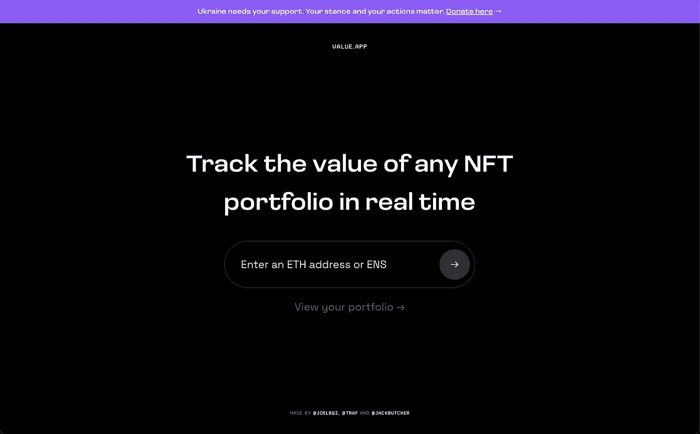

# 价值。应用程序—跟踪任何 NFT 产品组合的价值| Web3 应用程序评论

> 原文：<https://medium.com/coinmonks/value-app-track-the-value-of-any-nft-portfolio-web3-app-review-23a2c5fc272c?source=collection_archive---------26----------------------->

NFTs 和区块链技术公司最大的特点之一是能够公开审查交易和查看特定持有人拥有的资产。这建立了一种以验证和审查资产的数字历史为中心的文化。这种公开可见的历史提供了持有人如何评价 NFT 收藏的额外见解，因为它是一个强大的…