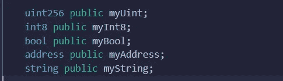

# 实性中有细节的值类型

> 原文：<https://medium.com/coinmonks/value-types-with-details-in-solidity-4a46abe8cdc5?source=collection_archive---------11----------------------->

嗨！在这篇文章中，我将尝试解释 solidity 语言中的值类型。首先，我来大致说说变量。

→所有初始化的变量都将是默认值。这意味着没有空和未定义。
下面是缺省值类型的例子:
-address = 0x 000000000000000000000000000000
-(u)int = 0
-bool = false
-string = " "

→另一个要点是，如果我们正在访问任何初始化的变量，那么你会看到公共变量自动获得一个 getter 函数。所以 solidity 为所有公共变量创建了一个 getter 函数。
现在让我们逐一学习值类型。

1.  A ***地址*** :这个真的很重要。因为我们通常会使用该值类型将 eth 从智能合约发送到其他智能合约，或者与智能合约进行交互。根据位置理论，你做的每一笔交易和每一件事都是基于地址的。
    →该值类型保存一个 20 字节的值(以太坊地址的大小)。
    →地址有你可以调用的成员和函数。简单说一下就两个:
    a) *余额*:基本上我们用它来查询一个地址的余额。
    b) *转账*:我们用乙醚(以卫为单位)寄到一个应付的地址。
2.  ***String :*** 这种值类型的属性与普通编程语言略有不同。对于我们见过的字符串的任何引用类型，您需要在**内存**或**存储**中定义内存位置。而且通常几乎在任何情况下，你都会选择*记忆*作为论据。我将在另一篇文章中详细讨论存储和内存。
    现在我们来说说一些重要的特性:
    →我们不能串接字符串。
    →无法搜索字符串。
    →没有字符串函数来替换字符串中的项目。
    →字符串在内部存储为字节数组。他们只是再次转换为 UTF 八，这并不容易，实际上并不适合真正处理弦乐或更大的弦乐。
    →现实中用弦工作在气和气方面也是蛮贵的。
3.  ***(无符号)整数*** :简单定义就是这样；各种大小的有符号和无符号整数。关键词 *uint8* 到 *uint256* 以 8 为步长(8 的无符号到 256 位)和 *int8* 到 *int256* 。u *int* 和 *int* 分别是 u *int256* 和 *int256* 的别名。
    →实度中的整数被限制在一定范围内。比如用 *uint8* ，这是 *0* 到 *2**8-1* 和 *int8* 从 *-128 到 127* 。
    →尺寸不同的原因主要在于燃气成本。
4.  ***布尔:*** 可能值为常量*真*假*假*。这个变量类型有运算符:
    →！(逻辑否定)
    → & &(逻辑合取，“与”)
    → ||(逻辑析取，“或”)
    → ==(等式)
    →！=(不等式)

下次见！