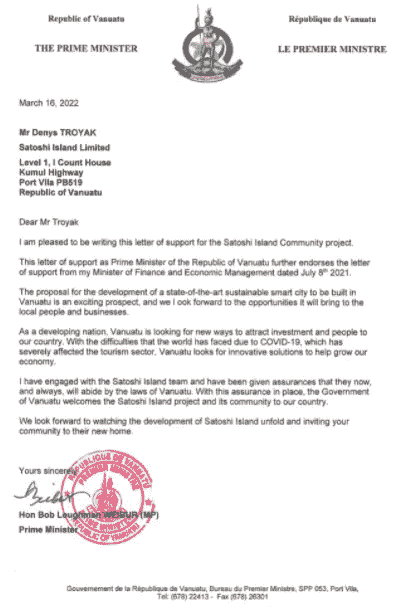
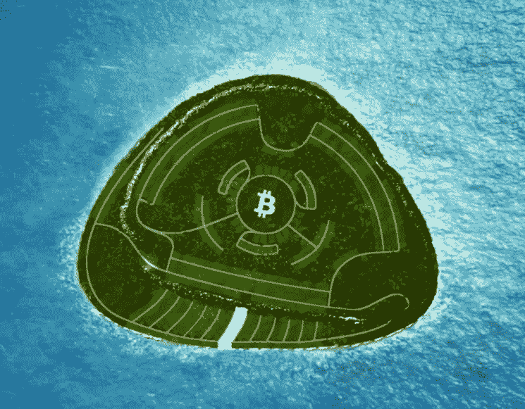

# 瓦努阿图总理申明支持 Satoshi 岛加密货币项目

> 原文：<https://medium.com/coinmonks/vanuatus-prime-minister-affirms-support-for-the-satoshi-island-cryptocurrency-project-2625292f5150?source=collection_archive---------24----------------------->

**Visit our website:-** [**https://bitcoinsupports.com/**](https://bitcoinsupports.com/)

瓦努阿图政府已宣布支持 Satoshi 岛社区项目，这是一个不向菲亚特开放的私人加密岛。一个国家的领导人支持一个加密货币项目并不常见。橙色萨尔瓦多总统 Nayib Bukele 是第一个推广比特币的领导人(BTC)。

现在，瓦努阿图总理鲍勃·拉夫曼阁下已经正式批准了与那国岛。

**Visit our website:-** [**https://bitcoinsupports.com/**](https://bitcoinsupports.com/)

Satoshi 岛是南太平洋上的一个巨大的加密乌托邦，最近揭示了它的目标、进展和 Cointelegraph 的准备工作。在得知他们已经收到了 50，000 份不可兑现的象征性(NFT)公民身份申请后，瓦努阿图总理表示支持“见证 Satoshi 岛的发展”

**Visit our website:-** [**https://bitcoinsupports.com/**](https://bitcoinsupports.com/)

该公函称，“瓦努阿图政府热烈欢迎 Satoshi 岛项目及其社区来到我们国家”，同时强调“瓦努阿图正在探索新的途径来吸引投资和人员到我们国家。”

新冠肺炎疫情“严重影响了旅游业”，该行业占瓦努阿图 2019 年国内生产总值的 34.7%。据世界银行估计，到 2020 年，这个位于布里斯班以南 2000 公里(1243 英里)的天堂般的群岛的游客人数将从大约 30 万下降到 8 万。Satoshi 岛的创建者早些时候告诉 Cointelegraph，该项目的主要问题之一是“缺乏旅游”然而，从根本上来说，Satoshi 岛为“密码部门提供了一个物理家园”

Satoshi 岛是密码爱好者的目的地，而不是旅游的地方。社区成员将生活在由分散自治组织(Dao)控制的社区中可持续建造的房屋中，所有权由不可替代的令牌(NFT)表示。

**Visit our website:-** [**https://bitcoinsupports.com/**](https://bitcoinsupports.com/)

从塞内加尔的阿肯市到斐济的 CryptoLand，以前的许多大型加密项目都失败了。Satoshi Island 的团队建议其他人“将想法保留在团队中，直到一切就绪，将想法转化为现实。”

团队建议其他人“极其谨慎地选择地点，并保证在后勤、环境和法律上可行，”以及

***“对地点非常挑剔，最重要的是，确保在发布项目之前拥有土地，这是向目标市场展示你所宣传的是真实的，而不是空想的重要一步。”***

随着瓦努阿图总理的批准，这个 Satoshi 岛的密码“白日梦”正接近实现。

**访问我们的网站:-**[**https://bitcoinsupports.com/**](https://bitcoinsupports.com/)

**免责声明:以上为作者观点，不应视为投资建议。读者应该自己做研究。**

> 加入 Coinmonks [电报频道](https://t.me/coincodecap)和 [Youtube 频道](https://www.youtube.com/c/coinmonks/videos)了解加密交易和投资

# 另外，阅读

*   [Bitsgap 审查](/coinmonks/bitsgap-review-a-crypto-trading-bot-that-makes-easy-money-a5d88a336df2) | [Quadency 审查](/coinmonks/quadency-review-a-crypto-trading-automation-platform-3068eaa374e1) | [Bitbns 审查](/coinmonks/bitbns-review-38256a07e161)
*   [密码本交易平台](/coinmonks/top-10-crypto-copy-trading-platforms-for-beginners-d0c37c7d698c) | [Coinmama 审核](/coinmonks/coinmama-review-ace5641bde6e)
*   [印度的加密交易所](/coinmonks/bitcoin-exchange-in-india-7f1fe79715c9) | [比特币储蓄账户](/coinmonks/bitcoin-savings-account-e65b13f92451)
*   [OKEx vs KuCoin](https://coincodecap.com/okex-kucoin) | [摄氏替代品](https://coincodecap.com/celsius-alternatives) | [如何购买 VeChain](https://coincodecap.com/buy-vechain)
*   [币安期货交易](https://coincodecap.com/binance-futures-trading)|[3 commas vs Mudrex vs eToro](https://coincodecap.com/mudrex-3commas-etoro)
*   [如何购买 Monero](https://coincodecap.com/buy-monero) | [IDEX 评论](https://coincodecap.com/idex-review) | [BitKan 交易机器人](https://coincodecap.com/bitkan-trading-bot)