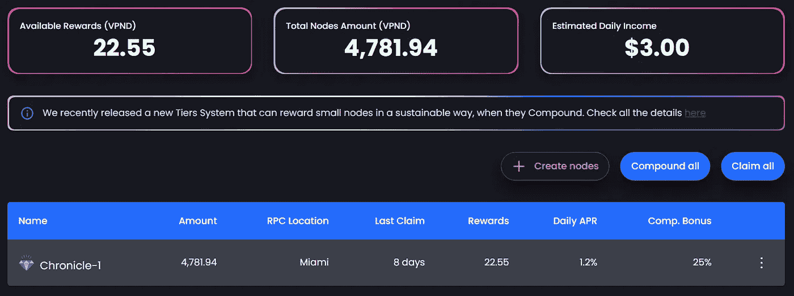
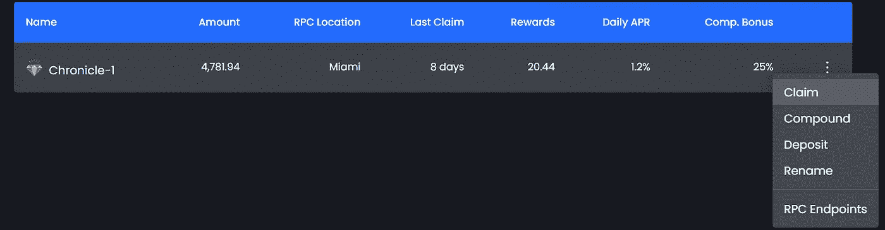
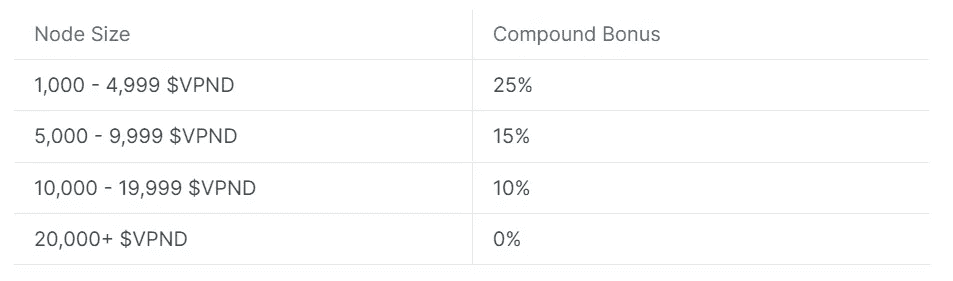
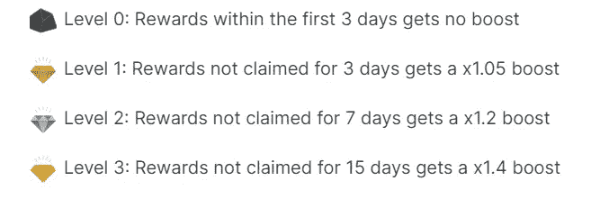
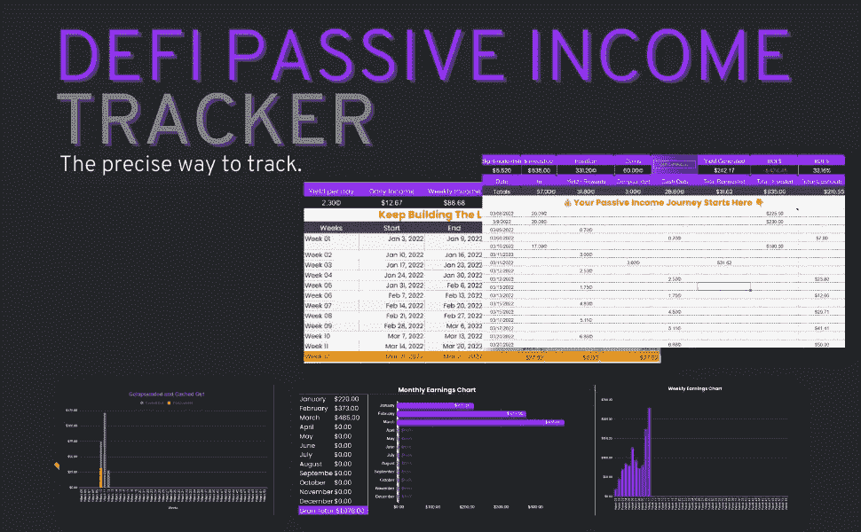
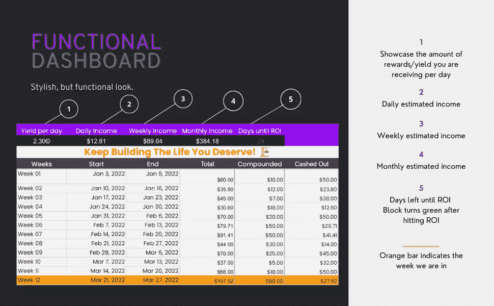

# 蒸汽节点——1%每日奖励。最便宜的节点。

> 原文：<https://medium.com/coinmonks/vapor-nodes-1-daily-rewards-the-cheapest-node-out-there-a43949dc760d?source=collection_archive---------2----------------------->

**我的私人不和& Gumroad 集团🔐:**

https://defichronicles.gumroad.com/l/nonayd

Vapor Nodes 是在 Avalanche 区块链上创建的项目。他们三个月多一点。与完全 doxxed 的创始人和主要开发人员，并锁定流动性超过一年(420 天)。

【https://twitter.com/MejiasDev 

这是 Vapor Finance 的首席开发人员。

Vapor 每天每个节点提供 1%的收益。这比其他节点项目更具可持续性。大部分项目我喜欢 0.5% — 2%。

已经创建了超过 40，000 个蒸汽节点。

它们是目前进入门槛最低的节点项目之一。创建节点的成本是 1，000 $VPND。按照目前 0.045 的价格，1000 美元的 vpnd 将花费您大约 45 美元。

创建一个节点的最低成本是 1，000 $VPND，并且没有层级。要创建更大的节点，您只需购买更多的$VPND。

你为创建节点所付的押金是不可退还的。这意味着，在创建节点后，你会处于亏损状态，直到你要求你的回报并出售它们以获取利润。(大多数节点项目都是这样工作的)。

他们的分销系统是这样的:

*   10%的流动性
*   10%团队/营销/费用/合作伙伴池
*   80%的国库- 25%被交换为美元 AVAX

# 简介和功能

创建节点后，你有 3 个选择；你可以复合，存款更多，或要求你的奖励。

**声明:**您每天将收到存款金额的 1%。使用上面的例子，我每天收到 47 美元的 VPND。

当你声称你将被征税 10%的奖励。其中 9%以$AVAX 的价格卖给财政部，1%被烧掉。

如果我申请了 47 $VPND，那么我将获得 42.3 $VPND。

## **复合:**

这是一个棘手的问题，因为有大量的功能来刺激复利和减轻销售压力。

*   **复合奖金:**

您的节点越小，获得的好处就越多。这很酷，因为他们实际上是在帮助那些小家伙。

以我的节点为例。我有 4，700 $VPND，因此我激活了 25%的奖金。如果我累积了 100 $VPND，并单击了复合而不是索赔，那么这 100 将乘以 1.25。

125 $VPND 将被存入我的节点，大小增加到 4825。

当你声称你不会收到 25%时，它只对复利起作用。没有等待期，这一个被激活取决于您的节点大小。请随意声明和出售，这样做不会使其失效。

*   **钻石手等级:**

如果您允许您的奖励累积，并且没有*领取*，则“钻石手”奖励将会激活。

请记住，这只会影响您尚未申请或复合的金额，而不会影响实际的节点。

如果我有 100 美元的 VPND 奖励，并且超过 3 天没有申领。那么这 100 $VPND 就要乘以 1.05 = 105 $VPND。

当你申请时，钻石等级被取消，它将重新开始到 0 级。复利不影响。

注意:每次您*复合*您的奖励，有 1%的复合税对您的无人认领的奖励。

## 存款:

创建后，您可以选择增加节点大小。一个有效的选择是每周平均花费美元，并通过点击“存款”来不断增加节点数量。这对奖金没有影响。

## 重命名:

如果你想改变你的节点的名字。

## RPC 终结点:

这是帮助处理一些数据的服务器。让它自动选择就好，或者滚动选择你认为离你最近的城市。

> 来自黑暗森林开发的 RPC 解释；
> 
> *要连接到区块链并从中检索数据，您需要连接到区块链网络上的一个节点。节点是存储和服务最新区块链状态的网络中的参与者。希望下载区块链数据的用户可以自己运行节点，或者通过节点的 RPC 端点连接到公共提供的节点。RPC(远程过程调用)端点就像一个节点的地址:它是一个 URL，对区块链数据的请求可以发送到这个 URL。*

## 他们也有推荐功能。

它是如何工作的

1.  复制您的推荐选项卡中的唯一链接。
2.  与你的朋友分享链接，请他们创建一个节点。
3.  一旦他们这样做了，你将得到他们创建一个节点的金额的 5%的佣金。

**如果这是你第一次创建你的，请随时使用我的链接来支持。**

[https://app.vapornodes.finance/nodes?invite = 0x 43 D5 E8 c 988 c 3563 db 3 d6c 16243 F5 EB 4c 15058 a 7](https://app.vapornodes.finance/nodes?invite=0x43dc5E8C988c3563db3d6C16243F5Eb4C15058A7)

# 投资和未来计划

为了让项目成功，他们必须投资并创造收入来支付节点创建者。他们在强节点、CVX、AVAX 验证器(超过 2000 个 AVAX)方面有一些投资。

就个人而言，我希望看到更多的投资，以使该项目更具可持续性。

此外，他们正在进行两个模糊的项目:

*   蒸汽链(雪崩子网)
*   蒸汽发射(发射台)

# 如何设置您的第一个节点:

*   创建一个 MetaMask 钱包，添加 Avalanche RPC，并为您的钱包注入一些 AVAX。
*   请访问 vapornodes.finance，或点击我的推荐链接
*   点击“购买 VPND”，会重定向到 TraderJoe.xyz，购买你想要的$VPND 的金额(1k 以上)。
*   返回页面，点击启动应用程序，连接您的钱包，然后点击创建节点。
*   添加您想要分配的$VPND 金额。
*   完成:)

如果你不知道如何使用 MetaMask，我在 Medium 上创建了一个简单的指南。

 [## 如何使用 MetaMask，添加 RPC，并为您的钱包提供资金。

### 快速指南设置，添加 FTM 和 AVAX 等网络，提示保护自己的骗子。

defichronicles.medium.com](https://defichronicles.medium.com/how-to-use-metamask-add-rpcs-and-fund-your-wallet-6b4b0362edb) 

# 结论

一周前我投资了 Vapor。我的初始投资是 157 美元。我在 0.034c 买入。从那以后，我一直在复利，并将继续下去，直到我达到略高于 10k $VPND 的目标。在那之后，我会拿走我每周的奖励。

我目前每天挣 3 美元或每周 21 美元。目标是达到 50 美元/周。

在投资之前一定要做好调查，不要投资超过你可能损失的部分。更重要的是，记得把你的利润拿走。:)

我已经在这个追踪器上工作了很长时间，让它变得简单而有效。用心制作每一部分。

这是一个完美的电子表格，可以跟踪你所有的节点、Dao 和你可能参与的被动收入项目。

如果你是被动收入，你应该跟踪你的收入。你不能改进你没有测量的东西。

## 仔细讨论👇：

[https://defichronicles.gumroad.com/l/xwwln](https://defichronicles.gumroad.com/l/xwwln)

> *感谢您的阅读！*
> 
> *如果你想了解我的日常生活，让我们在推特上成为朋友吧。🐤*
> 
> *@DefiChronicles*

***我的 youtube 频道:***[https://www.youtube.com/watch?v=aurU-nghWLA](https://www.youtube.com/watch?v=aurU-nghWLA)

***订阅我的快讯*** *我去哪儿更深入的跟我的* ***德菲之旅*** *。* [*https://www.getrevue.co/profile/DefiChronicles*](https://www.getrevue.co/profile/DefiChronicles)

或者，如果有什么我可以帮你的，请随时给我发电子邮件。

thedefichronicles@gmail.com

**免责声明:**这不是财务建议，我只是一个拿着笔记本电脑的家伙分享他的观点和经验。这只是为了娱乐。在投资之前，一定要做好自己的研究。

> *加入 Coinmonks* [*电报频道*](https://t.me/coincodecap) *和* [*Youtube 频道*](https://www.youtube.com/c/coinmonks/videos) *了解加密交易和投资*

# 另外，阅读

*   [3 商业评论](/coinmonks/3commas-review-an-excellent-crypto-trading-bot-2020-1313a58bec92) | [Pionex 评论](https://coincodecap.com/pionex-review-exchange-with-crypto-trading-bot) | [Coinrule 评论](/coinmonks/coinrule-review-2021-a-beginner-friendly-crypto-trading-bot-daf0504848ba)
*   [莱杰 vs n rave](/coinmonks/ledger-vs-ngrave-zero-7e40f0c1d694)|[莱杰 nano s vs x](/coinmonks/ledger-nano-s-vs-x-battery-hardware-price-storage-59a6663fe3b0) | [币安评论](/coinmonks/binance-review-ee10d3bf3b6e)
*   [Bybit Exchange 审查](/coinmonks/bybit-exchange-review-dbd570019b71) | [Bityard 审查](https://coincodecap.com/bityard-reivew) | [Jet-Bot 审查](https://coincodecap.com/jet-bot-review)
*   [3 commas vs crypto hopper](/coinmonks/3commas-vs-pionex-vs-cryptohopper-best-crypto-bot-6a98d2baa203)|[赚取加密利息](/coinmonks/earn-crypto-interest-b10b810fdda3)
*   最好的比特币[硬件钱包](/coinmonks/hardware-wallets-dfa1211730c6) | [BitBox02 回顾](/coinmonks/bitbox02-review-your-swiss-bitcoin-hardware-wallet-c36c88fff29)