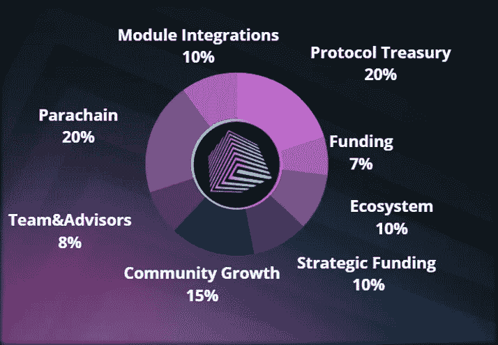

# VARCH —因瓦赫的本地令牌

> 原文：<https://medium.com/coinmonks/varch-invarchs-native-token-11b169d316ce?source=collection_archive---------13----------------------->

VARCH 是因瓦赫协议的本地令牌。因瓦赫是一种用于波尔卡多和 Web 3.0 的 IP 所有权、实用程序和认证协议。
VARCH 令牌非常强大，不仅仅是一项投资。

## VARCH 有哪些用例？

VARCH 是通过使用该协议构建的应用程序产生的网络费用的必需货币；它是对协议治理的投票权重的表示**；**用于知识产权文件的制作和认证；并且不仅仅用于核对者统计，还用于我们称之为知识产权统计的融资机制。

## VARCH 将会被铸造多少，它是一种通货膨胀的密码货币吗？

瓦奇有 10 亿代币的限量供应。因瓦赫引入了非常新的技术，因此有潜力建立一个庞大而强大的全新 dApps 生态系统。将这些结合起来，所有前面提到的公用事业加上生态系统的潜力。这种高需求和有上限的供应预示着一个自然的通缩未来。

## VARCH 是如何分布的？

$VARCH 令牌通过大使计划、早期社区销售、未来 crowdloan、因瓦赫建筑商计划以及对集成因瓦赫 IP 托盘模块的其他 Parachains 的激励进行分发。

正如我们在上面的图表中所看到的，在发行方面，全球社区一直站在因瓦赫的最前沿。任何团队成员都不会持有超过 1%的令牌供应；事实上，整个团队,“创始人+团队+顾问”将会看到 8%的合并分配，受制于 4 年的归属时间表和 1 年的悬崖，种子支持者也受限于相同的标准。

## 因瓦赫的重点是通过以下方式建立流动性:

1.  因瓦赫大使计划&社区销售。
2.  因瓦赫推出 crowdloan 以追求 Polkadot Parachain 位置时获得支持的奖励。
3.  $VARCH 还将自动分配给集成了因瓦 ch IP 货盘的副链钱包持有者。仅通过 1 或 2 个 IP 托盘集成，$VARCH 令牌将成为整个 Polkadot 生态系统中流动性最强、分配最多样的令牌(当然，$DOT 和$KSM 除外)。

随着殷钢的全面发展，社区治理将是至关重要的。因瓦赫协议有可能成为一个强大而有影响力的协议，为 IP 令牌化建立一个网络范围的标准。因此，它必须尽可能将这种力量和影响力分配给全球社会。

## VARCH TGE —令牌生成事件

了解因瓦奇将通过 Statemint 铸造其令牌是至关重要的，state mint 是波尔卡多特中继上的一个普通副链。因此，InvArch 背后的团队依赖于奇偶校验团队和 Statemint 链的开发。Statemint 链从贝壳升级为副链，搭载在 Polkadot 中继上；然而，它不是没有权限的。因此，Statemint 还不能公开使用，只有波尔卡多特议会可以使用该链铸造资产。然而，TGE 预计将在 2022 年第一季度发生。

## 结论

所有这些事实清楚地表明，InvArch 的本机令牌 vArch 是管理、保护和支持 InvArch 协议的关键；它有强大和通缩的象征经济学，独特的用例，在所有阶段都是健康的。

访问因瓦赫官方渠道:
[**网站**](https://invarch.network/)】[**推特**](https://twitter.com/InvArchNetwork)**不和**】[**亚社会**](https://app.subsocial.network/5857)】[**中社会**](https://invarch.medium.com/)[**电报**](https://t.me/InvArch)[**Github**](https://github.com/Invarch)】

> 加入 Coinmonks [电报频道](https://t.me/coincodecap)和 [Youtube 频道](https://www.youtube.com/c/coinmonks/videos)了解加密交易和投资

# 另外，阅读

*   [氹欞侊贸易评论](https://coincodecap.com/anny-trade-review) | [火币保证金交易](/coinmonks/huobi-margin-trading-b3b06cdc1519)
*   [去中心化交易所](https://coincodecap.com/what-are-decentralized-exchanges) | [比特恩斯 FIP](https://coincodecap.com/bitbns-fip) | [Pionex 评论](https://coincodecap.com/pionex-review-exchange-with-crypto-trading-bot)
*   [用信用卡购买密码的 10 个最佳地点](https://coincodecap.com/buy-crypto-with-credit-card)
*   [最好的卡达诺钱包](https://coincodecap.com/best-cardano-wallets) | [Bingbon 副本交易](https://coincodecap.com/bingbon-copy-trading)
*   [印度最佳 P2P 加密交易所](https://coincodecap.com/p2p-crypto-exchanges-in-india) | [柴犬钱包](https://coincodecap.com/baby-shiba-inu-wallets)
*   [8 大加密附属计划](https://coincodecap.com/crypto-affiliate-programs) | [eToro vs 比特币基地](https://coincodecap.com/etoro-vs-coinbase)
*   [最佳以太坊钱包](https://coincodecap.com/best-ethereum-wallets) | [电报上的加密货币机器人](https://coincodecap.com/telegram-crypto-bots)