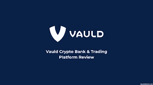

# VAULD，每周支出的被动收入！

> 原文：<https://medium.com/coinmonks/vauld-passive-income-with-weekly-payouts-3436f56ffdd2?source=collection_archive---------44----------------------->

很多时候，人们看投资时完全不知道该做什么，或者如何投资。许多人在投资时做的一件事是他们没有计划。任何时候你想赚钱，而不是赌博，你都应该有一个计划。很多时候，人们想投资，或者有一些资产，他们想用来投资，希望他们可以增加他们的收入。你的这个计划可以长期帮助你，如果你有兴趣长期持有一项资产，那么**可能适合你！**

****[**Vauld 有什么好的？**](https://vauld.com/register/gridbot)****

****许多人在投资时想要的东西之一是期权。现在，我确实意识到这违背了有一个计划的想法，然而很多时候人们想要一个选项，能够购买，出售，赌注，做他们想用他们的密码做的事情。这些思想和观念推动个人选择用自己的资产去入股，赚取被动收入。有了赌注，人们可以从他们的资产中赚取利息，并且他们的投资相对安全。****

******为什么是 Vauld？******

****许多人选择 [**VAULD**](https://www.vauld.com/auth/signin) 的原因之一是他们有一个绝对荒谬的赌注 AYP。我可以从我存进 [**金库**](https://www.vauld.com/auth/signin) 的许多资产中赚取利息。我可以在稳定的硬币上赚取大约 10%的 AYP，我每周都会得到这些收益。与 BTC 或联邦理工学院，我可以赚取约 6.7%的 AYP，并再次支付每日。****

******感兴趣？******

****如果你有兴趣，请随时观看我的视频[这里](https://www.youtube.com/watch?v=Y3xiusTdoGg)。点击并注册我的[链接](https://www.vauld.com/auth/signin)，享受远高于其他交易所的周利润。****

****YouTube 上的 grid bot Guru:[点击这里！](https://www.youtube.com/c/gridbotguru)****

****美国公民 pionex:[点击这里！](https://pionex.us/en-US/sign/ref/RnIZeirs)****

****全球公民 pionex:[点击这里！](https://www.pionex.com/en-US/sign/ref/zVt0KmHU)****

****报名参加比特币基地:[点击这里！](https://www.coinbase.com/join/wyatt_h)****

> ****加入 Coinmonks [电报频道](https://t.me/coincodecap)和 [Youtube 频道](https://www.youtube.com/c/coinmonks/videos)了解加密交易和投资****

# ****另外，阅读****

*   ****[CBET 回顾](https://coincodecap.com/cbet-casino-review) | [库科恩 vs 比特币基地](https://coincodecap.com/kucoin-vs-coinbase) | [沃尔德回顾](/coinmonks/vauld-review-2021-lend-trade-and-buy-bitcoin-in-india-e37a96374961)****
*   ****[折叠 App 回顾](https://coincodecap.com/fold-app-review) | [本地比特币回顾](/coinmonks/localbitcoins-review-6cc001c6ed56) | [Bybit vs 币安](https://coincodecap.com/bybit-binance-moonxbt)****
*   ****[加密保证金交易交易所](/coinmonks/crypto-margin-trading-exchanges-428b1f7ad108) | [赚取比特币](/coinmonks/earn-bitcoin-6e8bd3c592d9) | [Mudrex 投资](https://coincodecap.com/mudrex-invest-review-the-best-way-to-invest-in-crypto)****
*   ****[WazirX vs CoinDCX vs bit bns](/coinmonks/wazirx-vs-coindcx-vs-bitbns-149f4f19a2f1)|[block fi vs coin loan vs Nexo](/coinmonks/blockfi-vs-coinloan-vs-nexo-cb624635230d)****
*   ****[比斯勒评论](https://coincodecap.com/bitsler-review)|[WazirX vs coin switch vs coin dcx](https://coincodecap.com/wazirx-vs-coinswitch-vs-coindcx)****
*   ****[7 大副本交易平台](https://coincodecap.com/copy-trading-platforms) | [BuyCoins 点评](https://coincodecap.com/buycoins-review)****