# 一切的保险

> 原文：<https://medium.com/coinmonks/vaultification-of-everything-fb0aef48763?source=collection_archive---------2----------------------->

在本文中，我们将重点关注自 2020 年以来席卷 DeFi 空间的“保险库化”趋势，以及以这些保险库为代表的大量加密结构产品。尽管后者是金融产品的一个类别，而前者主要是 UX 的设计选择，但在分散金融的世界里，这两者往往是携手并进的。

由于大多数分散式资产管理协议利用基于“保险库”的 dApp 设计，我们希望分析迄今为止在 DeFi 世界中创建的更广泛的基于保险库的产品。

DeFi 中许多基于保险库的产品可以被视为一种自动化或半自动的资产管理形式。同时，DeFi 中的许多基于保险库的产品也可以被认为是结构化产品的例子。本文将讨论基于 Vault 的 DeFi 产品，它们可以包含在上述一个或两个类别中。

因此，我们不会关注 dex、Liquid Staking、Stablecoins、流动性拨备、Bridges、Synths，尽管其中一些可能也有类似金库的 UX 设计。

相反，我们将主要关注**资产管理**、**收益聚合器**、**杠杆收益农业**、 **DeFi 期权金库**、**固定收益产品**、**现实世界资产**和其他**结构性产品**，既简单又奇特。

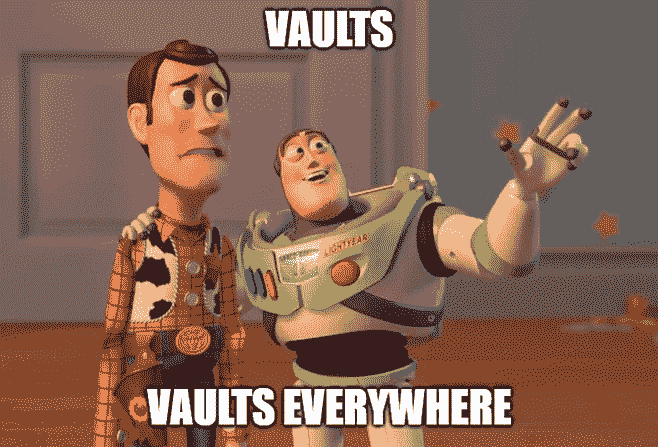

# DeFi 中的跳马是什么？

在分散金融(DeFi)世界中，金库是具有相关策略的资金池，旨在最大化金库内资产的回报。

金库为投资者节省了大量的研究时间，而这些时间原本是用来寻找最佳的连锁收益农业、盈利或投资策略的。同样，金库可以为投资者节省高额交易费用。

保险库的复杂程度不同，风险状况也不同。风险较低的金库通常有简单的策略。这些包括单一资产赌注金库(例如，存款 DAI 以赚取更多 DAI)和 LP 代币，自动计算农业奖励的复利。风险较高的保险库有更复杂的策略，涉及多个场和协议。

从视觉上看，金库是存放钱的长方形盒子。金库然后尝试进行连锁行动，试图增加你的钱。

# 金库简史

2009 年，比特币启动了加密货币。

2014 年，加密货币领域启动了以太坊和智能合约。

2016 年，以太坊和智能合约启动了 dApps。

2017 年，dApps kickstarted MakerDAO，0x，dYdX，Compound，AAVE，Synthetix，Uniswap，Melon…又名原始的 DeFi，甚至在 DeFi 这个术语被创造出来之前。

2020 年，Compound 启动了流动性挖掘和著名的 DeFi Summer。

2020 年夏天，流动性挖掘 kickstarted 了渴望。

2020 年，向往普及了金库的概念。

在 2021 年，金库本身成为了 DeFi 的“最佳实践”用户界面/UX 设计，尤其是 DeFi 选项金库。

截至 2022 年，大量 DeFi dApps 采用了拱顶设计。

拱顶可以被视为赌注概念的演变。赌注比 DeFi 早了五年。在赌注概念的早期版本中，加密货币持有者可以用他们的资产来换取一部分协议费和一部分新铸造的代币。类似地，用户将一项或多项加密资产存入金库，以获得收益，无论是通过其他代币的新通胀、期权费、协议费还是资本增值。

# 为什么基于拱顶的 dApp 设计在 DeFi 中如此普遍？

基于拱顶的设计对 DeFi 来说是如此普遍，以至于绝大多数 DeFi 项目都遵循 UX 的设计模式。两个主要原因:1)简单，一键 UX 2)节省油费。

用户来到 dApp，将他们的加密资产存放在一个金库中，该协议在幕后代表用户执行一系列金融交易。在大多数情况下，理论上，用户可以自己去执行所述交易。然而，基于保险库的 UX 简化了用户的过程——只需要一次点击，节省了用户的时间，并且不需要用户自己掌握进行所述交易的必要知识。**尽管 DeFi 有一半遵循基于保险库的设计，但在这篇特别的文章中，我们将重点关注与资产管理有直接或至少间接关系的 DeFi 产品。**

# 在设计中利用拱顶的一些 DeFi 类别的概述

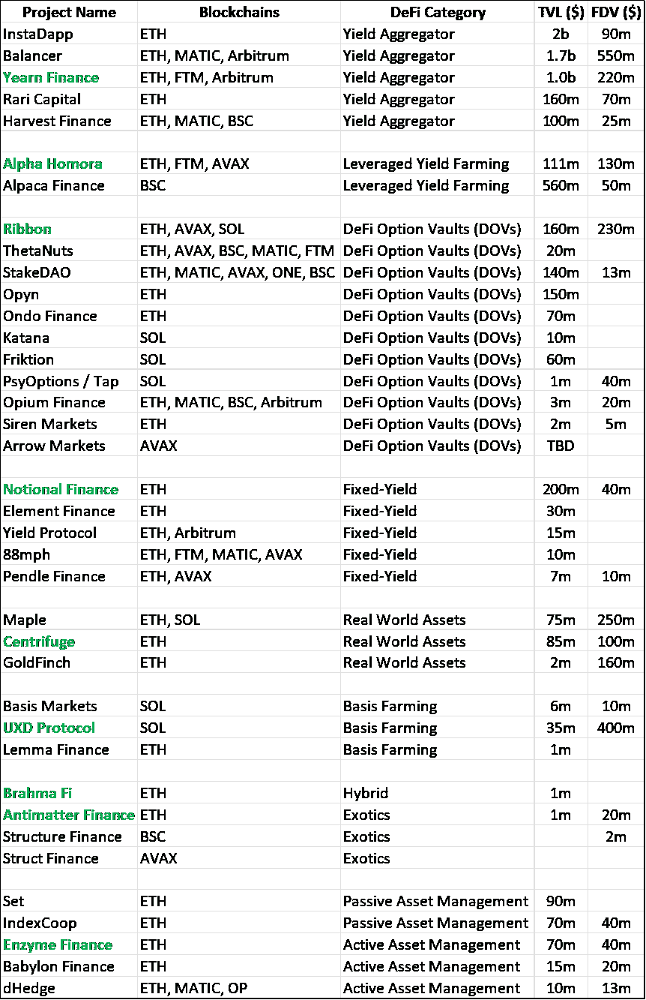

(Some) of the DeFi Categories and Products that utilize the Vaults design. Green shows the category leader.

# 高产农业

产量农业是利用大量分散金融(DeFi)应用程序来实现回报最大化的过程。历史上，这指的是在各种资金池中提供流动性(“LPing”)，并通过本地协议令牌和/或交易费获得回报。2020 年 5 月，当复合金融发起流动性挖掘运动时，它启动了整个产量农业行业，这是出了名的。除了基本的由市场决定的贷款年利率之外，复合金融还向根据协议借贷的人提供额外的美元红利代币。在 2020 年夏天，数百个 DeFi 协议开始激励他们的协议的使用(出借、借用、复制、交易等)。)与他们的本土令牌**。因此，高产农业指的是使用您的资本在 DeFi 生态系统中的各种活动之间不断切换，以最大化您的回报的过程。**最初，大多数早期的 DeFi 用户都是手动进行这一过程。

# 产量农业聚合器

Yield Farming Aggregators，也称为 Yield Optimizers，是迄今为止最受欢迎的 DeFi 产品之一。产量农业聚合器试图使产量农业的过程自动化，以便它们代表用户自动切换到最有利可图的 DeFi 池。

# 渴望

Andre Cronje 在 2020 年初开发的 Yearn Finance 是第一个，可以说是迄今为止最知名的产量农业聚合器。“赚取”产品允许人们将资金存入“渴望”,而“渴望”将使用存入的资金在最有利可图的贷款协议上自动放贷，如复合和 AAVE。

**至关重要的是，通过他们的“保险库”产品，Yearn 是 DeFi 中第一个开发保险库概念的协议。**

金库代表资产池，具有积极的相关战略，旨在最大限度地提高存入金库的资产的回报。金库采用了比《渴望》的 earn 产品更积极、更复杂的策略，通常涉及更多步骤。

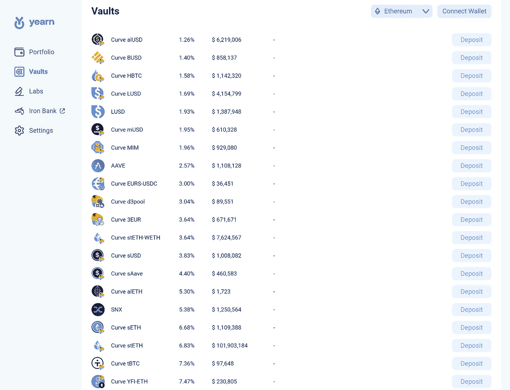

Yearn’s famous Vaults product, as of mid-June 2022.

一个更简单的例子是 2020 年推出的原始“渴望”金库。该战略运作如下:

> 1.用户将 ETH 存入渴望 ETH 金库。
> 
> 2.渴望利用 ETH 将其存入马可道借戴。
> 
> 3.戴随后被放入怀念戴的墓室。
> 
> 4.渴望戴金库将戴放入曲线的 Y 池，一个有不同稳定点数的池。
> 
> 5.除了将 DAI 放入 Curve 产生的标准费用之外，收到的 Curve LP 令牌也将锁定在 Curve Gauge 中，以赚取额外的 CRV 令牌。
> 
> 6.整个策略定期向 ETH 出售累积的 CRV。

在 2020 年夏季推出的当月，上述策略提供了高达 60%的 APY。

截至撰写本文时(2022 年 6 月)，这一战略的年度利润已经从 60%下降到 1%。这主要是由于价格、活动和流动性开采计划在过去的 6 个月里都下降了。产量农业目前实际上已经死亡，大多数渴望金库产生较低的个位数 APY 回报率。

## 其他产量农业综合企业

**Rari Capital** —另一个流行的基于以太坊的协议，既有 Earn 产品(收益聚合器)又有 Fuse 产品(无许可借贷池)。

**InstaDapp** —另一款流行的收益率优化产品，带有策略库。

**平衡器** —最初作为自动做市商(AMM)开始的项目，但后来扩展到其他产品，包括产量优化。

# 杠杆产量农业

杠杆收益农业是标准收益农业的延伸，旨在为 DeFi 世界带来更高的资本效率。LYF 允许用户向流动性池提供比他们实际拥有的更多的流动性——通过从其他流动性池借入额外资金的过程。贷方向池中提供代币以赚取收益，借方存入杠杆 LP 代币以获得额外的代币。

这种借款人获得抵押不足的贷款的行为理论上可以让高产农民获得比传统的无杠杆农业更多的 APY。不同的 LYF 策略可能适合交易者根据市场条件进行试验(请记住利息和波动性)，但是，标准和杠杆收益养殖都存在风险，交易者应该了解这两种情况下的风险，包括非永久性损失。与传统的保证金交易类似，如果交易者的债务和头寸规模之间的比率达到 100%，LYF 会带来额外的潜在清算风险。由于缺乏可用的借贷池流动性，贷方也可能无法立即提取代币。波动性更大、市值更小的投资组合对于杠杆收益率农业来说风险也更大。

Alpha Homora 是 TVL 最大的 DeFi 协议之一，由 Alpha 金融实验室在以太坊、币安智能链和 Avalanche 上开发。作为一个 LYF 平台，Alpha Homora 允许贷款人通过向杠杆有限合伙人出借资产来赚取“高额”利息，而杠杆有限合伙人可以自己借用资产来赚取更多利润。截至 2022 年 6 月，Alpha Homora 的 TVL 超过 7.5 亿美元。

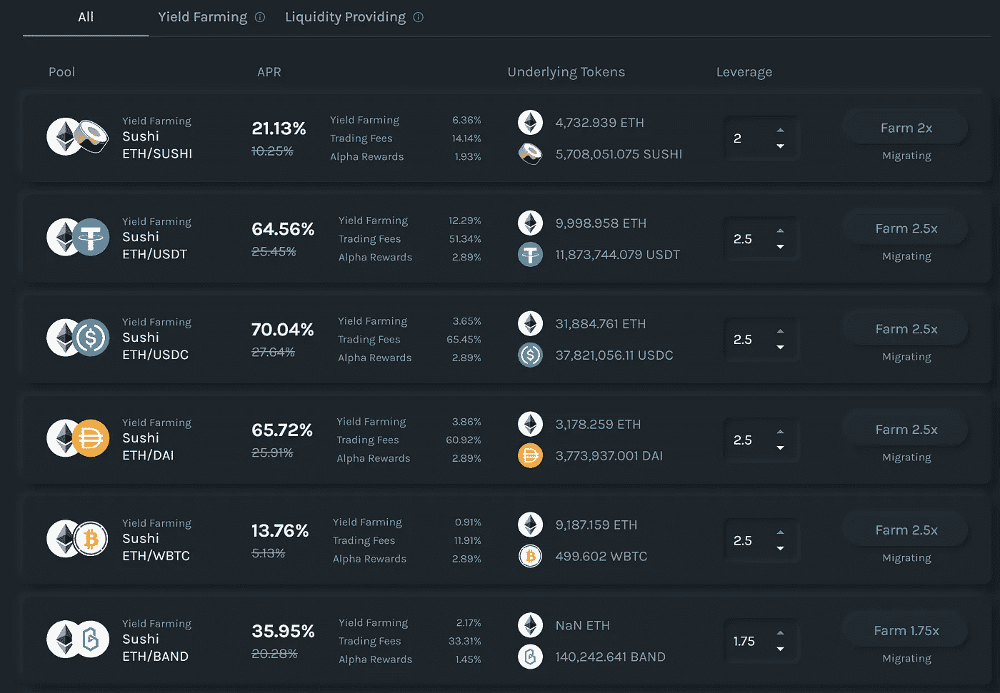

Alpha Homora’s Leveraged Yield Farming Pools.

另一个项目，**塔罗牌，**是建立在 Fantom Opera 上的(计划在乐观上推出)，并允许在基于$FTM 的 LP 代币上进行杠杆收益农业。[供应金库](https://tarotfinance.medium.com/tarot-supply-vaults-b10dfebed858)是自动化策略，允许用户跨多个库赚取收益。截至 2022 年 6 月，塔罗的 TVL 超过 2000 万美元。

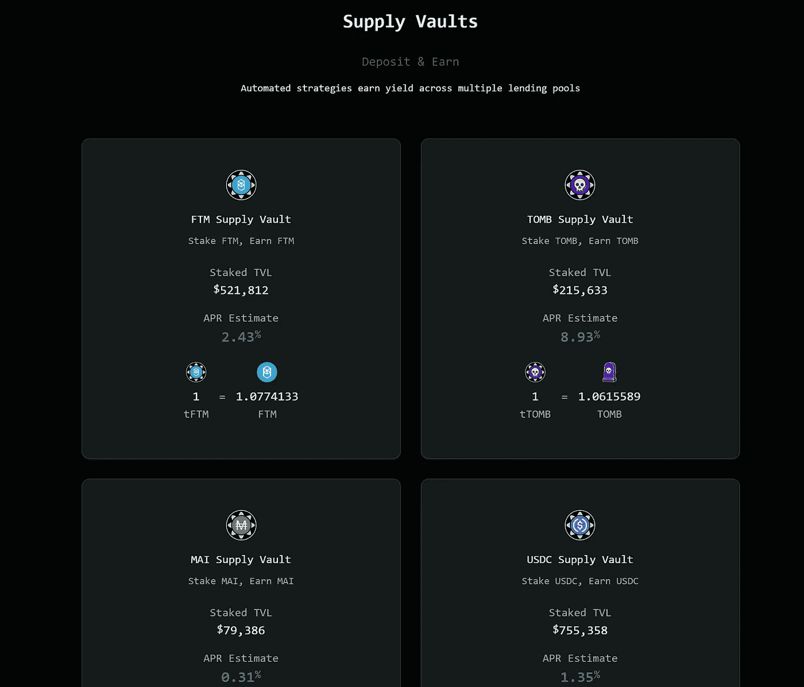

Tarot “Supply Vaults”

我们的观点是，相对于其他 DeFi 用例，如贷款、资产管理和结构化产品，收益农业和杠杆收益农业在 TVL 和市场资本化方面将会减少。

# 什么是结构性产品？

结构性产品是一种复杂的金融产品。结构性产品是预先打包的投资，可以组合多种资产，如期货、期权、固定收益和其他类型的资产，以实现某种非传统的回报。结构性产品的目标是实现高度定制的风险回报目标。结构性产品通过金融工程的过程将多种类型的投资或衍生产品组合成一种产品。结构性产品也可以被认为是预先打包的投资组合或预先打包的投资策略。据彭博称，整个结构性产品市场的投资资产超过 7 万亿美元。在传统金融的大多数情况下，结构性产品旨在提供略高回报的潜力，同时提供一些下行保护。

# 结构性产品为什么会存在？

结构化产品的存在有几个主要原因。

1) **管理风险** —提供一种在特定时间范围内获得部分或全部投资组合下跌保护的方法。

2) **提高回报/创收** —提供一种创收方式，例如，通过将波动性或缺乏波动性货币化。

3) **战术/临时风险**——临时(例如几个月)表达对特定工具或部门的市场观点，而没有与直接暴露于所述工具相关的全部风险。

# 传统金融中结构性产品的例子

**示例:** **“带有买入障碍成分的市场挂钩票据”** —投资者将获得股票的全部回报，但前提是在票据到期时股票上涨了 20%或更多。

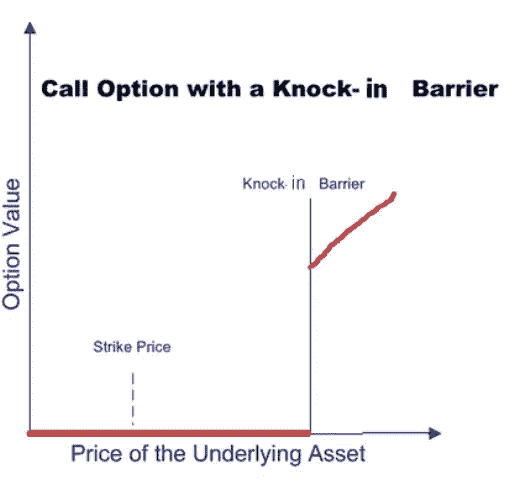

**稍微复杂一点的例子:“Buffered PLUS(性能杠杆上行安全性)”。**提高正回报的上行回报，在-50% < x < 0 范围内保护本金，提高-50%以下的下行回报。

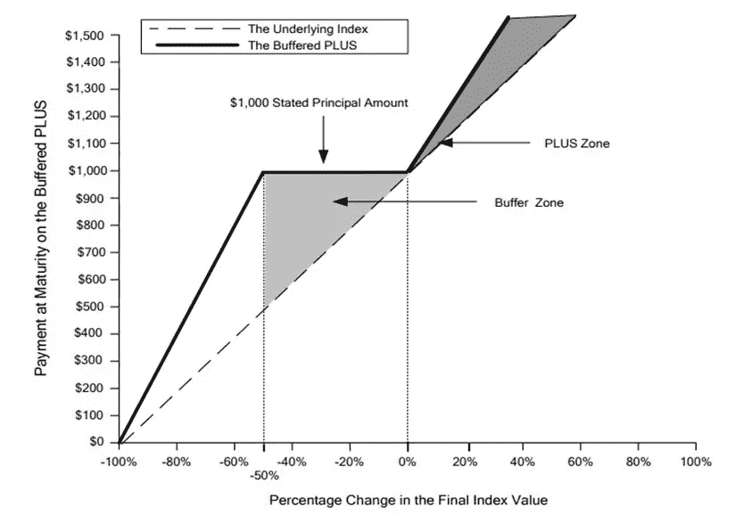

**复杂示例:“基于表现最差的 DJIA 和罗素 2000 指数的 Trigger PLUS(业绩杠杆上行证券)”。**一种复杂的结构性票据，具有资本保护、杠杆回报、上限上涨和无限损失等要素，其支付取决于两个不同的股票指数，而非一个。

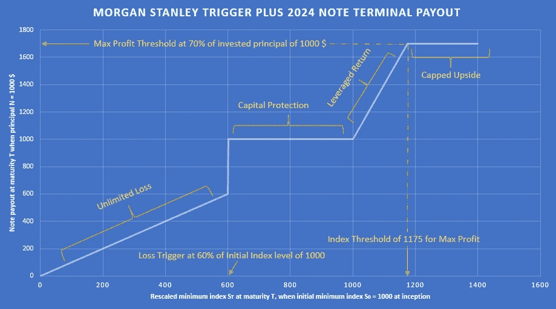

# 什么是 DeFi 结构性产品？

DeFi 结构性产品是分散金融世界中存在的链上结构性产品。

对我们来说幸运的是，DeFi 是一个较新的领域，主要由零售参与者组成，而不是具有非常复杂、定制和多变量需求的大型跨国机构——DeFi 中的结构化产品比 TradFi 中的产品简单得多。

# DeFi 结构化产品示例

下面我们来看看目前 DeFi 中存在的一些基于金库的结构化产品。

# DeFi 选项库(dov)

DeFi 期权保险库(dov)是当今最大和最受欢迎的 DeFi 结构化产品类别，也是保险库风格产品的第二大类别。

DeFi 期权金库是寻找“可持续收益”的一种尝试。2020 年和 2021 年在 DeFi 发现的大部分产量是不可持续的产量形式，正如我们今天在 2022 年看到的那样，许多以前的产量形式已经崩溃或完全消失。过去的许多收益形式依赖于高代币通胀，这在牛市中可能会奏效一段时间，以激励参与新协议，但最终是不可持续的，特别是如果上述代币的价格下跌。

DeFi Option Vaults 试图重新创建传统金融中的一些创收期权策略，并将它们引入分散金融的 onchain 空间。

Ribbon Finance 目前是最大的 DeFi Options Vaults 协议，截至 2022 年 6 月 12 日，其 TVL 为 1 . 6 亿美元。目前，Ribbon 和其他 DOVs 平台上最受欢迎的两种 DeFi 期权金库策略是买入看涨期权和卖出看跌期权。

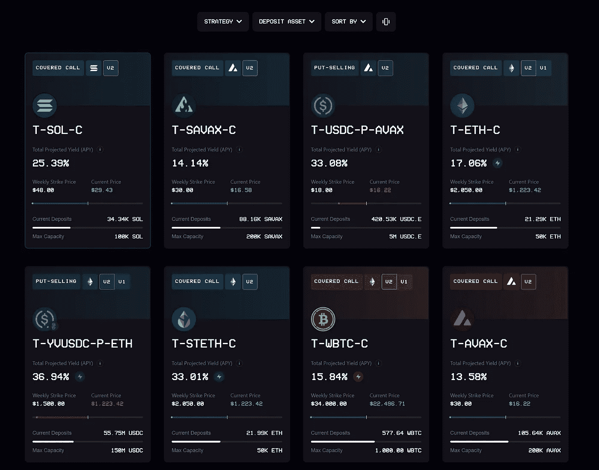

Ribbon Finance DeFi Option Vaults

## 撰写承保电话

卖出备兑看涨期权的目标是从卖出(“卖出”)看涨期权中获得每周收入，并在标的资产飙升至某一水平以上时，以放弃的上涨换取期权溢价。该战略采取的一系列行动如下:

> 1.投资者将 ETH 投资于每周的 ETH 备兑买入金库。
> 
> 2.该平台使用算法来选择 ETH 看涨期权的最优执行价格。
> 
> 3.该平台向其他市场参与者(通常是专业期权做市商)出售欧式看涨期权。
> 
> 4.Vault 通过出售看涨期权(收益率)收取 ETH 溢价。
> 
> 5.如果基础价格< options strike at expiry, options expire worthless and the Vault keeps the yield.
> 
> 6\. If underlying price >期权在到期时行使，金库会损失一些 ETH，这取决于价格比行使价高出多少。剩余的 ETH 返还给金库投资者。

在这种情况下,“备兑”是指这种策略由基础现货资产“提供资金”,因此，如果基础价格在到期时高于执行价格，卖出看涨期权的损失将由持有基础现货本身的收益同等抵消。

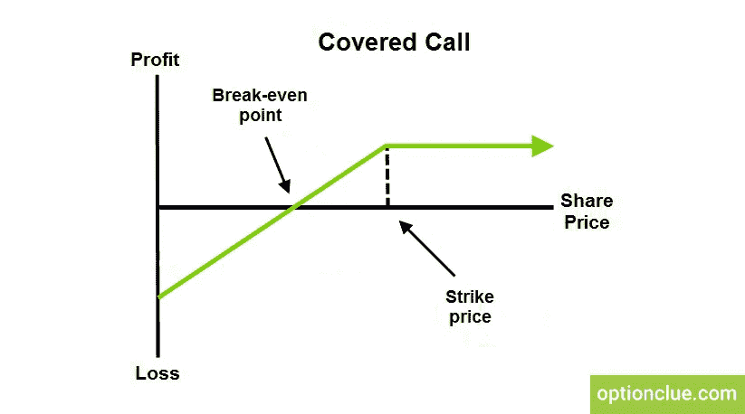

Payoff Diagram for a Covered Call position.

## 卖出

同样，卖出看跌期权的目标是从卖出看跌期权中获得周收入。

该战略采取的一系列行动如下:

> 1.投资者将 USDC 投资到每周一次的 ETH 看跌期权中。
> 
> 2.协议团队为即将到来的期权销售选择最佳执行价格。
> 
> 3.这些平台向其他市场参与者(通常是专业期权做市商)出售欧式看跌期权。
> 
> 4.Vault 通过出售看跌期权(收益率)收取 USDC 溢价。
> 
> 5.如果基础价格>期权在到期时被取消，期权到期时变得一文不值，金库保持收益。
> 
> 6.If 基础价格< options strike at expiry, the Vault loses some USDC depending on how much lower the price is above the strike. The remaining USDC is returned to Vault investors.

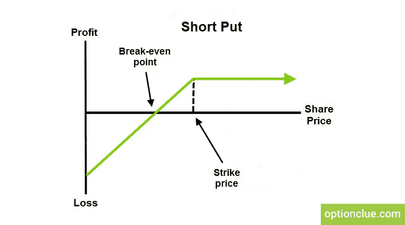

Payoff Diagram for a Short Put position.

As we can see, the payoff curves of the Covered Call and Put Selling strategies are quite similar. Furthermore, we can also see from the payoff curves alone that most popular structured products in crypto at the moment are simpler than some of the highly complex and bespoke structured products available in traditional finance.

Other than Ribbon Finance, a number of other DeFi Option Vaults platform are out there, including, but not limited to:

**StakeDAO** —在一个平台中结合了收益聚合器和 DeFi 期权库以及其他服务。

**ThetaNuts** —以太坊上的第三大 DOV 平台，专注于由主要加密货币的同时看跌期权指数支持的收益率令牌。

**Opyn**——squeress 的发明者，这是一种新的金融原始工具，它让持有人接触到 eth，而没有清算的可能性。有螃蟹金库，可以赚取收益，特别是在横向市场。

武士刀——索拉纳上第二大 DOV 平台。也关注备兑看涨期权和看跌期权。

索拉纳岛上最大的 DOV 平台。

**PsyOptions** —基于订单簿的期权交易所和 Solana 上的 DOV 平台。

**魔女金融** —既是期权交易所，也是以太坊的 DOV 平台。

**阿罗市场**——即将出台的雪崩 DOV 协议。

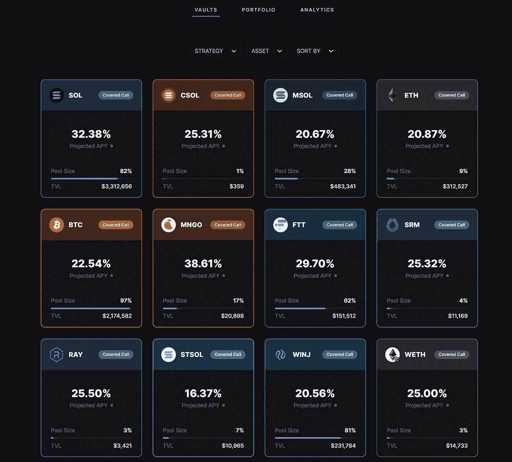

Katana Option Vaults on Solana.

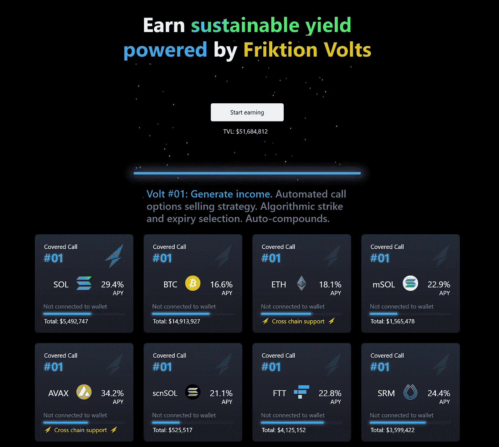

Friktion Option Vaults on Solana.

# 固定收益产品

在密码领域，固定收益产品(fyp)是为寻求长期可靠、稳定的资本收益的用户构建的 DeFi 协议和应用程序，而不是为寻求潜在更高收益但增加了可变性和/或风险的用户构建的产品。在传统金融领域，固定收益率被称为固定收益，对于寻求未来规划确定性的投资者来说，它是投资组合管理中的一个巨大([【100T+】美元)领域(一个主要例子是政府债券)。固定收益投资者能够以高度的信心准确预测他们的资本将会增长多少。与 TradFi 相比，DeFi 中 FYPs 的潜在优势包括透明度、无保管风险、灵活性和流动性以及开放性。](https://www.sifma.org/resources/research/research-quarterly-fixed-income-issuance-and-trading/)

**名义协议**是以太坊上 FYP 的一个典型例子。名义上是一个固定收益的借贷平台——相对于专门为希望借出加密资产的用户建立的固定收益协议。由一个在传统利率互换和技术开发领域拥有丰富经验的团队共同创立，名义银行旨在为管理固定收益率加密资产的用户提供确定性，并最大限度地降低风险。名义支付通过一种以 fCash token DeFi 原语为中心的机制运行，这是在未来特定时间的令牌化支付。例如，+105 12 月 1 日 fUSDC 是一种资产，持有人可以在到期后的 12 月 1 日赎回 105 复合 cUSDC(然后可以赎回 USDC)。在幕后，名义上的 AMM 流动性池允许流动性提供者在选择最长 20 年的到期利率后，将 fCash 代币和 cTokens 存入 mint nTokens(流动性池的附息股份),并作为贷款人和借款人的交易对手。截至 2022 年 6 月，名义 TVL 超过 1.8 亿美元。

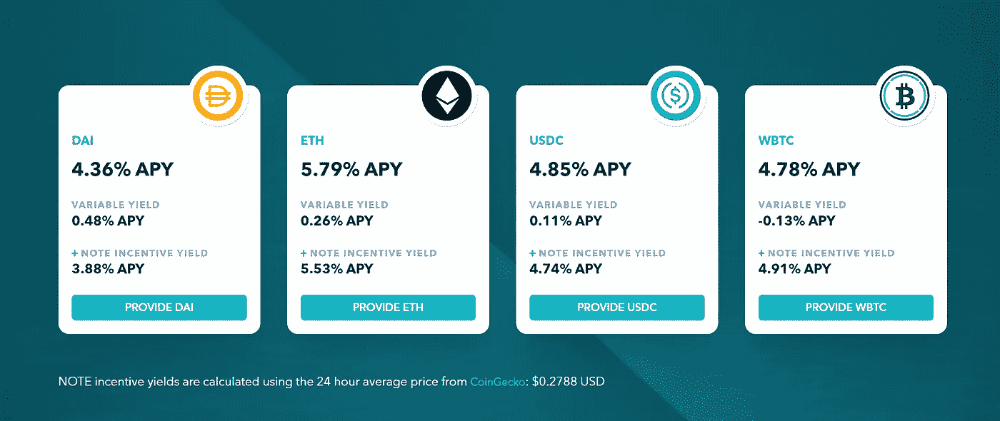

**收益协议**为借贷双方提供 fyp。截至 2022 年 6 月，Yield Protocol 的 TVL 超过 1500 万美元，并提供超过一年收益率的精选到期日产品。

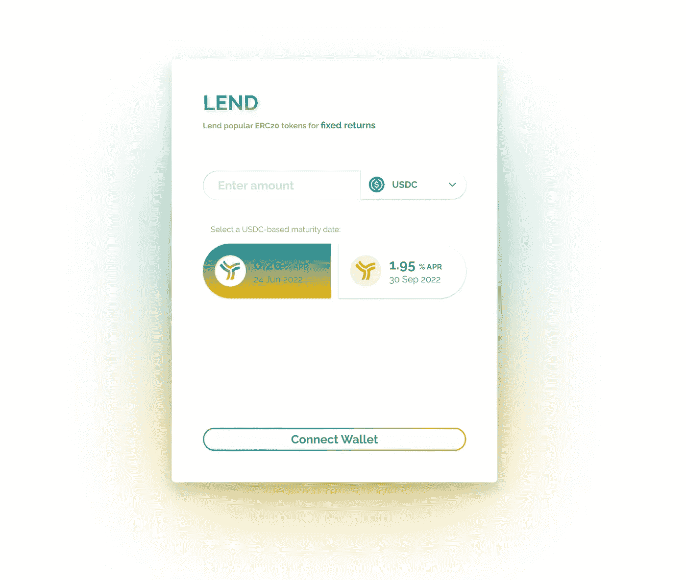

# 真实世界的资产和抵押不足的贷款平台

DeFi 的真实世界资产(RWA)类别旨在连接真实世界资产链，并允许投资者通过 DeFi 基础设施获得收益。资产的例子包括抵押贷款、贷款或房地产。

**离心机**被宣传为真实世界的 DeFi，旨在释放分散金融世界中真实世界资产的流动性。Centrigure 的愿景是在各地培育经济机会，目前的主要目标是让中小型企业进入开放、分散的资本市场，以降低其资本成本。该团队在以太坊上开发了 Tinlake，这是一个面向用户的应用程序，是基于现实世界资产的开放智能合约市场。离心机的 RWA 被桥接为支持隐私的 NFT——单个资产的令牌化表示，这些资产在离心机链上表示(利益链证明，桥接至以太坊，构建在底层上)。截至 2022 年 6 月，离心机 TVL 超过 8500 万美元。

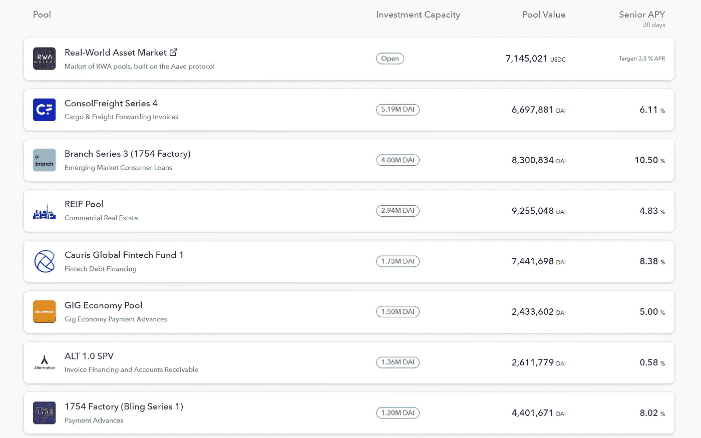

**Maple Finance** 是一项旨在解决传统金融领域效率低下问题的协议——通过在 DeFi(以太坊和 Solana)中引入机构现金流链，目标是提供不变性并减少企业信贷市场内的摩擦。主要产品是向机构投资者提供抵押不足的贷款，例如向秘密做市商提供信贷以进行运营。资金池代表在特定客户的基础上提供透明的连锁贷款服务(评估信用以设定与借款人的管理/书面贷款条款)，利益相关者提供资金以赚取固定收益。由于与买家的协议，贷款违约具有现实世界的追索权。枫叶财政部从借款人支付的贷款建立费中获利。截至 2022 年 6 月，枫叶 TVL 超过 7300 万美元。

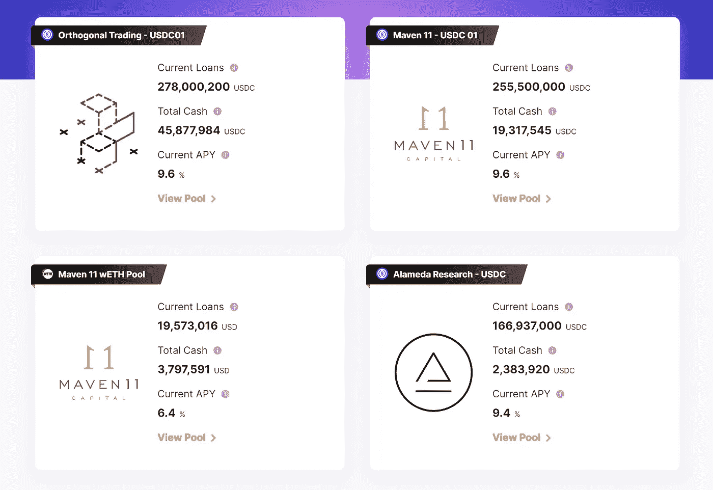

# 其他结构性产品、混合产品和外来产品

## 基础农业

**UXD 协议**——一个完全抵押的稳定币和一个基础农业协议同时存在。每存入 1 索尔，该协议就在索拉纳的分散式永久交易所开立一个等价的 1 索尔大小的空头头寸。鉴于在 crypto 的整个历史中，永久融资通常是正的而不是负的，其想法是在长期的正融资期间将融资差异捕捉为收入流(而在不太频繁的负融资期间会损失一点)。

**Lemma Finance** 和 **Basis Markets** 是在同一个领域工作的另外两个项目，但它们最近都很安静。

## 杂种

**梵天。Fi** —拥有德根金库(Degen Vaults)，该金库将全部存款投入保守的渴望策略，并使用周收益率执行激进的定向永久或期权动量交易。这让我们想起了保本票据(Principal Protected Notes，PPNs)，这是一种传统金融中的结构性产品，保证回报率至少为投资金额，并可能有额外收益。

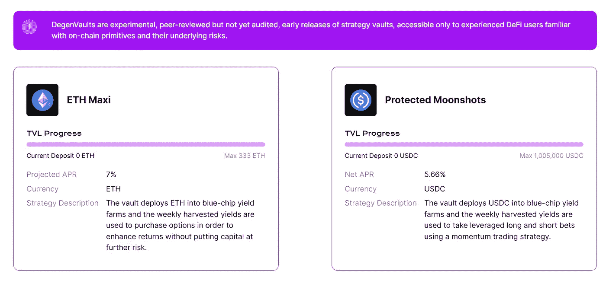

## 外来植物

**鸦片金融**—DeFi 结构化产品平台。除了常规 dov，还有“Turbos ”,这是一种稍微复杂一些的结构化产品。

**反物质金融**—DeFi 奇异结构性产品的平台。除了常规 dov，该平台还提供鞍式选项、分层选项、每周鲨鱼鳍(PPN)和其他奇特产品。

**结构金融** —一种基于 BSC 的协议，提供双重无接触，这是一种奇特的期权产品。

# 分散资产管理

分散资产管理是指使用区块链智能合同，以不可阻挡、不受审查和不可信的方式提供资产管理服务。本质上，它是区块链的基金。我们在上一篇文章中已经详细讨论了 DeFi 的这个子类，所以我们在这里不再赘述。但是，我们要注意的是，大多数分散资产管理产品(尤其是主动资产管理产品)也采用基于保险库的设计:

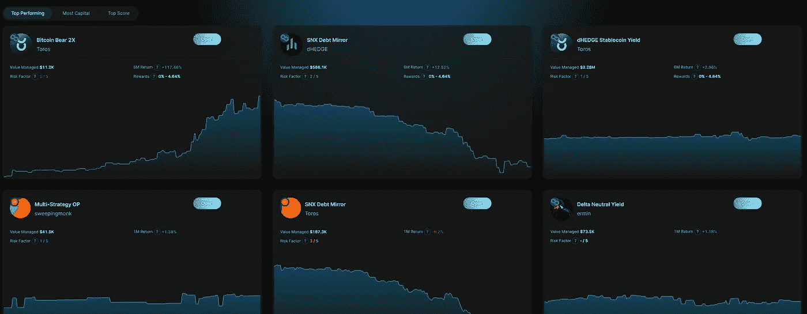

dHedge Vaults which represent discretionarily managed strategies

# DeFi 结构性产品与 DeFi 资产管理产品相比如何？

DeFi 结构化产品空间和 DeFi 资产管理空间之间的核心相似之处在于，它们都在很大程度上使用基于保险库的设计，因此作为用户，您可以将资金存入智能合约的实例中。

核心区别在于，在 DeFi 结构化产品领域，在您将资金存入保险库后，保险库执行的大多数后续操作都是自动、系统地完成的，而在 DeFi 资产管理领域，尤其是主动管理产品领域，后续操作是由一个或多个人员随意执行的。

# DeFi 结构性产品与 DeFi 资产管理产品相比如何？

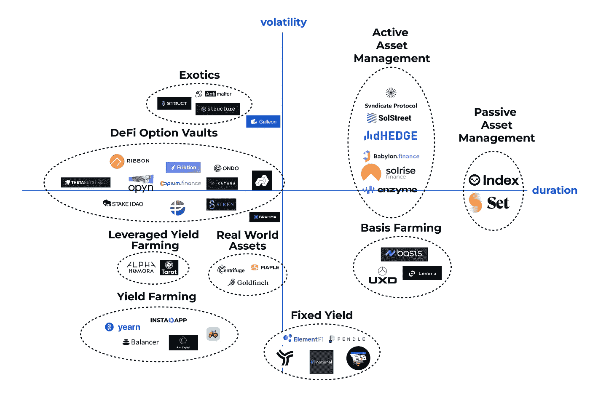

Market Map of many of Vaults-based DeFi products

正如我们所看到的，保险库设计出现在大部分 DeFi 协议中，从农业到借贷，再到分散的资产管理。我们相信在分散资产管理类别和金库类别中都有机会建立一些新的和创新的东西，我们称之为**短期自主资产管理。在下一篇文章中会有更多的介绍。**

## **在推特上关注我们:** [@STFX](https://twitter.com/STFX_IO)

## **加入 STFX 不和频道:**[discord.gg/STFX](https://t.co/2cTV2vAUTM)

> *加入 Coinmonks* [*电报频道*](https://t.me/coincodecap) *和* [*Youtube 频道*](https://www.youtube.com/c/coinmonks/videos) *了解加密交易和投资*

# 另外，阅读

*   [Bookmap 评论](https://coincodecap.com/bookmap-review-2021-best-trading-software) | [美国 5 大最佳加密交易所](https://coincodecap.com/crypto-exchange-usa)
*   最佳加密[硬件钱包](/coinmonks/hardware-wallets-dfa1211730c6) | [Bitbns 评论](/coinmonks/bitbns-review-38256a07e161)
*   [新加坡十大最佳加密交易所](https://coincodecap.com/crypto-exchange-in-singapore) | [收购 AXS](https://coincodecap.com/buy-axs-token)
*   [红狗赌场评论](https://coincodecap.com/red-dog-casino-review) | [Swyftx 评论](https://coincodecap.com/swyftx-review) | [CoinGate 评论](https://coincodecap.com/coingate-review)
*   [投资印度的最佳加密软件](https://coincodecap.com/best-crypto-to-invest-in-india-in-2021)|[WazirX P2P](https://coincodecap.com/wazirx-p2p)|[Hi Dollar Review](https://coincodecap.com/hi-dollar-review)