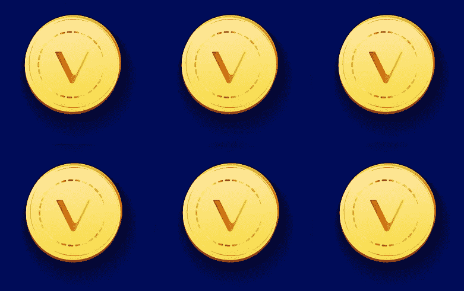
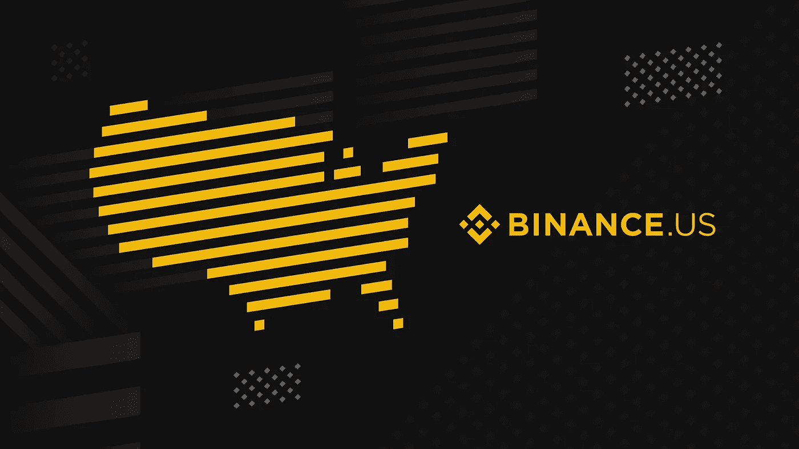
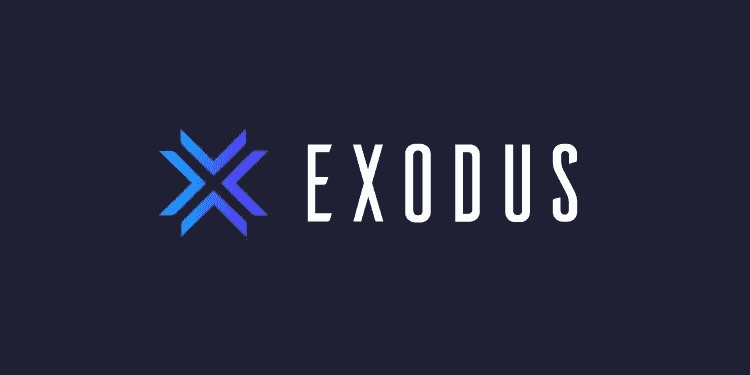
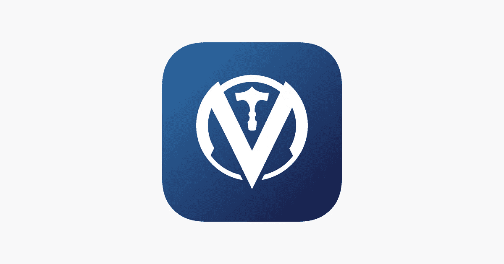
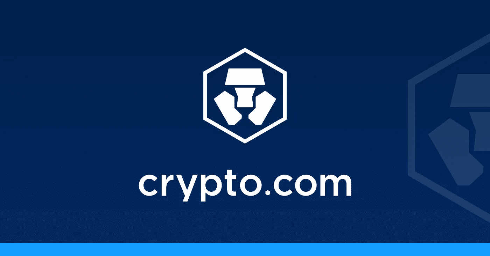
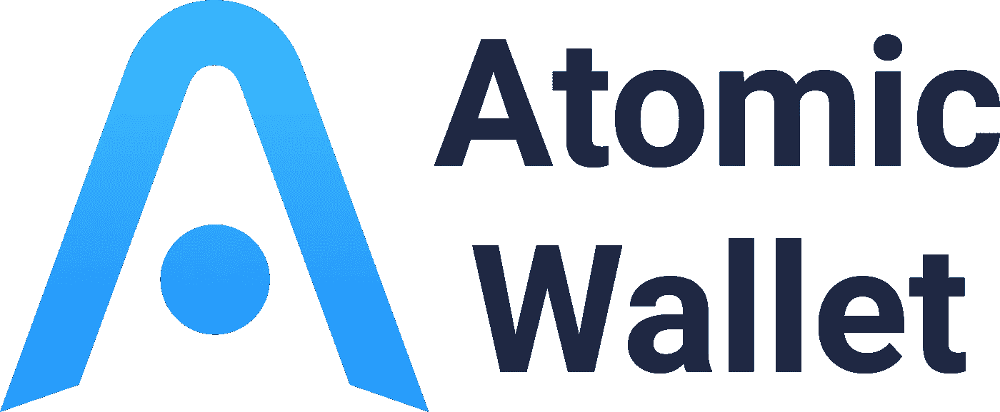

# ve chain——寻找 APY 最高赌注的初学者指南

> 原文：<https://medium.com/coinmonks/vechain-a-beginners-guide-to-finding-the-highest-staking-apy-77fc998a3b12?source=collection_archive---------41----------------------->

有没有想过你买的东西去了哪里或者是不是假货？VeChain (VET)是一个加密资产项目，涉及供应链跟踪，以保证你购买的任何东西的真实性，从牛奶到路易威登手袋。这种跟踪是通过使用 RFID 设备来实现的。

这个加密项目是加密星系中唯一的一个。当我们等待更多的大众采用时，我们可以用我们的 VET 令牌来换取被动收入。立桩兽医为你赢得兽医代币。让我们来看看哪些平台为你的兽医令牌提供了最好的 APY。

1.  美国币安

Curtesy of binance.us

*   平均每个月 1-3%的 APY 作为 VeThor 支付。
*   需要了解你的客户(KYC)。
*   你没有自己的钥匙。
*   [https://www . binance . us/en/staking/products/e 5949d 1808 ea 489881342 fece 7760912](https://www.binance.us/en/staking/products/e5949d1808ea489881342fece7760912)

2.出埃及钱包

Curtesy of exodus.com

*   每天支付 1-2%的 APY。作为维索尔
*   可在 IOS 和 Android 以及桌面版本上使用。
*   完全保管你自己的钥匙。
*   不需要了解你的客户(KYC)。
*   https://support . exodus . com/article/1204-ve chain-and-ve thor-staking-FAQ

3.VeChainThor 钱包

Curtesy of [https://apps.apple.com/us/app/vechainthor/id1397679485](https://apps.apple.com/us/app/vechainthor/id1397679485)

*   0.000432 VeThor，每持有 1 个 VET。每天支付。
*   完全保管你自己的钥匙。
*   不需要了解你的客户(KYC)。
*   安卓系统:https://play.google.com/store/apps/details?id=com.vechain.wallet
*   苹果:https://apps.apple.com/us/app/vechainthor/id1397679485

4.Crypto.com

curtesy of crypto.com

*   0.5% APY —灵活选项(无锁定)。
*   1% APY——灵活选择，在 CRO 必须持有 4000 美元。
*   1% APY——锁定 1 个月。
*   2% APY——锁定 1 个月，在 CRO 必须持有 4000 美元。
*   2% APY——锁定 3 个月。
*   3% APY——锁定 3 个月，在 CRO 必须持有 4000 美元。
*   4% APY——在 CRO 锁定 1 个月，必须持有 40，000 美元。
*   5% APY——锁定 3 个月，在 CRO 必须持有 40，000 美元。
*   需要了解你的客户(KYC)。
*   你没有自己的钥匙。
*   https://crypto.com/us/earn.

5.原子钱包

Curtesy of atomicwallet.io

*   1.63% APY 作为 Vethor
*   奖励每两周发放一次。
*   线上和手机 app。
*   不需要了解你的客户(KYC)。
*   完全保管你自己的钥匙。
*   https://atomicwallet.io/vechain-staking

Vechain 用作支付功能，而 VeThor 用于支付与交易相关的费用(可以认为这是商户接受信用卡所需支付的费用)。每当交易发生时，都会花费少量的 VeThor 来支付相关的费用。这些费用中的一部分被烧掉，剩下的被送给像你我这样的持有者。许多其他加密项目都有类似的机制，如以太坊和 NEO。VeThor 可以换成美元来购买更多的 VET 或任何其他加密资产。

快乐的赌注！

声明:本文并非财务建议。