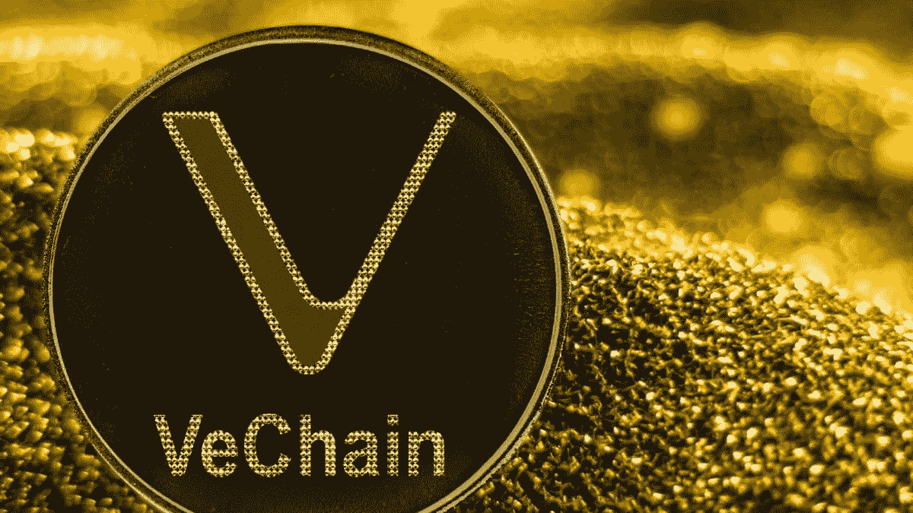

# VeChain 现已被 70 个国家的 200 多万家商店接受为一种支付方式

> 原文：<https://medium.com/coinmonks/vechain-is-now-accepted-as-a-form-of-payment-in-over-2-million-stores-in-70-countries-a730c1f34b84?source=collection_archive---------21----------------------->

## VeChain 的区块链技术背后的符号 VeChain 现在被 70 个国家的 200 多万家商店接受为支付手段。

在与炼金术建立新的关系后，VeChain 现在可以作为一种支付方式使用了…