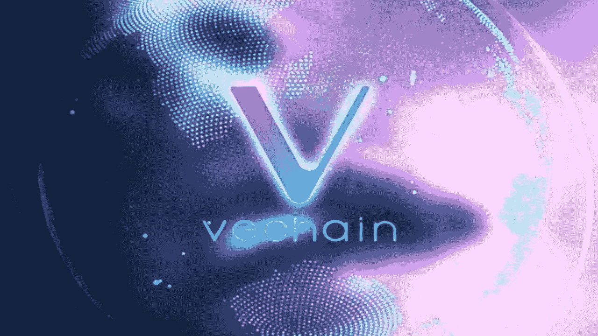

# VeChain (VET)解决方案可能会在 2022 年产生重大影响

> 原文：<https://medium.com/coinmonks/vechain-vet-solutions-may-have-a-significant-impact-in-2022-83f6f81ecb49?source=collection_archive---------27----------------------->

Source photo [vechain — Bing images](https://www.bing.com/images/search?view=detailV2&ccid=DaQ34k6f&id=8B4A04695DA26F8797CFD168B83D2DAD2C30231D&thid=OIP.DaQ34k6fktPNVa8TA7AH8wHaEK&mediaurl=https%3a%2f%2fi.ytimg.com%2fvi%2fCDyc_BeZyrk%2fmaxresdefault.jpg&cdnurl=https%3a%2f%2fth.bing.com%2fth%2fid%2fR.0da437e24e9f92d3cd55af1303b007f3%3frik%3dHSMwLK0tPbho0Q%26pid%3dImgRaw%26r%3d0&exph=720&expw=1280&q=vechain&simid=608045224818578991&FORM=IRPRST&ck=9F5E7B4AD41F680F2322E2A0EBB2FDD1&selectedIndex=6&ajaxhist=0&ajaxserp=0)

VeChain (VET)加密货币令牌被视为解决当前世界日益增长的问题的开创性努力。对于许多最大的加密货币解决方案来说，供应链过程中的假冒商品和掺假问题已经成为一个主要问题。