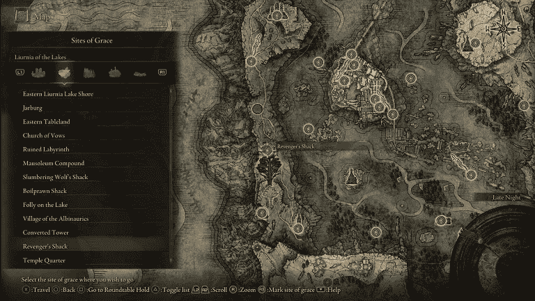

# 在埃尔登环冒险…我目前的道路。

> 原文：<https://medium.com/coinmonks/venturing-in-elden-ring-my-current-path-692bc6f61ff8?source=collection_archive---------27----------------------->

湖泊里的柳妮亚。多好的地方啊！

Liurnia of the Lakes 是游戏中更容易探索的地方之一，虽然它充满了自己的困难，例如陆地和海洋上的敌人，但它仍然是一个寻找高质量经验和项目的地方。

如果我没有在过去的帖子中让大家知道这一点，我已经完全探索完了整个利姆格雷夫…