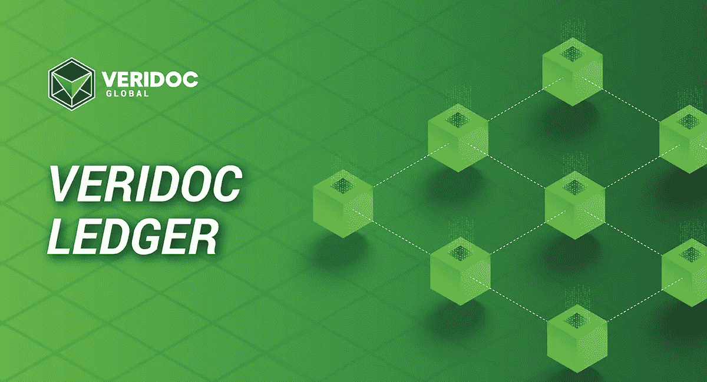
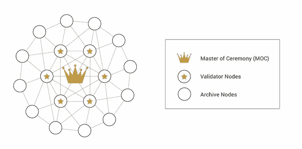
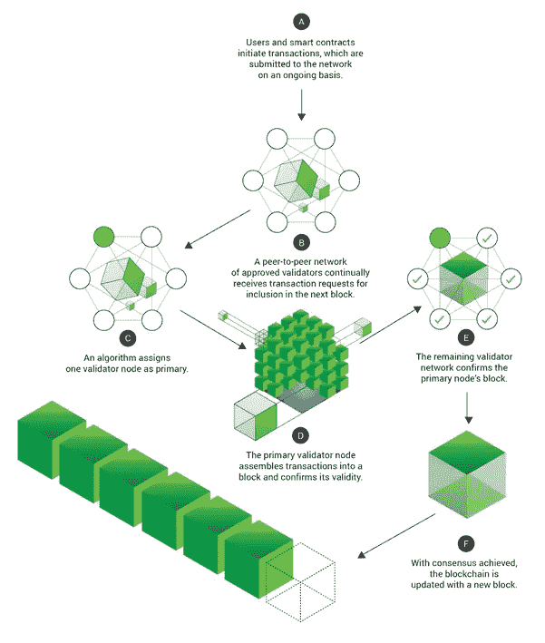

# VeriDoc Ledger:适合政府和企业的区块链

> 原文：<https://medium.com/coinmonks/veridoc-ledger-a-blockchain-fit-for-government-and-enterprise-dcd7e01a5f97?source=collection_archive---------20----------------------->

VeriDoc Global 是一种获得专利的验证协议，可与任何区块链集成。多链解决方案目前利用七种不同的区块链。每个区块链都有自己独特的优势和劣势。

VeriDoc Ledger 是 VeriDoc Global 套件中添加的第七个区块链，旨在填补公共和私人区块链之间的空白。它可以被描述为一个混合的区块链，在不牺牲安全性和透明性的情况下提供公共和私有特性。

VeriDoc Ledger 是以太坊区块链的一个分支，使 Ledger 能够继承区块链七年的开发和智能合同能力。世界第二大区块链的信誉和历史记录影响了该公司使用以太坊作为其技术基础的决定。

然而，与以太坊的工作证明和即将成为利益一致机制的证明不同，VeriDoc Ledger 利用授权证明方法在分布式节点之间就网络的单一状态达成一致。

Figure 1: Proof of Authority Blockchain Architecture

Figure 2: Proof of Authority Explained

**是什么让 VeriDoc Ledger 与众不同？**

**1。公私混合**

比特币和以太坊等公共区块链是不可变的，允许任何人探索账本，提供了最大程度的信任和透明度。然而，公共区块链不归个人或实体所有，因此几乎没有问责制。如果区块链停止工作，没有人会被判有任何不当行为，也没有服务级别协议。

另一方面，私营区块链通常向选定的利益相关者提供受控或有限的透明度。根据分类账的规则，数据并不总是不可变的，可以很容易地修改。由于大多数私营区块链是由实体经营的，因此对所提供的服务负有责任。

VeriDoc Ledger 提供了一个混合解决方案。区块链本质上是不可变的和公共的，允许任何人使用区块链浏览器来浏览账本，并且它由实体 VeriDoc Global 拥有和管理。为客户定制的区块链探索者可以通过过滤掉全球交易，只显示与用户或组织相关的记录，创造一个私人的区块链体验。

**2。交易成本**

区块链社区越来越关注公开区块链交易的成本。以太网(ETH)等加密货币的价格波动以及空投和项目启动导致的拥堵，导致高峰期间每笔交易的天然气费用增加了 500 美元。

VeriDoc Ledger 通过摆脱工作证明和利益证明解决了这个问题。在授权证明框架下，交易成本与运行区块链基础设施的成本直接相关。由于服务器成本本质上通常是固定的，项目现在可以围绕可预测的区块链交易费用来设定预算。

**3。可扩展性和问责制**

区块链社区中另一个日益增长的担忧是区块链的可伸缩性，因为它的使用和采用越来越多。许多区块链团体和基金会探索了各种选择，如增加区块大小、区块时间、侧链和分片。

VeriDoc Ledger 是在考虑以太坊的情况下开发的。在许多方面，它可以被描述为一个以太坊侧链。使用桥接协议，通过使用 Merkle 树验证哈希值，所有 VeriDoc 分类帐交易都在以太坊的主链上负责。由于 VeriDoc Ledger 专用于 VeriDoc Global 解决方案，因此短期内的可扩展性不是一个大问题，如果在不久的将来没有重大的技术进步，VeriDoc Global 可以根据需要简单地部署额外的侧链。

**4。安全**

公共区块链有一个共同的安全风险，称为 51%攻击，这是一群矿工或赌注者对区块链的攻击，他们控制了至少 51%的网络计算能力或赌注加密货币。也有关于量子计算机和量子抵抗或量子安全区块链的讨论。

VeriDoc Ledger 的权限证明共识机制允许 VeriDoc Global 管理哪些节点是验证器节点，哪些节点是归档节点。(参见上面的图 1。)这意味着它可以确保可信方始终控制至少 51%的计算能力。不可信节点将仅运行区块链的档案，并且不具有进行 51%攻击所需的任何验证者特权。

**5。碳和能源友好型**

围绕区块链工作证明的一个主要讨论话题是开采加密货币所需的能量，作为支持区块链网络的奖励。

通过采用权威框架证明，VeriDoc Ledger 是世界上最碳友好的区块链之一。不需要挖掘或打桩，这显著降低了运行节点的计算能力要求。节点甚至可以从 Raspberry Pi 运行。

VeriDoc Global 现在为任何希望连接到区块链的应用程序提供区块链服务。凭借不断增长的 API 库，VeriDoc Global 可以帮助政府和企业快速跟踪他们的 Web 3.0 之旅。

了解更多关于 VeriDoc 全球访问:[https://veridocglobal.com](https://veridocglobal.com)

*本文由首席运营官 VeriDoc Global 的 Daniel da Silva Lay 撰写。*

> 加入 Coinmonks [电报频道](https://t.me/coincodecap)和 [Youtube 频道](https://www.youtube.com/c/coinmonks/videos)了解加密交易和投资

# 另外，阅读

*   [如何在 FTX 交易所交易期货](https://coincodecap.com/ftx-futures-trading) | [OKEx vs 币安](https://coincodecap.com/okex-vs-binance)
*   [OKEx vs KuCoin](https://coincodecap.com/okex-kucoin) | [摄氏替代品](https://coincodecap.com/celsius-alternatives) | [如何购买 VeChain](https://coincodecap.com/buy-vechain)
*   [ProfitFarmers 点评](https://coincodecap.com/profitfarmers-review) | [如何使用 Cornix Trading Bot](https://coincodecap.com/cornix-trading-bot)
*   [如何匿名购买比特币](https://coincodecap.com/buy-bitcoin-anonymously) | [比特币现金钱包](https://coincodecap.com/bitcoin-cash-wallets)
*   [瓦济里克斯 NFT 评论](https://coincodecap.com/wazirx-nft-review)|[Bitsgap vs Pionex](https://coincodecap.com/bitsgap-vs-pionex)|[坦吉姆评论](https://coincodecap.com/tangem-wallet-review)
*   [如何使用 Solidity 在以太坊上创建 DApp？](https://coincodecap.com/create-a-dapp-on-ethereum-using-solidity)