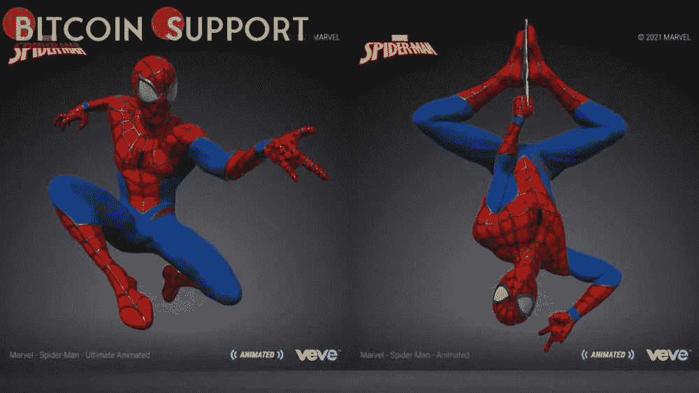

# 漫威 NFT 的合作伙伴 Veve 因应用内令牌漏洞关闭了其市场

> 原文：<https://medium.com/coinmonks/veve-a-marvel-nft-partner-has-shut-down-its-marketplace-due-to-an-in-app-token-exploit-6a27320392f?source=collection_archive---------8----------------------->

**Visit our website:-** [**https://bitcoinsupports.com/**](https://bitcoinsupports.com/)

Twitter 用户声称，该漏洞导致他们的数字收藏品价格在上周暴跌。Veve 是一个非伪造的代币(NFT)市场，拥有许可的数字商品，周二遭到攻击，导致数百万宝石(应用内代币)被非法收购。漫威、皮克斯和可口可乐等主流品牌已经选择 Veve 作为他们的官方发布合作伙伴，这表明该平台的受欢迎程度。

Veve 在周三发布的官方推特中承认了其平台的漏洞，称攻击者能够非法获得“大量”宝石。在调查完成之前，基于应用的 NFT 平台已经关闭了市场和宝石购买选项。

[https://Twitter . com/veve _ official/status/1506462178223616001](https://twitter.com/veve_official/status/1506462178223616001)

宝石是用户可以在市场上或掉落期间兑换成收藏品的 VeVe 应用内货币。根据早期的报道，攻击者利用购买系统中的一个缺陷，能够在无需支付费用的情况下制造出数百万颗宝石。一位用户说，一位朋友用过期的信用卡购买了宝石，交易成功了。

[https://Twitter . com/GARLICxSHRIMP/status/1506319537335148544](https://twitter.com/GARLICxSHRIMP/status/1506319537335148544)

几个用户账号在被发现试图从假冒账号购买廉价宝石时，也被暂停使用。虽然 NFT 平台没有透露被滥用的宝石的实际数量，但一名 Twitter 用户表示，总数可能是数百万，这是该网站最大的一次抢劫。这位 Twitter 用户还透露了该漏洞行动的时间表，其中包括 Veve 记录了应用内令牌 gems 的最大 3 天购买量，随后应用外令牌的价格下降了 50%，从 0.5 美元降至 0.25 美元，市场进入维护阶段。

[https://twitter.com/niftyswaps/status/1506462559893069826](https://twitter.com/niftyswaps/status/1506462559893069826)

Veve 上的 gem 漏洞也导致该平台上市的 NFT 价格大幅下跌，其中一名用户意识到，为什么在 Veve 的官方 Twitter 推特发布一周后，他的 NFT 价值就下跌了 80%。

[https://twitter.com/jai_sond/status/1506525526588022788](https://twitter.com/jai_sond/status/1506525526588022788)

**访问我们的网站:-**[**https://bitcoinsupports.com/**](https://bitcoinsupports.com/)

**免责声明:以上为作者观点，不应视为投资建议。读者应该自己做研究。**

> 加入 Coinmonks [电报频道](https://t.me/coincodecap)和 [Youtube 频道](https://www.youtube.com/c/coinmonks/videos)了解加密交易和投资

# 另外，阅读

*   [印度最佳 P2P 加密交易所](https://coincodecap.com/p2p-crypto-exchanges-in-india) | [柴犬钱包](https://coincodecap.com/baby-shiba-inu-wallets)
*   [8 大加密附属计划](https://coincodecap.com/crypto-affiliate-programs) | [eToro vs 比特币基地](https://coincodecap.com/etoro-vs-coinbase)
*   [最佳以太坊钱包](https://coincodecap.com/best-ethereum-wallets) | [电报上的加密货币机器人](https://coincodecap.com/telegram-crypto-bots)
*   [交易杠杆代币的最佳交易所](https://coincodecap.com/leveraged-token-exchanges) | [购买 Floki](https://coincodecap.com/buy-floki-inu-token)
*   [3Commas 对 Pionex 对 Cryptohopper](https://coincodecap.com/3commas-vs-pionex-vs-cryptohopper) | [Bingbon 评论](https://coincodecap.com/bingbon-review)