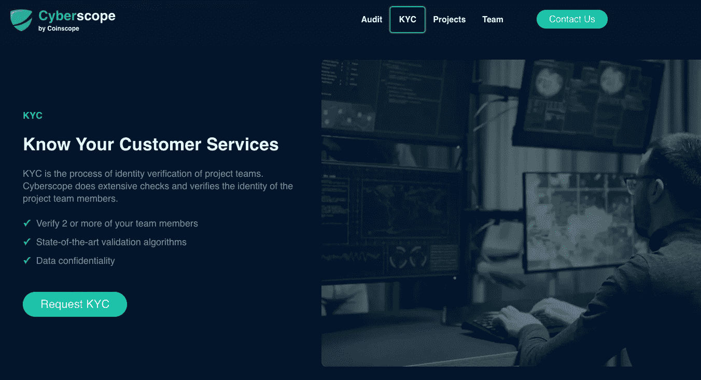

# 一个秘密骗局的受害者？看看你如何能收回你的资金

> 原文：<https://medium.com/coinmonks/victim-of-a-crypto-scam-see-how-you-can-recover-your-funds-abcceb4cfe0b?source=collection_archive---------18----------------------->

加密货币犯罪在 2021 年创下纪录，最新报告发现骗子去年窃取了价值 140 亿美元的加密货币。根据区块链的数据，这几乎是 2020 年诈骗者 78 亿美元的两倍，我们预计随着加密技术的普及，这一数字将继续增长。

我们在 [Cyberscope](https://www.cyberscope.io/) 的日常任务是保护散户投资者和交易者免受骗子和欺诈者的侵害。为了实现这一目标，我们正在提供像 KYC 这样的服务，可以在你成为加密骗局的受害者时保护你的投资。

# 投资前要检查什么

在你投资任何新项目之前，DYOR(做你自己的研究)是很重要的。在密码行业，您会经常听到这个缩写词，但是理解它的重要性是非常重要的。

> 新的加密用户应该做自己的研究，相信自己。
> ——CZ，币安 CEO

始终投资于已经被像赛博视这样的知名公司审计和 KYC 的项目。这将使你有更大的机会收回你的资金，以防你投资的加密货币的项目所有者决定进行某种欺诈。

# 如何识别自己是否被骗

无论你有多小心，你辛辛苦苦赚来的钱还是有可能落入骗子的口袋。你应该做的第一件事是确定你真的成为了犯罪的受害者。

在采取行动举报欺诈案件之前，您首先需要检查以下内容:

1.  **项目的创始人在社交媒体上有反应吗？**
    查看项目的电报频道或不和谐，看看其他像你一样的投资者在说什么。您可能错过了一个公告，或者合同中发生了迁移，交易被暂停。
2.  **追踪团队钱包的交易。** 看看项目的资金是如何被团队管理的。这些交易与创始人声称的相符吗？你注意到任何可疑的模式了吗？
3.  **看项目路线图。** 项目是否在项目上做主动开发？他们还在继续他们的营销活动吗？

一旦你确定你是一个犯罪的受害者，尽可能收集所有的证据，并联系该项目的 KYC 供应商展开调查。

# 如何收回你的资金

所以，你花了几个小时研究一个新项目，仍然发生了意想不到的事情，你投资的项目，要么 rugpulls 或项目所有者执行一些其他类型的骗局。你现在能做什么？

你需要做的第一件事是联系该项目的 KYC 供应商。像赛博视这样的 KYC 公司将代表你展开彻底的调查，并尽最大努力追回你的资金。

> 交易新手？试试[加密交易机器人](/coinmonks/crypto-trading-bot-c2ffce8acb2a)或者[复制交易](/coinmonks/top-10-crypto-copy-trading-platforms-for-beginners-d0c37c7d698c)

一旦确定该项目犯了罪，一个受人尊敬的 KYC 提供商将代表你提出指控。这不应该阻止你自己追查骗子，以增加你收回资金的机会。

以下是实现这一目标的步骤:

1.  **向您的 KYC 提供商索取事故报告。** 事故报告将包含车主的钱包和个人数据等信息，因此您可以向当地主管部门提出指控。
2.  **收集该过程中涉及的所有区块链交易的清单** 这将被证明是当局帮助他们进行自己的研究和调查的有价值的证据。如果你看到骗子将他们的资金转移到像币安这样的中央交易所，立即[联系交易所](https://www.binance.com/en/support/faq/360000006051)提供所有信息。
3.  **向 FTC & FCA** 
4.  雇佣一个密码猎人
    如果你损失了一大笔钱，你可能会考虑雇佣一个专家来帮你。加密猎人与加密货币持有者和执法机构合作，搜索和恢复放错地方、无法访问或被盗的加密货币。他们使用专门的软件生成数百万个潜在密码，并倾向于收取固定费用。

如果你是犯罪的受害者，找回你的加密资金可能很困难，但并非不可能。许多用户报告了成功的案例，他们通过遵循这些步骤成功地追回了部分或全部资金损失。不要放弃，记住在投资新项目之前，一定要 DYOR。

…

*原载于*[*https://www . cyber scope . io*](https://www.cyberscope.io/)*。*