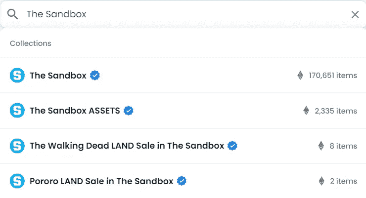
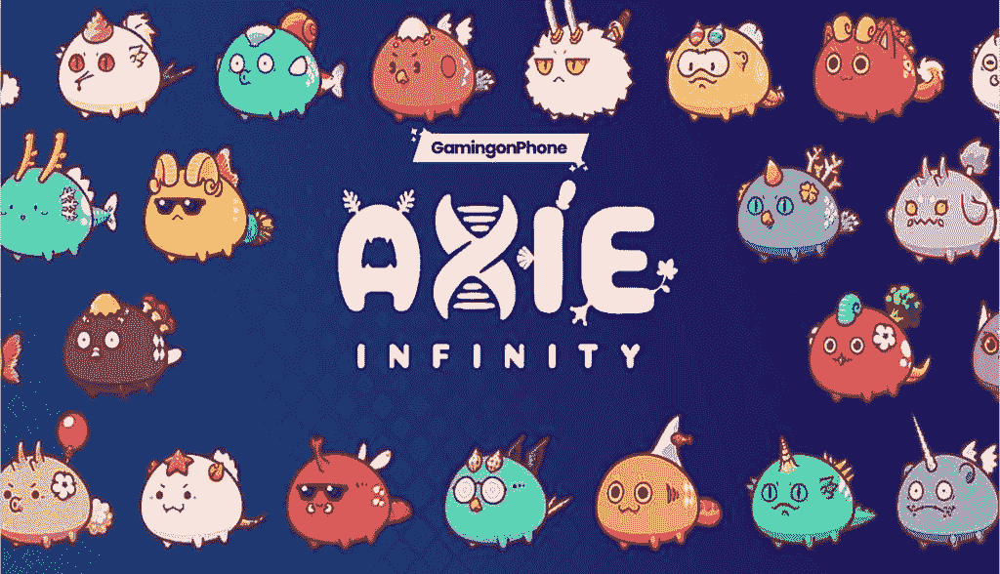

# 虚拟房地产——指南

> 原文：<https://medium.com/coinmonks/virtual-real-estate-a-guide-75336020963f?source=collection_archive---------24----------------------->

元宇宙，一个风靡全球的概念。我们无法确定它将会引起什么样的破坏，但是我们可以确定一件事，那就是它将会使之前的一切看起来都非常原始。

在过去的几个月里，许多围绕这个概念的项目已经出现。其中之一是“虚拟土地/地产”的概念。尽管许多人对元宇宙持怀疑态度，但大品牌已经开始购买虚拟土地。

"[沙盒](https://www.sandbox.game/en/)"到目前为止已经被列为最好的去中心化元宇宙之一。

The Sandbox Icon

# **《沙盒》中买地的步骤**

如果你对购买“沙盒”上的虚拟土地感兴趣，你主要可以选择使用 [OpenSea](https://opensea.io/) 或任何其他市场。要接收所述虚拟土地，请遵循以下步骤:

1.  在 OpenSea 上购买虚拟土地需要一个加密钱包。最常用的加密钱包是[元掩码](https://metamask.io/)。

Metamask wallet

2.进入 OpenSea，点击个人资料。连接您想要的钱包。

3.在你的钱包里加入你想要的 ETH 和一些额外的 ETH 作为汽油费。

4.在搜索栏中搜索“沙盒”。

Searching for The Sandbox on OpenSea

5.根据你的策略和预算选择你想要的土地

Virtual Lands

6.接受 Metamask 上的上述交易。

# **评估虚拟房地产**

评估虚拟土地时，需要考虑以下几点:

*   位置在你的虚拟土地的价格中起着关键作用。人口越多的地区，土地的价格就越高。名人或品牌旁边的虚拟土地在未来也有更高的价格飙升的机会。
*   分析项目背后的团队以及他们是否有经验来支持他们的主张是很重要的。元宇宙的竞争越来越激烈。人们需要不断地跟踪团队的进展，以了解他们是否真的坚持他们的最后期限。
*   为了安全起见，最好投资受欢迎的项目。规模较小的项目可能会因资金不足而关闭，因此项目的受欢迎程度在虚拟房地产的评估中起着重要作用。
*   项目的概念可以导致项目的成功或失败。项目的效用、用途和类型可能是投资者做出决定的影响因素，这在很大程度上取决于个人偏好。
*   如果一个元宇宙项目与同一领域的其他大公司有合作关系，项目成功的几率会成倍增加。其他公司将推动该项目的炒作，价格会增加。

# **虚拟土地作为投资的风险**

投资虚拟房地产前需要考虑的风险:

*   “沙盒”中的土地价值直接与他们的代币挂钩。资产的价格直接取决于加密市场，因此非常不稳定，因此可能是虚拟世界的主要风险因素。
*   如果不采取预防性安全措施，虚拟土地可能会被盗。安全问题是最受关注的问题，也是资产可利用性的第一层，因为它在某种程度上涉及到人的控制。
*   该团队可以对没有可用性的空洞项目进行大量虚假宣传，以获得投资。价格会被推高，然后他们会携款潜逃，因为没有中央管理机构，就没有问责制。

# **赚取虚拟土地投资机会**

*   你可以出租你的虚拟土地来赚取一些被动收入。数量将取决于许多因素，如稀缺性、邻近更大的庄园或著名的地方，以及由于炒作而导致的价格上涨。
*   还有一种选择是持有你的那块虚拟土地，直到它的价值随着时间的推移而升值，然后卖掉它赚更多的钱，然后继续这个循环。
*   人们可以在元宇宙开创自己的事业并从中获利。你也可以促进你的现实生活中的业务，增加销售。元宇宙的主要部分目前被用作赌场，拥有这些股票可以让你很好的利润。

# **即将推出的虚拟土地机会元数据**

在元宇宙有很多新项目，它们有很大的潜力，而且还在不断增长。一些最受欢迎的是:

*   分散土地

Decentraland

> 分散的土地是一个分散的虚拟现实平台，由以太坊区块链提供动力。在分散平台中，用户可以创建、体验和货币化他们的内容和应用。

*   地球 2

> 地球 2 是我们世界未来虚拟存在的开始，今天你有机会拥有这个不可思议的未来的一部分。
> 
> “地球 2”的愿景是创建一个地球的全球数字表示，一个人们可以建造、居住、交易、生活、体验、互动等等的地方。愿景是长期的和不朽的，我们认为《地球 2》的推出代表了世界虚拟时间线的诞生。

*   Somnium 空间

> Somnium Space 是以太坊区块链(或元宇宙)上的一个虚拟现实世界，玩家可以在这里购买土地，建造或进口 NFT，探索和交易。

*   无限轴

> Axie 是一个数字国家，全球的人们带着他们的 axie 一起玩耍、赚钱和生活。
> 
> 我们在这里创建一个生态系统，以社区和玩家拥有的经济为基础支柱，提供令人惊叹的 Axie 游戏体验。
> 
> Axie 和传统游戏的一个关键区别是，区块链经济设计释放了拥有复杂玩家拥有的经济的能力，并奖励能够达到高级技能水平的玩家。由于开放的经济体系和其他玩家的需求，玩家能够享受乐趣并朝着宏伟的目标努力，同时赚取具有实际货币价值的潜在资源——“游戏赚取”。

在 Web3 领域还有很多即将到来的项目。在这一点上，元宇宙是一个不断发展的领域，拥有大量未开发的潜力。

> 加入 Coinmonks [电报频道](https://t.me/coincodecap)和 [Youtube 频道](https://www.youtube.com/c/coinmonks/videos)了解加密交易和投资

# 另外，阅读

*   [印度加密交易所](/coinmonks/bitcoin-exchange-in-india-7f1fe79715c9) | [比特币储蓄账户](/coinmonks/bitcoin-savings-account-e65b13f92451)
*   [OKEx vs KuCoin](https://coincodecap.com/okex-kucoin) | [摄氏替代品](https://coincodecap.com/celsius-alternatives) | [如何购买 VeChain](https://coincodecap.com/buy-vechain)
*   [币安期货交易](https://coincodecap.com/binance-futures-trading)|[3 comas vs Mudrex vs eToro](https://coincodecap.com/mudrex-3commas-etoro)
*   [如何购买 Monero](https://coincodecap.com/buy-monero) | [IDEX 评论](https://coincodecap.com/idex-review) | [BitKan 交易机器人](https://coincodecap.com/bitkan-trading-bot)
*   [CoinDCX 评论](/coinmonks/coindcx-review-8444db3621a2) | [加密保证金交易交易所](https://coincodecap.com/crypto-margin-trading-exchanges)