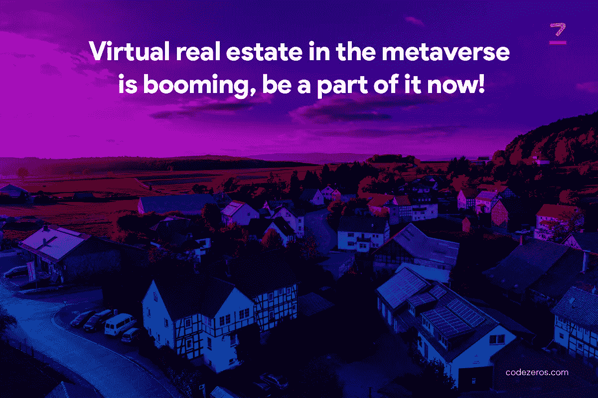

# 元宇宙的虚拟房地产正在蓬勃发展，现在就成为它的一部分吧！

> 原文：<https://medium.com/coinmonks/virtual-real-estate-in-the-metaverse-is-booming-be-a-part-of-it-now-330c37f121b0?source=collection_archive---------30----------------------->

房地产总是在繁荣，新冠肺炎疫情使其达到新的高度。通货膨胀使得投资土地成为普通大众的一个遥远的梦想。投资者准备在地球上不存在的土地上投资。

尽管投资房地产一直被视为一项不错的投资，但加密货币和元宇宙的兴起正在推动虚拟土地交易。区块链改变了房地产交易的方式。 [**房地产中的区块链**](https://www.codezeros.com/industry/real-estate) 由于消除了经纪人，有助于促进房地产交易。

Virtual real estate in the Metaverse is booming, be a part of it now!

**什么是元宇宙房地产？**

元宇宙是一个虚拟世界，人们在这里互动并构建他们的数字梦想。它们是虚拟世界中的小块土地。既然是数字地产，就没有地域障碍。元宇宙的房地产是虚拟现实平台中的空间，人们可以在这里购买、漫游、玩游戏，以数字方式相互交流。

元宇宙的土地价格取决于供求比率。区块链技术在速度和安全方面被认为是好的，并降低了欺诈风险。 [**元宇宙的区块链**](https://www.codezeros.com/) 帮助记录细节，比如元宇宙的房地产是如何开发、变更和交易的。

**元宇宙货币化正在撼动房地产行业吗？**

未来几年，元宇宙的商业地产将在全球房地产行业扮演重要角色。元宇宙房地产为用户提供了一个平台，让他们可以与世界各地的人联系，一起闲逛和玩游戏。

尽管房价很高，一些人还是对网上买卖房产感兴趣。元宇宙将在未来发挥关键作用，因为它吸引了熟悉技术、习惯在线交易模式的年轻群体。由于其高收入潜力和低启动成本，数字房地产对年轻企业家来说是一个绝佳的机会。

在这个世界里，人们可以在一个人造的世界里进行所有的日常活动，比如上班、学习、参加聚会、和朋友一起享受。它类似于人们玩的 3D 模拟游戏。简而言之，无法将元宇宙的房地产交易与实体房地产交易进行比较。 [**区块链解决方案**](https://www.codezeros.com/services/) 对元宇宙房地产行业产生了影响，因为它有助于集中数据和减少中介。

**NFTs 和元宇宙在虚拟房地产中的作用**

元宇宙帮助虚拟世界与现实世界融合，人们在增强和虚拟现实技术的帮助下受益。投资者在元宇宙虚拟世界投资和购买房地产。数字世界中的交易通过加密货币和 NFT(非有形代币)进行。

创建 NFT 是为了访问元宇宙，对于处理基于区块链的房地产解决方案的人来说是必不可少的。它们也被称为区块链中的所有权证书。NFT 对于保护数字艺术和资产不被窃取变得越来越重要。

除了买卖土地，NFTs 还可以用来租赁部分土地，用于网上商店和举办活动。以前，NFT 仅用于购买虚拟艺术品；然而，现在他们被用来购买虚拟房屋和房地产空间。

**为什么投资虚拟房地产是一件大事？**

投资元宇宙房地产不同于投资现实世界。在元宇宙投资是有利可图的，因为创办一家企业需要的时间更少。实业家通过快捷方便的交易，在短时间内建立商场或建造豪宅。位置在决定你的房产价值时起着重要的作用。

当投资者人数很多时，价格总是很高。与现实世界的房地产不同，虚拟房地产对他们的存在来说不是必要的。虚拟房地产是数字世界中独一无二的土地，在这里你可以做些创收的事情。 [**区块链房地产开发**](https://www.codezeros.com/services/) 对元宇宙房地产行业产生了巨大的影响，因为它为客户提供了快速安全的连接方法。

**如何投资元宇宙虚拟房地产？**

在元宇宙投资房地产时，可以采取几种方法。

投资者可以通过公开销售信息或咨询元宇宙房地产专家来选择自己的位置。然而，投资元宇宙虚拟房地产的步骤如下。

**01。设置数字钱包:**

因为元宇宙使用其独特的货币；需要设置一个数字钱包来进行虚拟购物。您的数字钱包必须与所选的元宇宙房地产兼容。把这个数字钱包和元宇宙账户联系起来。

**02。决定元宇宙平台:**

最受欢迎的选择是分散土地和沙盒。在这里，人们在购买时需要快速交易，因为最好的东西很快就会被抢走，而悬崖留给等待的投资者。

甚至还有像 OpenSea 和 Non-Fungible.com 这样的第三方市场，你可以在那里购买历史房产。从第三方市场获得帮助是有利可图的，因为在你购买之前可以看到该房产的整个交易历史。

03。寻求房地产中介的帮助:

元宇宙房地产经纪人很难找到，因为这个行业的机会有限。然而，你应该向他们寻求专业的帮助。他们是有相当一段时间处理实体房地产交易经验的人；然而，随着对元宇宙更多的了解和兴趣。他们可以指导你在元宇宙宇宙中购买或租赁一个地方。

**投资元宇宙房地产的风险和挑战**

在元宇宙房地产市场购买土地成本很高。加密货币是在元宇宙运行的货币，因为它们可以在全球范围内交易，并且不会产生高额的交易费用。

元宇宙是一个数字平台，一旦系统离线，你的虚拟土地和财产在市场上就没有价值了。

**结论**

虚拟土地的高房价、易买卖肯定会使元宇宙房地产成为一个蓬勃发展的行业。元宇宙正在以一种更好也更危险的方式改变整个世界。

元宇宙房地产投资对风险承受能力强的投资者来说是赚钱的人；然而，它不适合保守的投资者。 [**区块链技术解决方案**](https://www.codezeros.com/technology/) 被纳入元宇宙房地产交易，因为它们有助于加快整个交易过程。

> 加入 Coinmonks [电报频道](https://t.me/coincodecap)和 [Youtube 频道](https://www.youtube.com/c/coinmonks/videos)了解加密交易和投资

# 另外，阅读

*   [3 商业评论](/coinmonks/3commas-review-an-excellent-crypto-trading-bot-2020-1313a58bec92) | [Pionex 评论](https://coincodecap.com/pionex-review-exchange-with-crypto-trading-bot) | [Coinrule 评论](/coinmonks/coinrule-review-2021-a-beginner-friendly-crypto-trading-bot-daf0504848ba)
*   [莱杰 vs n 格拉夫](/coinmonks/ledger-vs-ngrave-zero-7e40f0c1d694) | [莱杰纳诺 s vs x](/coinmonks/ledger-nano-s-vs-x-battery-hardware-price-storage-59a6663fe3b0) | [币安评论](/coinmonks/binance-review-ee10d3bf3b6e)
*   [Bybit 交易所评论](/coinmonks/bybit-exchange-review-dbd570019b71) | [Bityard 评论](https://coincodecap.com/bityard-reivew) | [Jet-Bot 评论](https://coincodecap.com/jet-bot-review)
*   [3 commas vs crypto hopper](/coinmonks/3commas-vs-pionex-vs-cryptohopper-best-crypto-bot-6a98d2baa203)|[赚取加密利息](/coinmonks/earn-crypto-interest-b10b810fdda3)
*   最好的比特币[硬件钱包](/coinmonks/hardware-wallets-dfa1211730c6) | [BitBox02 回顾](/coinmonks/bitbox02-review-your-swiss-bitcoin-hardware-wallet-c36c88fff29)
*   [block fi vs Celsius](/coinmonks/blockfi-vs-celsius-vs-hodlnaut-8a1cc8c26630)|[Hodlnaut 审核](/coinmonks/hodlnaut-review-best-way-to-hodl-is-to-earn-interest-on-your-bitcoin-6658a8c19edf) | [KuCoin 审核](https://coincodecap.com/kucoin-review)