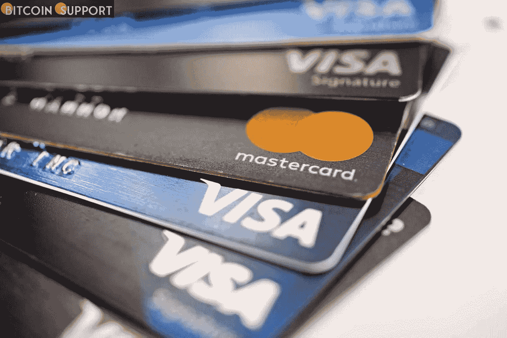

# Visa，Mastercard 和 PayPal 都停止了在俄罗斯的业务

> 原文：<https://medium.com/coinmonks/visa-mastercard-and-paypal-have-all-halted-their-operations-in-russia-94f17a02e690?source=collection_archive---------53----------------------->

**Visit our website:-** [**https://bitcoinsupports.com/**](https://bitcoinsupports.com/)

世界三大金融机构 Visa、Mastercard 和 PayPal 都停止了在俄罗斯的业务。由于俄罗斯于 2022 年 2 月 24 日入侵乌克兰，对该国进行了经济处罚。这些公司都在几小时前的新闻发布会上披露了这一信息。

**在俄国，Visa、Mastercard、PayPal 都已停止运营。**

由于俄罗斯自 2022 年 2 月 24 日开始入侵乌克兰，针对俄罗斯的金融制裁仍然有效。Visa，Mastercard 和 PayPal 对这种情况感到担忧，并且像最近几天的许多其他公司一样，已经决定退出这个国家。Visa Inc .

Visa 公司董事长兼首席执行官 Al Kelly 表示:“我们感到被迫采取行动，以回应俄罗斯对乌克兰的侵略性入侵以及我们目睹的不可原谅的暴行。”万事达卡在一份声明中表示:“由于当前冲突的不寻常性质和不确定的经济环境，我们选择停止我们在俄罗斯的网络服务。”。

Visa 的董事长兼 CEO 深知此举将对 Visa 的俄罗斯业务产生重大负面影响。然而，他们确实决定按照自己的理想行事。与此同时，万事达卡表示，他们正在与世界各地的政府和合作伙伴合作，以保证他们系统的稳定性、完整性和灵活性继续指导他们的运营。这些并不是第一批放弃俄罗斯市场的企业。事实上，许多其他人过去也这样做过。世界其他国家对俄罗斯实施的经济制裁可能有助于该国逆转其发展方向，结束乌克兰冲突。自冲突开始以来，已有近 130 万人逃离乌克兰。大多数人搬迁到波兰是因为它的便利位置。在某些情况下，乌克兰人利用波兰作为他们前往美国的第一站。世界各地的人们一直在向乌克兰提供金钱和非金钱的援助，以帮助其对抗俄罗斯。据 UseTheBitcoin 几天前报道，对乌克兰的比特币和加密货币捐款已超过 5000 万美元。这表明，全世界随时准备帮助乌克兰人抗击俄罗斯的侵略。

对于这场对抗来说，接下来的几天将会非常关键。俄罗斯士兵似乎已经停止了前进，给了乌克兰人更多的时间来夺回某些城市和村庄。

**访问我们的网站:-**[**https://bitcoinsupports.com/**](https://bitcoinsupports.com/)

**免责声明:以上为作者观点，不应视为投资建议。读者应该自己做研究。**