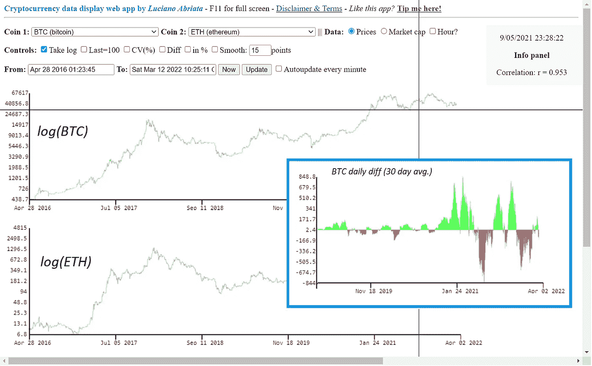

# 在线完整详细地可视化和分析加密货币

> 原文：<https://medium.com/coinmonks/visualize-and-analyze-cryptocurrencies-in-full-detail-29441079a395?source=collection_archive---------25----------------------->

This and all other figures by author Luciano Abriata.

## 用于实际操作的硬币数据可视化、分析和比较

## 查看历史价格和市值，完全控制时间范围，以线性或对数比例绘制数据，原始数据或标准化到最后一天或每天…