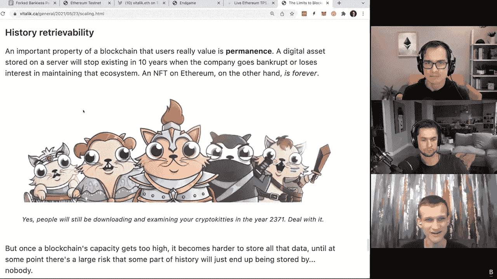

# 维塔利克·布特林的播客揭示以太坊前景

> 原文：<https://medium.com/coinmonks/vitalik-buterin-ethereum-to-complete-transition-from-pow-to-pos-by-july-46412ab154f9?source=collection_archive---------0----------------------->

Image from Crypto Daily

由 [LuckyHash](https://m.luckyhash.com/?utm_source=english&utm_medium=official) 为您带来

在最新的无银行播客中，以太坊联合创始人 Vitalik Buterin 介绍了由 5 个主要步骤组成的路线图，这对以太坊的生存和繁荣至关重要。

为了实现最终的去中心化和充分优化可扩展性，Buterin 声称以太坊在区块链数据方面必须“更敏捷、更轻量级”，以便能够容纳更多用户。

Buterin’s roadmap

第一步被称为“合并”，这是一个从 PoW 到 PoS 的**全面过渡，将在 2022 年上半年发生。当被问及他认为何时会发生完全合并时，布特林回答说“(会的)**现实地说，可能六个月**”**

第二步被称为“激增”，旨在极大地提升以太坊的可扩展性、带宽和吞吐量，尤其是在 zk-rollup 上。

虽然以太坊在 2021 年有了深刻的进步，包括伦敦 hardfork 和燃烧机制 EIP-1559，但高昂的燃气费仍然是一个问题。

不过，有了以上两个步骤的帮助，以太坊燃气费可以大幅降低。“如果连锁店可以处理更多的交易，那么这意味着有更多的空间，你不必与其他用户竞争同样非常少的位置。”布特林说，“所以每个用户的交易费用都大幅下降。”

当被要求评论以太坊在过去 6 年取得的进步时。“我说大约 50%，”布特林声称，“一旦‘合并’完全完成，我愿意超过 60 岁。我很乐意告诉你，一旦我们
有了完整的分片实现，我们将超过 80。”

Podcast replay

Buterin 说，他估计在路线图完成之前还有 6 年时间& 100%优化。

激增之后是“边缘”(Verkle Trees)，它允许更多的用户运行节点。布特林说，这实质上是“让尽可能多的人参与进来，任何人都可以验证这个链条的有效性”。

最后两个阶段是“清除”、历史数据到期和“挥霍”，包括所有其他小的更新。

虽然第一层还没有准备好被大规模采用，但在过去的一年中，第二层的扩展已经取得了惊人的进展。“第一层不是一个可以被用户直接大量采用的系统。但这正是我们反复强调可扩展性和第二层的原因。”布特林说。

出于你的兴趣，你可以在这里查看播客回放:

[https://www.youtube.com/watch?v=b1m_PTVxD-s](https://www.youtube.com/watch?v=b1m_PTVxD-s)

值得一提的是，2021 年 12 月初，Buterin 发表了一篇名为“Endgame”的文章，其中他描述了以太坊可能采用的 3 种以 Rollup 为核心的潜在方式。在文章中，他相信所有的区块链最终会合并成一个单一的巨大的区块链。这篇文章还介绍了一个工具，它允许以一种分散的、抗审查的方式进行块验证。

— — — — — — — — — — — — — — — — — — — — — — — — — — — —

跟随媒体上的 LuckyHash 获取更多区块链新闻

[LuckyHash](https://m.luckyhash.com/?utm_source=english&utm_medium=official) (移动)是全球领先的一站式加密资产管理平台。它提供无抵押采矿哈希拉特租赁和加密货币利息产生计划。

您可以加入我们的 [LuckyHash 官方电报社区](https://t.me/luckyhashgroup)，讨论更多区块链资讯，了解 LuckyHash 加密货币理财产品。

[在此创建一个 LuckyHash 账户](https://www.luckyhash.com/createAcc?invitationCode=031DA6)并在评论中留下您的账户，以获得 1000USDT-7d 储蓄账户产品。

> *加入 Coinmonks* [*电报频道*](https://t.me/coincodecap) *和* [*Youtube 频道*](https://www.youtube.com/c/coinmonks/videos) *了解加密交易和投资*

# 另外，阅读

*   [3 商业评论](/coinmonks/3commas-review-an-excellent-crypto-trading-bot-2020-1313a58bec92) | [Pionex 评论](https://coincodecap.com/pionex-review-exchange-with-crypto-trading-bot) | [Coinrule 评论](/coinmonks/coinrule-review-2021-a-beginner-friendly-crypto-trading-bot-daf0504848ba)
*   [莱杰 vs n rave](/coinmonks/ledger-vs-ngrave-zero-7e40f0c1d694)|[莱杰 nano s vs x](/coinmonks/ledger-nano-s-vs-x-battery-hardware-price-storage-59a6663fe3b0) | [币安评论](/coinmonks/binance-review-ee10d3bf3b6e)
*   [Bybit 交易所评论](/coinmonks/bybit-exchange-review-dbd570019b71) | [Bityard 评论](https://coincodecap.com/bityard-reivew) | [Jet-Bot 评论](https://coincodecap.com/jet-bot-review)
*   [3 commas vs crypto hopper](/coinmonks/3commas-vs-pionex-vs-cryptohopper-best-crypto-bot-6a98d2baa203)|[赚取加密利息](/coinmonks/earn-crypto-interest-b10b810fdda3)
*   最好的比特币[硬件钱包](/coinmonks/hardware-wallets-dfa1211730c6) | [BitBox02 回顾](/coinmonks/bitbox02-review-your-swiss-bitcoin-hardware-wallet-c36c88fff29)