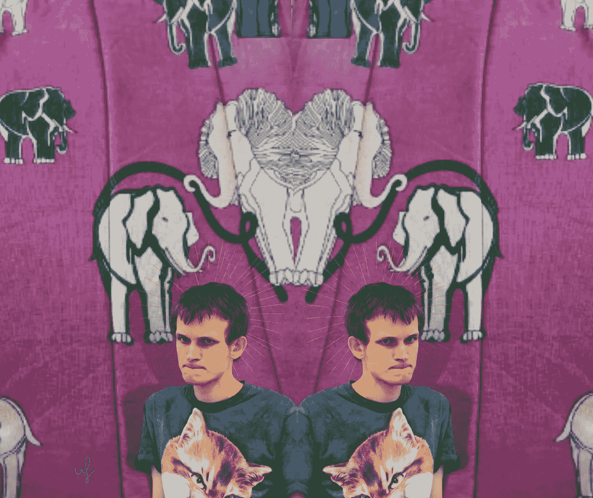
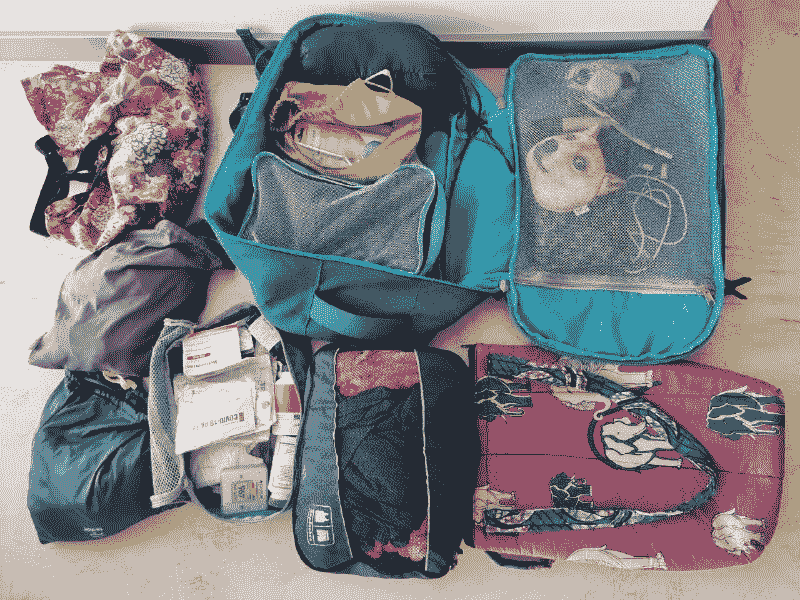
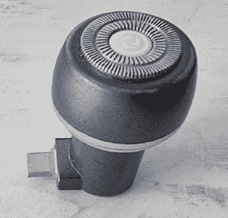
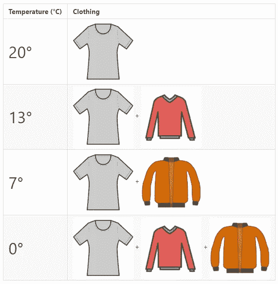
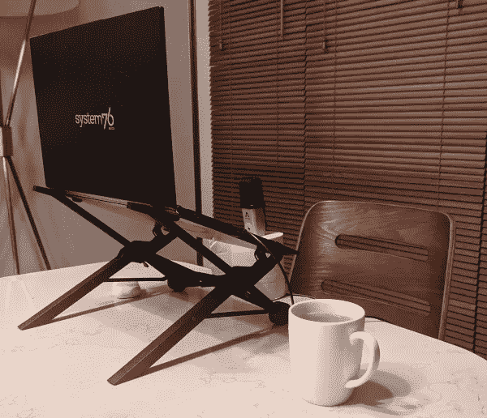
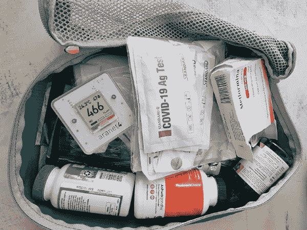
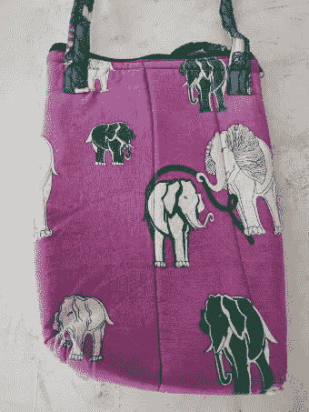
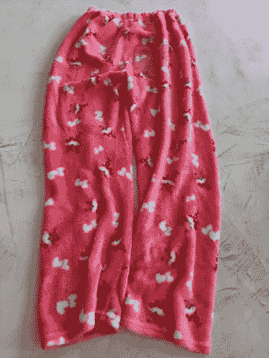
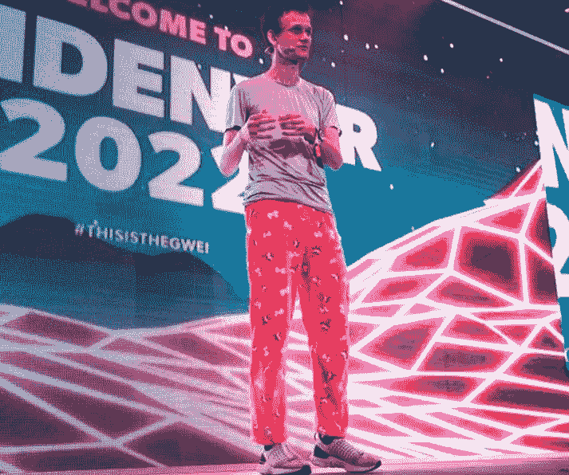

# 维塔利克·布特林展示了他拥有的一切…

> 原文：<https://medium.com/coinmonks/vitalik-buterin-showed-everything-he-owns-50efacee7042?source=collection_archive---------0----------------------->

以太坊的联合创始人 Vitalik Buterin 向他的博客读者展示了一个 40 升背包的内容。根据程序员和密码爱好者的说法，这里有你生活和旅行可能需要的一切。

**This preview will be included in the NFT collection called “**[**Uncle Fibonacci News**](https://opensea.io/collection/uncle-fibonacci-news)**”**

布特林已经过了九年的游牧生活。在此期间，他飞行了 150 万公里，飞行了 360 次。这样的生活让以太坊的联合创始人成为了一名行李优化专家——他以前需要一个 60 升的包+笔记本电脑包，现在他可以轻松搞定一个 40 升的背包，可以满足你的一切需求，还有一台笔记本电脑(甚至还有笔记本电脑支架！).

> 密码交易新手？试试[加密交易机器人](/coinmonks/crypto-trading-bot-c2ffce8acb2a)或者[复制交易](/coinmonks/top-10-crypto-copy-trading-platforms-for-beginners-d0c37c7d698c)

## 每一类东西都在一个单独的袋子里

Hynes Eagle Travel 40L 背包的内部隔层有 t 恤包、内衣包、袜子包、洗漱包、洗衣袋、急救箱、笔记本电脑包和各种装小件物品的小袋子。

Yes, yes, all this stuff fits into a 40-liter backpack.

## 没有额外的和最大的空间节省

争夺立方厘米的斗争是艰难的——你需要在一件东西带来的好处和它在背包中所占的位置之间找到完美的平衡。因此，Buterin 的选择也适合加密爱好者——你需要努力保持在“预算”内，同时确保你拥有所需的一切。

> 非常类似于几乎每个人都习惯处理的那种正常的财务规划，除了牛市中的 kryptans。

Razor: 5 cm long and 2.5 cm wide. Connects via USB-C to the phone — it is both a charger and a pen. $13 at Amazon

另一个通用的东西是笔记本电脑和手机的充电器。并且两个设备可以同时充电。5x5x2.5 厘米，仅售 55 美元！当然，30 美元的飞利浦电动牙刷也可以通过 USB Type C 充电。

Buterin 解释说，成功的秘诀是成为一个 USB-C 最大清单。所以他所有的设备都兼容这个连接器，你只能随身携带一个充电器和 1–2 根线缆。

## 衣服

布特林的衣服就更轻松了。他的策略是成为优衣库的最大买家:总的来说，Vitalik 约 70%的服装来自优衣库品牌。这是 8 件 t 恤(其中 6 件采用 AIRISM 优衣库技术)，8 条内衣(不信——也是优衣库)，8 双袜子(在优衣库是用袜子紧的，你不能很快穿上，所以袜子是从其他品牌买的)，保暖内衣，修身长裤，一件毛衣，一件紧身夹克和必要时可以当泳裤用的短裤(都是优衣库)。

当然，以太坊的联合创始人遵循着他最喜欢的品牌的主要原则——他的穿着让所有的层次都结合在一起，创造出适合任何天气的服装。

In cold Russia, Vitalik does not exist, so 0 degrees is his temperature minimum.

## 类别杂项

Buterin 将麦克风和笔记本电脑支架等有用的东西归入“杂项”类别。麦克风是便携式的，但如果你使用卫生纸，你会得到一个很好的立场。

笔记本电脑支架也非常重要，它可以保持正确的姿势。像维塔利科一样，读者，使用看台！另一个好处是可选的 20，000 mAh 电源组，无论走到哪里都可以延长电池寿命。

The workplace is simple and without show off. Toilet paper is on the way too.

## **药袋**

布特林是一名生物黑客，他很注意自己的健康。在急救箱中，你可以找到各种延长生命的药物组合(二甲双胍、ashwagandha——一种天然镇静剂和维生素)，当然还有针对冠状病毒的保护措施:二氧化碳测量仪、口罩、抗原测试和氟伏沙明(抗抑郁药，用于治疗和预防强迫症症状)。

布特林没有急救箱，但他建议买一个——一些有用的东西。

## 一点乐趣

**Stylish and fun. And the laptop breaks**

> *我的电脑包，在赞比亚的户外市场买的。*

背包里省的空间越多，可以随身携带的搞笑可爱的东西就越多。布特林有一个在赞比亚买的粉色电脑包，上面有大象，有独角兽的滑稽袜子，还有著名的狐狸图案的睡裤(或者柴犬，看他是和狗币爱好者交流还是和普通人交流)。

总的来说，你需要舒适和创造好心情的一切都收集在这个类别中。

**Pajama pants are great for speaking at blockchain conferences**

Buterin 解释说，40 升的背包可以让你携带一周的物品和所有必需品，同时方便携带——你可以随时把它放在你的手提行李中。打包的时候，提前计划，带几个配套的基础包。

[*全文来自 Vitalik*](https://vitalik.ca/general/2022/06/20/backpack.html)

📰 ***订阅*** [***斐波那契***](/@unclefibonacci) ***我来保持最新***

☕️eth:0x40a 8443813 e 8 fa 4a 9 f 88 f 18 b 77442 aa 4ed 91 fd4c

☕️BTC:1kkekcmdrghajztfxjoq 5 otg bv 1 mgucwdj

> 加入 Coinmonks [电报频道](https://t.me/coincodecap)和 [Youtube 频道](https://www.youtube.com/c/coinmonks/videos)获取每日[加密新闻](http://coincodecap.com/)

## 另外，阅读

*   [复制交易](/coinmonks/top-10-crypto-copy-trading-platforms-for-beginners-d0c37c7d698c) | [加密税务软件](/coinmonks/crypto-tax-software-ed4b4810e338)
*   [电网交易](https://coincodecap.com/grid-trading) | [加密硬件钱包](/coinmonks/the-best-cryptocurrency-hardware-wallets-of-2020-e28b1c124069)
*   [密码电报信号](http://Top 4 Telegram Channels for Crypto Traders) | [密码交易机器人](/coinmonks/crypto-trading-bot-c2ffce8acb2a)
*   [最佳加密交易所](/coinmonks/crypto-exchange-dd2f9d6f3769) | [印度最佳加密交易所](/coinmonks/bitcoin-exchange-in-india-7f1fe79715c9)
*   [币安 vs 比特邮票](https://coincodecap.com/binance-vs-bitstamp) | [比特熊猫 vs 比特币基地 vs Coinsbit](https://coincodecap.com/bitpanda-coinbase-coinsbit)
*   [如何购买 Ripple (XRP)](https://coincodecap.com/buy-ripple-india) | [非洲最好的加密交易所](https://coincodecap.com/crypto-exchange-africa)
*   [非洲最佳加密交易所](https://coincodecap.com/crypto-exchange-africa) | [胡交易所评论](https://coincodecap.com/hoo-exchange-review)
*   [eToro vs robin hood](https://coincodecap.com/etoro-robinhood)|[MoonXBT vs by bit vs Bityard](https://coincodecap.com/bybit-bityard-moonxbt)
*   开发人员的最佳加密 API
*   最佳[密码借贷平台](/coinmonks/top-5-crypto-lending-platforms-in-2020-that-you-need-to-know-a1b675cec3fa)
*   [免费加密信号](/coinmonks/free-crypto-signals-48b25e61a8da) | [加密交易机器人](/coinmonks/crypto-trading-bot-c2ffce8acb2a)
*   [杠杆代币的终极指南](/coinmonks/leveraged-token-3f5257808b22)