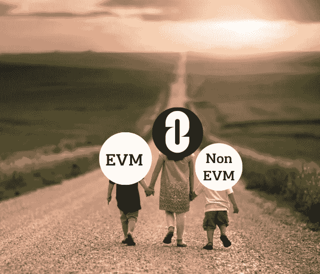
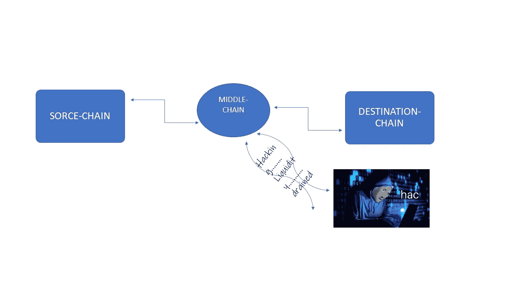
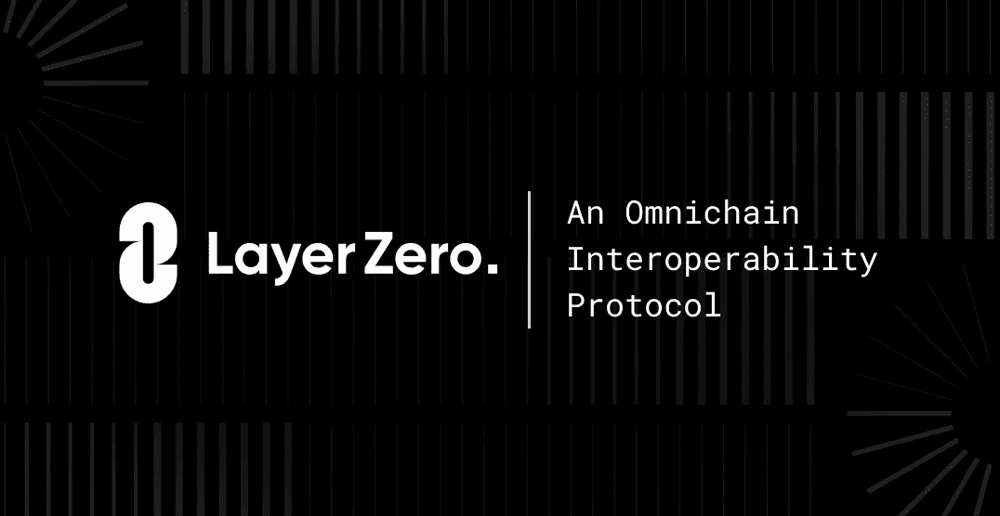
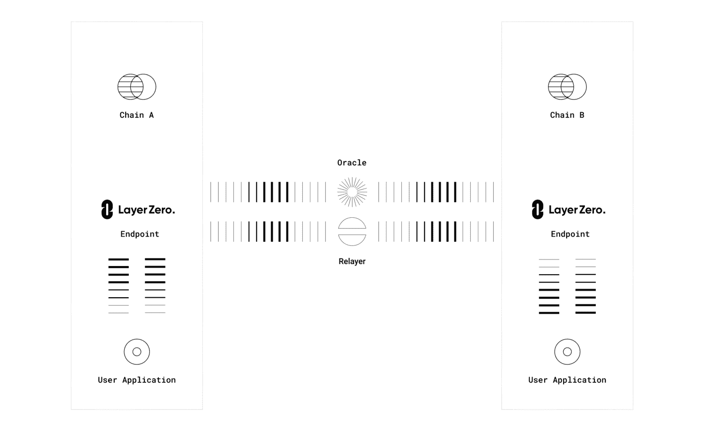

# Vitalik 穿越了 7 个连锁店来支付他的签证费用:只需点击图层 zer0

> 原文：<https://medium.com/coinmonks/vitalik-travelled-across-7-chain-to-pay-his-visa-on-a-click-layer-zer0-5a1df5cab6a3?source=collection_archive---------20----------------------->

在互联网泡沫之前，私有以太网存在于许多学校、公司和政府中。公共孤立网络也存在，直到互联网将所有这些网络连接在一起。

快进到今天，区块链出现了，有人刚刚定义了标准并破解了完美互操作性的代码:**零层**。

为了阐明此协议的相关性，我需要使用区块链的一个真实用例应用程序来进行说明:

所以维塔利克，一个 AVAX 最大化者，需要在区块链联邦理工学院支付签证费用，不幸的是，他别无选择，只能把他的 AVAX 硬币和联邦理工学院联系起来……

> Vitalik 考虑使用现有的桥梁，如 Synapse (n <token>池，如 nETH-ETH nUSD-stablecoins)、Thorchain(符文对)、AnySwap/Multichain 等。哦不！！这太复杂了，很容易被利用。</token>

**Don’t wanna lose my money, otherwise I wouldn’t get a visa.**

嗯，想到包装资产了？

> 使用 Avalanche 的本机令牌桥在 AVAX 和 ETH 之间进行桥接，反之亦然。他对用户体验很满意，没有延误，没有高额费用。我只需要将我的 AVAX 转移到将被包装的 ETH:本机资产保存在 AVAX 端的智能合同中，包装版本在 ETH 端发布。例如 USDC → USDC。

维塔利克阅读了关于[T4*他索拉纳黑客！！！*](https://kyrianalex.substack.com/p/another-day-another-solana-hack) ，想象一下，如果控制 AVAX 上资产的智能合约遭到黑客攻击，资金被盗。

Vitalik is pissed and unhappy again.

也许，他现在受到一个可互操作的全链条的支配:零层协议。

与此同时，如今每个现有的跨链桥接和消息传递协议都利用了*中间链验证*或*链上轻节点* **。**所以你可能想知道零层是由哪种材料制成的，对吗？答案是没有，因为任何一个都意味着有人要付出代价，你不想这样，对吗？

我会详细解释费用:*跟我来*

**中链验证:** *对链两端造成风险*

事实上，几乎所有的跨链网桥都依赖于这个协议，

就像 Vitalik 第一次想到使用 Synapse 或 Thorchain 等。中间链充当发送者(源链)和接收者(目的链)之间的中间链。因此，他们的工作机制只是在链之间接收——验证——转发消息。为此，必须成功授予中间链对两条链上的所有消息的完全签名权(*源链和目的链)*。

一个错误发生了，一个一致的腐败或者甚至是一个黑客，使得两个链条和他们的流动资金受到一个仁慈的黑客的摆布。我们都同意，今天的桥牌通常是放弃 2 个球来节省 1/4，甚至不到一半。

也许蜜罐利用已经从 [**虫洞等开始了。**](https://cointelegraph.com/news/wormhole-hack-illustrates-danger-of-defi-cross-chain-bridges)

**链上光节点？** *维塔利克，因为费用高，还不起签证。*

使用轻型节点会增加接收和验证对方链上的每个块头和成对链的工作量。与块头相反，交易证明在链上被转发和验证。

这被证明是在链之间传输的最安全的方式，但是它非常昂贵，尤其是在以太坊上运行链上光节点的时候。不幸的是，Vitalik 用不起这个，因为它和签证费一样贵。

**超轻节点:** *证明是 Vitalik 签证*的解决方案

*中间链*不太安全，虽然价格便宜，但仍然是一个脆弱的蜜罐，而*链上轻节点*非常安全，但成本与其目标一样高。

*超轻节点(ULN)* 是一种混合解决方案，具有*轻节点*的安全性和*中链的廉价特性。*

怎么会？与事务证明相反，*超轻型节点*验证不是在链上进行验证，而是通过分散式 oracles 按需保持块头流:*欢迎使用零层:ULN 通信协议。*

**零层:互操作性的全链条**

第 0 层是运行在 ULN 上的已配置用户应用程序。使用 Chain-link 作为分散的 oracle，零层通信协议位于两个链上终端之间:*ORACLE***和*RELAYER。我将用简单的术语解释它是如何工作的。***

****

****作用机制:** Vitalik 使用零层通信协议从 AVAXchain 向 ETH chain 发送消息。信息从 AVAX 终端消失。然后，AVAX 终端迅速通知用户应用*(零层)*指定的 Oracle 和 Relayer 消息及其目的链，即 ETH 链。**

**在整个通信过程中，Oracle 将块头转发到 ETH 终端，然后 Relayer 提交交易证明，该证明在目的链上得到验证:消息被快速转发到 Vitalik 的*以太坊地址*。**

*****谈零层所有链条的统一流动性，在 Defi 中打乱………………*****

***敬请关注* ***全链条未来！！！…..*** *(待续)。***

**随时欢迎您加入全链条革命，欢迎您通过[电报](https://t.me/joinchat/VcqxYkStIDsyN2Rh)、[不和谐](https://layerzero.network/discord)、[推特](https://twitter.com/LayerZero_Labs)、[网站](http://layerzero.network/)与我们交流。**

***快速提示:你总能在 telegram 社区找到我*🤓🤓**

> **加入 Coinmonks [电报频道](https://t.me/coincodecap)和 [Youtube 频道](https://www.youtube.com/c/coinmonks/videos)了解加密交易和投资**

# **另外，阅读**

*   **[如何在 FTX 交易所交易期货](https://coincodecap.com/ftx-futures-trading) | [OKEx vs 币安](https://coincodecap.com/okex-vs-binance)**
*   **[OKEx vs KuCoin](https://coincodecap.com/okex-kucoin) | [摄氏替代品](https://coincodecap.com/celsius-alternatives) | [如何购买 VeChain](https://coincodecap.com/buy-vechain)**
*   **[ProfitFarmers 回顾](https://coincodecap.com/profitfarmers-review) | [如何使用 Cornix Trading Bot](https://coincodecap.com/cornix-trading-bot)**
*   **[如何匿名购买比特币](https://coincodecap.com/buy-bitcoin-anonymously) | [比特币现金钱包](https://coincodecap.com/bitcoin-cash-wallets)**
*   **[瓦济里克斯 NFT 评论](https://coincodecap.com/wazirx-nft-review)|[Bitsgap vs Pionex](https://coincodecap.com/bitsgap-vs-pionex)|[Tangem 评论](https://coincodecap.com/tangem-wallet-review)**
*   **[如何使用 Solidity 在以太坊上创建 DApp？](https://coincodecap.com/create-a-dapp-on-ethereum-using-solidity)**