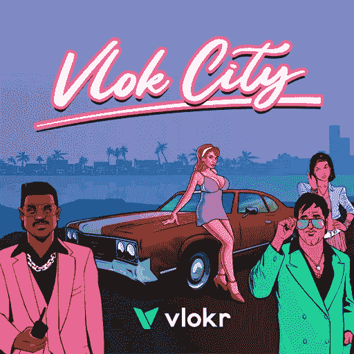

# Vlokr:分散社交媒体

> 原文：<https://medium.com/coinmonks/vlokr-decentralizing-social-media-c0e397b78d6d?source=collection_archive---------45----------------------->

> 社交媒体是我们今天生活中不可或缺的一部分。然而，过去社交媒体参与的荣耀和乐趣已经被围绕这些平台所有者未经同意的数据销售的许多争议所玷污。
> 
> 几年前，2018 年，英国议会[公布了脸书高管的内部邮件](https://www.forbes.com/sites/kalevleetaru/2018/12/15/what-does-it-mean-for-social-media-platforms-to-sell-our-data/?sh=6413c7272d6c)。在这些电子邮件中，马克·扎克伯格提议脸书向访问用户个人数据的开发者收取货币费用。发现这一点后，许多人离开了脸书。相反，他们转向其他社交媒体平台，这些平台在技术上做着同样的事情，但却隐藏在措辞巧妙的[隐私政策](https://www.security.org/resources/data-tech-companies-have/)和注册阶段的一个微小的同意复选框后面。
> 
> 去年， [pCloud](https://blog.pcloud.com/invasive-apps/) 进行了一项调查，揭示了一些关于我们频繁使用的社交媒体平台的令人生畏的统计数据。Instagram 分享 79%，脸书分享 57%，LinkedIn 分享 50%，YouTube 和 YouTube Music 各自与第三方分享 43%的用户个人信息。
> 
> 但是，如果有一个不受任何中央集权的公司或组织控制的社交平台呢？享受社交媒体平台的产品，而不用担心我们的个人数据被泄露或创意帖子被意外删除，这不是很好吗？
> 
> 好消息是，Vlokr 已经通过一个去中心化的社交平台来满足这些要求，用户可以在 IPFS 上上传或观看短视频，并在 Vlokr 的 Vlocity 区块链上喜欢、评论或分享它们，同时还可以获得奖励。

> 加入 Coinmonks [电报频道](https://t.me/coincodecap)和 [Youtube 频道](https://www.youtube.com/c/coinmonks/videos)了解加密交易和投资

# 什么是 Vlokr，它是如何工作的？

> Vlokr 旨在通过其分散、透明和开源的基础设施来促进信任，这些基础设施不会为了广告而出售用户的个人信息。分散的社区通过投票和标签做出所有与平台相关的决定，以确保收入算法对所有人都公平，不受集中的政治影响或公司强加的审查。
> 
> Vlokr 的令牌模型以 VLOKR 令牌的形式奖励创作者、影响者和观众，以表彰他们对平台内容和治理的贡献。

# VLOKR 令牌在 Vlokr 的社交平台上有什么作用？

> VLOKR 是区块链 Vlocity 的本地货币，它允许持有者向平台贡献内容，并对其中的内容进行排名。区块链算法将 VLOKR 令牌奖励分配给在社区标准内制作优质内容并对热门主题投票的用户。
> 
> 拥有 VP 令牌是发布、投票、标记和评论平台内容的必备条件。Vlokr 还为用户提供了一个 VP 令牌，授予持有者投票权。只有 VLOKR 令牌持有者将根据其帐户中持有的 VLOKR 数量每小时获得 1 VP。
> 
> 您可以通过访问 Vlokr 网站并参与[预售](https://www.pinksale.finance/#/launchpad/0xD41A5bbEd409ec239A597A6b0D10498F34E9cADc?chain=BSC)来获得这些 VLOKR 代币。查看他们的预售[这里](https://www.pinksale.finance/launchpad/0xD41A5bbEd409ec239A597A6b0D10498F34E9cADc?chain=BSC)。
> 
> 立即加入 Vlokr 革命，支持并享受其分散式社交平台，该平台使用区块链技术重新定义您在社交媒体世界中体验个人数据安全、内容创作者自由、社区监管和用户奖励的方式。