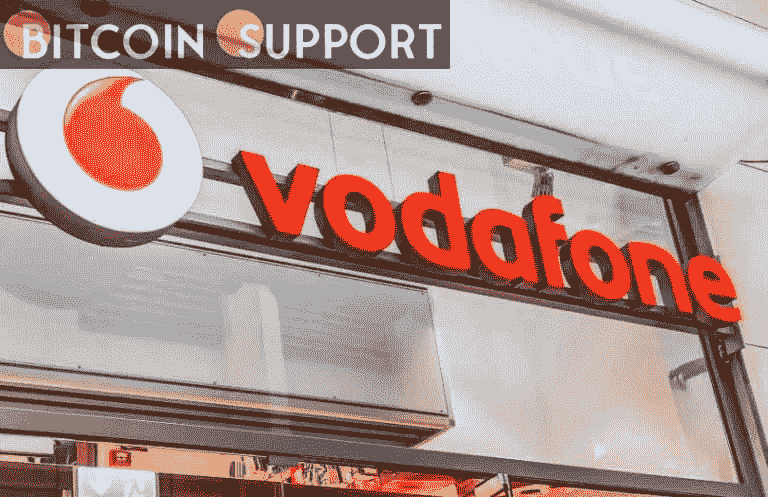

# 沃达丰推出了基于区块链技术的新“物联网经济”平台

> 原文：<https://medium.com/coinmonks/vodafone-has-launched-a-new-economy-of-things-platform-based-on-blockchain-technology-fa335ae70c76?source=collection_archive---------32----------------------->

**Visit our website:-** [**https://bitcoinsupports.com/**](https://bitcoinsupports.com/)

移动运营商沃达丰(Vodafone)推出了一个基于区块链的技术平台，允许联网设备代表客户进行安全的自动化交易。一份公司声明称，这个名为数字资产经纪人(DAB)的新平台将建立在沃达丰物联网(IoT)平台的优势之上，并将帮助客户利用新的“物联网经济”

如今，绝大多数互联设备和传感器都在使用互联网来收集和传输信息。虽然这是真的，但沃达丰新的“物联网经济”平台远不止于此。它使汽车或智能街道设施等经认证的互联对象能够代表用户无缝、安全地进行交易，而无需用户参与。

[https://Twitter . com/VodafoneGroup/status/14986666870609625088](https://twitter.com/VodafoneGroup/status/1498666870609625088) 

沃达丰的新平台将为任何设备提供唯一的数字身份，消除企业投资昂贵且耗时的基础设施的需要。这使其能够通过使用受移动 SIM 卡保护的钱包和支付技术，安全地与其他设备进行对话和交易。

**访问我们的网站:-**[**https://bitcoinsupports.com/**](https://bitcoinsupports.com/)

**免责声明:以上为作者观点，不应视为投资建议。读者应该自己做研究。**

> 加入 Coinmonks [电报频道](https://t.me/coincodecap)和 [Youtube 频道](https://www.youtube.com/c/coinmonks/videos)了解加密交易和投资

# 另外，阅读

*   [印度加密交易所](/coinmonks/bitcoin-exchange-in-india-7f1fe79715c9) | [比特币储蓄账户](/coinmonks/bitcoin-savings-account-e65b13f92451)
*   [OKEx vs KuCoin](https://coincodecap.com/okex-kucoin) | [摄氏替代品](https://coincodecap.com/celsius-alternatives) | [如何购买 VeChain](https://coincodecap.com/buy-vechain)
*   [币安期货交易](https://coincodecap.com/binance-futures-trading)|[3 commas vs Mudrex vs eToro](https://coincodecap.com/mudrex-3commas-etoro)
*   [如何购买 Monero](https://coincodecap.com/buy-monero) | [IDEX 评论](https://coincodecap.com/idex-review) | [BitKan 交易机器人](https://coincodecap.com/bitkan-trading-bot)
*   [CoinDCX 评论](/coinmonks/coindcx-review-8444db3621a2) | [加密保证金交易交易所](https://coincodecap.com/crypto-margin-trading-exchanges)
*   [红狗赌场评论](https://coincodecap.com/red-dog-casino-review) | [Swyftx 评论](https://coincodecap.com/swyftx-review) | [CoinGate 评论](https://coincodecap.com/coingate-review)
*   [Bookmap 点评](https://coincodecap.com/bookmap-review-2021-best-trading-software) | [美国 5 大最佳加密交易所](https://coincodecap.com/crypto-exchange-usa)
*   [如何在 FTX 交易所交易期货](https://coincodecap.com/ftx-futures-trading) | [OKEx vs 币安](https://coincodecap.com/okex-vs-binance)