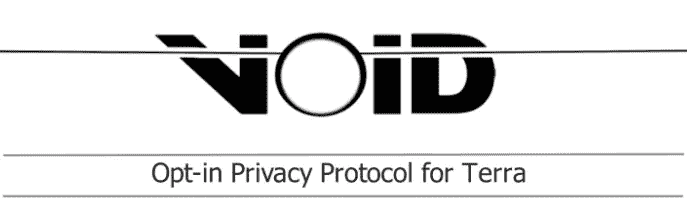

# 无效协议:区块链土地上的隐私

> 原文：<https://medium.com/coinmonks/void-protocol-privacy-on-the-terra-blockchain-27e08945364f?source=collection_archive---------8----------------------->

## 进入虚空

[https://protocolvoid.gitbook.io/void-protocol/](https://protocolvoid.gitbook.io/void-protocol/)

在这篇文章中，我的目标是让你有 **3 个收获**:

1.  什么是 Void 协议及其用例。
2.  Void 如何工作，包括令牌组学/治理/团队/路线图等。
3.  为什么隐私是重要的和目前可用的区块链隐私选项。