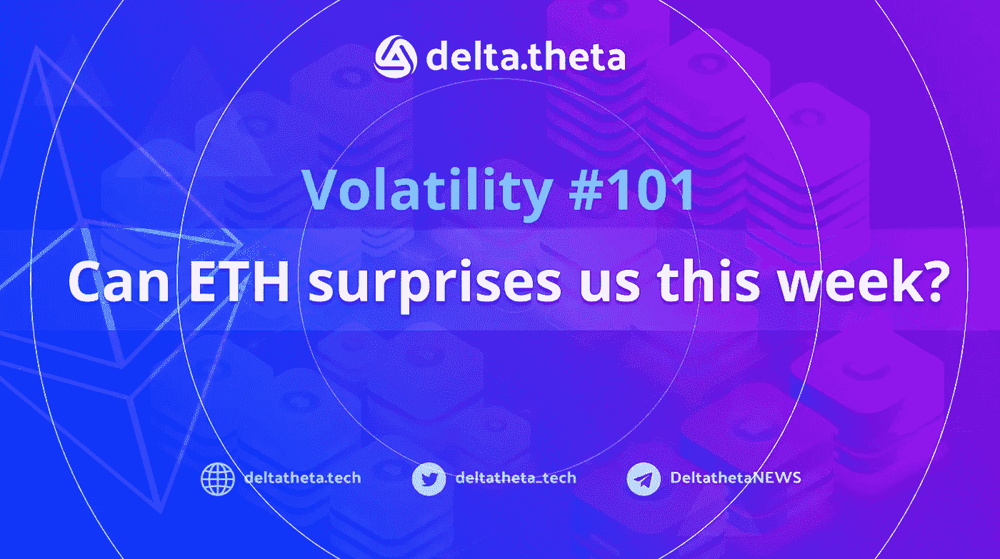
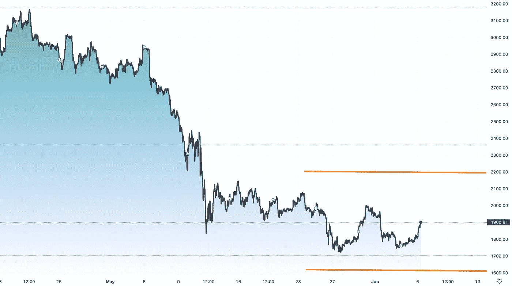
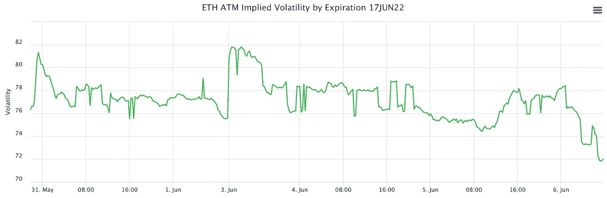

# 波动性# 101——本周 ETH 能给我们带来惊喜吗？

> 原文：<https://medium.com/coinmonks/volatility-101-can-eth-surprises-us-this-week-fd4ba1854693?source=collection_archive---------26----------------------->

**宏观形势:**加密货币市场受到宏观经济消息的压力。发达国家央行的加息周期、全球高通胀、美国大选前的政治紧张局势、全球供应链中断和局部军事冲突，都在对长期投资者情绪产生负面影响。由于目前与股票市场的高度相关性，加密货币也在下降，总市值自年初以来下降了 50%以上。

**本地趋势:**以太坊正处于其发展的最重要阶段之一——从工作证明向利益证明交易确认机制的转变。这种变化在技术上非常复杂，包含许多风险。为了在实践中测试理论，根据路线图的合并过程最初将在测试 Ropstein 网络中实现。结果将在 6 月 8 日之后揭晓。除了近期项目的重要消息外，美国美联储会议预计将于 6 月 15 日召开，其结果可能会在短期内对价格产生重大影响。

**投资理念:**6 月 15 日的美联储会议和预期的测试协议更新结果的公布可能会显著影响以太坊的波动水平。

**进场期权:**在当前行权时买入价差(撰写本文时为 1800 美元)——买入和卖出价格和到期日相同的期权(6 月 17 日)。因此，在波动性增加的情况下，预期利润来自重大的价格变动。

如果到期时价格达到 1500 或 2100 美元，回报将确定如下:2022 年 6 月 6 日，两种期权的平均总溢价为 195 美元，对应的利润为 105 美元(投资的 53%，年平均 1938%)。如果在到期日之前行使期权，最终结果可能会因市场条件而异。

**对新用户有用的链接:**

1️⃣ [加密期权交易终端](https://app.deltatheta.tech/terminal)

2️⃣ [专业版加密期权交易终端指南](https://optiondeltatheta.medium.com/delta-theta-p2p-options-dex-review-update-may-2022-2585a9621f11)

*   请求报价 [**电报聊天**](https://t.me/deltatheta_TradingGroup)

> 加入 Coinmonks [Telegram group](https://t.me/joinchat/Trz8jaxd6xEsBI4p) 并了解加密交易和投资