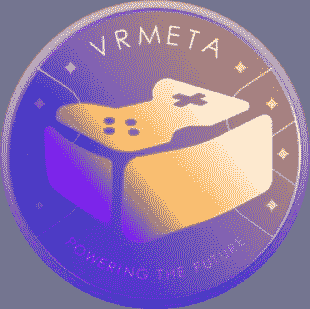
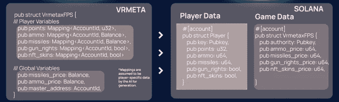

# VRMETAxGAME

> 原文：<https://medium.com/coinmonks/vrmetaxgame-665cd25d4ef3?source=collection_archive---------76----------------------->

VRMETA 的定义功能之一将是其 VRMETAxGAME，这是区块链核心运行时上的一个原生应用程序，允许创作者、公司和开发机构轻松访问区块链，并以简单的格式将他们的游戏/服务集成到元宇宙中。

目前，VRMETA 有 6 种游戏标准需要实现:
**VRMETAxRPG**

实现类，武器和盔甲 NFT 的特点，等级系统和法术系统，这将扩展到游戏的核心。提供扩展支持，如宠物和怪物。

上古卷轴/埃尔登戒指/巫师

**VRMETAxFPS**

实现枪支类型(狙击手，冲锋枪等)，弹药作为消耗品 NFT，弹药类型(导弹，手榴弹，子弹等)，士兵皮肤和盔甲，士兵类型(狙击手，刺客，特工)。

EX)堡垒/战场/彩虹六号

**VRMETAxMMO**

类似于 RPG 或 FPS，但扩展了服务器实现，并增加了游戏中物品的社团和 P2P 交易结构。

EX)魔兽世界/上古卷轴在线

**VRMETAxSPORT**

该标准专为体育游戏而设计，支持使用命名的、可交易的角色、定制制服(NFT)和添加特定玩家的统计数据(例如。速度、敏捷性、射击技巧等)。NHL/MADDEN/NBA

**VRMETAxRTS**

这个标准简化了策略游戏。它实现了资源系统、游戏时间限制、地图构建、士兵类型和士兵/平民创建队列系统的工具。

帝国时代/英雄联盟/命令与征服

**VRMETAxSIM**

专为模拟游戏打造。这些可以用于项目管理，如房屋或人物，汽车和排他性控制。

模拟人生/虚拟现实体验/飞行模拟器

**VRMETA 的游戏区块链解析器**

VRMETA 的游戏标准的一个好处是很容易将数据类型分为两个主要类别，这两个类别适合区块链:玩家和游戏。

VRMETA can parse its data based on Player(MAPPING) and Game(Non MAPPING). This is an example of VRMETA converting a VRMETAxFPS implementation into a Solana-supported program (smart contract). We can see VRMETA groups all of the data under one struct, while Solana’s separates the data into two based on Player::Game format.

**player** 数据类型是存储所有个人账户信息的类型，从用户的钱包地址提取。这包括玩家姓名、武器、库存、药剂、技能、等级、职业等数据。这种类型的数据结构很容易被 VRMETA 解析成其他的区块链，因为所有的区块链都依赖于这种账户- >个人的数据格式。

**游戏**数据类型负责处理全局变量，如游戏中的总货币、使用中的 NFT 收藏和总非功能性游戏、玩家数量、计划的社区活动、公会等。所有游戏都需要这些基本的游戏数据字段。

游戏可以无限扩展和定制，只要它们压缩玩家和游戏数据字段中的数据，以符合 VRMETA generation API 的标准。

使用我们简单的 UI，游戏开发人员将能够通过填写这些数据字段来创建与 VRMETA 的连接，抽象出区块链指标的困难部分，这样他们就可以专注于重要的事情:游戏。完成后，创作者将获得一个 VRMETA 托管的游戏服务器，根据创作者的选择，可以选择同时连接到多个区块链。

你有什么想法？你对此有什么想法或特色吗？请在下面的评论中告诉我们！

*   VRMETA 团队

> 加入 Coinmonks [电报频道](https://t.me/coincodecap)和 [Youtube 频道](https://www.youtube.com/c/coinmonks/videos)了解加密交易和投资

# 另外，阅读

*   [Bookmap 点评](https://coincodecap.com/bookmap-review-2021-best-trading-software) | [美国 5 大最佳加密交易所](https://coincodecap.com/crypto-exchange-usa)
*   最佳加密[硬件钱包](/coinmonks/hardware-wallets-dfa1211730c6) | [Bitbns 评论](/coinmonks/bitbns-review-38256a07e161)
*   [新加坡十大最佳加密交易所](https://coincodecap.com/crypto-exchange-in-singapore) | [购买 AXS](https://coincodecap.com/buy-axs-token)
*   [红狗赌场评论](https://coincodecap.com/red-dog-casino-review) | [Swyftx 评论](https://coincodecap.com/swyftx-review) | [CoinGate 评论](https://coincodecap.com/coingate-review)
*   [投资印度的最佳密码](https://coincodecap.com/best-crypto-to-invest-in-india-in-2021)|[WazirX P2P](https://coincodecap.com/wazirx-p2p)|[Hi Dollar Review](https://coincodecap.com/hi-dollar-review)