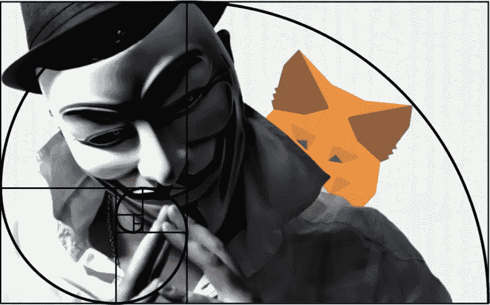
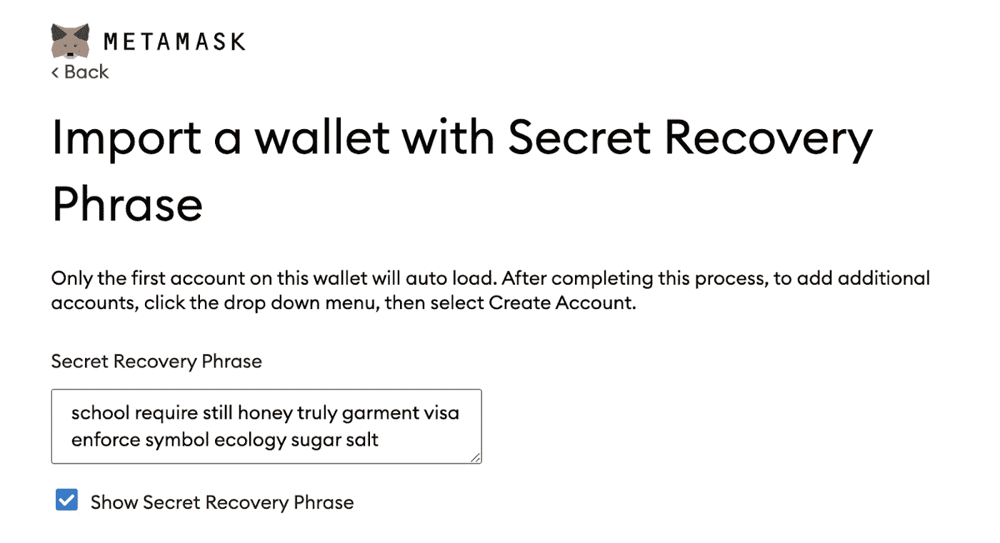

# 元掩码钱包中发现漏洞

> 原文：<https://medium.com/coinmonks/vulnerability-found-in-metamask-wallets-320865c6d9b9?source=collection_archive---------4----------------------->

Halborn 的安全研究人员在大多数浏览器钱包中发现了一个漏洞，包括 MetaMask。这个问题影响了一小部分用户。

This preview will be included in the NFT collection called “[Uncle Fibonacci News](https://opensea.io/collection/uncle-fibonacci-news)”

专家发现了一个案例，在特定条件下，网络钱包使用的秘密恢复短语可以从被黑客攻击的计算机的磁盘中提取出来。

开发人员修复了[元掩码扩展 10.11.3](https://github.com/MetaMask/metamask-extension/releases) 中的漏洞。

然而，他们警告说，满足以下条件的用户可能有风险:

◼️硬盘尚未加密
◼️恢复密码被导入到其他人的设备上或计算机遭到破坏
◼️使用“显示恢复密码”复选框查看屏幕上的文本(下图)。

MetaMask 团队指出，该漏洞是由于浏览器不认为物理访问攻击是一种威胁，并将所有文本输入存储在设备的内存中。只有全磁盘加密才能完全消除这种风险。

开发者的其他建议包括:清除浏览器缓存和电脑防病毒保护。

> 他们指出:“如果钱包和软件运行的系统遭到破坏，它们都无法保护自己。”

[Halborn](https://halborn.com/) 因披露漏洞获得了 5 万美元的奖励。

2022 年 6 月， [MetaMask](https://metamask.io/) 团队与 [HackerOne](https://www.hackerone.com/) 平台合作推出赏金计划。

📰 ***订阅*** [***斐波那契***](/@unclefibonacci) ***我来保持最新***

> 加入 Coinmonks [电报频道](https://t.me/coincodecap)和 [Youtube 频道](https://www.youtube.com/c/coinmonks/videos)了解加密交易和投资

# 另外，阅读

*   [Bookmap 评论](https://coincodecap.com/bookmap-review-2021-best-trading-software) | [美国 5 大最佳加密交易所](https://coincodecap.com/crypto-exchange-usa)
*   最佳加密[硬件钱包](/coinmonks/hardware-wallets-dfa1211730c6) | [Bitbns 评论](/coinmonks/bitbns-review-38256a07e161)
*   [新加坡十大最佳加密交易所](https://coincodecap.com/crypto-exchange-in-singapore) | [收购 AXS](https://coincodecap.com/buy-axs-token)
*   [红狗赌场评论](https://coincodecap.com/red-dog-casino-review) | [Swyftx 评论](https://coincodecap.com/swyftx-review) | [CoinGate 评论](https://coincodecap.com/coingate-review)
*   [投资印度的最佳加密软件](https://coincodecap.com/best-crypto-to-invest-in-india-in-2021)|[WazirX P2P](https://coincodecap.com/wazirx-p2p)|[Hi Dollar Review](https://coincodecap.com/hi-dollar-review)