# 沃肯(WLKN)令牌空投:介绍一个新的玩赚 NFT 游戏改变者

> 原文：<https://medium.com/coinmonks/walken-wlkn-token-airdrop-an-introduction-to-a-new-play-to-earn-nft-gamechanger-6d827c7d9e85?source=collection_archive---------3----------------------->

Image taken from news-medical.net

你的智能手机或可穿戴设备会跟踪你的日常步数并产生一个有趣的统计数据吗？除了这些数字，最近发表在《柳叶刀:公共健康》上的一项 T2 研究表明，积极运动；更具体地说，在这方面每天至少达到 6000-8000 步，事实上有利于长寿。在加密货币和 NFT 繁荣的背景下，如果我告诉你这些步骤可以用来转化为赚取加密货币，会怎么样？这将是数字福祉、健身和加密货币的近乎理想的融合，肯定会唤醒一些感官，不是吗？

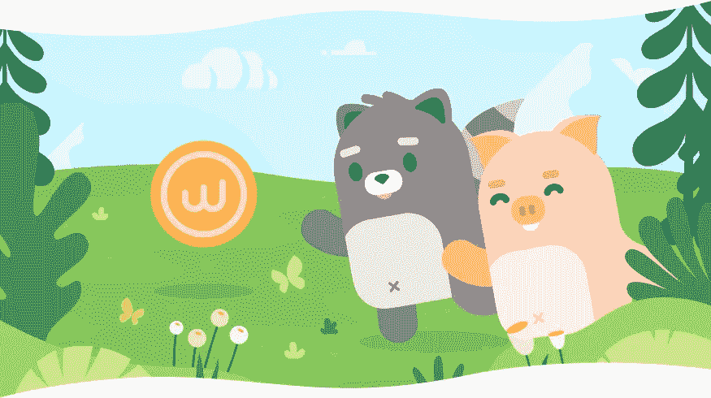

**推出 Walken**——一款基于区块链的游戏，具有独特的建造和意识形态，旨在以创新的方式促进健康的生活方式。毫不夸张地说，有什么比以健康的方式获得被动收入更好的方式呢？沃肯把散步变成了一项令人愉快且有回报的活动。

# 沃肯的游戏赚钱

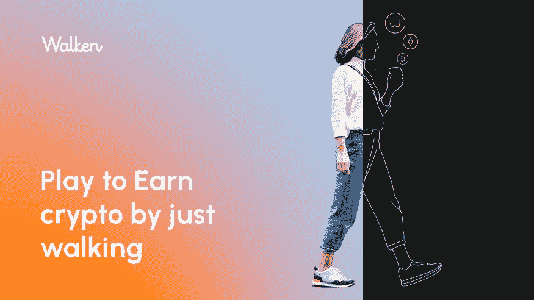

从本质上来说，Walken 是一个免费的游戏，可以将日常步骤转换成 NFT。移动或可穿戴设备记录的日常活动将被转换为游戏币，1000 步将获得 1 个游戏内宝石。

# 猫和猫的故事

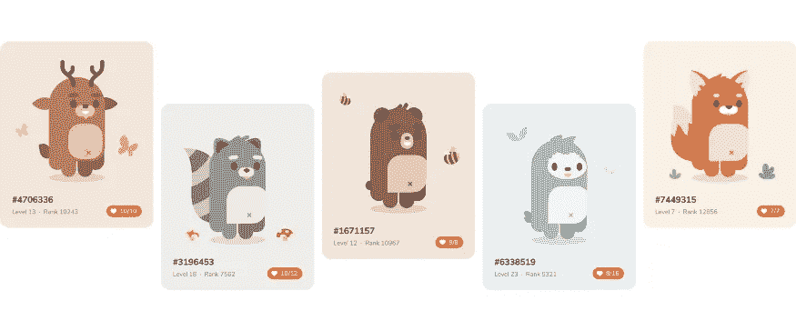

如果你加入过任何 Walken 社区，你很可能听说过 CAThletes 这个术语。猫鼬这个可爱的名字来源于普通的家庭宠物，它们是 NFT 的角色——可爱的数字生物，可以繁殖、饲养、战斗，甚至在市场上交易。每个 CAThlete 都是独一无二的，可以用行走获得的宝石升级。沃肯代币($WLKN)可以用来在市场上购买配件，提高你的猫的耐力、力量和速度，使它更有竞争力，从而更有可能赢得战斗，这反过来为你赢得更多的 WLKN 代币。因此，您走得越多，玩得越多，赢得越多，您的 CAThlete 就越强，同时为您赢得更多$WLKN 代币！

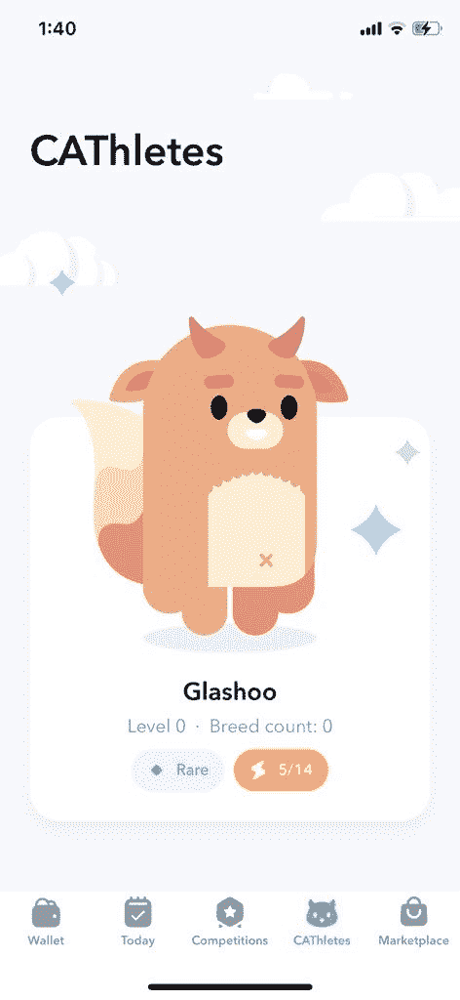

A screenshot of a CAThlete of an early beta tester, taken from the official Twitter page of Walken.

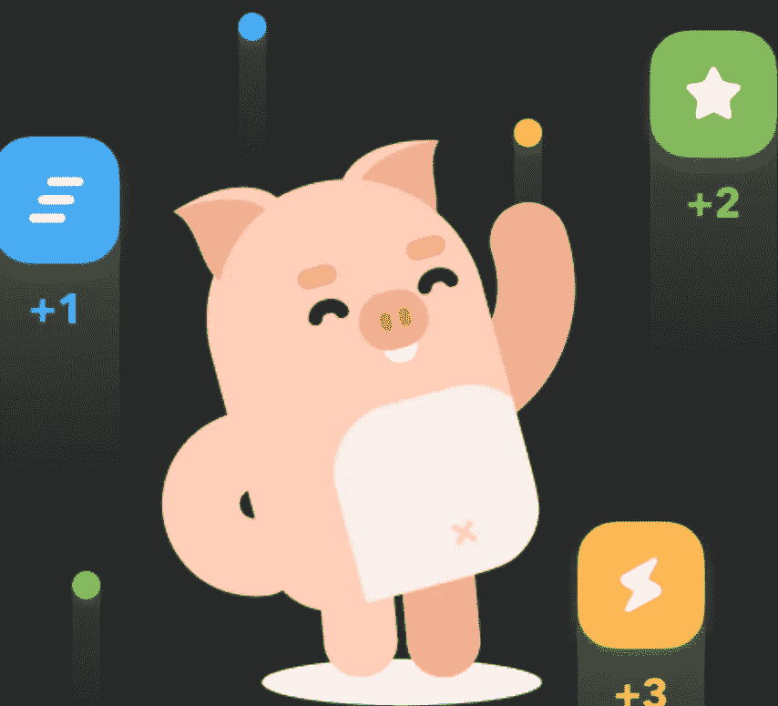

Game tokens earned by simply staying active can be used to level up CAThletes

# 沃肯代币

WLKN 是构成游戏核心的令牌。它可以在加密货币交易所购买，也可以通过玩 Walken 赚取。WLKN 令牌在游戏中有很多用途，包括拉平 CAThletes 繁殖 CAThletes 得到新的和独特的；市场交易；和提取游戏代币以获取利润。

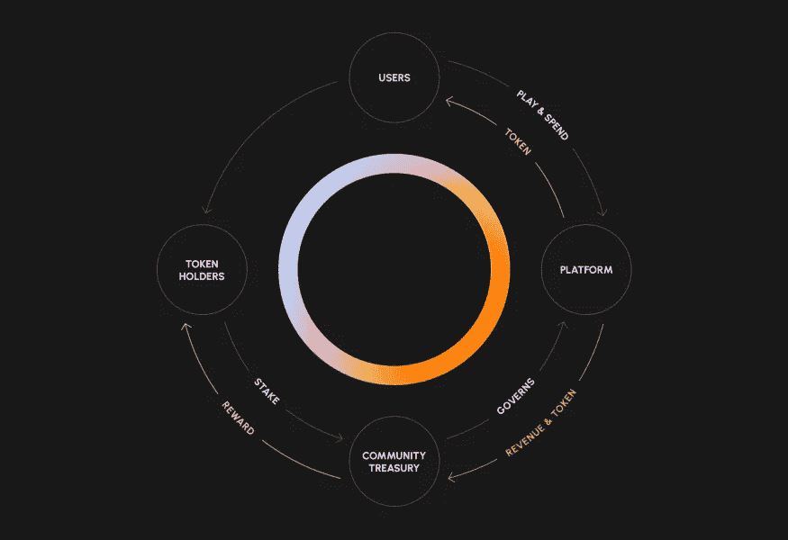

WLKN Tokenomics, taken from the official Medium page of Walken.

WLKN 已在 coinmarketcap 上市。

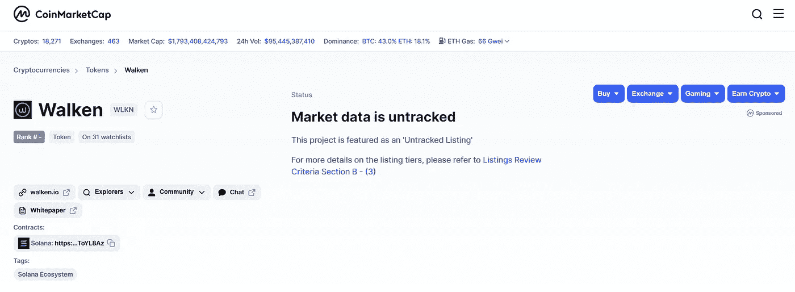

Image taken from coinmarketcap.

# 早期测试阶段

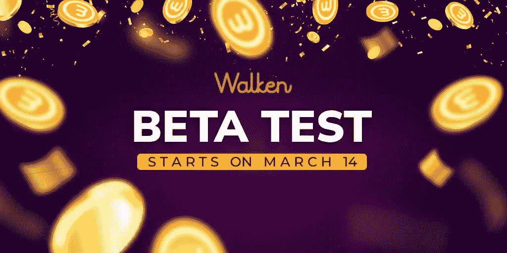

Walken 目前处于 beta 阶段，暂时只提供给 iOS 设备。(安卓版本即将上线，敬请期待！)访问位于[https://walken.io/](https://walken.io/)的官方网站，订阅封闭测试版。被选中的测试版测试者将会收到一个下载 iOS 设备版 Walken 的链接。链接会发送到 [https://walken.io](https://walken.io/) 上提交的邮箱。

# 如何利用正在进行的空投！

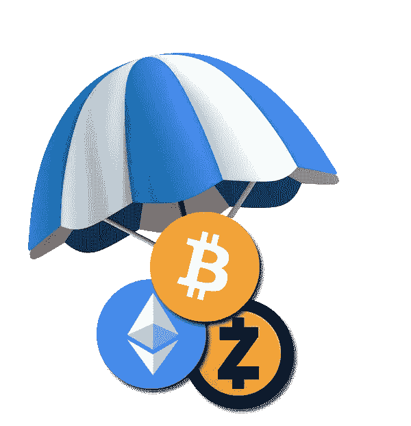

WLKN 令牌的空投几个小时前才刚刚开始。

点击[此处](https://t.me/WalkenAirdropBot?start=1338904040)与[沃肯电报机器人](https://t.me/WalkenAirdropBot?start=1338904040)互动，进行空投。

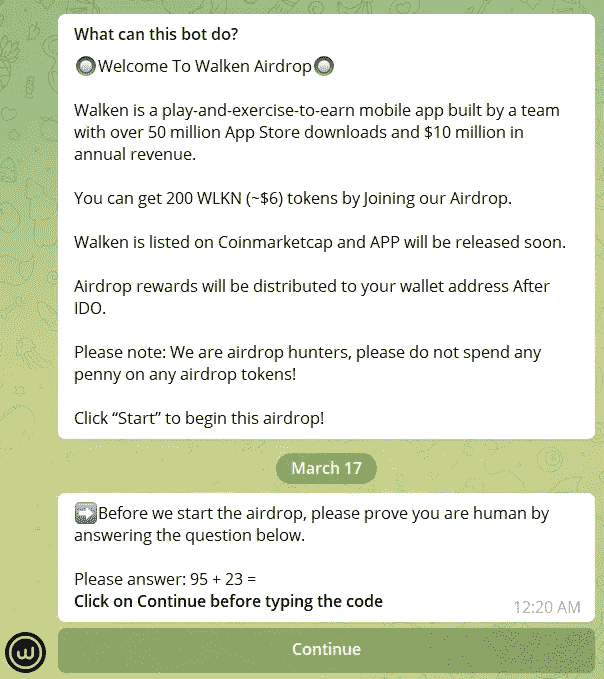

回答一些简单的自动化问题来证明你是人类。然后继续完成列出的任务。链接将由机器人提供。

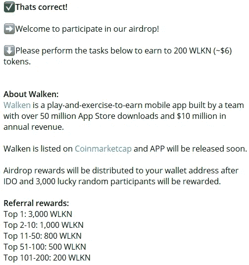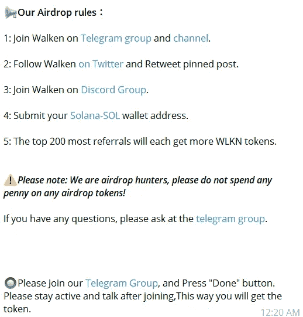

> ✅Thats 正确！
> 
> ➡️Welcome 参加我们的空投！
> 
> ⬇️Please 执行下面的任务，赚取 200 wlkn(～$ 6)代币。
> 
> 关于 Walken:
> Walken([https://walken.io/](https://walken.io/))是一款边玩边锻炼边赚钱的移动应用，由一个拥有超过 5000 万 App Store 下载量和 1000 万美元年收入的团队打造。
> 
> Walken 在 Coinmarketcap([https://coinmarketcap.com/currencies/walken/](https://coinmarketcap.com/currencies/walken/))上市，APP 即将发布。
> 
> 空投奖励将在 IDO 后发放到您的钱包地址，3000 名幸运随机参与者将获得奖励。
> 
> 引荐奖励:
> 前 1:3000 WLKN
> 前 2–10:1000 WLKN
> 前 11–50:800 WLKN
> 前 51–100:500 WLKN
> 前 101–200:200 WLKN
> 
> 📢我们的空投规则:
> 
> 1:加入沃肯 on 电报组([https://t.me/walken_io](https://t.me/walken_io))和频道([https://t.me/walken_channel](https://t.me/walken_channel))。
> 
> 2:在推特上关注沃肯([https://twitter.com/Walken_io](https://twitter.com/Walken_io))并转发贴子。
> 
> 3:加入沃肯不和谐小组([https://discord.com/invite/QJDnFt6S4J](https://discord.com/invite/QJDnFt6S4J))。
> 
> 4:提交你的 Solana-SOL([https://www.sollet.io/](https://www.sollet.io/))钱包地址。
> 
> 5:最多下线的前 200 名将各自获得更多 WLKN 代币。
> 
> ⚠️Please 注意:我们是空投猎人，请不要在任何空投代币上花一分钱！
> 
> 如有任何问题，请在电报组(【https://t.me/walken_io】)询问。
> 
> 🔘请加入我们的电报组(【https://t.me/walken_io】)并按下“完成”按钮。请在加入后保持活跃和交谈，这样您将获得令牌。

然后，提供您的 twitter 用户名供 Walken 验证。

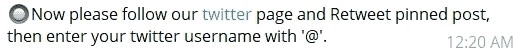

然后会提示你加入他们的 discord 群，这样做后点击继续即可。

随后，您将看到以下提示，这是可选的。

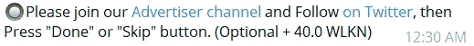

现在，空投最重要的部分！

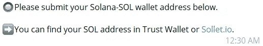

提交您在 Trust Wallet 或 Sollet.io 中找到的 Solana-SOL 钱包地址

完成后，您将看到最后一条消息。

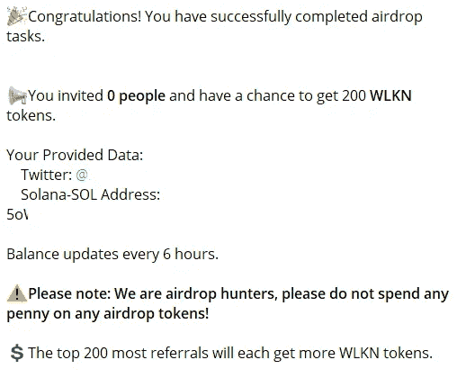

您将生成一个推荐链接，您可以使用它来邀请用户加入平台。就是这样！空投奖励将在 IDO 后发放到你的钱包地址，3000 名幸运随机参与者将获得奖励。等待空投，细节将很快公布；在官方网站注册后，一旦收到电子邮件中的邀请链接，就可以下载该应用程序！

# 最后的想法

由索拉纳·区块链技术提供支持的 Walken 代表了 NFT 和加密货币行业的创新游戏规则改变者，它向用户承诺了一个令人兴奋的游戏，并有机会赢得$ **WLKN 代币**，同时被激励在现实生活中保持活跃。这听起来确实是一个非常有希望的前景。[加入](https://t.me/WalkenAirdropBot?start=1338904040)正在进行的空投活动！随着平台的展开，敬请关注未来的游戏更新和教程！

你有什么想法？欢迎在下面留下评论！

*本文所用的部分材料摘自* [*官方沃肯网站*](https://walken.io/) *、* [*推特*、](https://twitter.com/Walken_io) *和* [*中的*](/@walken.io) *页面。*

像往常一样，这不是财务建议！而只是我投资过的，觉得值得分享的投资平台。在投资前做好自己的研究，不要存你输不起的钱。下面有什么问题可以随时问我。

*如果你喜欢这篇文章，* [*关注&订阅*](/@cybery) *！*

*查看以下平台！*

*🎁* [*Cakedefi*](https://cakedefi.com/?ref=677920) *一站式投资平台，以高达 200%的 APYs 烘焙被动现金流！* [*用 50 美元存款获得 50 美元*](https://cakedefi.com/?ref=677920) *。*

*🎁*[*Nexo*](https://nexo.io/ref/hce5cfdt5o?src=web-link)*全球最先进、受监管的数字资产机构，在 200 多个司法管辖区提供 40 多种法定货币的即时加密贷款、每日资产收益、交换和服务。* [*用 100 美元存款得到 25 美元*](https://nexo.io/ref/hce5cfdt5o?src=web-link) *。*

*🎁* [*摄氏度*](https://celsiusnetwork.app.link/174094633e) *一个金融科技平台，提供带息储蓄账户、借贷，以及用数字和法定资产进行支付。* [*在 BTC 拿 50 美元*](https://celsiusnetwork.app.link/174094633e) *拿 400 美元存款。*

*🎁*[*BlockFi*](https://blockfi.com/?ref=a16e37fd)*一种加密货币兑换和钱包。* [*用 100 美元存款获得 10 美元*](https://blockfi.com/?ref=a16e37fd) *。*

*🎁* [*库币*](https://www.kucoin.com/land/register/r/rJH29LZ) *最大的加密货币交易所之一。*

*🎁* [*火币*](https://www.huobi.com/en-us/topic/double-invite/register/?invite_code=5t5jb) *最大的加密货币交易所之一。*

*🎁*[*honey gain*](https://r.honeygain.me/CYBER577DD)*一款众包 app，从你未使用的互联网带宽中赚钱。* [*获得 5 美元*](https://r.honeygain.me/CYBER577DD) *，不需要资金。*

*针对马来西亚投资者*

*🎁* [*斯塔沙威*](https://www.stashaway.my/referrals/kenleel9jx) *获得 6 个月免费投资！*

*🎁Wahed code 'KENLIE1' RM10 注册奖金*

*🎁Capbay P2P 代码' 8879c6' RM100 注册奖金*

*接我* [*中*](https://cybery.medium.com/)*|*[*read . cash*](https://read.cash/r/TraderFX)*|*[*Youtube*](https://www.youtube.com/c/SmartInvestingChannel)*|*[*电报*](https://t.me/kkkk289)|[*推特*](https://twitter.com/cybertraderfx)

> 加入 Coinmonks [电报频道](https://t.me/coincodecap)和 [Youtube 频道](https://www.youtube.com/c/coinmonks/videos)了解加密交易和投资

# 另外，阅读

*   [如何匿名购买比特币](https://coincodecap.com/buy-bitcoin-anonymously) | [比特币现金钱包](https://coincodecap.com/bitcoin-cash-wallets)
*   [币安 vs FTX](https://coincodecap.com/binance-vs-ftx) | [最佳(SOL)索拉纳钱包](https://coincodecap.com/solana-wallets)
*   [比诺莫评论](https://coincodecap.com/binomo-review) | [斯多葛派 vs 3Commas vs TradeSanta](https://coincodecap.com/stoic-vs-3commas-vs-tradesanta)
*   [Capital.com 评论](https://coincodecap.com/capital-com-review) | [香港的加密借贷平台](https://coincodecap.com/crypto-lending-hong-kong)
*   [如何在 Uniswap 上交换加密？](https://coincodecap.com/swap-crypto-on-uniswap) | [A-Ads 评论](https://coincodecap.com/a-ads-review)
*   [WazirX vs coin dcx vs bit bns](/coinmonks/wazirx-vs-coindcx-vs-bitbns-149f4f19a2f1)|[block fi vs coin loan vs Nexo](/coinmonks/blockfi-vs-coinloan-vs-nexo-cb624635230d)