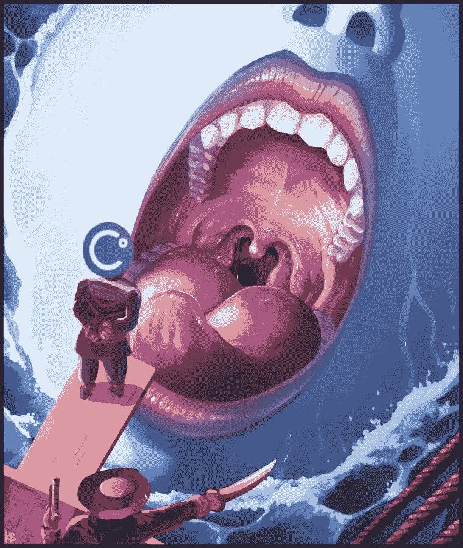
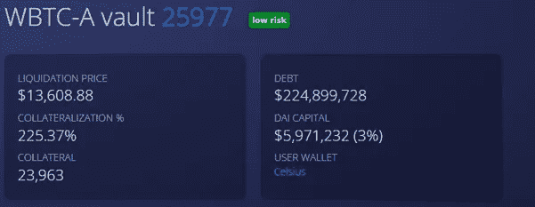
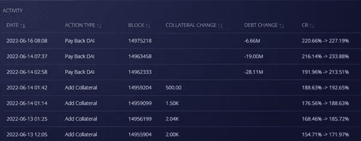
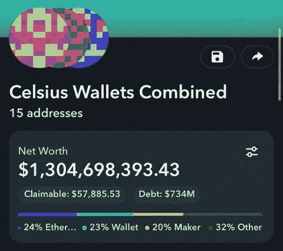

# 用摄氏温度走木板

> 原文：<https://medium.com/coinmonks/walking-the-plank-with-celsius-43ed29558544?source=collection_archive---------1----------------------->

Credits to [Karbo](https://www.deviantart.com/karbo/art/Walk-the-plank-301098889)

# **简介**

如果你没有注意到，自 6 月 11 日以来，加密市场已经变得异常火爆[。鲨鱼闻到了血腥味，围着它打转。我爸坚信市场不会复苏。我觉得大部分爸爸都是。再一次，crypto 看起来像 17 世纪中期的荷兰郁金香球茎](https://coinmarketcap.com/currencies/bitcoin/)[。](https://www.investopedia.com/terms/d/dutch_tulip_bulb_market_bubble.asp)

今天，我将讨论一个非常现实而又困难的话题——Celsius Network——这个集中式加密交易所两周前暂停了从其平台上的所有提款。我和其他 170 万用户的存款现在被冻结，可能岌岌可危。正是这种情况，比特币旨在通过消除对银行和其他第三方的信任来提供保证。

就我个人而言，我承认我已经把很大一部分加密储蓄放在了摄氏温度上。如果我失去了它，还不足以毁掉我的财务前景，但它肯定会在未来很长一段时间内造成伤害。然而，我对再次看到我的资金保持谨慎乐观。如果没有，那就已经得到了一个昂贵的教训。我对少数在社交媒体上传播毒性、发明信息和 FUD(恐惧、不确定性和怀疑)的喧闹的巨魔和机器人充耳不闻。Celsius 的许多实际利益相关者似乎在每个转折点都默认了情绪主义和末日论，并一直说“一切都结束了”。

在这篇文章中，我将全面而真实地讲述“摄氏零度冻结”。我将调查冻结是如何发生的，是什么造成的，包括一些个人对可能结果的思考，以及我从错误中吸取的教训。我所说的一切都是有保留的，因为目前的信息是有限的。准备好大量的信息，没有理财建议。

# 摄氏网络

Celsius 是一家拥有 650 多名员工的大公司。去年，Celsius 筹集了 7.5 亿美元的资金，估值超过 30 亿美元。Celsius 背后的人大部分都是有良好记录的有能力的人。一个例外是前首席财务官 Yaron Shalem，他因涉嫌洗钱、欺诈和性侵犯于去年 11 月被捕。前机构贷款主管杰西卡·哈特(Jessica Kharter)，在她担任 Celsius 高级职位的 1-2 年前，她出演了一部业余成人电影。[【3】](#_ftn3)

另一方面，首席执行官[亚历克斯·马辛斯基](https://www.linkedin.com/in/mashinsky/)创立了 4 家独角兽公司(估值超过 10 亿美元的公司)，并拥有 50 多项专利。首席风险官 [Rodney Sunada-Wong](https://www.linkedin.com/in/rodney-sunada-wong/) 在摩根士丹利担任风险主管已有十多年的经验。现任首席财务官， [Rod Bolger](https://www.linkedin.com/in/rodbolger/?original_referer=https%3A%2F%2Fwww%2Eqwant%2Ecom%2F&originalSubdomain=ca) ，在加拿大最大的银行 RBC 担任财务主管已有十多年的经验。

Celsius 的工作方式与传统银行非常相似，但它被用于借贷加密资产，而不是用于法定用途。与传统银行不同，用户可以通过将密码存入 Celsius 获得高收益。例如，我在比特币上的 APY(年百分比收益率)为 2.5%，以太坊为 6%，Tether 为 7.10%，Polkadot 为 9.02 %，Solana 为 3.82%。这是有可能的，因为 Celsius 将矿山和其他“收益农民”的资产短期出租给能够通过仲裁、做市或卖空为自己创造利润的行为者。根据首席执行官亚历克斯·马辛斯基的说法，Celsius 相当于在数字世界中出借证券。[【4】](#_ftn4)

# 冻结客户资金

大约两周前，Celsius 暂停了提款。在 6 月 12 日周日所有资产被冻结后不久，他们向“社区”发布了一份备忘录，内容如下:

> "*由于极端的市场条件，今天我们宣布 Celsius 暂停所有账户之间的提款、互换和转账。我们今天采取这一行动，是为了让 Celsius 在一段时间内更好地履行其提款义务。*

在宣布之后，6 月 13 日星期一晚上，Celsius 的原生令牌$ CEL——作为平台用户的奖励——出现了 [TerraLUNA 式的](https://medium.datadriveninvestor.com/the-terraluna-crash-internet-scams-in-desperate-times-of-crypto-73f6f7a2c156)暴跌。$CEL 在一小时内暴跌 55%以上，[【5】](#_ftn5)与此同时，社交媒体上流传着关于 Celsius 濒临破产的猜测。

更糟糕的是，当我们阅读 Celsius 的[使用条款](https://celsius.network/terms-of-use)第 13.1 段时，它说:

> *“如果 Celsius 破产、进入清算程序或因其他原因无法偿还其债务，则在 Earn 服务中使用的或在 Borrow 服务中用作抵押品的任何合格数字资产可能无法收回，并且除了根据任何适用法律您作为 Celsius 债权人的权利之外，您可能没有与 Celsius 对您的义务相关的任何法律救济或权利。*

或者用简单明了、不墨守成规的英语说:“如果 Celsius 破产，你可能就再也见不到你的资金了。”然而，正如我们将在后面看到的，证据似乎表明，Celsius 面临的更多的是流动性问题，而不是破产问题。

也就是说，没有太多关于幕后真实情况的信息。Celsius 团队或多或少保持了沉默，除了一些用法律术语正式宣布的消息(没有透露太多)。他们取消了 6 月 17 日每周一次的 [AMA](https://www.youtube.com/watch?v=akHW8Xen4Cw) 会议(问马辛斯基任何问题)，焦虑和愤怒的顾客希望在那里得到一些答案。

我们目前能得出的唯一合理的次结论是，随着撤销请求的堆积和用户从平台大规模迁移，Celsius 无法履行其义务。分析师指责 Celsius 用用户的加密资金进行赌博，以赚取高额收益。“赌博”有时被证明是不成功的。

例如，Celsius 是以太坊 2.0 的赌注解决方案 [Stakehound Staked Ether](https://stakehound.com/blog/) 的最大持有者(下一节将详细介绍赌注解决方案)。2021 年 6 月 22 日，Stakehound 宣布，它丢失了代表客户存放的超过 38，000 ETH 的密钥。根据 Dirty Bubble Media 的数据，Celsius 的损失至少达到 35，000 瑞士法郎，在今天的熊市条件下大约为 5，000 万美元。[【7】](#_ftn7)Celsius 没有向公众透露任何关于他们损失的信息。

另一个事件来自 Celsius 与 BadgerDAO 的牵连，后者在去年年底成为网络钓鱼攻击的受害者。[【8】](#_ftn8)摄氏度在今天的熊市中损失了 896 BTC 对应 2000 万美元。

很容易会有其他导致 Celsius 流动性问题的事件或风险管理不善的例子，但尚未公布或记录在案。没有办法知道…

# 堆叠醚

数据显示，除其他因素外，Celsius 的流动性变得很差，因为它持有大量利多股份以太坊(stETH)。简而言之，stETH 是一种以太坊衍生产品，在以太坊将共识模型从工作证明(PoW)转换为利益证明(PoS)之前，它是不可挽回的。这一期待已久的转变被称为“合并”。该活动原定于今年 8 月举行，但被无限期推迟。

目前，以太坊网络上的所有交易都在两个区块链上进行验证，一个是使用 PoW 的以太坊主网(以太坊 1.0)，另一个是使用 PoS 的[信标链](https://ethereum.org/en/upgrades/beacon-chain/)(以太坊 2.0)。以太坊上的所有交易仍然在主网上处理，而信标链正在运行，以便测试、同步和为即将到来的以太坊 2.0 更新提供早期安全性。

作为矿工或验证者参与的最大激励是块奖励的支付。现在，与 Mainnet 上的矿工相比，支付给信标链上的验证者的报酬只是零头。此外，押注以太坊 2.0 有两个主要缺点:

*   用户至少需要 32 个以太网(ETH)来参与信标链上的标桩。
*   在合并之前 32 个 ETH 是锁着的。

32 ETH 的高入门要求对大多数日常加密用户来说是一个障碍。即使对于资金雄厚的大玩家来说，收益率也伴随着流动性不足的代价，因为他们持有的股权可能在 1-2 年内，甚至更长时间内都不能动用。

这就是[利多金融](https://lido.fi/)和 stETH 介入的原因。stETH 是 staked ETH 的令牌化版本，可用于交易和借贷。丽都金融目前为用户在信标链上下注提供 4%的每日回报。没有参赛要求，这意味着任何人都可以参加没有 32 ETH。合并完成后，stETH 代币也完全可兑换为 ETH 代币。[【9】](#_ftn9)

赌注以太坊应该和以太坊有完全相同的价值。但与加密市场更大规模的抛售相一致的是，stEth 在 6 月 10 日的交易价格为 0.9413/ETH，在 6 月 13 日进一步下跌至 0.9341。失去与瑞士联邦储备银行 1:1 的联系汇率，呼应了导致 TerraLuna 崩盘的美国联邦储备银行与美元挂钩汇率的下跌。然而，与 TerraUST 不同的是，stETH 没有严格要求保持其挂钩。丽都别无选择，只能在合并后兑现 stETH 的赎回权，而不管其挂钩。[【11】](#_ftn11)stETH 交易价格低于 ETH 的问题在于流动性。

摄氏温度含有大量的 stETH。截至目前(2022 年 6 月 25 日)，在[有 409.706 个 stETH 在](https://zapper.fi/bundle/0x8aceab8167c80cb8b3de7fa6228b889bb1130ee8%2C0x1cedc0f3af8f9841b0a1f5c1a4ddc6e1a1629074%2C0x87a67e7dc32fdc79853d780c6f516312b4a503b5%2C0xeee27662c2b8eba3cd936a23f039f3189633e4c8%2C0xc131701ea649afc0bfcc085dc13304dc0153dc2e%2C0x84e1f49a6b65882c7365b6a775999cfcb481f22f%2C0xcf7a68127285c7c6c8546ce51b89d7e820f6d294%2C0x4f6742badb049791cd9a37ea913f2bac38d01279%2C0xdbaa0bcec419c47a75efbb93c745aebae3fe9c7b%2C0x3b6543ebe26824bd8156a103063f56ce50f88080%2C0xef22c14f46858d5ac61326497b056974167f2ee1%2C0x3be6d80fdce385358f5762998882efc282df7b9a%2C0x845cbcb8230197f733b59cfe1795f282786f212c%2C0x0fc8415a9b8f535e9f48ba245b1b18a37fb03a90%2C0x8665d75ff2db29355428b590856505459bb675e3?label=Celsius+Wallets+Combined&id=0x7d3a40822eb2701f5d08e3a24b0bfefbd173e1ae&addresses=0x8aceab8167c80cb8b3de7fa6228b889bb1130ee8%2C0x1cedc0f3af8f9841b0a1f5c1a4ddc6e1a1629074%2C0x87a67e7dc32fdc79853d780c6f516312b4a503b5%2C0xeee27662c2b8eba3cd936a23f039f3189633e4c8%2C0xc131701ea649afc0bfcc085dc13304dc0153dc2e%2C0x84e1f49a6b65882c7365b6a775999cfcb481f22f%2C0xcf7a68127285c7c6c8546ce51b89d7e820f6d294%2C0x4f6742badb049791cd9a37ea913f2bac38d01279%2C0xdbaa0bcec419c47a75efbb93c745aebae3fe9c7b%2C0x3b6543ebe26824bd8156a103063f56ce50f88080%2C0xef22c14f46858d5ac61326497b056974167f2ee1%2C0x3be6d80fdce385358f5762998882efc282df7b9a%2C0x845cbcb8230197f733b59cfe1795f282786f212c%2C0x0fc8415a9b8f535e9f48ba245b1b18a37fb03a90%2C0x8665d75ff2db29355428b590856505459bb675e3&tab=dashboard)。Celsius 的整个商业模式围绕着从用户的资金中获取大量密码，赚取收益，并向用户支付回报。但是现在 stETH 不再能以 1:1 的价值兑换 ETH，代币被有效地锁定了。如果 Celsius 决定大量抛售 stETH，价格可能会进一步下跌。[【12】](#_ftn12)是什么原因导致了这次 stETH 的脱钩？

# #CELShortSqueeze

区块链数据显示，就在 UST 失去与美元的联系、TerraLUNA 崩溃之前，Celsius 从 Terra 的锚协议中提取了 225，000 ETH。[【13】](#_ftn13)[一个普遍的理论](https://www.youtube.com/watch?v=0wCFB4aR1Vk%3Fauto_play%3Dtrue)是，Celsius 成为了“秘密黑手党”协同卖空攻击的受害者。据传，这次袭击是对 Celsius 在 UST 抛售中的领先地位的报复。

市场分析师兼 Twitter 用户[普兰](https://twitter.com/TheRealPlanC)发布了一个由两部分组成的帖子[其中他剖析了 FTX 交易所和交易公司 Alameda Research 是如何联手打压 Celsius 的。他们同时抛售了 stETH 的大量股票，而其他参与者则故意在社交媒体上传播 FUD，引发了“银行挤兑”。链上分析确实显示，6 月 8 日，在 stETH 失去挂钩的前两天，Alameda 在两个小时内向市场抛售了 50，615 stETH。](https://twitter.com/TheRealPlanC/status/1537483503624806400?s=20&t=It5runufgxfxgjRci-u1YQ)[【14】](#_ftn14)此外，在提现冻结前，$CEL 代币在 FTX 交易所被[大量做空](https://i.redd.it/i019ucx5ot491.jpg)(图片来自 6 月 10 日)。

Reddit group[r/Celsius network](https://www.reddit.com/r/CelsiusNetwork/)和 trendingTwitter 标签 [#CELShortSqueeze](https://twitter.com/hashtag/CelShortSqueeze?src=hashtag_click) 下的 celsius 支持者(或“Celsians”)在过去几天里购买了大量的$CEL 代币。计划很简单:在 FTX 上低价买入$CEL，将代币发送到 MetaMask 等私人钱包中，并设置高卖出限价单，例如 100 美元。[【15】](#_ftn15)

Celsius 卖空交易的目的是让那些对 Celsius 下跌进行投机的交易员尝尝他们自己的药。代币流动性低。据估计，87%的$CEL 被冻结在提款冻结中。通过买入美元 CEL，供给减少，需求增加，价格也增加。与[Gamestop vs . r/wall street bets](https://en.wikipedia.org/wiki/GameStop_short_squeeze#GameStop)的动态类似，卖空者最终将被迫平仓，并遭受巨大损失，这将推动$CEL 的价格进一步上涨。

到目前为止,# CELShortSqueeze-计划似乎正在发挥作用。美元在 6 月 21 日飙升 50%，达到 1.56 美元，而 6 月 13 日为 0.17 美元。[【16】](#_ftn16)

# 走向破产还是暂时的流动性紧缩？

根据法律定义，破产意味着“无法支付到期债务”。[【17】](#_ftn17)我们可以区分“现金流破产”和“资产负债表破产”。[【18】](#_ftn18)

当一家公司缺乏流动性来偿还债务时，它就是“现金流破产”。当一家公司实际上根本不拥有偿付债务的资产时，它就是“资产负债表破产”。

这个 200 亿美元的问题是(10 个月前， [Celsius 报告说](https://blog.celsius.network/celsius-celebrates-1m-users-af478a509d2c)管理着 200 多亿美元的总资产持有量)Celsius 是现金流破产(缺乏流动性)还是资产负债表破产。目前区块链的数据指向前者，而媒体和一般在线 FUD 的故事指向后者。

作为一家不受监管的私人公司，公众看不到 Celsius 的资产负债表。Celsius 报告了他们 2019 年和 2020 年的财务数字和审计报告。足够可疑的是，尽管投资者在社交媒体平台上多次呼吁，但 2022 年没有发布任何东西。[【19】](#_ftn19)

截至 6 月 25 日，Celsius 在 DeFi 协议 [MakerDAO](https://makerdao.com/en/) (见此处金库)上的贷款相当于 2.25 亿美元。根据造市协议发放的贷款以戴支付，这是一种与美元 1:1 挂钩的稳定货币。借款人需要提供抵押品。此外，抵押品必须超过贷款的价值，称为超额抵押。例如，借款人可以投入价值 150 美元的不稳定加密资产，并获得价值 100 美元的戴稳定币贷款。[【20】](#_ftn20)

从下面 Celsius 钱包的截图可以看出，他们已经抵押了 23，963 英镑作为在戴贷款的担保。单位是包裹比特币(wBTC)。wBTC 是基于可替代的 ERC-20 标准的以太币代币，其价值与比特币 1:1 挂钩。简单来说，wBTCs 就是等同于比特币价值的以太币代币。

过去两周，Celsius 用户密切关注当前 13.609 美元的清算价格。如果比特币跌破该价格水平，戴的贷款将通过智能合约自动用 Celsius 在 wBTC 的抵押品偿还。这可能会使 Celsius 资产负债表资不抵债。

6 月 13 日星期一，当比特币价格暴跌时，Celsius 濒临破产。当时只有 17，919 wBTC 作为抵押品存放在钱包中，清算价格为 22，584 美元。[【21】](#_ftn21)

幸运的是，正如下面金库中的活动所示，Celsius 设法偿还了部分戴贷款，并增加了抵押品以降低清算价格，以免为时过晚。

6 月 20 日，摄氏[向](https://etherscan.io/tx/0x3f51f69ab4cb5e7ba9fe93e0c7d27988102472680b922011f0cea369bc5e3a9b)[大院](https://compound.finance/)清偿了戴1000 多万美元的债务。6 月 24 日，他们[向](https://etherscan.io/tx/0xca1a17f4d82bb65385d58886343dbc554a60596a68a6adcb43be378596867990)[名义金融](https://notional.finance/)偿还了戴超过 1000 万美元的债务。Celsius 从 Chainlink 获得的另一笔 3400 万美元的贷款也于上周全部还清。

显然，Celsius 是在偿还贷款，而不是让它们被清算。当我们看他们的组合钱包投资组合时，他们的整体财务状况在过去两周似乎也有了很大改善。截至 6 月 26 日，他们的净资产为 1，942，068，006.62 美元，比 6 月 13 日增加了+6.5 亿美元，截图如下。

为了在冷冻的凯尔特人的血管中注入更多的氦，stETH 似乎正在慢慢恢复其与 ETH 的联系，在 6 月 25 日超过了 0.965。[【22】](#_ftn22)

我在本节中提到的一切似乎表明，Celsius 正在遭受暂时的流动性紧缩，他们不太可能在短期内申请破产。在我个人看来，从另一个交易所[如 Nexo](https://cointelegraph.com/news/nexo-offers-to-buy-out-celsius-loans-amid-withdrawal-suspension) 收购似乎更有可能，而且(显然)对用户来说是更好的结果。另一个有趣的进展是[西蒙·迪克森](https://twitter.com/SimonDixonTwitt)，加密投资公司 [Bnktofuture](https://bnktothefuture.com/) 的首席执行官，他提出[帮助 Celsius 制定一个恢复计划](https://bnktothefuture.com/blog/celsius-recovery-plan-a-statement-from-simon-dixon-and-bnk-to-the-future/)。

尽管有这些积极的迹象，华尔街日报在 6 月 24 日报道说，高盛正在寻求投资者承诺 20 亿美元，如果他们申请破产，就购买 Celsius。据称，花旗银行的顾问和阿金·甘普·施特劳斯·豪尔律师事务所的重组律师推荐了这一结果。[【24】](#_ftn24)这是最糟糕的情况，原因我就不在这里讨论了。然而，根据来自高盛的西蒙·迪克森的内部消息来源，这个故事是假新闻。

再说一次，没有人能公开肯定地说这是怎么回事。在线空间中的 FUD 和氦似乎数量相当。猜测，谣言和理论，但少数真正有洞察力的人签署了 NDA 的。在正式宣布之前，利益相关者不幸地被无限期地蒙在鼓里。我们想起了 Terra 的联合创始人 Do Kwon 在 TerraLUNA 自由落体到接近零的时候发表的那条臭名昭著的自信的推特。

# 我的结束语

现在，Celsius 的口号“解放你自己”听起来有些空洞。正如我看到一位 YouTube 评论者指出的那样，他们兑现了自己的承诺。然而，如果 Celsius 破产，并在用户之前向昂贵的破产律师和受托人支付股息，许多“Celsians”将不可避免地通过从现在起将储蓄存在银行来“解封”。

如果 Celsius 的 DAI 贷款被要求追加保证金并被清算，分析师们预计，这将对加密市场的其余部分产生连锁效应。其他公司也可能被清算，甚至可能像多米诺骨牌一样倒下，而比特币和密码的价格将进一步下跌。因此，Celsius 退出，或者至少能够偿还客户的存款，应该符合所有人的利益。

沃伦·巴菲特不再是密码圈最受欢迎的人物，四年前他称比特币为老鼠药。尽管如此，包括我自己在内的加密社区无疑可以从他全面的、基于价值的投资策略中学到很多东西(本杰明·格拉哈姆的《聪明的投资者》是我的阅读清单上的第一本书)。

像许多其他人一样，我承认我被 Celsius 的高收益承诺、他们来自传统金融玩家的巨大支持、他们的每周 ama 等等蒙蔽了双眼。同时，我没有对公司进行足够的尽职调查，也没有对导致崩盘的加密推特给予足够的关注。我还忽略了一些投资的基本规则，即不要贪婪，要在交易所之间分散投资。或者就像古老而普通的比特币谚语所说:不是你的钥匙，也不是你的硬币。

绝望和焦虑当然是可以理解的，因为任何人现在都把钱押在了 Celsius 上。然而，真正的企业家精神可以浴火重生，变得更加强大。不管怎样，生活还是要继续。最后，良好的人际关系和健康比冰冷的资产更重要。所以最好把注意力放在这上面。

【Vipal Monga 和 Angus Loten(2022 年 6 月)】，Celsius 投资者不太可能提供更多资金来纾困 Crypto Lender[https://www . wsj . com/articles/Celsius-networks-Investors-impossible-to-Bail-Out-Crypto-Lender-11655395113](https://www.wsj.com/articles/celsius-networks-investors-unlikely-to-provide-more-funds-to-bail-out-crypto-lender-11655395113)(17–06–2022)。

[【2】](#_ftnref2)(2021 年 11 月)伊恩·艾利森(Ian Allison)，Celsius 首席财务官，因与摩西·霍格公司前工作相关的指控被捕->[https://www . coin desk . com/business/2021/11/26/Celsius-CFO-因指控被捕-与前工作相关-在摩西·霍格公司/](https://www.coindesk.com/business/2021/11/26/celsius-cfo-arrested-on-charges-tied-to-former-job-at-moshe-hogegs-firm/)(16–06–2022)。

[【3】](#_ftnref3)Reddit thread by MightyMihir->[https://www . Reddit . com/r/wallstreetbetsscrypto/comments/vc8nif/the _ celsius _ blow up _ ex adult _ star _ to _ chief _ lending/](https://www.reddit.com/r/WallStreetBetsCrypto/comments/vc8nif/the_celsius_blowup_exadult_star_to_chief_lending/)(19–06–2022)。

[【4】](#_ftnref4)摄氏网络，摄氏如何赚取收益率，[https://www.youtube.com/watch?v=_W327zdQ0x0](https://www.youtube.com/watch?v=_W327zdQ0x0)(18–06–2022)。

[【5】](#_ftnref5)来自 Coingecko 的价格:[https://www.coingecko.com/en/coins/celsius-network-token](https://www.coingecko.com/en/coins/celsius-network-token)(15–06–2022)。

[【6】](#_ftnref6)脏泡媒体(2022 年 6 月)，Celsius 网络在 Stakehound key 失策中至少损失了 35000 乙醚->[https://dirtybublemedia . substack . com/p/Celsius-Network-lost-至少-35000？UTM _ source = % 2f profile % 2f 69647390-dirty-bubble-media&UTM _ medium = reader 2](https://dirtybubblemedia.substack.com/p/celsius-network-lost-at-least-35000?utm_source=%2Fprofile%2F69647390-dirty-bubble-media&utm_medium=reader2)(26–06–2022)。

[【7】](#_ftnref7)同上。

[【8】](#_ftnref8)Dirty Bubble Media(2022 年 6 月)，一个莫名其妙的错误让 Celsius Network 从 BadgerDAO hack 那里损失了 2200 万美元的赔偿，[https://dirtybublemedia . substack . com/p/An-莫名其妙-error-cost-celsius？s = w](https://dirtybubblemedia.substack.com/p/an-inexplicable-error-cost-celsius?s=w)(20–06–2022)。

[【9】](#_ftnref9)同上。

[【10】](#_ftnref10)价格数据来自 dune . com:[https://dune.com/dataalways/stETH-De-Peg](https://dune.com/dataalways/stETH-De-Peg)(25–06–2022)。

[【11】](#_ftnref11)Conor Ryder，CFA(2022 年 6 月)，摄氏达到沸点->[https://blog . kaiko . com/摄氏-达到沸点-c9b 258 f 4474 f](https://blog.kaiko.com/celsius-reaches-boiling-point-c9b258f4474f)(25–06–2022)。

[【12】](#_ftnref12)Stacy Elliott(2022 年 6 月)，Celsius 流动性紧缩如何与利多的 Staked Ethereum 联系起来->[https://decrypt . co/102812/Celsius-Liquidity-Crunch-Lido-Staked-ether eum-steth](https://decrypt.co/102812/celsius-liquidity-crunch-lido-staked-ethereum-steth)(15–06–2022)。

Ryan Weeks(2022 年 5 月)，Celsius 在 Terra chaos->[https://www . the block . co/post/146752/Celsius-从 Anchor-Protocol-amid-Terra-chaos 中拉出 5 亿美元](https://www.theblock.co/post/146752/celsius-pulled-half-a-billion-dollars-out-of-anchor-protocol-amid-terra-chaos)(20–06–2022)。

[【14】](#_ftnref14)HsakaTrades 6 月 8 日的推特帖子[https://twitter.com/HsakaTrades/status/1534464723302891522](https://twitter.com/HsakaTrades/status/1534464723302891522)(25–06–2022)。

[【15】](#_ftnref15)《玉》(2022 年 6 月)，本案为#CELShortSqueeze — $GME 2.0？->[https://medium . com/@ cryptoismyjam/the-case-for-the-celshortsqueeze-gme-2-0-4587 fcee 13 ba](/@cryptoismyjam/the-case-for-the-celshortsqueeze-gme-2-0-4587fcee13ba)(26–06–2022)。

[【16】](#_ftnref16)解密 Staf(2022 年 6 月)，在 GameStop 式的短压尝试中摄氏上涨 50%>[https://Decrypt . co/103406/Celsius-Up-50-Amid-GameStop 式的短压尝试](https://decrypt.co/103406/celsius-up-50-amid-gamestop-style-short-squeeze-attempt)(26–06–2022)。

[【17】](#_ftnref17)瓦西律师推特 6 月 13 日线程——>[https://twitter.com/wassielawyer/status/1536192639112183808](https://twitter.com/wassielawyer/status/1536192639112183808)(17–06–2022)。

[【18】](#_ftnref18)ShaharBrams 推特 6 月 14 日线程——>[https://twitter.com/ShaharAbrams/status/1536787774086471682](https://twitter.com/ShaharAbrams/status/1536787774086471682)(17–06–2022)。

[【19】](#_ftnref19)@ Crypto _ Joe 10 Twitter 帖子六月十日->【https://twitter.com/Crypto_Joe10/status/1535291357996015618】T2(25–06–2022)。

[【20】](#_ftnref20)山姆·安德鲁(2022 年 6 月)冰点->[https://samuelandrew.substack.com/p/freezing-celsius](https://samuelandrew.substack.com/p/freezing-celsius)(20–06–2022)。).

[【21】](#_ftnref21)Twitter 线程 by @ MikeBurgersburg->[https://Twitter . com/MikeBurgersburg/status/1536277332826136576？s = 20&t = QS 28 swn 6 kfmhrgrk 7 GB 57g](https://twitter.com/MikeBurgersburg/status/1536277332826136576?s=20&t=Qs28SwN6KfmhrgrK7gB57g)(21–06–2022)。

[【22】](#_ftnref22)dune . com 价格数据:[https://dune.com/dataalways/stETH-De-Peg](https://dune.com/dataalways/stETH-De-Peg)(25–06–2022)。

[【23】](#_ftnref23)Tracy Wang(2022 年 6 月)，高盛领先投资者集团购买 Celsius 资产:来源[https://www . coin desk . com/business/2022/06/24/Goldman-Sachs-raising-funds-to-Buy-Celsius-Assets-Sources/](https://www.coindesk.com/business/2022/06/24/goldman-sachs-raising-funds-to-buy-celsius-assets-sources/)(25–06–2022)。

[【24】](#_ftnref24)同上。

> 加入 Coinmonks [电报频道](https://t.me/coincodecap)和 [Youtube 频道](https://www.youtube.com/c/coinmonks/videos)了解加密交易和投资

# 另外，阅读

*   [用于 Huobi 的加密交易信号](https://coincodecap.com/huobi-crypto-trading-signals) | [HitBTC 审查](/coinmonks/hitbtc-review-c5143c5d53c2)
*   [TraderWagon 回顾](https://coincodecap.com/traderwagon-review) | [北海巨妖 vs 双子星 vs BitYard](https://coincodecap.com/kraken-vs-gemini-vs-bityard)
*   [如何在 FTX 交易所交易期货](https://coincodecap.com/ftx-futures-trading)
*   [OKEx vs KuCoin](https://coincodecap.com/okex-kucoin) | [摄氏替代度](https://coincodecap.com/celsius-alternatives) | [如何购买 VeChain](https://coincodecap.com/buy-vechain)
*   [ProfitFarmers 回顾](https://coincodecap.com/profitfarmers-review) | [如何使用 Cornix 交易机器人](https://coincodecap.com/cornix-trading-bot)
*   [如何匿名购买比特币](https://coincodecap.com/buy-bitcoin-anonymously) | [比特币现金钱包](https://coincodecap.com/bitcoin-cash-wallets)