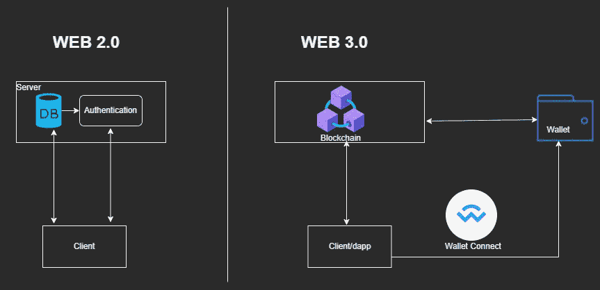

# WalletConnect v1.0 版概述

> 原文：<https://medium.com/coinmonks/walletconnect-v1-0-overview-cb0c6ac75124?source=collection_archive---------10----------------------->

本文概述了 WalletConnect，这是一种将移动钱包连接到 dApps 的协议。

Source:[https://raw.githubusercontent.com/WalletConnect/walletconnect-assets/master/png/original/walletconnect-banner.png](https://raw.githubusercontent.com/WalletConnect/walletconnect-assets/master/png/original/walletconnect-banner.png)

## **简介**

WalletConnect 是一种通过安全连接促进 dApps 和钱包之间通信的协议。WalletConnect 允许加密钱包与桌面 dApps 连接，只需扫描二维码即可建立安全连接，并发送端到端的加密消息，允许用户在不离开移动钱包的情况下签署这些消息。

Image: Web 2.0 & Web 3.0 architecture

如上所示，在 web2.0 中，认证由中央服务器使用用户名/密码进行处理，从而提供对数据库的访问，将这些映射到 web3.0 将意味着此认证通过钱包(例如元掩码)完成，dApp 和区块链作为 web3 空间中的其他组件，允许 dApp 和钱包之间的此认证/连接的协议是 WalletConnect。

## **我们为什么需要 WalletConnect？**

在 WalletConnect 推出之前或目前作为其替代产品，将任何钱包连接到 dApp 的唯一方法是使用浏览器扩展或在移动钱包中使用 dApp 浏览器。浏览器扩展最常见的例子是 metamask 扩展，它支持 Chrome、Edge 等流行的浏览器。第二种选择是嵌入钱包的 dApp 浏览器，常见的例子是 Trust Wallet 在 android Trust Wallet 应用程序中提供 dApp 浏览器。

这些选项似乎适用于各种使用情形，但仍有缺点，其中一些列举如下:

*   浏览器钱包本身不会收集任何个人信息。安装它的浏览器可以收集有关您如何使用已安装的钱包扩展的信息，即暴露浏览的数据泄漏，并进一步使用这些数据来赚钱。
*   易受攻击的浏览器或钱包将影响您的浏览器钱包扩展，导致钱包中存储的资金丢失。因此，使用浏览器钱包存储私钥和大额令牌余额是不安全的。
*   基于浏览器的钱包也容易受到网络钓鱼攻击。
*   这些浏览器扩展依赖于浏览器，也就是说，如果浏览器取消了对这些扩展的支持，用户将很难用他们的钱包访问 dApps。
*   在钱包移动应用中使用 dApp 浏览器打破了 UX。因为 dApp 不会提供与其桌面版本相同的 UX。
*   使用 dApp 浏览器将意味着钱包开发者需要付出额外的努力来构建这些浏览器，而不是专注于实际的钱包功能和安全性，从而产生开销。
*   dApp 浏览器不能添加到 iOS 钱包。在基于 iOS 的钱包中，dApp 浏览器支持被移除，以响应 iOS 提供的应用指南，从而获得 AppStore 上列出的任何应用。最近的例子是 Trust Wallet，它从钱包的 iOS 应用程序中删除了 dApp 浏览器功能，以遵守 AppStore 指南。

为了克服所有这些缺点并提供流畅的用户体验，WalletConnect 提出了一个开放协议，通过简单的 QR 码将任何移动钱包连接到基于桌面的 dApp，或者通过深度链接将任何 dApp 从移动浏览器连接到移动钱包。

## 【WalletConnect 如何工作？

简而言之，WalletConnect 协议使用桥接服务器在两个应用程序之间建立连接，桥接服务器将在连接的设备之间中继对称加密的有效载荷。协议依赖于其中一个对等方(dApp)通过显示 QR 码或深度链接来启动连接，只有当用户批准钱包上的连接请求时，才会建立连接。

*建筑*

WalletConnect 协议架构有 3 个主要组件:

1.  dApp:在区块链上提供服务的 web3 应用程序，使用客户端连接到钱包。
2.  钱包:存储私钥并负责签署有效载荷的应用程序。
3.  桥服务器:一个网络套接字服务器，负责在 dApp 和 wallet 之间转发消息。

*工作*

Image: Establishing a connection , Source:[https://docs.walletconnect.com/tech-spec](https://docs.walletconnect.com/tech-spec)

1.  dApp 发布一个加密数据，包含 peerID(dApp 的客户端 ID)和 peer meta(dApp 的元数据包括 dApp 名称、徽标和描述)。在后台，dApp 发送“pub”请求，主题= >握手主题，peerID =>dapp 客户端 ID。另外，dApp 发送主题为=>dapp 客户端 ID 的“sub”请求
2.  dApp 使用标准的 [walletconnect URI 格式](https://eips.ethereum.org/EIPS/eip-1328)来显示 QR 码，其中包括 walletconnect 协议、握手主题、版本、桥服务器 URL、对称密钥十六进制字符串。
3.  钱包将使用二维码或深层链接读取 URI。在读取 URI 之后，对等体将接收并解密连接请求有效载荷。在后台，wallet 发送主题为= >握手主题的“sub”请求，以获得加密的连接请求。钱包还向主题发送“sub”请求= >钱包客户端 ID。
4.  然后，钱包将显示一个包含 dApp 提供的连接请求详细信息的弹出窗口。然后，用户将批准或拒绝该连接。
5.  如果用户批准了连接请求，wallet 将共享帐户地址和链 id，如果拒绝，wallet 将发送适当的响应。为此，wallet 发送“pub”请求，主题=> dApp 客户端 ID，peerID=>wallet 客户端 ID 和连接响应。
6.  因此，dApp 将从桥服务器获取该数据。

> 交易新手？尝试[加密交易机器人](/coinmonks/crypto-trading-bot-c2ffce8acb2a)或[复制交易](/coinmonks/top-10-crypto-copy-trading-platforms-for-beginners-d0c37c7d698c)

一旦握手完成，双方都将这些客户端 ID(接收消息的主题)和对等体 ID(发送消息的主题)主题添加到它们的持久本地存储中。

Image: Call request , Source:[https://docs.walletconnect.com/tech-spec](https://docs.walletconnect.com/tech-spec)

1.  一旦连接建立，dApp 将发送一个加密的 JSON-RPC 调用请求到桥服务器，这将触发一个推送通知。
2.  一旦 wallet 收到通知，它将从桥服务器获取有效负载。
3.  当用户批准请求时，wallet 将签署有效负载，并将加密的有效负载发送到桥服务器。
4.  因此，dApp 接收到来自桥服务器的响应。

## **WalletConnect 在行动…**

集成 WalletConnect 的 dApp 示例可在此处找到:

*   react js:[https://github . com/vineetaparodkar/wallet _ connect _ sample . git](https://github.com/vineetaparodkar/wallet_connect_sample.git)
*   react Native CLI:[https://github . com/vineetaprodkar/wallet _ connect _ react _ Native _ CLI . git](https://github.com/vineetaparodkar/wallet_connect_react_native_cli.git)
*   反应本土博览会:[https://github.com/vineetaparodkar/wallet_connect_expo.git](https://github.com/vineetaparodkar/wallet_connect_expo.git)

## **对 WalletConnect v1.0 版的改进**

*   WalletConnect v1.0 使用直接通过 QR 码共享的对称密钥，因此不安全，因为该密钥容易受到浏览器攻击。—在 2.0 版中，通过使用 X25519 共享密钥派生的非对称密钥，此问题已得到修复。
*   WalletConnect v1.0 需要链切换才能连接到不同的链。— v2.0 提供了一项功能，其中 dApp 必须提前请求链，用户将能够从 dApp 进行控制，从而避免链切换。
*   在 WalletConnect v1.0 版中，会话生存期是无限的(直到其中一个对等体发出断开事件)，因此会导致会话停滞。— v2.0 管理这些会话，默认会话时间为 7 天，配对的默认时间线为 30 天。

在 WalletConnect v2.0 beta 中添加的其他改进和附加功能可以在 [v2.0 beta 文档](https://docs.walletconnect.com/2.0/)中找到。

## **参考文献:**

*   WalletConnect v1.0 版—[https://docs.walletconnect.com/](https://docs.walletconnect.com/)
*   WalletConnect v2.0 测试版—[https://docs.walletconnect.com/2.0/](https://docs.walletconnect.com/2.0/)

> 加入 Coinmonks [电报频道](https://t.me/coincodecap)和 [Youtube 频道](https://www.youtube.com/c/coinmonks/videos)了解加密交易和投资

# 另外，阅读

*   购买 Dogecoin 的 7 种最佳方式 | [ZebPay 评论](https://coincodecap.com/zebpay-review)
*   [最佳期货交易信号](https://coincodecap.com/futures-trading-signals) | [流动性交易回顾](https://coincodecap.com/liquid-exchange-review)
*   【Huobi 的加密交易信号 | [Swapzone 审查](/coinmonks/swapzone-review-crypto-exchange-data-aggregator-e0ad78e55ed7)
*   [最佳加密交易机器人](/coinmonks/crypto-trading-bot-c2ffce8acb2a) | [购买索拉纳](https://coincodecap.com/buy-solana) | [矩阵导出评论](https://coincodecap.com/matrixport-review)
*   [Coldcard 评论](https://coincodecap.com/coldcard-review) | [BOXtradEX 评论](https://coincodecap.com/boxtradex-review)|[uni swap 指南](https://coincodecap.com/uniswap)
*   [比特币基地评论](/coinmonks/coinbase-review-6ef4e0f56064) | [德里比特评论](/coinmonks/deribit-review-options-fees-apis-and-testnet-2ca16c4bbdb2) | [FTX 评论](/coinmonks/ftx-crypto-exchange-review-53664ac1198f)