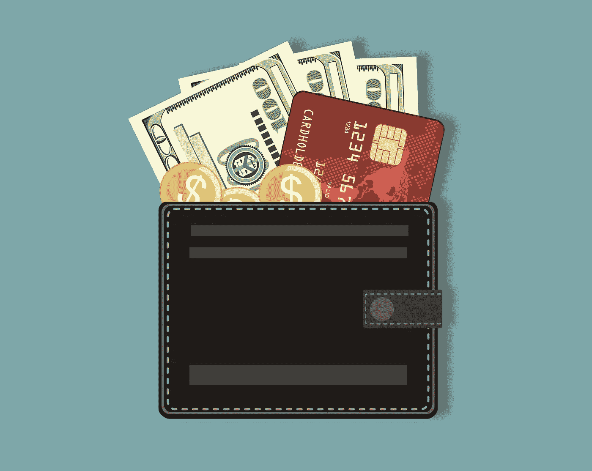

# 大多数事情都需要钱包

> 原文：<https://medium.com/coinmonks/wallets-are-required-for-most-things-2ecb31817c90?source=collection_archive---------37----------------------->

这是针对新加密用户的三部分系列的第二部分。第一篇文章，“ [*欢迎新加密用户*](/@moosechris/welcome-new-crypto-super-bowl-users-bd57be7ca250) *”，涵盖了比特币基地超级碗广告和对新加密用户有用的条款。这篇文章解释了新用户如何开始与比特币基地比特币赠品之外的其他加密工具互动。*

照片不存在银行里。

每月的银行报表和联邦存款保险公司不处理非金融资产。艺术品、护照、结婚证、出生证明等。所有重要文件都不属于传统银行的职责范围，因为它们不是金融工具。

这同样适用于比特币基地的应用程序。比特币基地的“应用”无助于一些较新的加密趋势，如艺术品、音乐版权或被称为“不可替代令牌”的数字文档。

> 一个不可替代的令牌(NFT)是一个复杂的说法“独特的东西”。一美元钞票是可替代的，因为任何其他美元钞票都是一样的。一件艺术品是不可替代的，因为它是独一无二的。没有人会拿蒙娜丽莎换蜡笔画。仅仅因为两者都是“艺术”并不意味着两者是“相同的”。

拥有 NFT 的需要一个钱包，在那里可以持有所有权的证明，而不是比特币基地的申请。这是因为比特币基地的应用程序是一个托管工具，提供的功能类似于前一篇文章中提到的银行。持有数字资产需要一个钱包，而不是比特币基地应用程序，为了理解这一点，想象一下汽车的标题。

汽车所有权是证明谁拥有一辆汽车的文件，并保存在某个安全的地方，如保险箱。当汽车被出售时，将所有权从保险箱中取出并转让给买主的行为正式确立了新车主的身份。

NFT 和数字钱包的工作原理是一样的。

一件数字艺术品不会放在某人的钱包里，就像汽车不会放在某人的保险箱里一样。相反，数字艺术有一把私人钥匙，一个类似于汽车所有权的文件，控制这把钥匙的能力就是所有权的证明。

> 如果两个人都声称自己拥有一辆车，那么解决争端就很容易了——谁拥有所有权？确定谁拥有一把 NFT 是相似的，拥有者就是控制钥匙的人。

如果一件艺术品被出售，钥匙就像汽车的所有权一样被转让。新主人在他们的钱包里拿着钥匙，可以证明所有权，因为他们可以证明他们有钥匙。

这就是为什么访问钱包如此重要，谁控制了钱包，谁就控制了钱包中的所有资产以及移动资产的能力。

就像丢失保险箱的密码就意味着无法访问其中保存的重要文件一样，无法访问钱包就意味着无法访问钱包内的钥匙。没有数字资产的密钥，证明所有权的能力也就消失了。

这就引出了我们系列的最后一篇文章— [安全和如何不丢失东西](/@moosechris/security-and-how-not-to-lose-things-fa2d4917674f)。

> 加入 Coinmonks [电报频道](https://t.me/coincodecap)和 [Youtube 频道](https://www.youtube.com/c/coinmonks/videos)了解加密交易和投资

# 另外，阅读

*   [霍比审核](https://coincodecap.com/huobi-review) | [OKEx 保证金交易](https://coincodecap.com/okex-margin-trading) | [期货交易](https://coincodecap.com/futures-trading)
*   [麻雀交换评论](https://coincodecap.com/sparrow-exchange-review) | [纳什交换评论](https://coincodecap.com/nash-exchange-review)
*   最好的[加密税务软件](/coinmonks/best-crypto-tax-tool-for-my-money-72d4b430816b) | [CoinTracking 评论](/coinmonks/cointracking-review-a-reliable-cryptocurrency-tax-software-5114e3eb5737)
*   [Stackedinvest 评论](https://coincodecap.com/stackedinvest-review) | [北海巨妖评论](/coinmonks/kraken-review-6165fc1056ac) | [bitFlyer 评论](https://coincodecap.com/bitflyer-review)
*   最佳[加密借贷平台](/coinmonks/top-5-crypto-lending-platforms-in-2020-that-you-need-to-know-a1b675cec3fa) | [杠杆代币](/coinmonks/leveraged-token-3f5257808b22)
*   最佳[加密制图工具](/coinmonks/what-are-the-best-charting-platforms-for-cryptocurrency-trading-85aade584d80) | [最佳加密交易所](/coinmonks/crypto-exchange-dd2f9d6f3769)
*   [比斯勒评论](https://coincodecap.com/bitsler-review)|[WazirX vs coin switch vs coin dcx](https://coincodecap.com/wazirx-vs-coinswitch-vs-coindcx)
*   [7 大副本交易平台](https://coincodecap.com/copy-trading-platforms) | [买币点评](https://coincodecap.com/buycoins-review)
*   [MyConstant 点评](https://coincodecap.com/myconstant-review) | [8 款最佳摇摆交易机器人](https://coincodecap.com/best-swing-trading-bots)