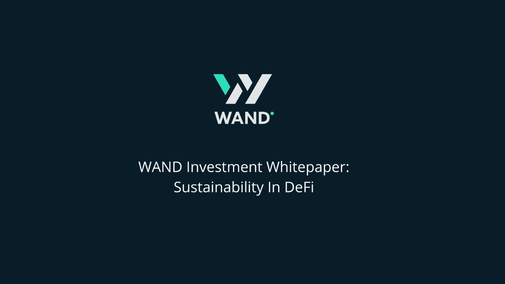

# WAND Investments ELI5 白皮书:在 DeFi 中协调安全性、可持续性和回报

> 原文：<https://medium.com/coinmonks/wand-investments-eli5-whitepaper-reconciling-safety-sustainability-and-rewards-in-defi-f10c28c641a0?source=collection_archive---------4----------------------->

什么是魔杖投资？

我们的使命是为所有投资者创造可持续的、低风险的中等回报。我们将通过精心设计的令牌组学来实现这一目标，使用由团队和社区管理的三个令牌和三个独立的金库。

**令牌组学——一个三令牌系统**

我们的创新系统使用三个独立的令牌——权杖、指挥棒和魔杖。每种代币都有不同的效用和回报结构，这让投资者可以更好地控制他们的投资策略和如何产生收入。

为了更好地理解 WAND 协议的工作原理，让我们更深入地了解一下每个令牌:

**权杖——不断增长的象征**

一切从这里开始！

一个新的投资者从魔杖协议中购买权杖代币。权杖令牌的成本会比底价(底价)高一点。这是确保底价随着时间稳步上升的第一个机制。当投资者想卖掉他们的权杖时，这个方法非常有效！

铸造权杖令牌时，会发生两件非常重要的事情:

95%的销售资金进入了权杖国库(稍后会有更多)

一个魔杖令牌被铸造。下面你会学到更多关于 WAND 的知识。

权杖国库持有出售权杖代币的资金，这些资金用于低风险投资。这些投资收入的 66%被再投资到国库——这形成了第二个机制，确保支持价格上涨的权杖。其余 33%的收入被送往指挥棒财政部。你将了解下面的指挥棒财政部。

既然我们已经了解了权杖令牌的价值如何随着时间的推移而增加，投资者现在有两个选择:

以略低于底价的价格将他们的权杖卖回给协议，同时仍有利润。这就形成了进一步提高权杖底价的第三种机制的基础。

永久交换(焚烧)他们的权杖，作为回报，获得权杖令牌

请注意，如果投资者选择回售给协议，有 10 天的等待期，以收到 USDC 形式的收入。这是为了给协议时间来收回支持权杖的资金。

因此，让我们回顾一下权杖价格升值背后的主要机制:投资者在支持价值以上买入，投资者在支持价值以下卖出，以及国债投资的回报。还有第四种机制:资金从风险国库(如下所述)流入权杖国库。

如果投资者选择燃烧他们的权杖，那么他们会收到我们的下一个令牌——指挥棒。

**指挥棒——反射令牌**

投资者只能通过燃烧权杖令牌来获得权杖令牌。接力棒令牌是为长期持有者设计的，因为它为投资者创造了可持续的被动收入。它得到了我们的第二个财政部——指挥棒财政部的支持。

指挥棒国库的资金来源有三个:投资者燃烧权杖代币以获得指挥棒代币，权杖国库的 33%奖励和风险国库的 33%奖励，我们将在下面描述。指挥棒财政部用于中低风险投资。这些投资收入的 45%被空投到 USDC 的指挥棒持有者手中，另外 45%被再投资到指挥棒国库。

如果投资者希望退出协议，他们可以将他们的接力棒令牌卖回给协议，但价格会很低，因此不建议这样做，除非投资者需要快速现金。

**WAND——我们创新的资金助推器**

魔杖是我们的第三个也是最后一个象征。投资者不能持有魔杖，因为它只供协议使用。这只是“幕后”。

你可能还记得，每次铸造权杖令牌时，也会铸造魔杖令牌。权杖令牌的数量总是与权杖令牌的数量相同，并且它们的价值也总是相同。

那么魔杖是干什么用的呢？该协议使用魔杖令牌作为抵押品，在借贷平台上进行借贷。它允许协议以 10%至 15%的年利率借入稳定资本，然后可以投资获得 20%至 50%的收入，为协议创造额外收入。

该协议获得的收入随后被用于提高权杖国库，从而使整个协议受益。实际上，魔杖代币通过支持权杖价格升值和增加每周 USDC 空投给权杖持有者的价值来帮助我们。

**风险金库**

最后，还有第三个金库——风险金库。这个国债中持有的资金被用于风险更高、更深入的投资，这些投资不一定会拿投资者的代币价值冒险，因为国债是分开的。

来自这个国库的奖励将被用来支持和促进权杖和指挥棒国库。

**社区参与**

WAND Investments 是一个以社区为中心的协议，在这个协议中，社区可以做出积极的贡献。这可以通过参与管理委员会、寻找成功的投资机会、对机构群体决策进行投票或仅仅通过保持活跃和推广协议来实现。

被选入管理委员会和/或为 WAND 带来丰硕投资机会的投资者将在 USDC 获得奖励，并因其贡献获得声誉标志。

在 WAND，任何形式的帮助都会得到回报。

**结论**

不再有兰博基尼、月亮或泵&转储——是时候用一种成熟、可持续和现实的方法来处理 DeFi 了。随着令牌和协议的持续增长，您可以将令牌放几个月，然后回来，确保您的投资增值。我们的模型可以持续数年，模拟显示了它在熊市和牛市中的可持续性。

我们的定位是低风险(类似于 stablecoins 赌注)，中等回报(综合我们安全投资的收益 SCEPTER 的增长机制+风险金库)，安全第一(KYC + doxxing + multisig +启动前审计)，社区驱动和以可持续发展为中心的方法。

我们是棒的，我们将持续成功！

瓦格米死了，SGMI 万岁！

> 加入 Coinmonks [电报频道](https://t.me/coincodecap)和 [Youtube 频道](https://www.youtube.com/c/coinmonks/videos)了解加密交易和投资

# 另外，阅读

*   [折叠 App 审核](https://coincodecap.com/fold-app-review) | [Kucoin 交易机器人](/coinmonks/kucoin-trading-bot-automate-your-trades-8cf0ca2138e0) | [Probit 审核](https://coincodecap.com/probit-review)
*   [如何匿名购买比特币](https://coincodecap.com/buy-bitcoin-anonymously) | [比特币现金钱包](https://coincodecap.com/bitcoin-cash-wallets)
*   [币安 vs FTX](https://coincodecap.com/binance-vs-ftx) | [最佳(SOL)索拉纳钱包](https://coincodecap.com/solana-wallets)
*   [比诺莫评论](https://coincodecap.com/binomo-review) | [斯多葛派 vs 3Commas vs TradeSanta](https://coincodecap.com/stoic-vs-3commas-vs-tradesanta)
*   [Capital.com 评论](https://coincodecap.com/capital-com-review) | [香港的加密借贷平台](https://coincodecap.com/crypto-lending-hong-kong)
*   [如何在 Uniswap 上交换加密？](https://coincodecap.com/swap-crypto-on-uniswap) | [A-Ads 评论](https://coincodecap.com/a-ads-review)