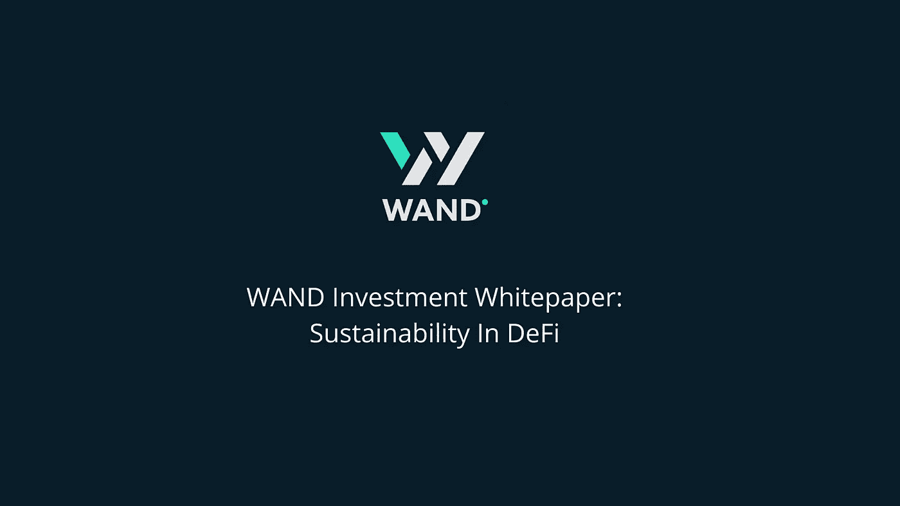
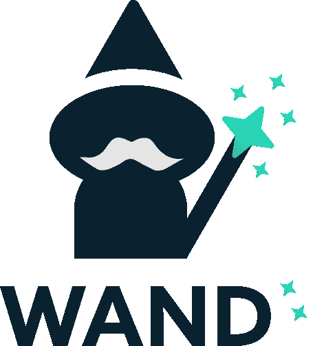
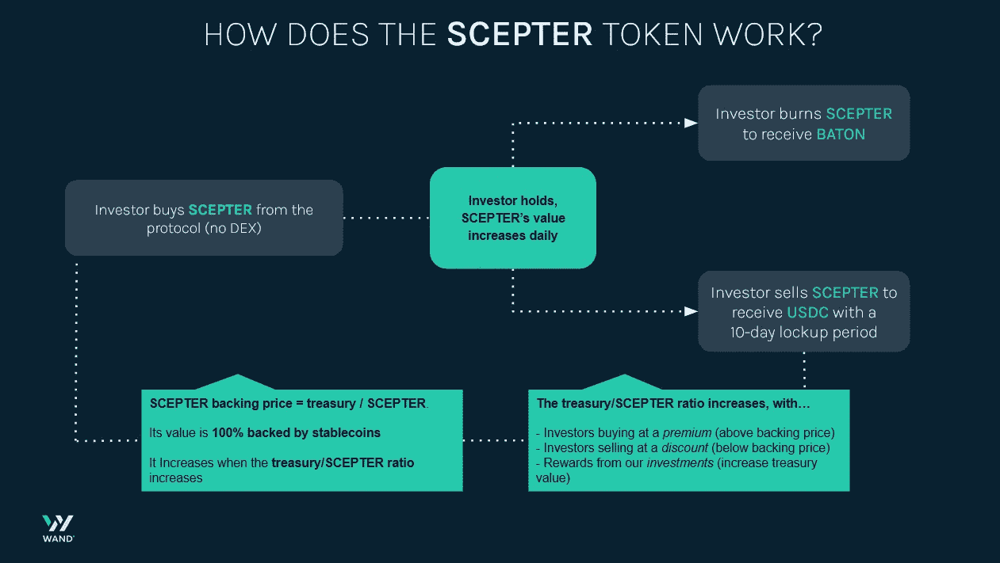
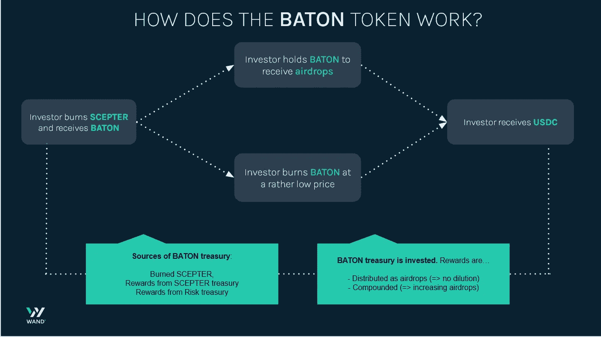
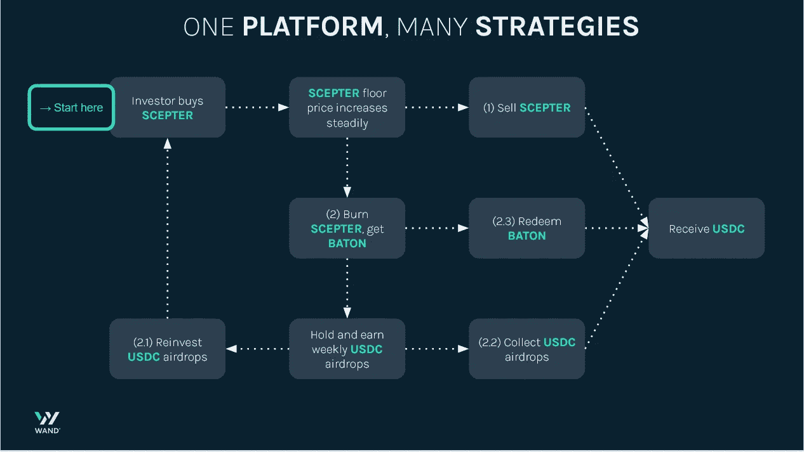
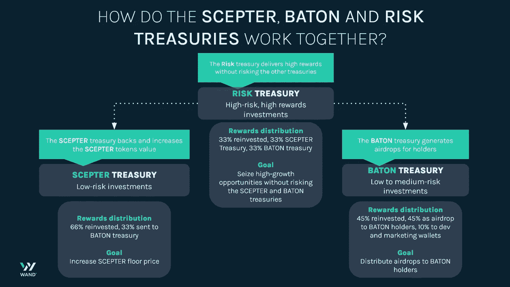
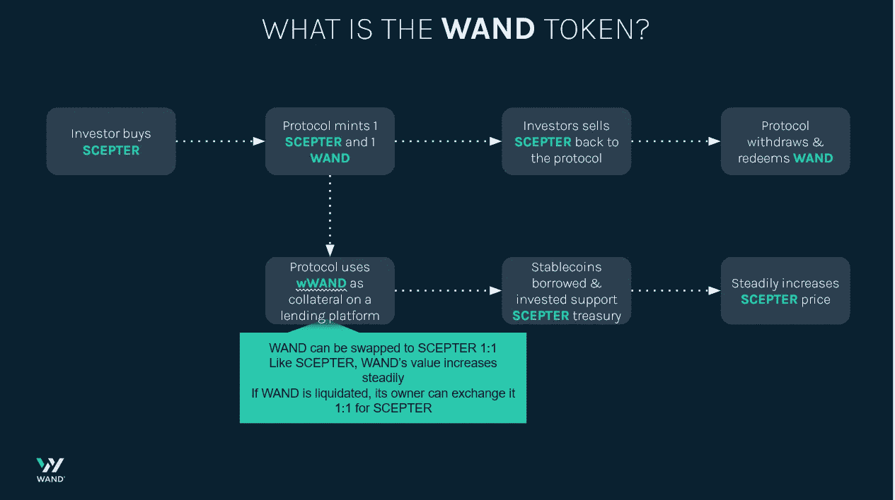
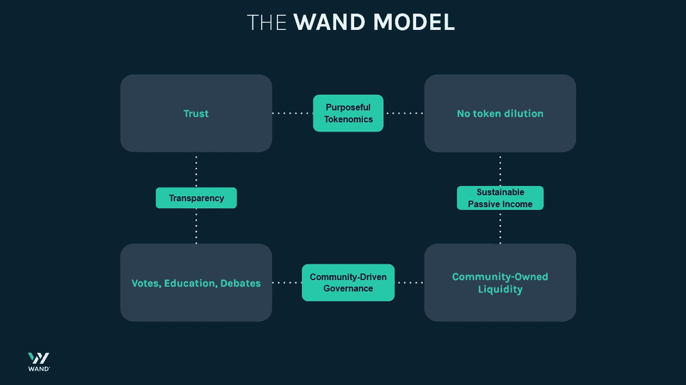
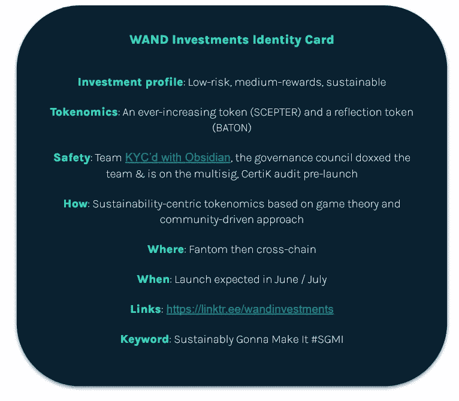

# 魔杖投资白皮书:不断增长的令牌

> 原文：<https://medium.com/coinmonks/wand-investments-whitepaper-reconciling-safety-sustainability-and-rewards-in-defi-ba20d96213?source=collection_archive---------0----------------------->

Version 5 — April 9, 2022

我们的使命是为所有投资者创造可持续的、低风险的中等回报。我们将通过一个只会增值的代币(权杖)、被动 USDC 空投的第二个代币(指挥棒)以及使用由团队和社区管理的差异化金库来实现这一目标。

# **简介:DeFi 中对可持续性和透明度的需求**

在分散融资(DeFi)领域，大多数成立超过一个月的平台都遵循相同的模式:项目启动，代币泵，摇摆交易者和早期采用者抛售代币，持有者已经处于亏损状态。

在 DeFi 挣很多钱是可能的。但这需要时间、技巧和运气。**我们正在创建一个新的、以可持续发展为中心的项目**，在这个项目中，运气是不必要的，一切都是为了让持有人受益，无论是牛市还是熊市。

# **庞兹经济学的替代方案**

WAND 被设计成一个**低风险投资平台**，参与协议的投资者和退出协议的投资者都对持有代币的投资者有利(即使一条鲸鱼退出协议，价格也不会下跌，实际上还会上涨！).

权杖令牌价格不是根据需求和报价来计算的，而是用一个非常简单的方法:**权杖价格=权杖国库的价值除以流通的令牌总数**。我们使用税收的方式确保了国库的增长总是比代币的数量成比例地多，**因此权杖的价格总是会上涨**。

指挥棒令牌根据第二个财政部，指挥棒财政部的表现进行空投。假设市场稳定或绿色，巴吞空投每周将收到**数量增加的 USDC 空投。**

听起来好得难以置信？也许吧。继续读下去，形成你自己的观点。

*Meet our mascot, MoneyWiz. This wizard has some good news for you!*

我们意识到每个人投资的原因都不一样。有些人想投资一个项目，比如买车或买房。其他人想补充他们的收入。还有一些人想实现财务自由。这就是为什么我们设计了一个**双令牌模型，权杖和指挥棒**。

# 权杖:基于经济而非庞氏经济学的不断增长的象征

权杖只能从协议中购买或出售。用来购买权杖的权杖金币将成为支持令牌的权杖库。由于价格是根据国库的大小和权杖令牌的总数计算的，除非稳定的权杖变得不稳定，否则价格不会下降。如果我们投资的协议(如 Anchor)遭到黑客攻击，这个数字也会下降

为了确保 [**不断增长的价格下限**](/coinmonks/why-the-scepter-token-is-safe-and-has-an-ever-increasing-value-6166af085314) ，财政部的增长需要与代币的数量成比例，否则价格会一直保持不变。这就是我们实施**多重增长机制**的原因。

第一个价格增值机制是**区分权杖支持价格与权杖购买价格和权杖出售价格**(类似于其他协议中的税收的机制)。

*   **买入价**永远高于支持价。这样，当投资者从协议中购买 SCEPTER 时，他们投入国库的资金比他们从 SCEPTER 中得到的多，**增加了国库/SCEPTER 比率**，因此增加了支持价格。
*   同理，**卖价**永远低于底价。因此，当投资者决定回售给协议时，他们将取回低于他们出售的权杖比例的一部分国债，并再次**增加国债/权杖比例，从而提高支持价格**。价格计算在白皮书的后面部分。

第二个增长机制是**差异化国债**。有三种国债:权杖国债、指挥棒国债和风险国债。我们稍后将解释指挥棒国债，现在让我们把注意力集中在权杖和风险国债上。

*   众所周知,**权杖国库**是由投资者买卖权杖来融资的。但是，财政部也将投资于低风险投资(稳定的农业)以增加国库的增长。
*   风险财政部与权杖财政部分离，并已通过预启动种子轮融资。它将被投资于高风险投资，部分回报将被转移到 SCEPTER treasury ，再次促进其增长。这样，在没有新的权杖进入流通的情况下，权杖国债保持增长，国债/权杖比率增加，支持价格上升。

第三个成长机制是**权杖燃烧**。当投资者将权杖烧成铸币棒时，权杖支持价值的 10%留在权杖国库中。这再次提高了国债/权杖比率，从而提高了支持价格。

此外，有一个 10 天的锁定期的人谁想要出售他们的权杖的协议。每天 10%的税可以减少这一时间。这是必要的，因为国库投资，我们需要撤回投资，以支付给投资者。

> 让我们回顾一下。每个权杖 100%由权杖库的稳定硬币支持。权杖的价格围绕着每权杖代币的底价。每一个可以增加每一个权杖令牌数量的国库比例的事件，都会增加每一个权杖令牌的价值。这包括:投资权杖金库的回报、溢价购买权杖代币的投资者、折价出售权杖代币的投资者、将权杖烧成铸币棒的投资者、从风险转移到权杖金库。

SCEPTER, the ever-increasing token

现在是时候解释我们的第二个令牌，接力棒。

# **接力棒:传送递增 USDC 奖励的反射令牌**

指挥棒是**的反射令牌**。燃烧权杖可以获得权杖。当持有接力棒时，**投资者将收到接力棒国库**产生的每周 USDC 空投。空投可以索赔，也可以复合。很简单，不是吗？

指挥棒财政部有两个来源:

*   当投资者燃烧权杖时， **90%来自权杖国库的稳定收入**最初支持被燃烧的权杖，**被转移到权杖国库**。
*   指挥棒财政部也部分由风险财政部资助。33%的回报从风险财政部转移到指挥棒财政部。

要知道一旦烧了权杖收了接力棒，就不能逆转交易了。有可能**以权杖底价的 30%赎回权杖**，(上限为权杖底价的 1/2)，但权杖是为长期持有而设计的。

BATON, the reflection token

> 让我们来回顾一下:一个投资者燃烧他的权杖来得到指挥棒，他将每周在 USDC 收到空投。因为空投是由国库投资产生的，没有象征性的稀释，空投不会随着时间的推移而减少。由于部分国债是复合的，在市场条件不完全乐观的情况下，每根指挥棒的空投将会增加！

# **WAND Investments:两个代币，投资者的几种策略**

在下面的信息图中，你可以看到可供投资者选择的不同策略。**从图表的左上方开始读取，并按照箭头**进行操作。每个数字代表了投资者赚取 USDC 或复合收益的一种可能策略。

**这一切都始于购买 SCEPTER** (不断增长的象征:由于多种增长机制，其价格旨在保持增长，因为它 100%由 stablecoins 支持，所以不会下降)。然后，投资者可以出售获利(1)或燃烧接收接力棒，USDC 空投令牌(2)。然后，接力棒持有者可以复合奖励(2.1)，以 USDC 的形式收集奖励(2.2)或赎回接力棒(2.3)。我们的两个令牌权杖和指挥棒有无限的供应。

*WAND: two tokens, four investment strategies.*

你现在对权杖和指挥棒背后的动力有了理解。为了增加细节，我们现在将解释它背后的数学原理。如果您对此不感兴趣，请直接跳到“安全:我们对更好 DeFi 的承诺”部分。

# **权杖的三种价格**

我们选择不在交易所(DEX 或 CEX)交易 SCEPTER，因为它将受到自由市场价格波动的影响，这种情况太常见了。相反，我们正在创造**一种价值稳步上升的象征物**，这样所有投资者都可以确信他们的资产价值会随着时间的推移而升值。

如前所述，权杖价格不是由市场决定的，而是由我们的协议(主合同)决定的。**价格是围绕支持价格**计算的，并且取决于支持每个权杖令牌的稳定金币数量。

实际上，**买入价>支持价>卖出价**。结果是，当投资者购买或出售权杖代币时，国库/权杖代币数量比率增加，因此**当投资者购买或出售权杖代币时，权杖支持价格增加**。先说底价。

## 权杖底价:一直在涨

要计算支持价格，您需要将整个权杖国库价值除以流通中的权杖代币数量。公式如下:

> 权杖底价=权杖国库价值/流通中的权杖代币数量

*我们来举个例子。如果国库价值 10K 元，有 100 权杖代币，那么我们有:权杖支持价格= 100 美元。*

现在你明白底价是如何运作的了。还有另外两个价格需要理解:买入价格和卖出价格。

## 权杖购买价格:购买时提高权杖价格

投资者溢价购买权杖代币:**每个权杖代币都以高于其支持价格的价格购买**。买价是这样计算的:

> 权杖买入价=支持价格* (1.2 +增长系数)

投资者总是以支持价格的 120%或以上购买权杖代币。然后我们把生长因子加进去。它是这样计算的:

> 增长系数= 2*(过去 5 天内购买的令牌数/5 天前存在的令牌总数)，上限为 0.3

基于最近购买的权杖代币的数量相对于流通中的权杖代币的数量来计算增长因子。从本质上来说，**当对权杖的需求很高时，增长因子增加，当需求较低时，增长因子减少**。权杖买入价是动态的，目的是让持有者受益，同时保持对想要购买权杖的投资者有吸引力的价格。

让我们以最后一个例子为例(国库中 10K 币的支持价格为 100 美元，100 个代币)，为简单起见，假设增长因子= 0。如果投资者购买 100 枚权杖代币，他将以每枚代币 120 美元(100 美元 x 1.2)的溢价购买。权杖底价现在是 22K$/200 = 110$。不出所料，投资者购买时，权杖支持价格会上涨。

## 权杖出售价格:出售时也增加权杖价格

投资者**以低于支持价格**的价格向协议出售他们的权杖。销售价格是这样计算的:

> 权杖卖价=支持价格*(0.90-卖出系数)

该协议将总是以支持价格的 90%或更低的价格买回权杖令牌。然后减去卖出因子，得到卖出价格。它是这样计算的:

> 销售系数= 2 *(过去 5 天销售的令牌数/5 天前现有的令牌总数)，上限为 0.3。

**卖出因子与增长因子**相反。当有更多的投资者卖出时，它增加，当有更少的投资者卖出时，它减少。

让我们继续我们的例子。如果投资者出售 100 个权杖，他以每令牌 99 美元的折扣出售(110 美元 x 0,9)。我们现在有 200–100 = 100 个代币。权杖底价现在是 12，1K$/100 = 121$。正如我们所看到的，当投资者出售权杖时，它的价格会上升。

## **权杖的动态定价让持有者受益**

**依赖于环境的增长和销售因素将允许 SCEPTER 的动态定价**。这将激励人们在购买量很少的时候购买(从而支持一段时间内稳定的购买量)，并防止人们立即出售(从而防止泵&倾销模式)。

如果你计算一下，你会发现权杖的卖出价格比它所代表的国债份额要低，而权杖的买入价格比它所代表的国债份额要高。**投资者溢价买入权杖，折价卖出。这个价格差距保证了权杖会有一个不断上涨的价格**(包括投资者出售其权杖代币的时候)**并惠及中长线投资者**。

# **接力棒:长期被动收入令牌**

指挥棒是反射令牌。我们创新的国库和指挥棒的性质——燃烧的权杖——使它真正独一无二。它为希望获得可持续和被动收入来源的投资者提供了一个选择。**每根警棍空投的代币数量(以稳定硬币的形式)预计会随着时间的推移而增加**。

可以通过燃烧权杖获得权杖，并通过以下方式卖回给协议:

> 权杖赎回价格=权杖底价的 30%，上限为权杖底价的 1/2

并且:

> 警棍面值=警棍国库价值/流通中的警棍代币数量

这个公式意味着**当投资者赎回他们的指挥棒时，他们将获得其指挥棒国库份额的 30%**,每赎回一根指挥棒可获得 1/2 权杖。

我们认为把接力棒卖回给协议对持有者来说不是最优选择；然而，我们希望提供脱离协议的可能性，或者在投资者需要时有一个直接的收入来源。指挥棒的赎回价格低于权杖的销售价格，以防止投资者滥用协议，购买和燃烧权杖，然后赎回指挥棒，并在循环运动中再次购买权杖。

**来自警棍金库的奖励是这样分配的** : 45%是复利(随着时间的推移增加空投价值)，45%用于向警棍持有者分发空投物资，10%发送给 dev wallet。

# 选择你的投资策略

这两个令牌是同一个协议的一部分，它们紧密相连。当投资者燃烧权杖以获得权杖时，10%的权杖支持留在权杖国库中，从而使权杖持有者受益。因为权杖的价格上涨，每一根新铸造的权杖都会有更高的支持价值。这意味着指挥棒持有者的收入将随着时间的推移而增加，而不会牺牲可持续性。这两个令牌相互受益。

现在，作为一名投资者，你可能会想:**权杖和指挥棒**哪个对我更好？我们认为每个投资者都应该自己回答这个问题。我们已经创建了一个 [**开放式模拟器**](/@WAND-Investments/guide-how-to-use-the-wand-simulator-3db8eb1f4104) 到来运行您自己的关于协议财务性能的模拟。

# 三级国库模式

财政部分为三部分:以权杖和指挥棒为中心的财政部以及致力于高风险投资的风险财政部。他们的收入来源和报酬分配是不同的。

权杖国债只用于低风险投资，因为它的价值支持权杖代币的价格。**其价值的 100%在稳定状态**。它的投资产生了微薄的收入，但是权杖代币的大部分增长将来自溢价购买，折价出售和风险国库的回报。

我们的**BATTON treasury 旨在壮大**。我们将大部分资金分配给安全投资(如稳定投资者 LPs、稳定投资者 LPs 和本地网络令牌 LPs 等)，因为**我们希望它在牛市和熊市中成长，就像**一样。我们将把一小部分投资分配给中等风险投资(包括具有自动再平衡功能的蓝筹股，以超越市场表现，并在早期阶段进入其他有希望的协议)，这样我们就不会错过持有人的良机。

**风险库将在两者之上**进行更高风险的投资，而不冒投资者象征性价值的风险，**支持我们高回报的理念，同时保持低风险的形象**。这是我们练习日间交易、提前进入、私人销售等的地方。

我们的目标是**将稳定加入和本地网络令牌的安全性与高风险投资提供的高收益相结合**。我们通过**将更安全和高风险的国债**分开来实现这一点。最终，我们希望以低得多的风险提供远高于投资稳定所能提供的收益率。

The WAND treasury model

# **魔杖:我们创新的国债助推器**

但是等等——还有第三个记号**！WAND 令牌是我们协议的另一个创新方面，在幕后**工作**。这就是为什么每次铸造一个权杖令牌时，它的未铸造版本也会被铸造出来:**魔杖**。权杖:魔杖的价值是 1:1，因为权杖的价值只会增加，所以魔杖是用作抵押品的完美象征。**

WAND token 是协议使用的 [**作为抵押品，它将以 10-15%的年费借入稳定的债券**](/@WAND-Investments/wand-token-benefits-and-risks-an-overview-30acc5de6c0e) ，并将其投资于提供 20-50% APR 的低风险策略。两个 apr 之间的差额将是净差额，这将有利于持有人。万一魔杖被清算，它的新主人可能会以 1:1 的价格换成权杖。互换的可能性确保了 WAND 具有货币价值。

wWAND: our secret treasury booster

# **安全性:我们对更好 DeFi 的承诺**

我们将巧妙地执行**保守管理策略**，使 WAND Investments 成为权杖持有人和权杖持有人的低风险投资场所。我们的方案是**要持续数年**而不是数天。我们将继续增加我们的财富和您的代币价值。

这个团队是由[**【KYC】**](https://twitter.com/ObsidianCouncil/status/1508823757892329485)**doxed**到[四位成员选举产生的治理委员会](/coinmonks/what-does-community-driven-mean-cf3ad7523110)和一个 **multisig** 已经实施。售前前将完成 CertiK 的**审计**。任何能够直接访问国库和/或代码的人在获得此类访问权限之前都将被 KYC 和 doxxed。

# **你的钱，你的选择:社区驱动的治理**

WAND Investments 通过财政部积极管理投资者的资金。因此，毫无疑问，**投资者在投资选择、路线图和团队工作上有很大的发言权**。我们期待就这些不同的主题进行定期讨论、辩论和投票。

为了组织这次活动，社区选出了一个由四名社区成员组成的治理委员会。治理委员会是 multisig 的一部分，提出建议，激发辩论，并帮助以可投票表决的形式制定投资者的建议；他们将在投资者和团队之间双向传递信息。除非时间敏感，否则治理委员会不做决策；他们更接近主持人，他们的声音将有助于形成辩论和叙述。

此外，**我们的投票机制将是公平的**:它不会是一个权杖或一票，因为历史已经表明，这样的机制可以让少数鲸鱼拥有该协议。也不会是一个钱包=一张选票，因为有更多利害关系的人应该在我们的决策中有更大的发言权。我们给了大投资者更多的投票权，而没有减少小投资者的发言权。确切的投票公式和比例将由机构群体决定。

The WAND model

# **供贡献者使用的公用事业 NFTs**

发布前的贡献者将获得白名单奖励。启动后，两类**贡献者将通过公用事业 NFTs 获得持续帮助的奖励:治理委员会成员和投资机会猎人**。治理委员会将获得一个治理 NFT，这将为他们赢得一定数量的 USDC，这将与社区商定。

帮助 WAND 寻找高价值投资(尤其是风险国债)的投资者将获得一个 NFT。赏金猎人的 NFT 将会给他们权利来分享他们帮助 WAND 获得的利益。同样，确切的模式将由机构群体决定。要决定的参数包括每个 NFT 的寿命、它赋予的赚取权利的份额大小、将创建的 NFT 层级等。

WAND 是一个社区驱动的项目，奖励帮助它发光的社区成员。每个人都是赢家，从受益于主动贡献的被动收入者到因其帮助而获得额外利益的贡献者。

# **结论:可持续发展(SGMI)**

DeFi 是一个奇妙的创新，提供了如此多的可能性。无数的项目已经启动，包括许多结果可变的分叉。最近，许多公司都在推销月球，并出现了净亏损。虽然有足够的时间、资金和培训的投资者可以获得巨额利润，但也有可能损失惨重。很多欧姆叉的投资者都吃过这个亏。

这就是我们的切入点。**我们提供一个管理良好的国库和一个为稳定和可持续的代币价格升值而设计的协议**。在魔杖，一切都是为了增加权杖的价值和对指挥棒持有者的空投。根据社区的决定，将开发更多的公用事业，以创造新的收入来源，并使我们的投资者的生活更轻松。因为魔杖模型是独一无二的，而 SCEPTER 的风险较低，但价格不断上涨，所以它是围绕透明、安全和健康回报的价值观构建的全新生态系统的第一块石头。

**我们把** **改成**。不再有兰博士，月亮或泵&转储。现在是代币真正增值的时候了，你可以把代币放几个星期，回来后确保你的投资增值。

**我们将持续发展。**

瓦格米死了，SGMI 万岁！

*备注:*

1.为了尊重机构群体的决定，一些数字或描述可能会有所变化。WAND 将是一个不断发展的模型，这里所写的只有在写作时才是准确的。

2.财资模型中的数字可能会发生变化，以考虑到有关公用事业 NFTs 的决策

> 加入 Coinmonks [电报频道](https://t.me/coincodecap)和 [Youtube 频道](https://www.youtube.com/c/coinmonks/videos)了解加密交易和投资

# 另外，阅读

*   [MyConstant Review](https://coincodecap.com/myconstant-review) | [8 款最佳摇摆交易机器人](https://coincodecap.com/best-swing-trading-bots)
*   [Godex.io 审核](/coinmonks/godex-io-review-7366086519fb) | [邀请审核](/coinmonks/invity-review-70f3030c0502) | [BitForex 审核](https://coincodecap.com/bitforex-review)
*   [10 本关于加密的最佳书籍](https://coincodecap.com/best-crypto-books) | [英国 5 个最佳加密机器人](https://coincodecap.com/uk-trading-bots)
*   [ko only Review](https://coincodecap.com/koinly-review)|[Binaryx Review](https://coincodecap.com/binaryx-review)|[Hodlnaut vs CakeDefi](https://coincodecap.com/hodlnaut-vs-cakedefi-vs-celsius)
*   [MoonXBT vs Bybit vs 币安](https://coincodecap.com/bybit-binance-moonxbt) | [硬件钱包](/coinmonks/hardware-wallets-dfa1211730c6)
*   [火币交易 Bot](https://coincodecap.com/huobi-trading-bot) | [如何购买 ADA](https://coincodecap.com/buy-ada-cardano) | [Geco？一次回顾](https://coincodecap.com/geco-one-review)