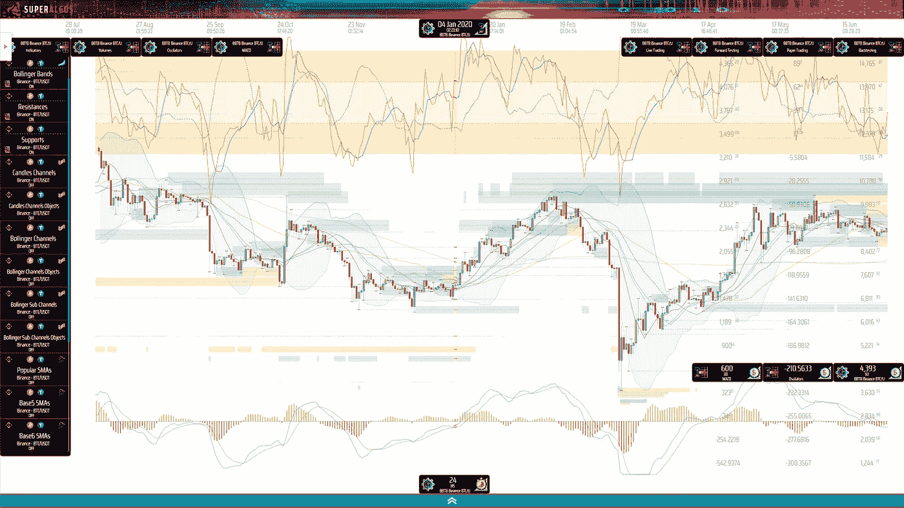

# 想帮忙预测下一个比特币蜡烛吗？加入我们的众包机器学习建模工作！

> 原文：<https://medium.com/coinmonks/wanna-help-forecast-the-next-bitcoin-candle-de4e560b182a?source=collection_archive---------15----------------------->

## 加密交易和机器学习

## 贡献一些计算能力，并通过使用开源软件预测顶级加密货币获得奖励！

Photo by Kanchanara on Unsplash

如果你和我一样，你可能幻想过用 ML 来破解密码市场。好家伙，听起来真棒！

能够在一定程度上预测价格是上涨还是下跌，以及大致的波动范围肯定会让你比其他人更有优势！

如果你不是机器学习专家，这种探索可能遥不可及，除非你愿意花几年时间学习关于 ML 和现有财务实现的一切。当然，除非您希望加入我们的开源社区！

> 在这种情况下，你需要的只是一些基本的技术能力来运行 Superalgos，我们的开源加密交易自动化平台，并为集体努力贡献一些 CPU/GPU 周期！

现在，如果你对 ML 有深入的了解，并且有金融实施的经验，或者甚至有市场预测的经验，你可能已经遇到了一些严重的障碍。主要障碍是训练机器学习模型是一个极其密集的计算过程。整个范式是建立在处理大量数据的基础上的。

如果你真的想破解代码，你可能需要投资一个工业级数据中心来提供所需的计算资源。

> 或者，您可能想加入我们的团队，贡献您的专业知识，并利用我们的集体计算资源来帮助训练新模型！

这样想吧…

您需要测试定义模型架构和数据形状的参数的所有可能组合，每个组合都有一个可能的值范围，并且您需要针对您希望处理的每个市场和时间范围测试它们。您不知道哪些数据集与做出预测最相关，因此您需要生成并测试一批数据集。现在补充一下，市场一直在发展和变化，这意味着即使你为今天的预测找到了完美的参数集，这个模型最终也会过时！

对所有可能的组合进行持续的、永无止境的强力测试是众包工作的完美候选，因为没有人能够独自运行所有需要的测试，除非他们愿意进行大量投资来建立和运行重要的数据处理设施。

现在花一分钟思考一下反向逻辑！

> 没有人能与分布式的、不断增长的众包工作相竞争，这就是你想要加入的原因！

# 这就是它的工作方式

你将加入一个 algo 交易者社区，建立最强大的开源加密市场研究和交易自动化平台。

> Superalgos 是 Github 上[交易](https://github.com/search?q=trading)和[交易机器人](https://github.com/search?q=trading+bots)搜索的热门项目之一，有数万次下载。这也是第一次在[加密交易](https://github.com/topics/crypto-trading)和[加密交易策略](https://github.com/topics/crypto-trading-strategies)的主题！

自己去看看吧！

Superalgos Platform integrated Charting System

如果您希望了解更多关于该系统的信息，请查看网站上的 [Superalgos 平台](https://superalgos.org/crypto-trading-bots-platform.shtml)页面。此外，如果你想在安装前试用一下系统，网站上也有有限的在线演示。

*ML 测试客户端*从 Superalgos 平台内部运行，并连接到由社区成员运行的远程 *ML 测试服务器*。服务器管理测试用例，并将它们分发给运行 *ML 测试客户端*的平台用户。

# 这对你有什么好处

Superalgos 是一个社区拥有的加密项目，专门在开源贡献者中分发项目的本机 [Superalgos $SA 令牌](https://superalgos.org/token-overview.shtml)。

当您运行 *ML 测试客户端*时，每次您的机器解决一个测试用例并将结果发送到 *ML 测试服务器*，服务器会记录您的用户配置文件所执行的工作，您贡献的计算能力会在原生令牌中授予您每月奖励！

> 一旦您为您的贡献积累了足够的令牌，您将被授予访问在 1、2、3、4、6、8、12 和 24 小时的时间范围内与 USDT 配对的顶级加密资产的下一支蜡烛的最佳可用预测的权限。
> 
> 你也将被授权买卖我们正在训练的其他集体 ML 模型的信号。

您可以使用预测和信号进行手动交易，或者将它们整合到您使用 Superalgos 构建的自动策略中。随着学习曲线的推进以及与参与集体努力的人群互动，您将了解到如何做到这一点的所有细节！

你也可以通过许多其他方式为该项目捐款，从而更快地增加你的代币余额！

# 如何开始

## 1.下载并安装 Superalgos

一旦你准备好了，点击这个链接进入 [Superalgos Github 库](https://github.com/Superalgos/Superalgos)，按照 README 文件上的说明开始运行面向开发者和贡献者的**安装**(ML 项目没有测试其他安装)。

如果您对安装或学习曲线有任何问题，请加入 Telegram 上的 [Superalgos 支持小组或](https://t.me/superalgossupport) [Superalgos Discord server](https://discord.gg/CGeKC6WQQb) 从社区获得帮助。

你还应该加入 Telegram 上的 [Superalgos 机器学习小组，以获得运行测试任务的帮助，并与推动该项目的 ML 区域的人群取得联系。](https://t.me/superalgosmachinelearning)

## 2.做前三个教程

在参与人群测试之前，您需要熟悉 Superalgos。

我会完全诚实地告诉你……Superalgos 是一个巨大的系统，旨在释放难以置信的力量——但需要时间来掌握。完成前三个应用内互动教程需要两到三个小时。

前几个教程会让你对系统的工作原理有一个总体的了解。你可以浏览更多的教程，该应用内置了超过 1500 页的文档。

整个事情可能不适合周末冒险。但是，如果你对交易、自动化和 ML 感兴趣，那么我相信 Superalgos 会让你大吃一惊，我相信学习过程值得你花费每一秒钟的时间！

## 3.创建并贡献您的用户资料

您的用户配置文件是您在项目中的身份。您将需要它向测试服务器进行身份验证。

要创建您的配置文件，您将转到*令牌-分发-Superalgos* 工作区，并完成*创建您的用户配置文件教程*。

## 4.了解如何运行 ML 测试客户端

当您熟悉 Superalgos 并创建了您的用户档案时，您就可以开始参与测试工作了！

转到 Superalgos 安装上的`Bitcoin Factory`文件夹，按照`README`文件上的说明启动并运行！如果你想在深入研究 Superalgos 之前了解更多，你可以在安装之前看一下[repo](https://github.com/Superalgos/Superalgos/tree/develop/Bitcoin-Factory)中的自述文件！

> 加入 Coinmonks [电报频道](https://t.me/coincodecap)和 [Youtube 频道](https://www.youtube.com/c/coinmonks/videos)了解加密交易和投资

# 另外，阅读

*   [氹欞侊贸易评论](https://coincodecap.com/anny-trade-review) | [霍比融资融券交易](/coinmonks/huobi-margin-trading-b3b06cdc1519)
*   [分散交易所](https://coincodecap.com/what-are-decentralized-exchanges) | [比特 FIP](https://coincodecap.com/bitbns-fip) | [Pionex 审查](https://coincodecap.com/pionex-review-exchange-with-crypto-trading-bot)
*   [用信用卡购买密码的 10 个最佳地点](https://coincodecap.com/buy-crypto-with-credit-card)
*   [最好的卡达诺钱包](https://coincodecap.com/best-cardano-wallets) | [Bingbon 副本交易](https://coincodecap.com/bingbon-copy-trading)
*   [印度最佳 P2P 加密交易所](https://coincodecap.com/p2p-crypto-exchanges-in-india) | [柴犬钱包](https://coincodecap.com/baby-shiba-inu-wallets)
*   [八大加密附属计划](https://coincodecap.com/crypto-affiliate-programs) | [eToro vs 比特币基地](https://coincodecap.com/etoro-vs-coinbase)