# 想了解领先吗🥪MEV 一天天？介绍三明治套利日报表！

> 原文：<https://medium.com/coinmonks/wanna-understand-the-front-running-mev-day-by-day-introducing-sandwich-arbitrage-daily-report-1b2875c70630?source=collection_archive---------3----------------------->

Photo by [Campaign Creators](https://unsplash.com/@campaign_creators) on [Unsplash](https://unsplash.com/)

三明治套利是 DeFi 世界中最隐蔽、最阴暗、最具破坏性的 MEV 交易。三明治套利在没有持续监控和曝光的情况下，实际上是在公众视线之外。

就拿[这个受害者交易](https://eigenphi.io/ethereum/tx/0xa6813d8ce3266f83d6eb31dd765f60bcd4856662f56bbd8aa895c9cbe7cb39a2)来说吧。这名交易员曾想用 211.5 万 USDT 换 USDC。然而，攻击者发现了这笔交易，并调动了价值超过 840 万美元的 WETH 和 DAI 进行三明治套利。最终，攻击者的套利成本是价值 2463 美元的汽油费，并获得价值 48692 美元的 WETH 作为利润。

像这样的 mev 和 MO 在 DeFi 每分钟都在发生。为了提高知名度，EigenPhi 发布了[三明治套利模块](https://eigenphi.io/ethereum/sandwich)，从头到脚揭开以太坊上的三明治套利，包括摘要、排行榜、攻击者和受害者细节以及实时攻击。此外，我们制作[一个小工具](https://eigenphi.io/sandwich/search)来帮助你检查你是否被夹住了。这是我们如何识别三明治套利的方法。

现在我们介绍降低三明治套利风险的最新方法:[三明治套利每日报告](https://eigenphi.notion.site/Sandwich-Arbitrages-Daily-Report-c32bc40bc0934957ad7edf2c1d307917)作者 EigenPhi。

# 过去 24 小时和 7 天的三明治套利趋势

和我们的[套利日报表](https://eigenphi.notion.site/Auto-Daily-Report-2f6bc48486e04c5199ab6159d3ff0e05)一样，三明治日报表是从美国东部时间昨天早上 7 点到今天早上 7 点之间的以太坊链上数据自动生成的。

我们来打开[今天的报道](https://eigenphi.notion.site/Sandwich-Arbitrages-Daily-Report-05-31-2022-by-EigenPhi-08b794e2930d4f6d8fa551f733abaa88)。

报告的第一个图表显示了过去 24 小时的趋势。

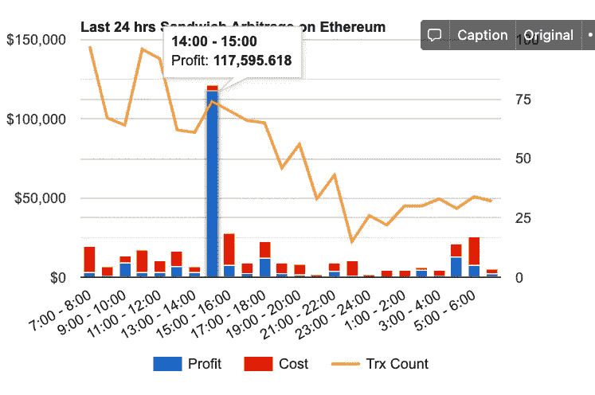

每小时的堆叠柱显示了该期间发生的套利交易的小计收入，分为蓝色柱线的利润和红色柱线的成本。橙色线描述了右轴测量的三明治套利的数量。

我们可以看出，14:00 到 15:00 是三明治搜寻者最饥饿的时候。

当然，当您将光标移动到该列和该行时，您可以读取指示器的准确数字。

下图以相同的逻辑显示了最近七天的趋势，只是横轴显示了七个日期。

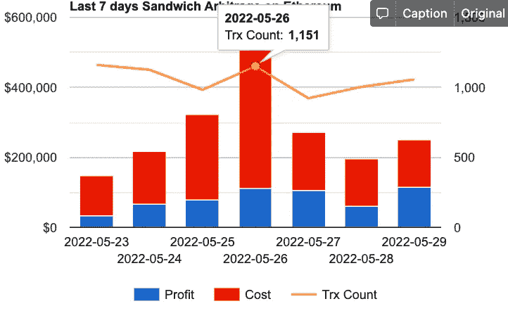

昨天和前天相比有什么变化？下表给你答案。它包含总计数、攻击者的 EOA 计数、受害者的 EOA 计数、总利润/成本/收入、总投资回报率，以及利润超过 1K 美元的套利交易和 MEV-BOT 的相同数据，所有这些都让您了解昨天报告的变化率。

下表中的数据告诉我们，与昨天相比，总利润增加了 77.7%。我们还了解到，大部分收益来自利润> 1K 美元的套利交易，其利润为 179，976 美元，增长了 96.2%，最终导致该类别的投资回报率达到 594.7%。

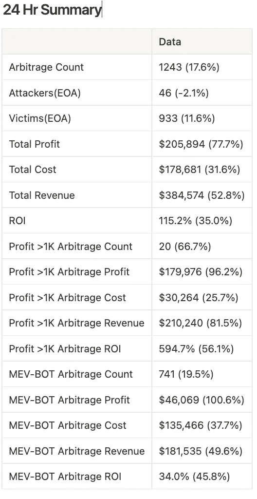

# 昨天三明治搜寻者能做什么？

这三个图表使用百分位数分布方法说明了市场中的整体三明治套利能力。

乍一看可能有点混乱。所以让我们从下表开始理解这个概念:

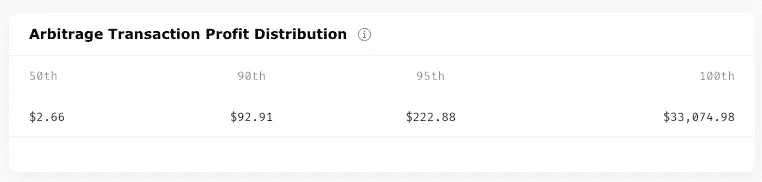

该表显示，最低的 50%的交易利润大多低于 2.66 美元；90%的交易利润大多低于 92.91 美元；约 95%低于 222.88 美元，最高盈利 33074.98 美元。

下表展示了三明治套利的总利润/成本/收入分布:

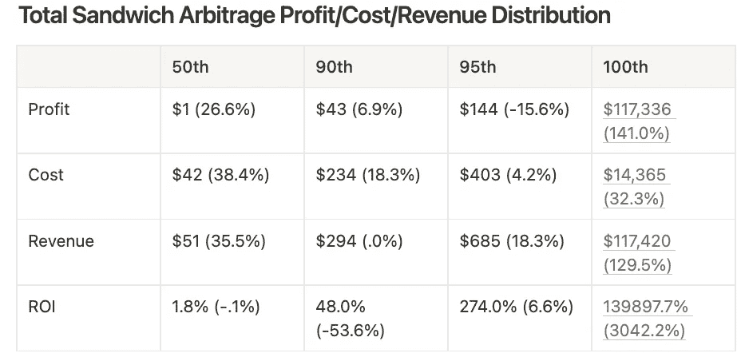

表格的前三行现在应该更清楚了。然而，重要的是要记住**同一列的数据绝不属于同一个事务。**

我们分别计算利润、成本、收入和 ROI 分布排名。例如，一笔交易的成本是 42 美元，排名第 50 位。但是它的利润可能是 20 美元，比第 50 个利润多 1 美元，比第 90 个利润少 43 美元，反之亦然。

第四行中的 ROI 也是独立于同一列中的数据计算的。它还显示了整体投资回报分布。因此，最好的投资回报率是 139897.7%，第 95 个是 274.0%，等等。

有了表中数据的知识，让我们再次检查图表。

为了让数据更容易理解，图表的纵轴用对数来表示。

第一个展示了整体三明治套利的**利润**百分位数分布与标在以太网上的 s .利润> 1K 美元套利与 S. MEV-Bot 套利。

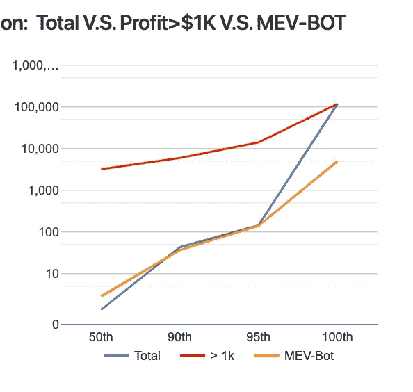

它表明，在第 50 百分位，利润> 1K 美元交易的利润大于 Total 和 MEV-Bot 的利润，这是显而易见的。在第 90 和第 95 百分位，Total 和 MEV-Bot 的利润大致相同，大约在 100 美元左右，我们称之为下表中的数据:

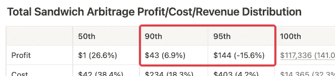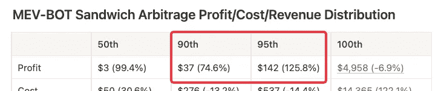

在第 100 位的利润方面，Total 的线符合利润> $1K 的线，因为最显著的收益来自利润> $1K 的类别。

不需要花太多时间就可以发现，最终，在所有三个图表中，至少有两条线会在第 100 个百分位相遇，其中一条属于总类别。

我们还可以读到，> 1K 的利润线在另外 2 的上面，一般意味着这个品类的利润比另外 2 的多。

现在我们可以继续看成本分布图了。

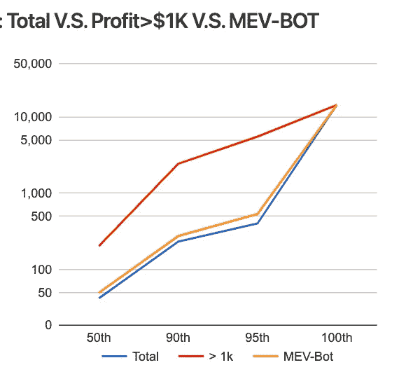

不同百分位数的总成本和 MEV-Bot 成本接近，均小于利润> 1K 美元的成本。在这两者中，MEV-Bot 通常比 Total 的其他搜索者花费更多。

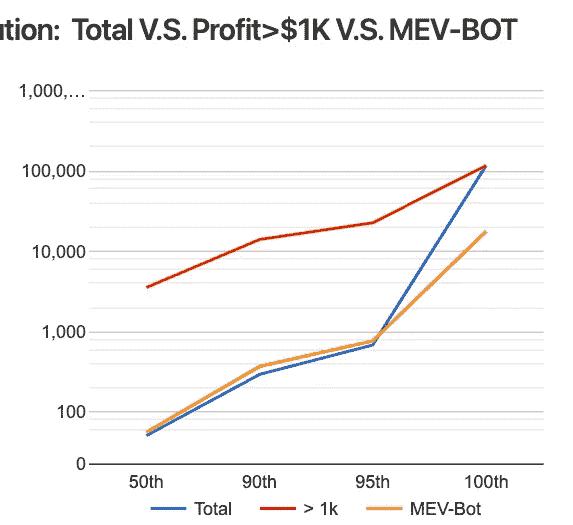

关于收入分配，最高收入来自利润> 1K 美元类别，而不是 MEV-Bot 类别。

**记住，相同百分位的数据不一定属于同一笔交易，第 100 笔除外。**

表格的前三行现在应该更清楚了。然而，重要的是要记住**同一列的数据绝不属于同一事务。**

以下三个表以不同的维度显示了分布图中的数据:特定类别的利润、成本、收入和 ROI 的汇总。

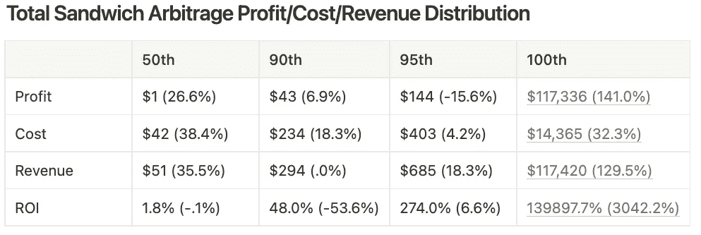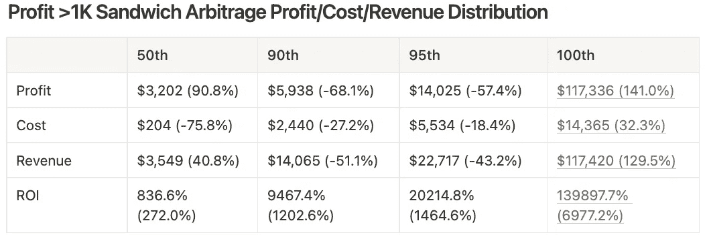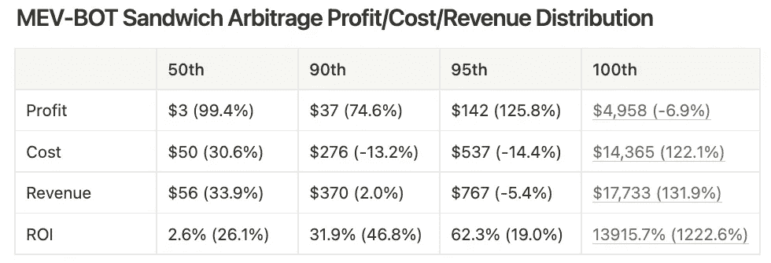

# 5 种最美味的三明治

在分布对比图和表格之后，下表显示了利润最高的 5 个三明治套利。参与套利的代币在一列。点击套利的散列地址会将你带到[合约详情](https://eigenphi-1.gitbook.io/arbitrage-scan-user-guide/contract)页面，显示不同套利类型的表现、利润排行榜、最喜欢的池、代币和利润分配。

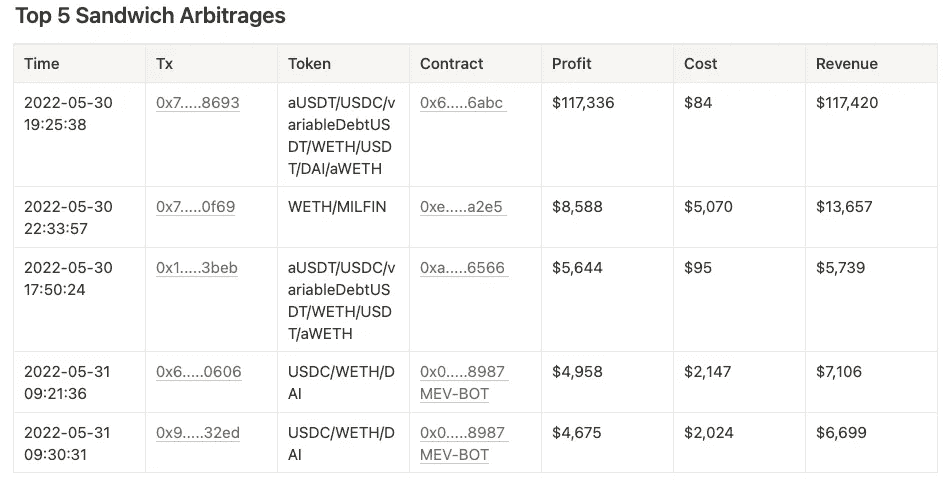

# 使用这些协议和路由器时要小心！

以下部分是套利交易中被利用最多的 10 个合约。

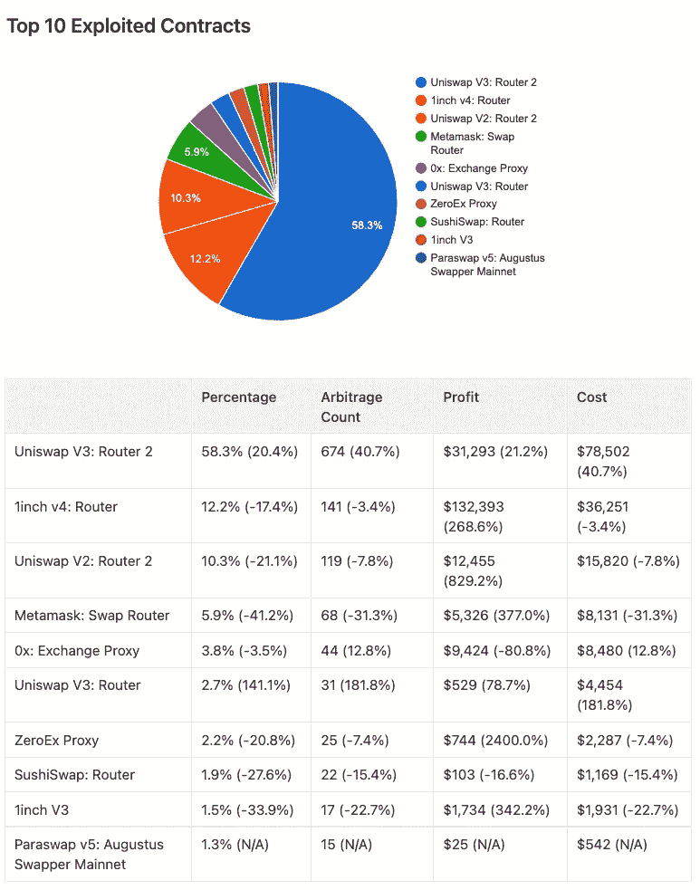

我们分析了所有的链上交易并总结了图表。这里大部分契约是不同协议的路由器和代理。交易者用这些来执行他们的掉期交易，这些交易不知不觉地被夹在中间。如果你想进行大量的交易，这个图表将帮助你决定哪些指标和协议最有可能被利用。

该表显示路由器或协议在套利计数中所占的百分比。这里也显示了过去 24 小时内发生了多少次三明治套利，以及这些套利的小计利润和成本。

# 顶级攻击者和受害者

以下是这段时间内排名前三的攻击者和受害者。攻击者表显示了攻击者进行了多少次套利以及相关金额。受害者表检查受害者的损失和被攻击的次数。两个表格中的所有地址都会带你找到攻击者或受害者的详细信息。

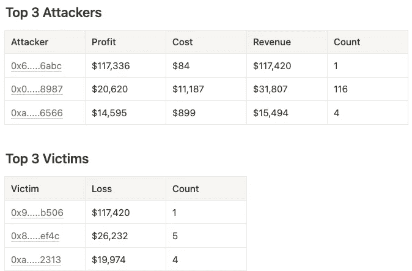

# #DYOR 在🥪

[三明治套利每日报道](https://eigenphi.notion.site/Sandwich-Arbitrages-Daily-Report-c32bc40bc0934957ad7edf2c1d307917)到此结束。不过如果你想做更多这样的分析，可以[下载以太坊三明治套利日报表的历史数据](https://docs.google.com/spreadsheets/d/156fapjTIhDNCqjr02w-1zXvTfbMmYdDWraXS8JNLDA4/edit#gid=704766022)，从 2022 年 1 月 2 日开始。您可以在每天报告的开头和结尾找到下载链接。

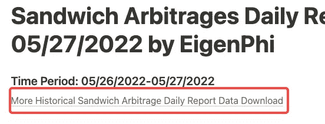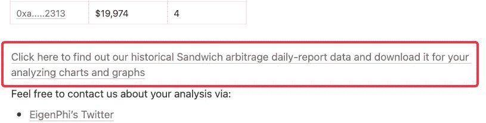

如果您认为我们遗漏了您需要的一些数据，请随时留下您的评论或通过以下渠道联系我们。任何反馈都是非常鼓励和欢迎的！！

跟随我们通过这些来挖掘更多隐藏的 DeFi 的智慧:

*   [EigenPhi 官方推特](https://twitter.com/eigenphi)
*   [EigenPhi MEV 提醒推特](https://twitter.com/eigenphi_alert)
*   [子堆栈](https://eigenphi.substack.com/)
*   [中等](/@eigenphi)
*   [Mirror.xyz](https://mirror.xyz/0xc19565163aFdEe3783FC970E4Bd0275B11848d34)
*   [电报](https://t.me/WisdomOfDeFi)
*   [不和](https://discord.com/invite/JXD8cyzR2a)
*   [时事杂志](https://www.getrevue.co/profile/EigenPhi)

> 加入 Coinmonks [电报频道](https://t.me/coincodecap)和 [Youtube 频道](https://www.youtube.com/c/coinmonks/videos)了解加密交易和投资

# 另外，阅读

*   [BigONE 交易所评论](/coinmonks/bigone-exchange-review-64705d85a1d4) | [电网交易机器人](https://coincodecap.com/grid-trading)
*   [氹欞侊贸易评论](https://coincodecap.com/anny-trade-review) | [CoinSpot 评论](https://coincodecap.com/coinspot-review)
*   [新加坡十大最佳密码交易所](https://coincodecap.com/crypto-exchange-in-singapore) | [收购 AXS](https://coincodecap.com/buy-axs-token)
*   [投资印度的最佳加密软件](https://coincodecap.com/best-crypto-to-invest-in-india-in-2021) | [WazirX P2P](https://coincodecap.com/wazirx-p2p)
*   [西班牙 5 大最佳文案交易平台](https://coincodecap.com/copy-trading-spain)
*   [Pionex 双重投资](https://coincodecap.com/pionex-dual-investment) | [AdvCash 审查](https://coincodecap.com/advcash-review) | [支持审查](https://coincodecap.com/uphold-review)
*   [开发人员的 8 个最佳加密货币 API](https://coincodecap.com/best-cryptocurrency-apis)