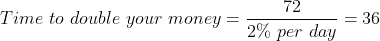

# 想在 36 天或更短时间内让你的钱翻倍吗？这可能是个骗局，也可能不是？

> 原文：<https://medium.com/coinmonks/want-to-double-your-money-in-36-days-or-less-it-could-be-a-scam-or-maybe-not-7b4fc0adcf2f?source=collection_archive---------23----------------------->

不是财务建议，也不要烧伤你的手指。投资风险自担。

你听说过“72 法则”吗？如果没有，我来解释一下。根据 [Investopedia](https://www.investopedia.com/ask/answers/what-is-the-rule-72/) :

> 给定固定的年利率，72 法则是确定投资需要多长时间才能翻倍的简单方法。通过将 72 除以年回报率，投资者可以粗略估计出最初的投资需要多少年才能实现自我复制。

等等，我告诉过你 36 天，对吧？假设你每天获得 2%的投资回报率，那么你可以用 72 除以它。

明白了吗？很简单，耶！

现在你知道了让你的钱翻倍的公式，让我们来看看怎么做？

🥁🥁🥁，你可以用 Swapnex 来做。我可以建议你看看我的故事: [**Swapnex:套利交易的新艺术**](https://bit.ly/37c320Y) **。**再次强调，不是投资建议。请自行研究。

> Swapnex 让你与他们的智能平台在几个密码交易所交易。它允许交易者在一个交易所购买硬币，在另一个交易所出售，而无需在任何一个交易所注册。

有了 Swapnex 提供的免费机器人，你每天可以下 1 到 8 个订单。对于 8 个订单，你需要一个疯狂的数量。多少钱？$50000.除非你有这么多钱，用 50 美元你可以每天开始 4 个订单。每份订单的投资回报率大约为 0.05%，每天的投资回报率为 2%。现在你知道我为什么告诉你 36 天或更少了。

这一切听起来好得令人难以置信。对我来说，老实说，我会支持你。会不会是庞氏骗局？有可能。如果你这样认为，请告诉我。我能够撤回我的密码(BTC，XRP)。关于庞氏骗局的事实是，较早加入骗局的人可以取出他们的利润。当越来越多的人加入，突然间，一切都打破了。

我个人投资了我的游戏币，我所做的第一件事就是，取出我的初始投资。所以如果出来是个骗局，对我伤害不会太大；)够勇敢:)

如果你想注册并开始交易，Swapnex 提供了一个 30 天的免费机器人，并提供少量 BTC 来测试这项服务。你可以保留机器人产生的利润。你可以使用我的推荐链接

我希望这篇文章对你有所帮助。如果你喜欢这个故事，请给它竖起大拇指，并在下面留下评论！

如果您想了解更多关于**加密货币、投资、联盟营销和在线赚钱的信息，请关注我的 [**Medium**](/@primitivebrave) 。**

你觉得这篇文章有趣吗？
给它鼓掌(最多 50 次！)👏

> 加入 Coinmonks [电报频道](https://t.me/coincodecap)和 [Youtube 频道](https://www.youtube.com/c/coinmonks/videos)了解加密交易和投资

# 另外，阅读

*   [5 款最佳加密交易终端](https://coincodecap.com/crypto-trading-terminals) | [最佳 DeFi 应用](https://coincodecap.com/best-defi-apps)
*   [比特币基地 vs 瓦济克斯](https://coincodecap.com/coinbase-vs-wazirx) | [比特鲁点评](https://coincodecap.com/bitrue-review) | [波洛涅克斯 vs 比特鲁](https://coincodecap.com/poloniex-vs-bittrex)
*   [德国最佳加密交易所](https://coincodecap.com/crypto-exchanges-in-germany) | [Arbitrum:第二层解决方案](https://coincodecap.com/arbitrum)
*   [币安交易机器人](/coinmonks/binance-trading-bots-d0d57bb62c4c) | [OKEx 评论](/coinmonks/okex-review-6b369304110f) | [阿塔尼评论](https://coincodecap.com/atani-review)
*   [最佳加密交易信号电报](/coinmonks/best-crypto-signals-telegram-5785cdbc4b2b) | [MoonXBT 评论](/coinmonks/moonxbt-review-6e4ab26d037)