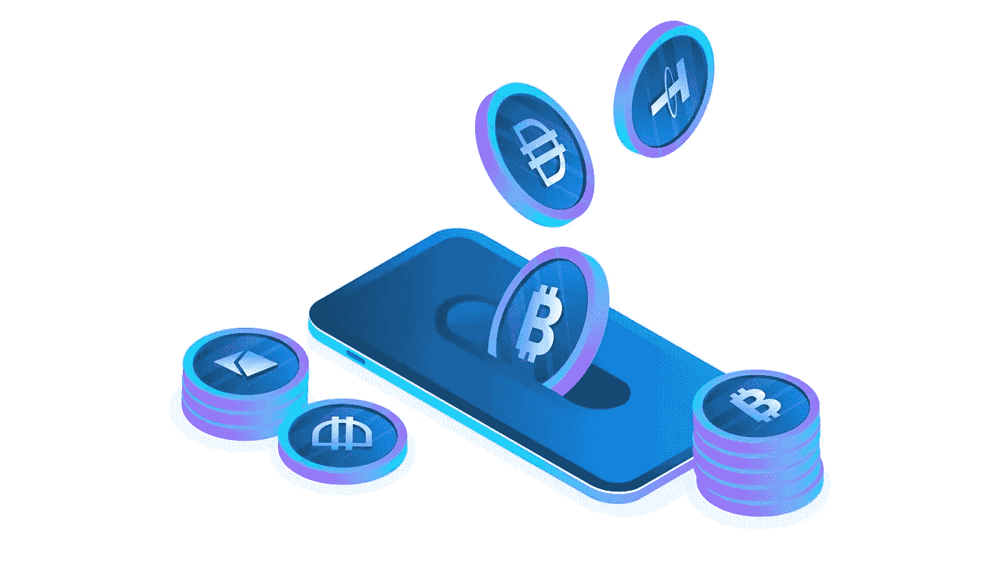

# 想拥有密码？买一个不是唯一的选择！

> 原文：<https://medium.com/coinmonks/want-to-own-crypto-buying-one-is-not-the-only-option-8f424ae0cc6c?source=collection_archive---------75----------------------->

成为一名“密码霍德勒”感觉很特别！不是吗？但是，当我们有其他方法时，每次用法定货币购买它们就不那么酷了😄

不，我不是在说采矿。当你能以一种不那么乏味的方式得到一些东西时，为什么要投入精力、资源和金钱呢？

那么，让我们看看还有哪些其他的方法:

1.  空投——换句话说，免费赠送*的代币*。每当推出新的加密技术时，拥有该技术的公司会给交易所一些硬币，让它们用现有的投资(基于特定的标准)在用户中进行分配。这已成为最近行业的新规范。
    *标准是什么，用户是如何选择的，那就另当别论了！*

2.**返现**——许多在线卖家和信用卡公司想出了一些有趣的方法来推广加密技术和增加销售额，包括我们一直以来最喜欢的*返现*。

3.**股息** —这就像传统的股票市场一样。持有一些硬币一段时间，你会得到更多取决于平台的 APY 利率。

4.**推荐奖励**——“把你的朋友带到平台上，赢取密码”。听起来很有趣，对吗？现在很多密码交易所都在这么做。好消息是你不需要投资任何东西。只要推荐你的朋友，然后坐好！

5.**奖励** —终于到奖励时间了！一些应用程序奖励你令牌，仅仅是因为你使用了他们的应用程序。好得难以置信？但事实如此。查看“勇敢”浏览器。只需在他们的平台上浏览，获得蝙蝠代币！免费的！

*不胜枚举！但这些是我的最爱！希望你喜欢阅读！
敬请期待！*

> 加入 Coinmonks [电报频道](https://t.me/coincodecap)和 [Youtube 频道](https://www.youtube.com/c/coinmonks/videos)了解加密交易和投资

# 另外，阅读

*   [CoinLoan 点评](https://coincodecap.com/coinloan-review)|[Crypto.com 点评](/coinmonks/crypto-com-review-f143dca1f74c) | [火币保证金交易](/coinmonks/huobi-margin-trading-b3b06cdc1519)
*   [Bybit vs 币安](https://coincodecap.com/bybit-binance-moonxbt)|[stealth x 回顾](/coinmonks/stealthex-review-396c67309988) | [Probit 回顾](https://coincodecap.com/probit-review)
*   [顶级付费加密货币和区块链课程](https://coincodecap.com/blockchain-courses)
*   [CBET 点评](https://coincodecap.com/cbet-casino-review) | [库币 vs 比特币基地](https://coincodecap.com/kucoin-vs-coinbase) | [拜比特 vs 比特币基地](https://coincodecap.com/bybit-vs-coinbase)
*   [如何在加拿大购买加密货币？](https://coincodecap.com/how-to-buy-cryptocurrency-in-canada)