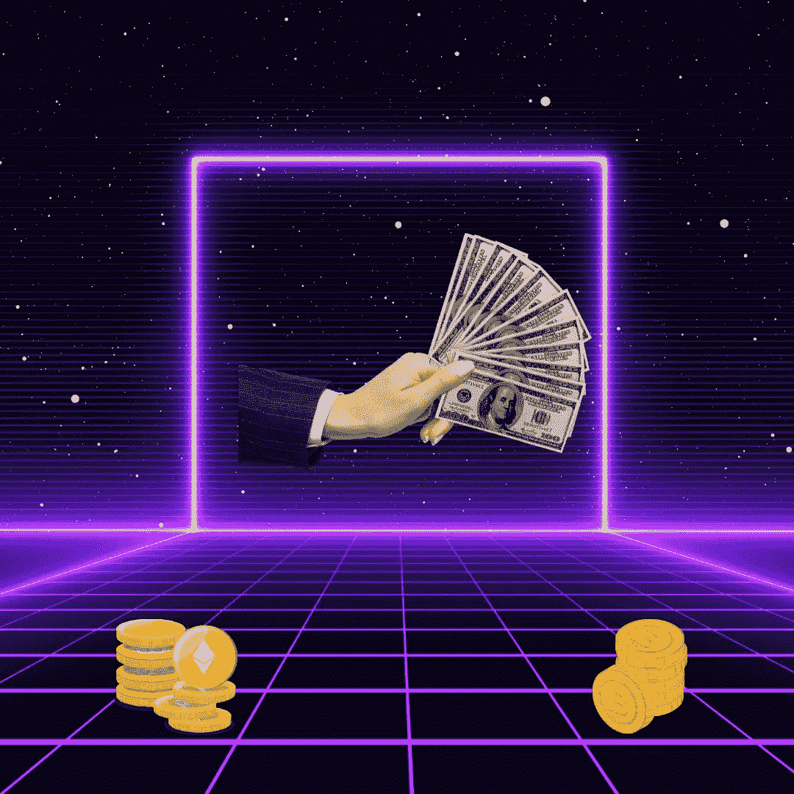

# 战争已至昨日，富人正在自救，是吗？

> 原文：<https://medium.com/coinmonks/war-arrived-yesterday-the-wealthy-are-saving-themselves-are-you-29528385143c?source=collection_archive---------4----------------------->

## 一厢情愿和自满是他们的盟友。你的疏忽和疏忽是他们的杠杆。你无知的观点是他们最大的财富。

Source: Self created image with [Canva](http://www.canva.com).

让我们从承认无知不是一种侮辱开始。我对相当一部分情况一无所知。无知只是意味着…