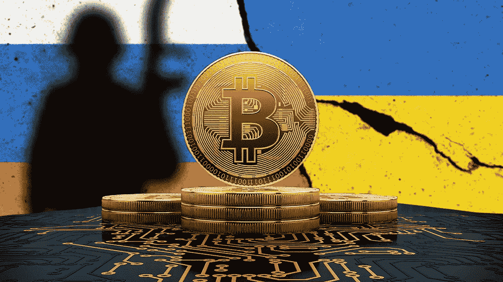
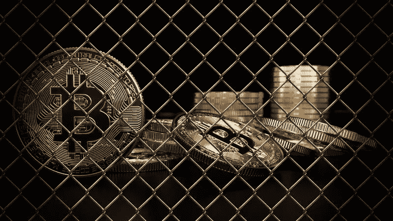

# 乌克兰战争:俄罗斯因比特币而颤抖

> 原文：<https://medium.com/coinmonks/war-in-ukraine-russia-trembles-over-bitcoin-4a61b6806c0?source=collection_archive---------19----------------------->

不惜一切代价防止资本外逃——由于国际社会部分成员施加的前所未有的经济制裁，俄罗斯经济正在衰退。由于一场大规模衰退正在酝酿之中，债务违约已经摆在了桌面上。一些人认为比特币和加密货币可能是逃避制裁的一种方式。但事情没那么简单。为了限制资金外流，俄罗斯央行(CBR)正在加大对其公民的压力，并监控他们的一举一动，就像西方人一样，他们想不惜一切代价实施制裁。

## 乌克兰和俄罗斯严重依赖加密货币为战争提供资金并绕过制裁

随着对俄罗斯的经济制裁日益严厉，俄罗斯人正转向加密货币，以对冲卢布暴跌。最近几周，比特币购买量呈爆炸式增长。对俄罗斯来说，数字货币可能是规避西方制裁和封锁的好方法。

俄罗斯不是唯一一个押注加密货币的国家。乌克兰也是，特别是用它来资助战争。首相实际上已经在他的推特账户上发起了捐款呼吁。分享了三个数字钱包的链接。比特币、以太坊和 USDT 的持有者可以在几秒钟内转移捐款。短短几天，已经收集了几千万美元的加密货币。

## 阻止密码在俄罗斯的传播。

欧盟和北约可以要求交易平台禁止向俄罗斯地址转账。这一想法得到了乌克兰政府的支持，但迄今为止遭到了比特币基地和币安的拒绝。两位行业领袖强调了他们的非政治性。然而，这些平台声称尊重国际制裁，并阻止了俄罗斯寡头的进入。这一点得到了证实:该行业的主要参与者已开始冻结数千个可能被用来规避经济制裁的账户。

一次大的数字扫描。过去几天，加密货币平台一直在俄罗斯进行清理，冻结所有与受西方制裁影响的个人或实体相关的账户。大规模行动以来，仅比特币基地平台就确认了至少 25000 个！“所有相关账户都与构成问题的个人和实体有直接或间接的联系，”该组织的法律经理保罗·格雷瓦尔(Paul Grewal)在一条长消息中解释道，他提醒我们，比特币基地正在尽一切可能遵守欧洲和美国做出的制裁决定。其他经纪人如其同胞北海巨妖或中国币安，也宣布他们已经冻结了众多账户。

与此同时，俄罗斯银行有义务监控他们的客户。金融机构必须特别注意任何试图从某些国家撤回资产的自然人或法人。这些所谓的“敌对”或“不友好”国家包括超过 48 个国家，包括美国、英国和所有欧盟国家。

俄罗斯政府的目标是阻止任何资金流出该国。将来对他们大有用处的资本。俄罗斯司法系统最近在这方面特别严厉。它预见到，如果违反这些限制，将被处以高额罚款，甚至承担刑事责任。

## 比特币和加密不再是摆脱政府控制的解决方案

近 1000 万俄罗斯人在各种平台上持有 630 亿美元的密码。当局知道这一点，他们的担忧似乎是有道理的。随着支付卡的暂停以及随后创纪录的通货膨胀，cryptos 显然正在成为俄罗斯公民的 B 计划。这是为了转账、购买或保护他们的储蓄。不幸的是，平台上的新存款似乎受到了影响。国际媒体似乎痴迷于俄罗斯寡头及其船只在世界各地被扣押的故事，但事实上，大多数“正常”的人正在为这种情况付出最沉重的代价，一如既往…

因此，乌克兰战争凸显了加密的弱点和优点:它没有内在价值；它不像黄金或美元那样稳定，但它允许人们摆脱政府的控制，转移资金。“我们相信上帝”被写在美元上，但加密人在这种情况下找到了他们对自由的信念:他们不相信赚钱的政府，并可以剥夺他们的储蓄。

## 关于我

我对加密货币的世界感兴趣，我分享我的经历和我感兴趣的主题，以便通过文章传递我的激情。

我们还在制作一个网站，我们试图把所有关于我们测试的程序、我们认为没问题的程序以及要不惜一切代价避免的骗局放在上面

你也可以查看我的其他文章: [Arbismart 骗局](/@vheim.crypto/arbismart-scam-alert-ec8023324b75)侦破， [Swapnex.io](/@vheim.crypto/swapnex-io-my-experience-after-45-days-on-the-platform-and-a-65-2-roi-6db932fbc4c4) 关于一个我喜欢的平台或者[巅峰挖矿](/@vheim.crypto/summit-mining-invents-community-mining-f72de2c87865)关于社区挖矿

在进行任何投资之前，如果你打算投资，请确保只投资你能承受的损失，而不是更多，并进行自己的研究。

**Moffice**

> 加入 Coinmonks [电报频道](https://t.me/coincodecap)和 [Youtube 频道](https://www.youtube.com/c/coinmonks/videos)了解加密交易和投资

# 另外，阅读

*   最好的比特币[硬件钱包](/coinmonks/hardware-wallets-dfa1211730c6) | [BitBox02 回顾](/coinmonks/bitbox02-review-your-swiss-bitcoin-hardware-wallet-c36c88fff29)
*   [block fi vs Celsius](/coinmonks/blockfi-vs-celsius-vs-hodlnaut-8a1cc8c26630)|[Hodlnaut 审核](/coinmonks/hodlnaut-review-best-way-to-hodl-is-to-earn-interest-on-your-bitcoin-6658a8c19edf) | [KuCoin 审核](https://coincodecap.com/kucoin-review)
*   [Bitsgap 审查](/coinmonks/bitsgap-review-a-crypto-trading-bot-that-makes-easy-money-a5d88a336df2) | [Quadency 审查](/coinmonks/quadency-review-a-crypto-trading-automation-platform-3068eaa374e1) | [Bitbns 审查](/coinmonks/bitbns-review-38256a07e161)
*   [加密复制交易平台](/coinmonks/top-10-crypto-copy-trading-platforms-for-beginners-d0c37c7d698c) | [Coinmama 评论](/coinmonks/coinmama-review-ace5641bde6e)
*   [印度的加密交易所](/coinmonks/bitcoin-exchange-in-india-7f1fe79715c9) | [比特币储蓄账户](/coinmonks/bitcoin-savings-account-e65b13f92451)