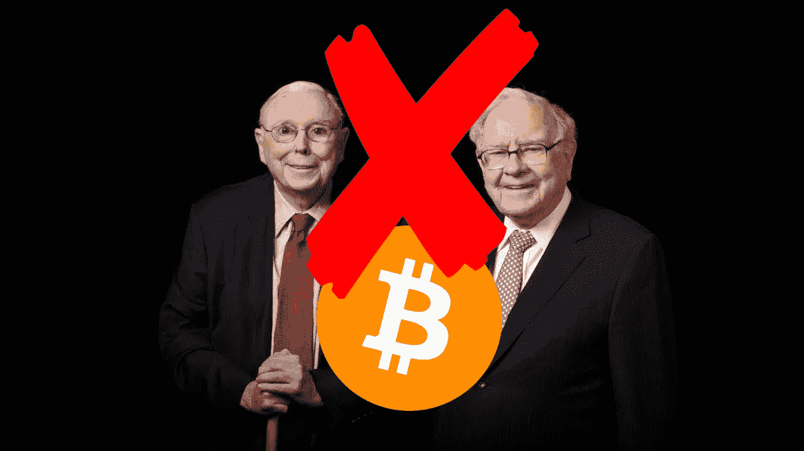

# 沃伦·巴菲特和查理·芒格对比特币的看法是错误的，不要接受他们的加密建议

> 原文：<https://medium.com/coinmonks/warren-buffet-and-charlie-munger-are-wrong-about-bitcoin-dont-take-crypto-advice-from-them-4ccd066548af?source=collection_archive---------40----------------------->

你可能听过查理·芒格和沃伦·巴菲特谈论比特币。他们对此的评论基本上都是负面的。沃伦·巴菲特说他不会用 25 美元买下世界上所有的比特币。我认为他们错了，他们不应该在不理解比特币的时候评论它。不要误会我的意思，我确实认为沃伦巴菲特和查理芒格是世界上最好的投资者。然而，他们不懂科技。沃伦巴菲特了解资产负债表、市盈率和可口可乐。正如 Chamath Palihapitiya 在美国消费者新闻与商业频道接受采访时所说:“我认为，在他的整个投资生涯中，技术显然不在他的能力范围之内”。我同意这一点，巴菲特早期投资了多少家科技公司？没有，他最终在 2011 年买了 IBM 的股票，在 2016 年买了苹果。

沃伦·巴菲特最近才换了一部 iPhone，显然他只用它打电话。我愿意打赌沃伦·巴菲特不知道如何改变手机亮度。显然，这是一个很大的假设，但我仍然认为，要理解比特币，你至少需要对这项技术有一点了解，这显然是沃伦·巴菲特所没有的。总之，尽管我喜欢沃伦·巴菲特和查理·芒格，我还是读过本杰明·格拉哈姆的《聪明的投资者》。在生活和投资的很多方面，我都很尊敬他们俩。不幸的是，基于他们的专业领域，你不应该接受沃伦巴菲特和查理芒格关于比特币的建议，因为他们不知道自己在说什么。他们已经错了几次，在比特币的问题上，他们将再次犯错。

感谢阅读，如果你喜欢这篇文章，请关注。

> 加入 Coinmonks [电报频道](https://t.me/coincodecap)和 [Youtube 频道](https://www.youtube.com/c/coinmonks/videos)了解加密交易和投资

# 另外，阅读

*   [CBET 点评](https://coincodecap.com/cbet-casino-review) | [库币 vs 比特币基地](https://coincodecap.com/kucoin-vs-coinbase) | [拜比特 vs 比特币基地](https://coincodecap.com/bybit-vs-coinbase)
*   [折叠 App 回顾](https://coincodecap.com/fold-app-review) | [本地比特币回顾](/coinmonks/localbitcoins-review-6cc001c6ed56) | [Bybit vs 币安](https://coincodecap.com/bybit-binance-moonxbt)
*   [加密保证金交易交易所](/coinmonks/crypto-margin-trading-exchanges-428b1f7ad108) | [赚取比特币](/coinmonks/earn-bitcoin-6e8bd3c592d9) | [Mudrex 投资](https://coincodecap.com/mudrex-invest-review-the-best-way-to-invest-in-crypto)
*   [WazirX vs coin dcx vs bit bns](/coinmonks/wazirx-vs-coindcx-vs-bitbns-149f4f19a2f1)|[block fi vs coin loan vs Nexo](/coinmonks/blockfi-vs-coinloan-vs-nexo-cb624635230d)
*   [比斯勒评论](https://coincodecap.com/bitsler-review)|[WazirX vs coin switch vs coin dcx](https://coincodecap.com/wazirx-vs-coinswitch-vs-coindcx)