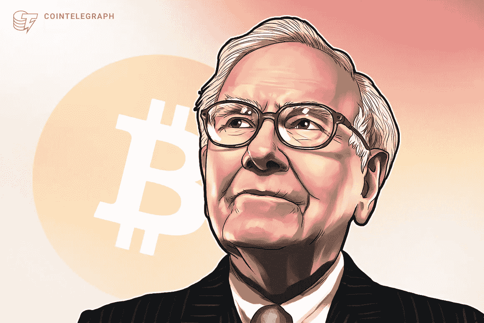

# 沃伦·巴菲特 vs 比特币

> 原文：<https://medium.com/coinmonks/warren-buffet-vs-bitcoin-95432404ee0?source=collection_archive---------14----------------------->

*2022 年 5 月 20 日数据*

迪安·福齐西亚，❤女士

Image via [Cointelegraph](https://cointelegraph.com/news/rat-poison-squared-bitcoin-passes-warren-buffett-s-berkshire-hathaway-by-market-cap)

在最近的伯克希尔·哈撒韦股东大会上(4 月 30 日)，沃伦·巴菲特谈到了一些投资话题，并参考一些现代话题和辩论，提供了他务实、古怪的经济学类比。巴菲特被问及比特币，他是这样回答的…

***“如果你……拥有世界上所有的比特币，你以 25 美元的价格卖给我，我不会接受，”*** [***巴菲特说***](https://www.cnbc.com/2022/05/02/warren-buffett-wouldnt-spend-25-on-all-of-the-bitcoin-in-the-world.html#:~:text=%E2%80%9CIf%20you%20...,you%20one%20way%20or%20another.) ***。“因为我拿它做什么？无论如何，我都得把它卖给你。”***

在巴菲特对为什么世界上所有的比特币都不值 25 美元的描述中，他用了两个类比。

1.  如果有人拥有世界上所有的农田，并向他提供 1%的农田，他会以合适的价格接受。
2.  如果有人拥有美国所有的公寓楼，并以合适的价格向他提供 1%的产权，他也会接受。

他基本上是想说公寓楼和农田有物质价值。他们是真实的。他们作为所有者为他创造利润。反过来，比特币不产生任何利润，也不是一门生意，所以巴菲特认为它完全没用。

这对我毫无意义。

我相信，巴菲特指的是更大的傻瓜理论。

一项没有内在价值的资产只会在一个“更大的傻瓜”出现并决定为它支付更多时以更高的价格交易。

就像买运动卡一样。根据大傻瓜理论，有签名的迈克尔·乔丹新秀卡没有任何价值。这是一张打印纸，上面写着一些东西。唯一会购买这种资产的人是那些认为它的价值超过前所有者估价的傻瓜。

也就是说，你可以以 300 万美元的价格卖掉那张小小的纸。

为什么会这样呢？

亲笔签名的迈克尔·乔丹新秀卡的主人都是他妈的白痴吗？巴菲特似乎会这么说。

那张纸不会产生任何东西。它没有内在价值。它不支付股息，也不公布下一季度的收益。

也许，人们认为它是有价值的，因为价值超越了企业的实际所有权。

当人们决定购买一只股票时，他们很少关注每股的账面价值，而是基于一些奇怪的理论、价格和杂色的傻瓜文章。所以，我想问题是，为什么我们重视没有“价值”的东西？为什么市场会支撑那些没有真正“价值”的商品，除非是卖给下一个从前一个傻瓜那里购买商品的傻瓜？

那么，为什么一个比特币价值 3 万美元。？为什么迈克尔·乔丹的那张纸值你一辈子的收入？在什么情况下，人类会认为运动卡或比特币之类的东西没有价值？对象是否产生客观值真的重要吗？即便如此，人类真的处理了一份生意和 1 个以太币的区别吗？当他们按下 Robinhood 上的绿色购买按钮时，他们真的在想这个吗？

我觉得不是。

所以问题是:世界上所有的比特币怎么可能比沃伦·巴菲特古老钱包里的 25 美元还不值钱？

…

比特币的市值目前为 5750 亿美元。在巅峰时期，其价值超过 1.1 万亿美元。价值 5750 亿美元的比特币是世界上第十大最有价值的资产。根据全球市场:比特币目前的价值超过脸书、维萨、三星、沃尔玛、万事达、埃克森、雪佛龙、家得宝、辉瑞和可口可乐。没错。比特币的估值处于 17 个月来的最低水平，但它的价值仍高于沃尔玛。[沃尔玛雇佣了 230 万名员工。](https://corporate.walmart.com/askwalmart/how-many-people-work-at-walmart#:~:text=We%20employ%20approximately%202.3%20million,million%20in%20the%20U.S.%20alone.&text=Ready%20to%20begin%20your%20career%20with%20Walmart%3F)

他妈的 230 万人！！！

那么，脱节在哪里？为什么沃伦·巴菲特是错的？为什么他是对的？我开始思考这个问题，我试图让自己有信心也许，只是也许，让自己相信我是对的，巴菲特是错的。

我的投资组合中有 10%是加密的。我现在后悔了吗？他妈的是的！我认为世界上所有的比特币价值都低于 25 美元吗？他妈的不！

这里必须有一些中间地带，对不对？

问题是，巴菲特的大脑不是在互联网上长大的。他的大脑直到 20 多岁才开始看电视。他的知识基础、经验和处理市场的方式都不符合现代世界。世界上的其他人看到了我所看到的。有缺陷的资产类别？是啊！当然可以。

说到底，我不知道密码是如何工作的，你也不知道。说真的，给我讲讲区块链背后的数学是如何工作的。我会等的。你甚至不知道互联网是如何工作的！我也不想！！

互联网是一个真正的奇迹。即使是关于互联网的最小的事情也是不可理解的。缩小到你屏幕上最小的像素。那个像素到底是怎么显影的？屏幕上最小的物理部分有多少步。有多少家制造商合作制造了像素玻璃及其背后的所有软件和硬件？

什么技术使它下面的颜色显影？颜色是如何电子制造的？你知道怎么做吗？你知道当你点击手机屏幕时，压力系统是如何检测到你手指的压力的吗？你知道半导体是怎样制造的吗？你知道电力是如何通过充电器传输，并通过一个微小的端口进入设备的吗？你知道互联网或任何先进技术实际上是如何工作的吗？

是的，你明白*它做什么*；它在一个共同的虚拟平台上将世界各地的人们联系起来。但是，你不明白在这个屏幕上向你传达这些话需要多少难以理解的专业知识。

话虽如此，区块链也极其复杂。

是的，概念是非常不同的，有一个他妈的吨少软件。但是，区块链比正常人试图承担的任何事情都要复杂一千倍。密码学和所有的废话都是[难以想象的多面性](https://mathinvestor.org/2017/08/the-mathematics-behind-blockchain/#:~:text=Blockchain%20is%20basically%20a%20publicly,x3%20%2B%20a%20x%20%2B%20b.)。

所以，当某人明天在手机上购买. 0001 比特币时，他们不会知道那个比特币是如何创建的。他们不会关心比特币是如何产生的。他们为什么要这么做？他们有限的预感并不重要，因为对他们来说这只是一项投资。对他们来说，最重要的是他们能赚到钱。大量不创造利润的随机狗屎可以用来交换收益。古代中国或日本的武器，任何种类的艺术，体育或音乐纪念品:它们都对某人有价值。

所以，挑战上个世纪最成功的投资者；是什么让比特币有价值？

三件重要的事情:

**稀缺性、效用和流动性**

**稀缺**

与迈克尔·乔丹签名卡非常相似，比特币从结构性稀缺中获得价值。迈克尔·乔丹亲笔签名的新秀卡屈指可数。同样，目前只有大约 1900 万个比特币存在。

用巴菲特的例子来说，有人得到了每一张签名的迈克尔·乔丹新秀卡。他们都是一个人的独有财产。

就像财政部如何控制美元的供应一样，这个家伙控制了迈克尔·乔丹签名新秀卡的全部供应。

现在让我们假设这个人公开声明，他将会以递减的速度递增燃烧迈克尔乔丹的新秀卡，直到 2140 年；迈克尔·乔丹新秀卡的价值会发生什么变化？

由于普遍的稀缺性，这些卡的价格会随着时间的推移逐渐增值。迈克尔·乔丹牌会变得更有价值或更昂贵。

巴菲特举的农田例子也是如此。如果有人能够神奇地摧毁美国部分农田，那么剩余的供应就会因稀缺而升值。

因此，比特币将逐渐降低其供应速度，直到 2140 年，届时供应将达到上限。由于其作为货币手段的预定稀缺性和历史记录，地球上所有的比特币怎么可能不值 25 美元？沃伦·巴菲特能想出如何把他的银行账户和比特币基地联系起来并存入 25 美元吗？世人可能永远不会知道。(沃伦·巴菲特太老了，甚至不知道那个商业广告

**效用**

1 比特币和迈克尔乔丹卡都非常稀缺；现存的不多。比特币和迈克尔·乔丹牌都有效用。人们购买它们是因为他们认为他们的商品对他们有价值:无论是概念上的还是财政上的。他们可能会购买任何一种资产，因为他们相信其概念价值(在比特币的情况下，分散和不受监管的货币，或 MJ 卡；迈克尔·乔丹遗产的叙事价值和文化影响)

对一些人来说，比特币不仅仅是他们手机上的一个愚蠢的小游戏。一些有限的人认为，比特币/区块链是通往一个更加分散和公平的世界的技术门户。(祝你好运。也就是说，很多人持有比特币或其他替代币的原因并不是为了未来的财务收益。比特币代表了一种新型社会的潜力。一个财政收入不占全球经济四分之一的 T4。毕竟，货币不就是货币吗？一种常见的交易方式？为什么我们的货币必须盈利？为什么任何地方的任何人都不能使用同一种货币？

**流动性**

巴菲特不明白的一点是，比特币和迈克尔·乔丹牌不是一回事。虽然 MJ 卡市场的流动性不如比特币或美元；因为稀缺性，它们都包含感知价值。人们不只是到处交易迈克尔乔丹牌作为一种货币手段。他们确实用比特币做到了这一点。

比特币是一种流动性、可交易的资产。

不管你是否相信它的可行性，它仍然比许多国家的货币体系运行得更好。全球通货膨胀率最高的委内瑞拉，去年目睹其货币膨胀了 1120%。

让我问你这个问题。如果美国财政部宣布，直到 2140 年(比特币最后一半的粗略估计)，美元的供应量将通过越来越低的利率递增，美元的价值会发生什么变化？*它会增加*。

美元的供给和比特币的供给对各自资产价格的影响是一样的。当供给减少时，资产价值增加。

美联储决定印刷大量货币，增加美元的供应量。美元的价值下跌了。

如果美联储开始逐渐降低他们创造货币的速度，并决定在 2140 年后不再创造货币，美元的价值将获得他妈的更多的价值。

如果你知道美元会在它发生之前增值，你会选择投资美元。

这将是一项伟大的投资！这正是比特币将要发生的事情！

那么巴菲特怎么会看不到这一点呢？

**结论**

巴菲特不明白，一项独立于美联储的资产可以通过稀缺性、效用和流动性来保值。比特币和无数其他替代币已经做到了这一点。而它们的历史功效充其量是:低劣，许多交易发生在毒品和武器交易商之间；为什么比特币或其他替代货币不能像美国货币一样发挥作用？它以同样的方式保持价值！

那么一张纸上的迈克尔·乔丹和比特币或者以太坊有什么区别呢？神谕认为没有区别。他真的认为它毫无价值。

沃伦·巴菲特比我更精通投资。沃伦·巴菲特也出生于 1930 年。

1930

1930

1930

这个混蛋二战时还在中学！！！你知道有多少人已经 91 岁了？我奶奶 86 岁了，她不知道世界上发生了什么。真的不知道。她过着非常充实的生活，也非常聪明，但她没有智能手机。沃伦·巴菲特比这大六岁。想想吧！

话虽如此，遗憾的是，沃伦·巴菲特的大脑比我的工作效率更高，但我对此没意见。我肯定他比。但是这并不意味着他能比我更清楚地看到未来。

去他妈的沃伦巴菲特。

人类不会像价值机器人一样操作。人们投资老跑车是因为他们喜欢跑车。人们会花 300 万美元买一张上面有 80 年代黑人的纸，因为对他们来说，这值 300 万美元！这并不意味着大傻瓜理论是完全愚蠢的。当我去一个大城市看人们的服装时，我发现许多人例行公事地穿一套 10，000 美元的服装。我承认，那是真正的疯狂。这简直就像一件袖子上印着颠倒的米色印花的 Hanes 运动衫。

关键是:价值超越了企业所有权。你的大脑无法分辨比特币和企业股份的区别。就价值而言，这两者之间的区别充其量是模糊的。加密和区块链本身就很有价值。

**稀缺性、效用和流动性！**

它检查每一个该死的盒子。

所以去你妈的！

不管怎样，我在超级碗之前买了很多 Crypto.com 硬币(CRO ),因为我认为它会飙升。我花了大约 55 美分买了大部分。目前价值 20 美分。当我的朋友开始告诉我关于加密，我告诉他们这是一个骗局。我仍然相信这一点。

Coinmarketcap 和一大堆堕落的(或者说生成的)投资者不同意这种观点。

我尊敬沃伦·巴菲特，我也相信他是对的。或许三年后，比特币将价值 18 美元，而先知也将名副其实。

但也许这不会发生。

> 交易新手？尝试[加密交易机器人](/coinmonks/crypto-trading-bot-c2ffce8acb2a)或[复制交易](/coinmonks/top-10-crypto-copy-trading-platforms-for-beginners-d0c37c7d698c)