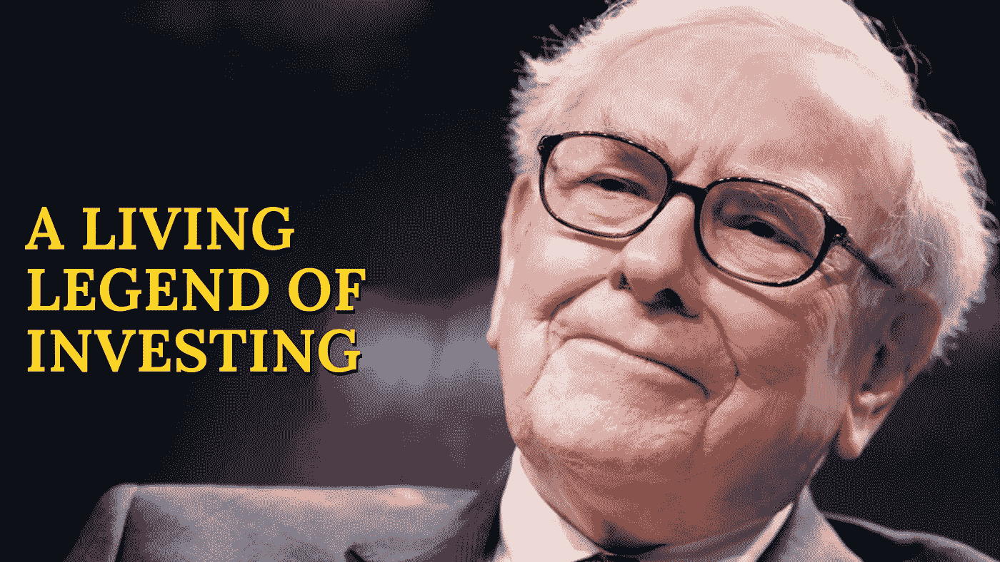
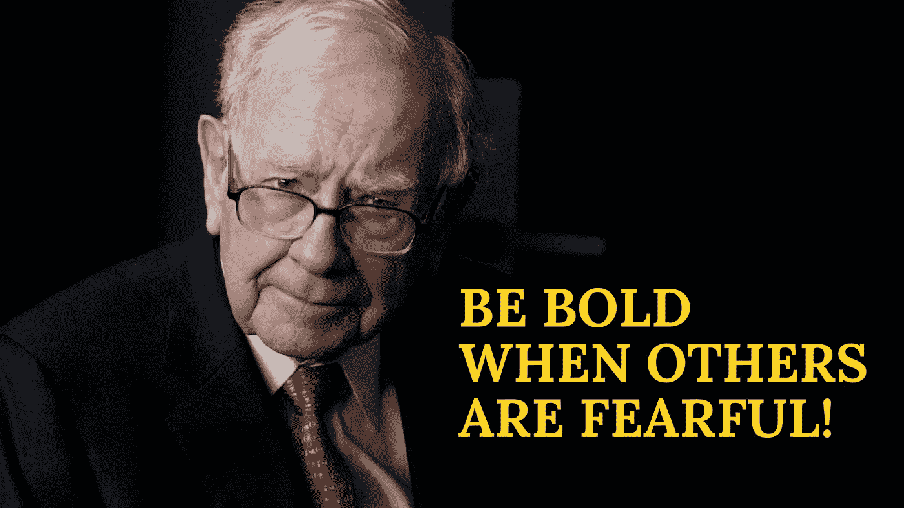

# 沃伦·巴菲特:他只是静止不动还是有技巧？

> 原文：<https://medium.com/coinmonks/warren-buffett-does-he-just-stay-still-or-have-skills-d6f94ec55375?source=collection_archive---------60----------------------->

# 没有人不知道沃伦·巴菲特！

No One Does Not Know About Warren Buffett!

谈投资就会提起**沃伦巴菲特**的话题。他的净资产现在超过了 1160 亿美元——这是 2022 年 5 月的最新数据。根据彭博亿万富翁指数，他是世界上第六富有的人！

**“沃伦·巴菲特是如何变得富有的？”**是关于这位杰出人物最常被问到的问题之一。根据维基百科，对多项业务的投资让他在 1962 年首次成为百万富翁。当时，他的合伙企业价值超过 102.5 万美元。随后，他决定投资并接管伯克希尔·哈撒韦公司。

 [## 情绪交易与情绪获胜:它们是一样的吗？

### 新手交易心理是否必不可少？我们同意关于我们头脑的知识不会产生可见的…

medium.com](/@libraryoftrader/emotional-trading-vs-emotional-winning-are-they-the-same-f3b9f770d10b) 

如果你希望在现实生活中听到一夜成功的奇迹，我恐怕要说沃伦不是一个突出的例子。巴菲特在 32 岁时成为百万富翁，这是早期的成功。然而，他在那之前很久就开始了他的投资生涯——在他 11 岁的时候。他用了大约 28 年的时间为**伯克希尔·哈撒韦**取得了巨大的成功。1990 年，巴菲特正式跻身世界亿万富翁之列。

值得注意的是，沃伦已经 91 岁了，但他仍然以董事长兼首席执行官的身份管理着伯克希尔·哈撒韦公司。令我钦佩和好奇的是，他是如何取得如此持续不断的成功的。

# 有人说巴菲特的财富完全是侥幸的结果，但真的是这样吗？

有时成功以最不为人知的方式出现，尤其是前所未有的成功。由于缺乏解释和嫉妒，人们称之为狗屎运。然而，我相信只有可以解释的成功才能持久。

直截了当地说，每个人都喜欢挣得更多，但只有少数人能够实现这个目标。这是一个残酷的事实，但它暗示着富有的人已经用策略和知识规划了他们的职业生涯。

他们不会有一天醒来发现自己被数百万美元包围。他们强烈渴望在生活中有所成就，并努力实现自己的梦想！

沃伦·巴菲特可能不是一个迅速成名的绝佳例子。然而，他是一个可持续财富的活着的传奇人物。在高盛为小企业做的一次演讲中，他通过罗斯·布鲁姆金夫人和杰克·泰勒鼓舞人心的真实故事，揭示了卓越成就背后的基本原则。

 [## 基本面分析和技术面分析:它们有多大区别？

### 这些术语是投资者和交易者经常谈论的术语。他们都是分析…

medium.com](/@libraryoftrader/fundamental-analysis-vs-technical-analysis-how-different-are-they-84110384e594) 

它唤起了许多关于成功人士遵循的基本和简单的想法。巴菲特演讲的关键信息是让**渴望**超越标准，让**取悦顾客**。

你可能会说“他想说什么就说什么，如此矛盾的哲学，因为他现在在世界之巅！”。公平地说，你的怀疑是合理的，因为我也有同样的怀疑。然而，他不是一个健谈的人，这是我在阅读了许多关于他的文章和视频后发现的。此外，通过我的第一手经验，我了解到盈利业务的每一个基础都很容易——与每个客户交朋友。

如果你对顾客缺乏尊重和欣赏，他们就不会再光顾你的商店或购买更多的东西。巴菲特说，我们可能会忘记一条领带的价格，但不会忘记他受到的待遇。

# 那么，投资呢？他有什么秘密？

So, What About Investing? What Are His Secrets?

**沃伦·巴菲特**40 多年来持有可口可乐股票的策略给他带来了巨大的收入。然而，在他关于期权和其他金融衍生品的观点中仍然存在矛盾。

具体来说，他对这些工具表现出谨慎的态度，称它们为定时炸弹和大规模杀伤性武器。然而，沃伦在 2008 年交易衍生品，作为政府救市推广的支持。此外，伯克希尔哈撒韦公司仍持有巨额衍生品。

这种意见冲突似乎不是缺乏一致性，而是误导他人的策略的结果。经验丰富的基金经理迈克尔·斯坦哈特评论沃伦的策略是有史以来最伟大的公关活动！

 [## 日内交易和投资:哪个更好？

### 日内交易和投资是一个让很多人犹豫是否开始他们的职业生涯的话题

medium.com](/@libraryoftrader/day-trading-vs-investing-which-is-better-ef7556195df2) 

因此，沃伦·巴菲特关于期权或衍生品投资的看似自发的决定是带领他的交易走向成功的灵活策略。当然，关于他的运气是否比普通标准持续的时间更长，仍然存在争议。

这样一个天才的投资头脑里到底有什么仍然是一个谜。然而，我发现他的方法是违背概念的。他的名言是，当其他人都小心谨慎时，投资者应该大胆。

具体来说，尽管有债券交易丑闻，巴菲特还是在 1991 年收购了所罗门兄弟公司。或者他决定在 2007-2009 年金融危机期间向美国银行注资。这些例子是证明巴菲特对金融投资的冒险态度的众多案例中的两个。

然而，如果我没有提到他对金融价格波动和技术分析的敏感性，这肯定是一个奇怪的缺失。如果是这样的话，这听起来很像是一种本能的交易。

我想在这里强调的是，沃伦·巴菲特在混乱的市场中保持了冷静和清醒。此外，他完全了解回购的力量，他在 2020 年的股东信中分享了这一点。

 [## 股神巴菲特向交易者和投资者推荐哪些书籍？

### 如果说这个星球上有一份富豪榜的话，如果没有沃伦巴菲特(Warren Buffett)，这份榜单将是一个巨大的错误。他是…

medium.com](/@libraryoftrader/which-books-does-warren-buffett-recommend-to-traders-and-investors-b6e6b3c243b9) 

其他人深入研究了他的策略，发现最好的行动就是发现自己已经拥有的东西。投资者应该仔细看看什么是真正有利可图的，而不是追逐最响亮、最闪亮的股票小摆设。

每个期权交易者的目的地是时间套利。它包括购买蓝筹股的短期期权，你可以长期持有。与此同时，期权的溢价将随着时间的推移补充不断增加的股息和股票回报。

**你也能找到我们👇**

*   [库的交易员](http://bit.ly/3GQsIiY)
*   [脸书](http://bit.ly/3XyoeTY)
*   [推特](http://bit.ly/3XHQRhK)
*   [领英](http://bit.ly/3ihv3cu)
*   [Reddit](http://bit.ly/3imq76f)
*   [Quora](http://bit.ly/3VcaEUK)
*   [Tiktok](http://bit.ly/3VibUpx)

> 交易新手？试试[加密交易机器人](/coinmonks/crypto-trading-bot-c2ffce8acb2a)或者[复制交易](/coinmonks/top-10-crypto-copy-trading-platforms-for-beginners-d0c37c7d698c)