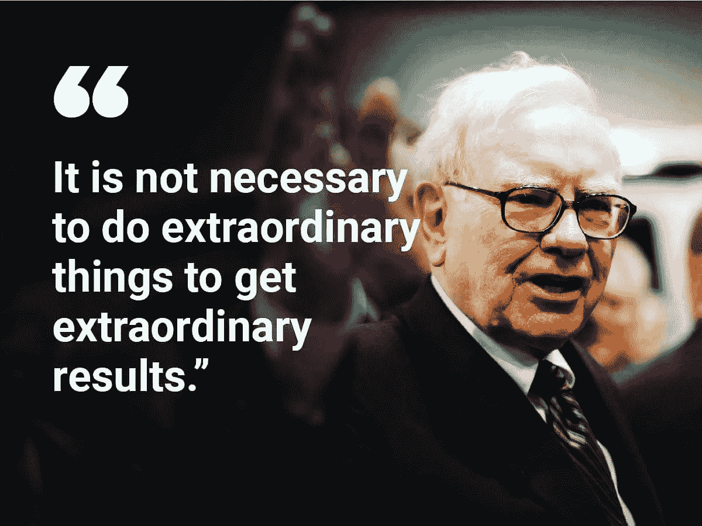

# 沃伦·巴菲特谈常见投资错误

> 原文：<https://medium.com/coinmonks/warren-buffett-on-common-investing-errors-f5e9668a5597?source=collection_archive---------3----------------------->

Source photo [warren buffett quotes — Bing images](https://www.bing.com/images/search?view=detailV2&ccid=mD7v%2fX7K&id=FA89949417111943A5B7DFD49F591C32499F4B28&thid=OIP.mD7v_X7K6jB9cNWAi12LWAHaFj&mediaurl=https%3a%2f%2fwww.yourselfquotes.com%2fwp-content%2fuploads%2f2018%2f02%2fwarren-buffett-quotes-wallpaper.jpg&cdnurl=https%3a%2f%2fth.bing.com%2fth%2fid%2fR.983eeffd7ecaea307d70d5808b5d8b58%3frik%3dKEufSTIcWZ%252fU3w%26pid%3dImgRaw%26r%3d0&exph=900&expw=1200&q=warren+buffett+quotes&simid=608008945224789875&FORM=IRPRST&ck=AA4EE97D540F78F0EC3A621914FB3A61&selectedIndex=0&idpp=overlayview&ajaxhist=0&ajaxserp=0)

你可能会在网上发现大量避免投资失误的信息。你很可能不会遇到关于投资失误不可避免性的坦率讨论。

如果你购买的是金融资产，你会不时出错。你可以选择不正确的股票或共同基金。你可能会过度投资。你可能过于热衷于股票而忽略了…