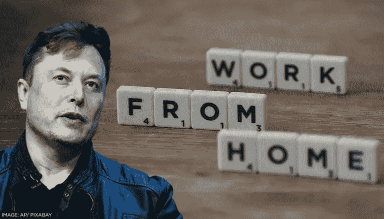
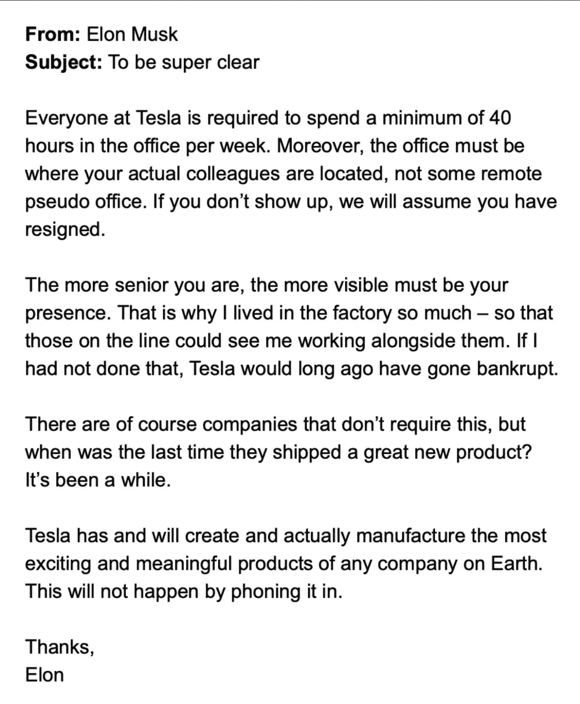
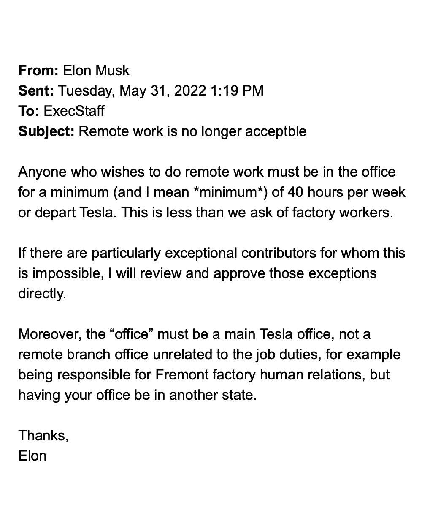

# 埃隆要求每个人都亲自来上班，这样做对吗？

> 原文：<https://medium.com/coinmonks/was-elon-right-in-asking-everyone-to-come-to-work-physically-4d9356384217?source=collection_archive---------48----------------------->

Elon wants his employees to work back in office.

你知道，每个人都有一个特别的朋友，不知何故，他总是那么大声和喧闹，当他或她在附近时，你总是能分辨出来。

不知何故，你甚至在看到他们之前就听到了。

它们是如此引人注目和明显，以至于不可能忘记忽略它们的存在。

在他们本不该参加的派对上与陌生人击掌庆祝，并兜售没人听说过的最新另类硬币。

是的，这是伊隆在社交媒体上给你的。

真的好像埃隆做的每一个动作，社交媒体都爆炸了，我的订阅被他淹没了。

就像灭霸说的“不可避免”。

你可以避开关于伊隆最新推文或滑稽动作的聊天和新闻。

就在上周，让我们来回顾一下埃隆都做了些什么。

他发出了两封电子邮件，命令他在特斯拉的所有员工返回工作岗位，否则“我们将认为你已经辞职”。

读完那篇文章后，我大吃一惊。

When was a last time they actually shipped a great new product?

他说，“特斯拉已经并将创造并实际制造地球上任何公司最令人兴奋和最有意义的产品。”

很难否认这一点。

"这不会通过打电话来实现。"

推特蜜的好甜的花蜜。

难怪媒体喜欢他，推特把他的语录当早餐，耳朵被他的#真相炸弹竖起来

Bold words.

他接着开始与 Atlassian 的联合创始人斯科特·法夸尔(Scott Farquhar)在 Twitter 上发生冲突，法夸尔表示，“他很乐意挖走马斯克的员工，让他们去做远程工作”。

大胆。

你不会和狗爸爸，这个不屈不挠、不败的推特重量级冠军打成一片，也不会期望被残忍地摧毁。

埃隆还发出了另一封电子邮件，称他将解雇特斯拉 10%的员工，理由是艰难时期即将来临。

不管你怎么看待埃隆，我不知道有哪个上市公司的首席执行官有这种胆量。

冒犯他人的性腺，踮起脚尖，沙沙作响的羽毛，做出大胆的举动，不管别人会怎么想。

他有一颗北极星，他不会让任何人阻止他到达那里。

他说“任何希望做远程工作的人都必须每周至少在办公室呆 40 小时(我指的是最少 40 小时)，否则就离开特斯拉。这低于我们对工厂工人的要求”。

一些观点。

对于那些认为埃隆在电子邮件中指的是工厂工人的人来说，他们可能错了。

埃隆实际上是在将特斯拉的上班族与工厂工人进行比较。

我想这是有道理的，对吗？

这就是你加入像特斯拉这样的火箭飞船的原因，对吗？

你相信民族精神、使命和目标，这意味着成为一名团队成员。

团队精神意味着当一个人痛苦时，所有人都会痛苦。

当一个人胜利时，所有人都胜利了。

这确实提出了一个存在主义和哲学的问题:工厂工人应该默认比办公室职员工作更长时间吗？

事实上，鉴于工厂工人不能在家工作，上班族应该有在家工作的特权吗？

-

埃隆要求每个人都亲自来上班，这样做对吗？

-

#初创公司#业务# startupx #员工#成功#社交媒体#文化#远程工作#战略# elonmusk # gigafactory #电动汽车# elon #特斯拉#twitter #atlassian

> 加入 Coinmonks [电报频道](https://t.me/coincodecap)和 [Youtube 频道](https://www.youtube.com/c/coinmonks/videos)了解加密交易和投资

# 另外，阅读

*   [Coldcard 评论](https://coincodecap.com/coldcard-review) | [BOXtradEX 评论](https://coincodecap.com/boxtradex-review)|[uni swap 指南](https://coincodecap.com/uniswap)
*   [比特币基地评论](/coinmonks/coinbase-review-6ef4e0f56064) | [德里比特评论](/coinmonks/deribit-review-options-fees-apis-and-testnet-2ca16c4bbdb2) | [FTX 评论](/coinmonks/ftx-crypto-exchange-review-53664ac1198f)
*   [Coinmetro 评论](https://coincodecap.com/coinmetro-review) | [VirgoCX 评论](https://coincodecap.com/virgocx-review)
*   [法国四大最佳加密副本交易平台](https://coincodecap.com/copy-trading-platforms-france)
*   [从 WazirX 切换到 CoinDCX 的 5 个理由](https://coincodecap.com/reasons-to-switch-from-wazirx-to-coindcx)
*   [联合国硬币评论](https://coincodecap.com/unocoin-review) | [最佳加密赌注硬币](https://coincodecap.com/best-crypto-staking-coins)