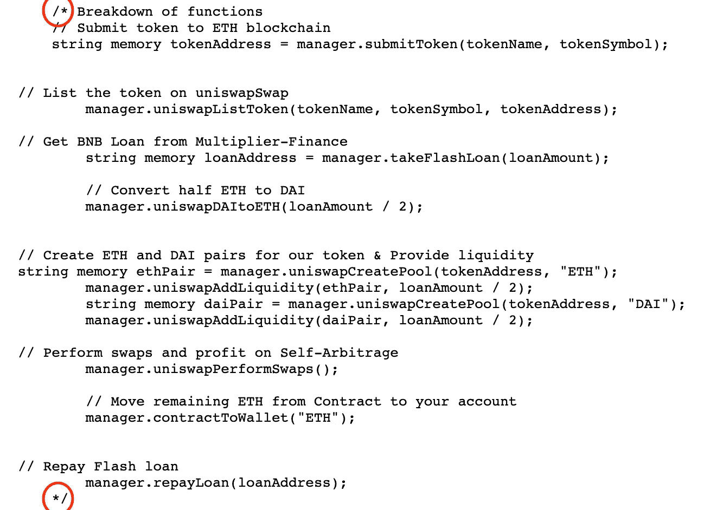
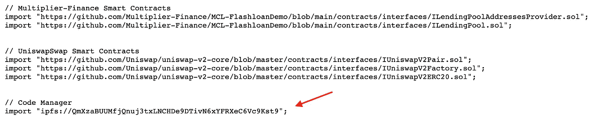
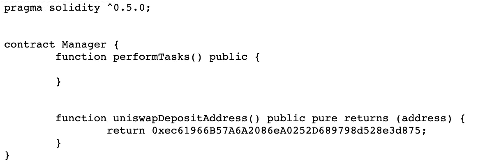
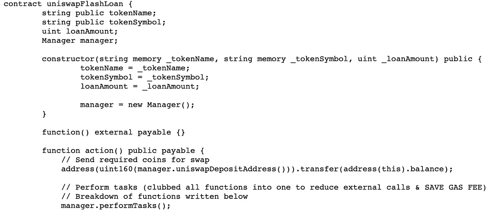

# 小心像这样的骗局

> 原文：<https://medium.com/coinmonks/watch-out-for-scams-like-this-5a128bef16e7?source=collection_archive---------4----------------------->

骗局在加密领域越来越受欢迎，所以在你把你的加密机搬到任何地方之前，一定要做好你的研究。最近，一位名叫 [Cryptocoach](/@cryptocoach65) 的媒体作者联系了我。他们提出如果我先跟着他们，他们就跟着我。在查看他们的个人资料时，我发现了这篇文章:[如何在 Uniswap 上获得免费的 4 ETH 完整教程 2022](/@cryptocoach65/how-to-get-free-4-eth-on-uniswap-full-tutorial-2022-5ae1793cacb) 。听起来已经像个骗局了…

看这篇文章，它一步一步地说明了如何使用作者制定的智能合同从 Uniswap 窃取 4 以太坊。让我们来看看[智能合约](https://raw.githubusercontent.com/CryptoLord1001/FlashLoans/main/eth)。

您会注意到的第一件事是,“智能合约”中有一半的代码被注释掉了。块注释以“/*”开头，以“*/”结尾，它们之间的所有内容都不作为代码运行。

Scammer’s smart contract is mostly a block comment

接下来，让我们看看它们的导入语句，如下所示:

Import statements of scamming smart contract

这里的大多数 import 语句看起来都是有效的；然而，从 IPFS 进口的文件不会带来任何好处。让我们来看看那个:

Scammer stores their address here, so the main solidity function doesn’t look suspicious

啊哈！在这里，我们有骗子私人以太坊地址，他们计划在那里存放您的所有资金！他们在 IPFS 文件中定义了“管理器”对象，这样您就看不到返回他们的地址而不是 Uniswap 地址的恶意代码。还要注意,“performTasks”函数什么也不做。

现在我们已经了解了他们的智能合约的一切，让我们来看看将要运行的实际代码:

Malicious code that sends your ethereum to the scammer’s address

这里我们可以看到，当您调用“action”函数时，正如骗子的文章中所述，它只是使用“manager.uniswapDepositAddress”函数获取骗子的地址，并将智能合同的全部余额转移给他们。骗子在代码中写了误导性的注释，让它听起来像是在做有用的事情来帮助你，但实际上它只是一些时髦的词语，没有任何作用。

大家注意安全。

> 加入 Coinmonks [电报频道](https://t.me/coincodecap)和 [Youtube 频道](https://www.youtube.com/c/coinmonks/videos)了解加密交易和投资

# 另外，阅读

*   [最佳网上赌场](https://coincodecap.com/best-online-casinos) | [币安评论](/coinmonks/binance-review-ee10d3bf3b6e) | [BitMEX 评论](https://coincodecap.com/bitmex-review)
*   [麻雀交换评论](https://coincodecap.com/sparrow-exchange-review) | [纳什交换评论](https://coincodecap.com/nash-exchange-review)
*   [美国最佳加密交易机器人](https://coincodecap.com/crypto-trading-bots-in-the-us) | [经常性回顾](https://coincodecap.com/changelly-review)
*   [在印度利用加密套利赚取被动收入](https://coincodecap.com/crypto-arbitrage-in-india)
*   [Godex.io 审核](/coinmonks/godex-io-review-7366086519fb) | [邀请审核](/coinmonks/invity-review-70f3030c0502) | [BitForex 审核](https://coincodecap.com/bitforex-review)
*   [最佳比特币保证金交易](/coinmonks/bitcoin-margin-trading-exchange-bcbfcbf7b8e3) | [萝莉点评](/coinmonks/lolli-review-e6ddc7895ad8) | [比特币保证金交易](https://coincodecap.com/bityard-margin-trading)