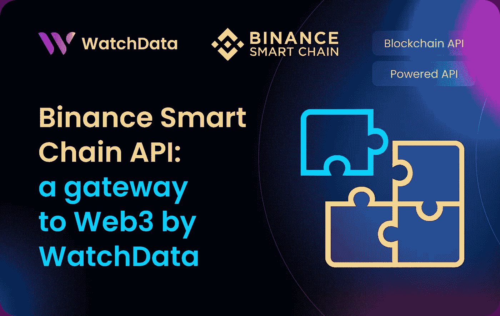
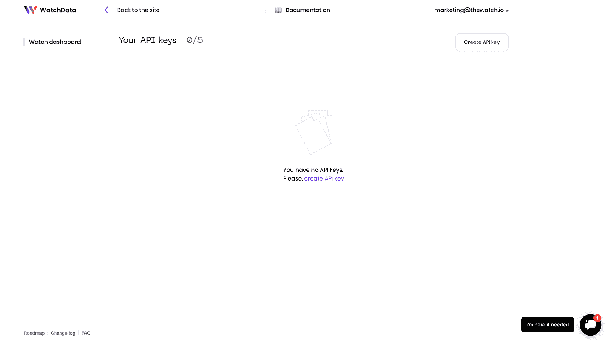
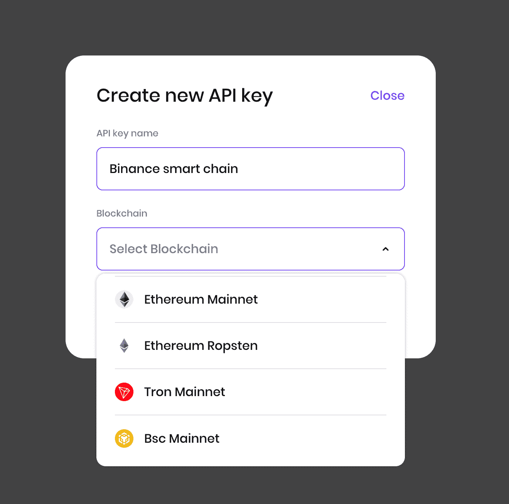
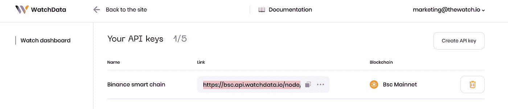
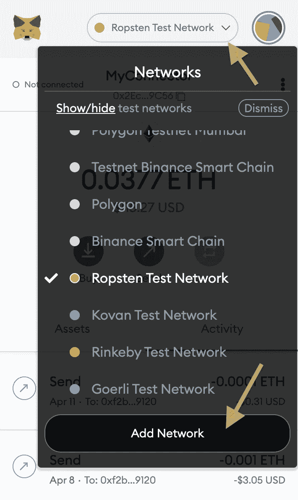
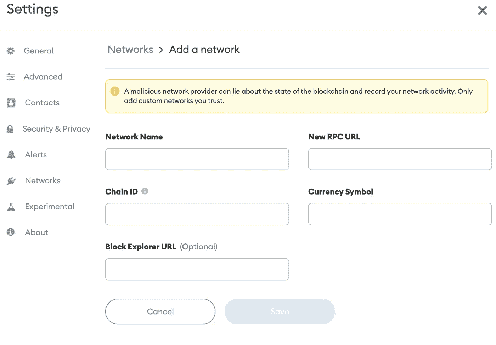
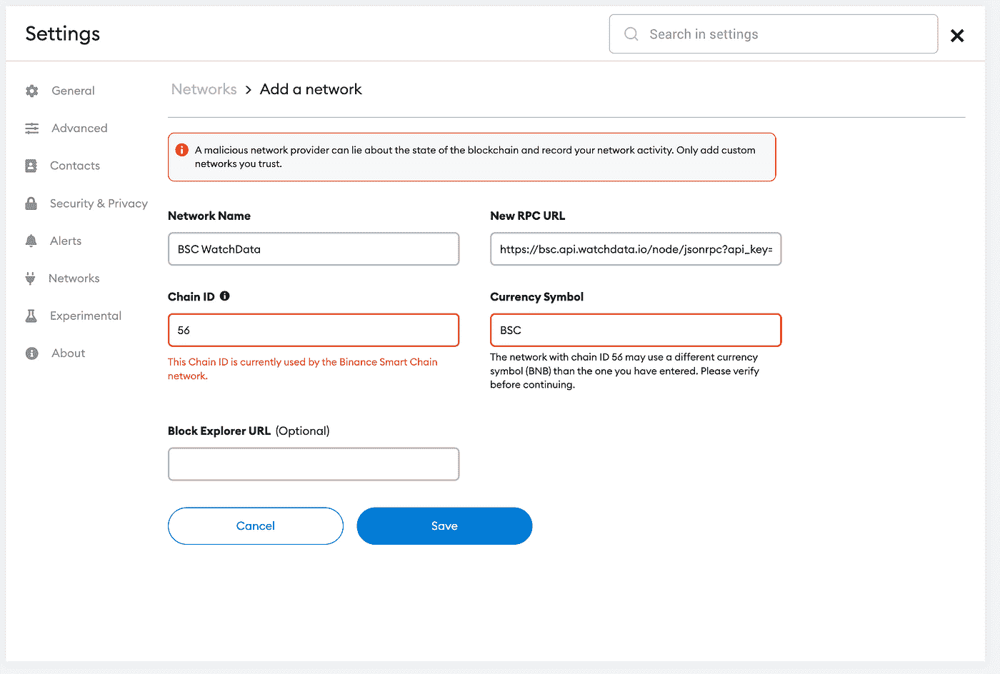

# WatchData 支持币安智能链

> 原文：<https://medium.com/coinmonks/watchdata-supports-binance-smart-chain-b5fe95926535?source=collection_archive---------28----------------------->



# 如何连接币安智能链节点

假设您想在币安智能链上创建任何应用程序。为此，您需要访问完整的 BSC 节点。自己设置 BSC 节点可能相当麻烦。

找到一个快速可靠的节点也是一个挑战。

这可能需要几个星期，然后你必须继续下去。如果您不小心，您可能会花费更多的时间来维护您的节点，而不是实际使用它。

出现这种情况有几个原因:

*   设置节点需要很长时间。It 部门通常需要两周时间来设置和正常运行一切。
*   一旦你完成了你的节点的设置，你需要保持对它的关注，以使它正常工作。节点通常需要持续维护，因为它们通常运行在功能不太强大或不太可靠的机器上。
*   有许多不同类型的节点，因此，如果一种类型的节点出现问题，不能保证另一种类型会更好地为您工作，您最终可能不得不重新开始！
*   自动负载缩放。如果您的应用程序在使用节点提供程序时开始消耗更多的资源，您不会注意到任何偏差。

这只是你将面临的问题的一部分…

这就是区块链节点提供商的用武之地。WatchData 拥有最好的 API 和强大的 API 服务之一！如果没有 WatchData 这样的数据提供者，访问 BSC 节点会非常困难。但凭借其 [**区块链 API**](https://docs.watchdata.io/blockchain-apis/binance-smart-chain-api) 和 [**Powered API**](https://bit.ly/3lcl863) 服务，WatchData 让这一过程变得容易得多。

# 什么是 BSC(币安智能链)？

你可能会问自己，“什么是 BSC？”嗯，币安智能链是一个区块链，与传统的币安链平行运行。币安链于 2019 年推出，其主要重点是促进快速和分散的交易。然而，这个链存在一些灵活性问题，这反过来导致了可伸缩性问题。这就是币安智能链发挥作用的地方。

与币安链不同，BSC 与 EMV(或以太坊虚拟机)技术兼容。这样做是为了在原始链之后留下高带宽，并通过实施 BSC 将智能合同引入生态系统。那么它是如何工作的呢？

币安链使用利害关系证明(PoS)共识算法。更具体地说，它使用了权威证明(PoSA)算法。在这里，参与者要求 BNB 成为验证者。如果一个验证者对一个有效的区块出价，他们将获得该区块内交易的佣金。

跨链互操作性也是这个新链的重要组成部分。这种架构允许用户无缝地将资产从一个链转移到另一个链。这意味着币安链上的快速交易可以与 BSC 上的 dApps 的创建同时使用。

# 如何使用 WatchData 连接 BSC 节点？

要从 WatchData 网站访问 BSC API，第一步是创建一个帐户。这是完全免费的，只需要几秒钟。当您拥有一个帐户并登录后，我们可以仔细看看如何使用 WatchData 连接到 BSC API。

1.  注册



2.创建 API 密钥



3.结果



> 你可以在这篇文章里读到更详细的入门说明→ [**这里**](https://blog.blockmagnates.com/a-step-by-step-guide-on-how-to-start-using-the-watchdata-ethereum-api-4f5e727e3529) **。**

通过使用我们的 API，您可以添加一些功能，为您的用户提供与他们的数据进行交互的新方式，为他们提供更好的体验，并使他们更有可能再次光临！

[**区块链 API**](https://docs.watchdata.io/blockchain-apis/binance-smart-chain-api)

使用 WatchData 的 API，您可以获得原始区块链数据:余额、交易、块、令牌转移、日志等。无需运行自己的节点！节省开发成本和相关费用。通过我们的 API 调用大多数 JSON-RPC 方法，就像发送到自己的节点一样。

让我们看几个与我们的 API 交互的例子:

最常见的端点之一是— **eth_blockNumber (BSC)**

请求示例:

```
URL: <https://bsc.api.watchdata.io/node/jsonrpc?api_key=your_api_key>
RequestType: POST
Body:
{
    "jsonrpc":"2.0",
    "method":"eth_blockNumber",
    "params":[],
    "id":0
}
```

响应示例:

```
{
  "jsonrpc": "2.0",
  "id": 0,
  "result": "0x11af5c7"
}
```

自己试试，很简单！

[**Powered API**](https://bit.ly/3lcl863)

[Powered API](https://bit.ly/3lcl863) 是一种与节点交互的附加功能。我们接管了区块链的工作，并将数据转换成清晰的结构化格式。你作为一个用户，会得到一套现成的数据，里面承载着海量的信息。让我们更清楚地解释给你听:如果你想找到由一个 BSC 地址进行的所有交易怎么办？虽然这在 SQL 数据库中可能很容易，但在区块链却异常复杂——你几乎必须扫描区块链的每一笔交易，看它是否包含一个地址。我们已经创建了一些高级 API，允许您立即执行这个查询和其他类似的查询。

像这样的情况，试试[**watch _ getTransfersByAddress**](https://docs.watchdata.io/powered-api/transfers/watch_gettransfersbyaddress)

请求示例:

```
URL: <https://bsc.api.watchdata.io/node/jsonrpc?api_key=your_api_key>
RequestType: POST
Body:
{
    "id": 1,
    "method": "watch_getTransfersByAddress",
    "jsonrpc": "2.0",
    "params": [
        {
            "addresses": "0x6a73eb4e8EA2068ec539D2f0D15d757766E247E4",
            "contractAddresses": "native",
            "transferDirection": "from",
            "fromBlock": 14046400,
            "toBlock": "latest",
            "offset": 0,
            "limit": 10
        }
    ]
}
```

响应示例

```
{
    "jsonrpc": "2.0",
    "id": 1,
    "result": [
        {
            "blockNumber": 18541974,
            "blockTimestamp": "2022-06-09T15:40:54",
            "transactionHash": "0xaabec1b38b5752d0d35b41f8f97150b16f5ad8abc36e1ffb3ffff293c4aedae2",
            "transactionIndex": 190,
            "logIndex": null,
            "contractAddress": null,
            "transferType": "trx",
            "from": "0x2d4c407bbe49438ed859fe965b140dcf1aab71a9",
            "to": "0x0000000000000000000000000000000000001000",
            "value": 130519792672271954,
            "fee": 0,
            "asset": "BSC",
            "decimals": 18
        },
        {
            "blockNumber": 18541995,
            "blockTimestamp": "2022-06-09T15:41:57",
            "transactionHash": "0x35f3ee96f1f57f5f58e4025b24a6cc98fc0d3fbf6d26784a56c6840ea5acf9ff",
            "transactionIndex": 153,
            "logIndex": null,
            "contractAddress": null,
            "transferType": "trx",
            "from": "0x2d4c407bbe49438ed859fe965b140dcf1aab71a9",
            "to": "0x0000000000000000000000000000000000001000",
            "value": 84645758210632809,
            "fee": 0,
            "asset": "BSC",
            "decimals": 18
        },
        {
            "blockNumber": 18542016,
            "blockTimestamp": "2022-06-09T15:43:00",
            "transactionHash": "0x45a5fefe177518b3bf6b60375e1ef468a9405c358c53ab4ad35526cbd2bba898",
            "transactionIndex": 192,
            "logIndex": null,
            "contractAddress": null,
            "transferType": "trx",
            "from": "0x2d4c407bbe49438ed859fe965b140dcf1aab71a9",
            "to": "0x0000000000000000000000000000000000001000",
            "value": 128711794952039418,
            "fee": 0,
            "asset": "BSC",
            "decimals": 18
        }
    ]
}
```

仅在一个终端上就有大量有用的信息。

**如何用 BSC 节点改变元掩码网络**

现在在 MetaMask 中创建一个定制的 RPC 配置

转到您的元掩码钱包，单击顶部的网络下拉列表，选择底部的自定义 RPC。



然后，您将看到以下屏幕:



**让我们用自定义 RPC 信息填充这些字段。**

1.  对于您的网络，您可以指定任何您想要的名称。我们将使用 BSC 网络，在本例中，我们将其命名为 BSC WatchData
2.  对于新的 RPC URL 字段，生成一个键并复制您需要使用的区块链的 HTTP 链接。



最终的 HTTP 应该是这样的:

```
<https://bsc.api.watchdata.io/node/jsonrpc?api_key=YOUR_API_KEY>
```

1.  查找您要连接的网络的链 ID。

*   币安智能连锁 Mainnet — chainID = 56

4.**货币符号**和 **Block Explorer URL** 可选。对于大多数链，这里不需要输入。

完成后，您的配置应该如下所示:

如果您收到警告，请不要担心，例如:*“此链 ID 目前由 ropsten 网络使用。”。*这只是 MetaMask 提醒你，同一条链有不同的配置，没问题。填写完这些信息字段后，只需点击“保存”即可！

**就这样！你完了！**

# 结论

WatchData 使连接到 BSC 节点变得很容易。你所要做的就是注册，然后你只需点击几下鼠标就可以使用我们的平台连接一个节点。WatchData 团队将帮助您启动和运行。
为了获得更多信息，我们强烈建议您学习我们的官方[文档](https://bit.ly/3IgbLeZ)。

获取各种有助于开发 dApps 的工具！

# 有用的链接

*   [WatchData main](https://bit.ly/3MXPMgi)
*   [WatchData 推特](https://twitter.com/watchdata_io)
*   [手表数据不一致](https://bit.ly/3Ikf30D)
*   [观察数据文档](https://bit.ly/3IgbLeZ)

> 加入 coin monks[Telegram group](https://t.me/joinchat/Trz8jaxd6xEsBI4p)学习加密交易和投资