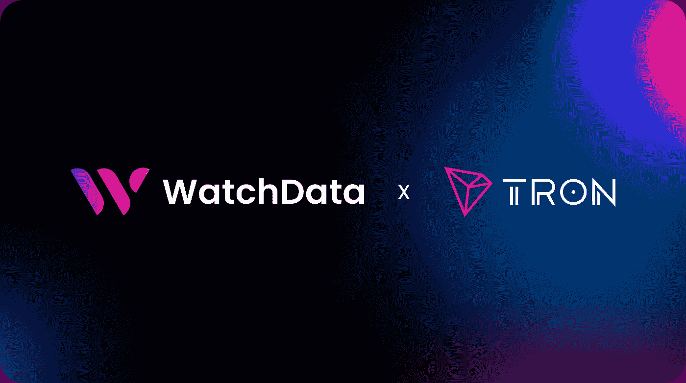
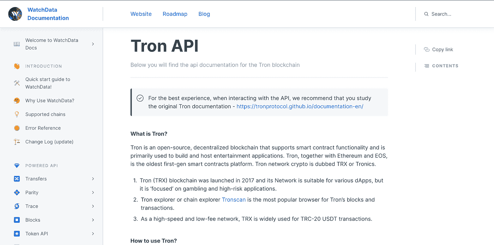

# WatchData 的开发者平台要来 Tron 生态了！

> 原文：<https://medium.com/coinmonks/watchdatas-developer-platform-is-coming-to-the-tron-ecosystem-eaa5ee780cf?source=collection_archive---------27----------------------->

# 介绍

我们很高兴地宣布，WatchData 现在支持[创区块链！](https://docs.watchdata.io/blockchain-apis/tron-api)

TRON 是一个基于区块链的生态系统，允许开发人员构建分散的应用程序和令牌。

TRON 公共区块链是 TRON 生态系统的核心。它建立在去中心化的概念上，并为开发者提供了一种简单的方式来构建他们的去中心化应用，如钱包和 DApps，以及 TRON 上的令牌。

与以太坊等其他区块链类似，TRON 允许开发和转移数字资产、DApp 创建和部署、发行新令牌、赌注等等。独特的架构和安全代码确保其区块链生态系统比其他大多数公共区块链更加高效和稳定。

# 在 TRON 网络上构建应用程序的好处包括:

1.  安全和信任:

TRON 是一个分散的平台，允许所有用户参与验证过程。这确保了所有的交易都是透明、安全和可信的。

2.效率:

TRON 网络的主要特点是每秒处理超过 100，000 个事务(TPS)的能力。这使得它成为当今最高效的区块链之一，与以太坊等其他区块链相比，处理时间更快，成本更低。

3.可扩展性:

TRON 通过分片技术提供可扩展性，该技术将大数据分成称为分片的较小部分，然后可以由网络上的不同节点单独存储，而不会影响彼此的性能或速度，以后在需要时再单独访问它们

在 TRON 区块链上构建你的去中心化应用有很多好处。例如，如果你想建立一个安全、快速的支付系统，你可以轻松地做到。您的应用程序还可以访问 TRON 令牌持有者/用户的无限数据。所有的交易都是公开的、不可改变的，这意味着一旦出现争议，可以很容易地跟踪它们。此外，在这个区块链平台上发生人为错误的可能性为零！与 ETH 等其他受欢迎的区块链相比，TRON 网络的燃气费相当低，这意味着每笔交易的成本更低！

# WatchData 产品是真正的端到端产品，拥有专有的基础设施，以及一整套增强的 API 和其他工具。

[watch data 区块链 API](https://docs.watchdata.io/welcome-to-watchdata-docs/features/blockchain-api) 是一个定制、可扩展和分布式系统的组合，本质上允许 API 作为单个节点，实现可靠性和规模。

> *你可以在本文中阅读更详细的入门说明→* [*这里*](https://blog.blockmagnates.com/a-step-by-step-guide-on-how-to-start-using-the-watchdata-ethereum-api-4f5e727e3529) *。*

该基础设施凭借以太坊生态系统中行业领先的可靠性和可扩展性取得了非凡的成果。

团队很高兴看到 Tron 开发人员开始用 WatchData 构建并优化 WatchData 产品套件，以满足 Tron 开发人员的需求。

# 结论

TRON 是一个越来越受欢迎的区块链平台。它已成为以太坊(Ethereum)和比特币(Bitcoin)等老牌区块链平台的有力竞争对手。它受欢迎的主要原因是较低的煤气费。这使得它适合于构建运营成本更低的分散式应用程序(dapps)。除了低费用，TRON 还承诺比其他区块链交易时间更快。

我们在 WatchData 的使命是确保 web3 生态系统继续增长和发展。我们认为，这个生态系统长期健康的关键指标是开发人员在我们平台上的参与度、创造力和生产力。通过将新的和现有的 Tron 开发者引入这个社区，我们只是加强了 web3 生态系统，并扩展了我们共同构建时的可能性。

为了获得更多信息，我们强烈建议您学习我们的官方[文档](https://bit.ly/3IgbLeZ)。

获取各种有助于开发 dApps 的工具！

# 有用的链接

*   [WatchData main](https://bit.ly/3MXPMgi)
*   [WatchData 推特](https://twitter.com/watchdata_io)
*   [观察数据不一致](https://bit.ly/3Ikf30D)
*   [WatchData 文档](https://bit.ly/3IgbLeZ)

> 加入 Coinmonks [电报频道](https://t.me/coincodecap)和 [Youtube 频道](https://www.youtube.com/c/coinmonks/videos)了解加密交易和投资

# 另外，阅读

*   [TraderWagon 回顾](https://coincodecap.com/traderwagon-review) | [北海巨妖 vs 双子座 vs BitYard](https://coincodecap.com/kraken-vs-gemini-vs-bityard)
*   [如何在 FTX 交易所交易期货](https://coincodecap.com/ftx-futures-trading) | [OKEx vs 币安](https://coincodecap.com/okex-vs-binance)
*   [OKEx vs KuCoin](https://coincodecap.com/okex-kucoin) | [摄氏替代品](https://coincodecap.com/celsius-alternatives) | [如何购买 VeChain](https://coincodecap.com/buy-vechain)
*   [ProfitFarmers 回顾](https://coincodecap.com/profitfarmers-review) | [如何使用 Cornix Trading Bot](https://coincodecap.com/cornix-trading-bot)
*   [如何匿名购买比特币](https://coincodecap.com/buy-bitcoin-anonymously) | [比特币现金钱包](https://coincodecap.com/bitcoin-cash-wallets)