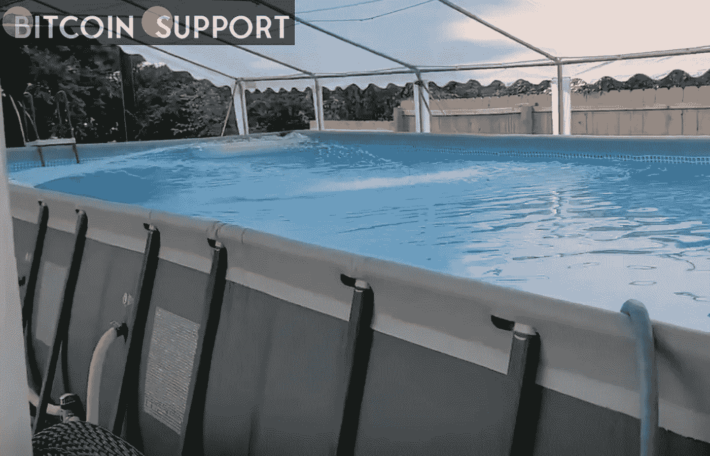
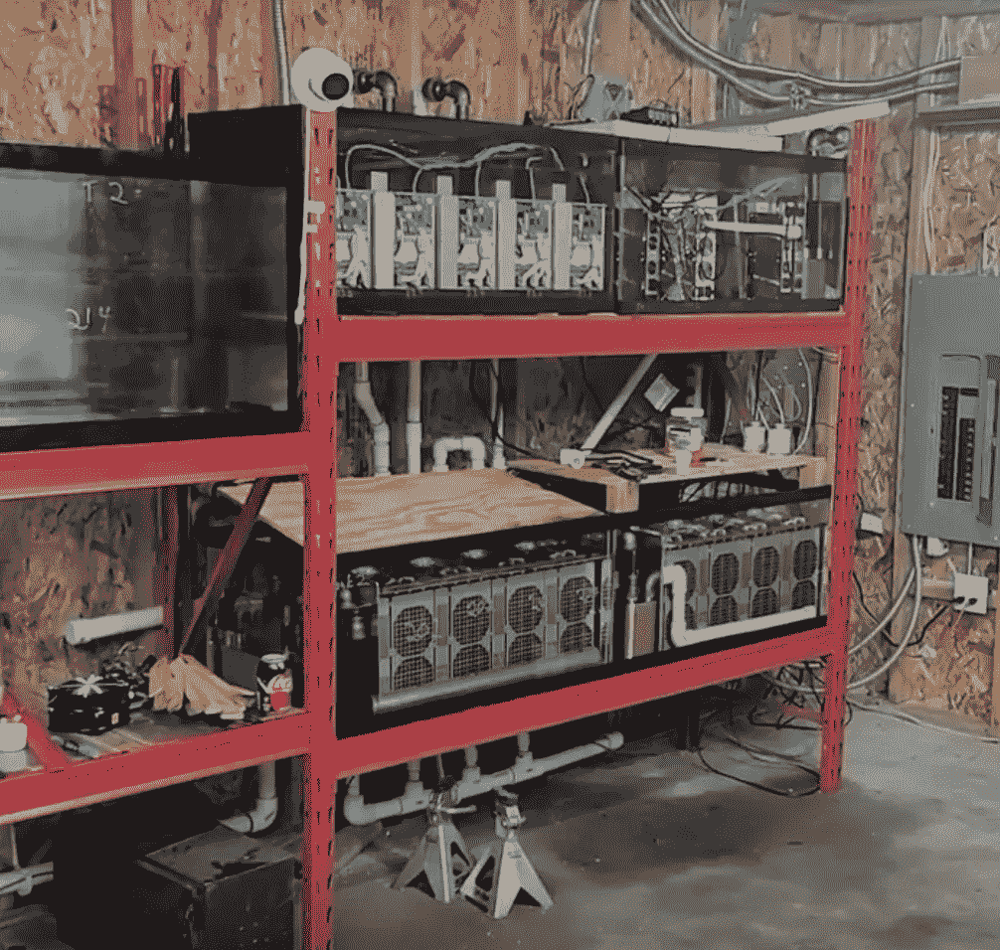

# 水是一个极好的主意！比特币采矿是加热这个游泳池的关键

> 原文：<https://medium.com/coinmonks/water-is-an-excellent-idea-bitcoin-mining-is-key-for-heating-this-swimming-pool-4e62d3c0dbf6?source=collection_archive---------32----------------------->

**Visit our website:-** [**https://bitcoinsupports.com/**](https://bitcoinsupports.com/)

一名比特币矿工正在加热他的整个游泳池，以便让他的孩子游泳——同时保护比特币网络并赚钱。另一项矿业突破被一位比特币创造者“汇集”起来。他利用比特币(BTC)开采产生的“废热”来加热他的游泳池。

比特币爱好者乔纳森·袁(Jonathan Yuan)的孩子“喜欢游泳，但前一年，他们很少去游泳，因为水对他们来说总是太冷了。”幸运的是，他对比特币采矿感兴趣，并意识到它会产生巨大的热量。袁说，他购买了一个“热交换器，并配置了几个专用集成电路”，随后能够保持“整个夏天游泳池温度在 90 华氏度以上。”这种方法利用沉浸来冷却 ASICs，同时“回收废热并将其用于实际用途，如加热生活/工作空间、游泳池或任何其他可以受益于高达 60 摄氏度/140 华氏度热量的地方。”

**Visit our website:-** [**https://bitcoinsupports.com/**](https://bitcoinsupports.com/)

然而，“当中国禁令发生”和调整的困难减少，袁被迫作出艰难的选择。我是减少我的比特币挖矿还是把游泳池改成浴缸？“当难度像岩石一样下降时，我实际上把所有的 ASICs 都推到了极限，将游泳池的温度提高到 110 华氏度，并迫使孩子们在大约一两个月的时间里不游泳。”lol。是的，我不得不说“对不起，孩子们，今天游泳池太热了；你将无法游泳。”

调整难度随后提高到新的高度，他的孩子又能游泳了。此外，袁还从采矿中“赚到了钱”，也许最有趣的是，“这个池子起到了理想的热缓冲作用。”的确，雇佣比特币矿工来加热他的游泳池比使用传统方法更有效:它将“24 小时内的温度变化保持在 2F 的 1 华氏度以内，尽管有些日子环境温度超过 40 华氏度。”住在美国中西部明尼苏达州的袁(音译)尽管气温极低，但他还是让游泳池保持了“温暖”:

[【https://twitter.com/CoinHeated/status/1479423686297927680】](https://twitter.com/CoinHeated/status/1479423686297927680)

袁(音译)建议有游泳池的人也照着做，因为这是余热的“理想应用场景”。袁(音译)目前正在制造一种泳池专用水箱，这种水箱可以让池水直接通过热交换器。

袁的家里现在用上了 ASICs 的暖气，他已经把一个爱好转换成了职业。他的比特币采矿公司 CoinHeated“致力于将比特币矿工的余热转化为有用的热能。”现在的想法是将泳池加热项目扩展到其他住宅，他正在与“热交换器制造商”讨论，他们将能够制造出在经过化学处理的池水中不会腐蚀的东西

与此同时，孩子们可以享受他家的游泳池，这个游泳池已经被工作证明温暖了。

[https://twitter.com/CoinHeated/status/1486903741374779392](https://twitter.com/CoinHeated/status/1486903741374779392)

**访问我们的网站:-**[**https://bitcoinsupports.com/**](https://bitcoinsupports.com/)

**免责声明:以上为作者观点，不应视为投资建议。读者应该自己做研究。**

> 加入 Coinmonks [电报频道](https://t.me/coincodecap)和 [Youtube 频道](https://www.youtube.com/c/coinmonks/videos)了解加密交易和投资

# 另外，阅读

*   [交易信号是什么？](https://coincodecap.com/trading-signal) | [Bitstamp vs 比特币基地](https://coincodecap.com/bitstamp-coinbase) | [买索拉纳](https://coincodecap.com/buy-solana)
*   [ProfitFarmers 回顾](https://coincodecap.com/profitfarmers-review) | [如何使用 Cornix Trading Bot](https://coincodecap.com/cornix-trading-bot)
*   [十大最佳加密货币博客](https://coincodecap.com/best-cryptocurrency-blogs) | [YouHodler 评论](https://coincodecap.com/youhodler-review)
*   [my constant Review](https://coincodecap.com/myconstant-review)|[8 款最佳摇摆交易机器人](https://coincodecap.com/best-swing-trading-bots)
*   [MXC 交易所评论](/coinmonks/mxc-exchange-review-3af0ec1cba8c) | [Pionex vs 币安](https://coincodecap.com/pionex-vs-binance) | [Pionex 套利机器人](https://coincodecap.com/pionex-arbitrage-bot)