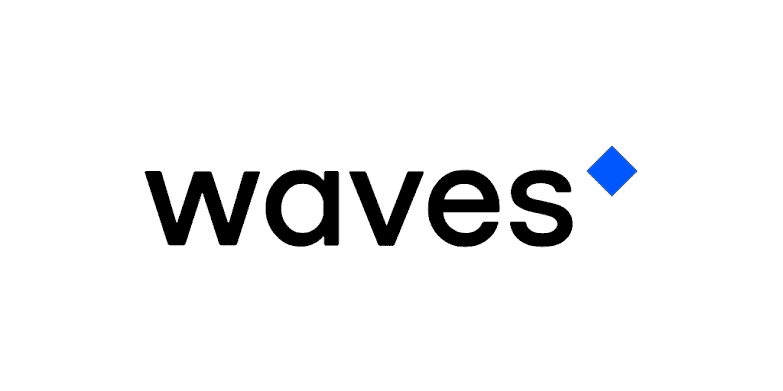
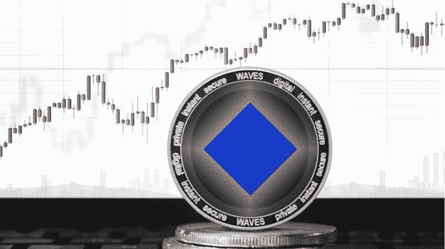
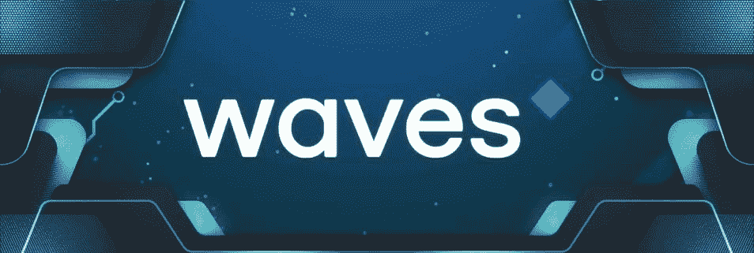

# 波币价格预测——波币是好投资吗？

> 原文：<https://medium.com/coinmonks/wave-coin-price-prediction-is-wave-coin-a-good-investment-769fcd820500?source=collection_archive---------59----------------------->

Wave Coin 已经获得了巨大的牵引力，这使得硬币的价格飙升，许多用户都期待着在不久的将来看到硬币创下历史新高。同时，Wave 的价格有很大的潜力飙升，Wave 投资者对该项目持积极态度。

最近，在 3 月 16 日，他们在他们的社区进行了一次空投，这次空投让他们所有的社区成员都有资格积极参与社区活动，赢得一些代币，令人惊讶的是；他们现在接受 AMA 加入他们的电报社区，该社区将于 2022 年 4 月 5 日举行电报社区，他们的社区对这些举措感到非常兴奋

不久，他们成立了一家美国公司，并雇佣了 3 名新员工。这些是大部分的东西，一直在制造价格波动，使其价格从 30 美元上升到 60 美元，这是一个月内的两倍。

因此，这篇文章需要一些关于波币的信息，波币是什么，它的价格预测，以及波币是否是一个好的投资。

# 什么是波币？

[Waves](https://waves.tech/) 是一种多用途区块链协议，支持多种用例，包括分散式应用(DApps)和智能合约。

Waves 成立于 2016 年 6 月，是加密货币行业最早的初始硬币产品(ICO)之一，最初旨在通过提高速度、实用性和用户友好性来增强第一批区块链平台。

该平台经历了许多变化，并在其初始设计的基础上添加了新的衍生功能。

Waves 的本地令牌是 WAVES，这是一个无上限的供应令牌，用于标准支付，如块奖励。

Wave 也有一个交易所，在那里它的代币可以和每一对进行交易；他们的大多数投资者利用这个交易所，通过在交易所挂牌交易代币赚了大笔钱

# 海浪硬币价格预测 2022–2031

目前，WAVES (WAVES)在整个加密市场中以 34.74 美元的价格排名第 43 位，其中包括 1.0792 亿美元(107，918，044 个 Waves)的流通供应和 1.0792 亿美元(107，918，044 个 Waves)的总供应。

截至撰写本文时，其最大供应量为不适用，其市值为 37.5 亿美元(37.48948559.74 美元)，其完全稀释后的市值为 37.5 亿美元(37.48948559.74 美元)。

在撰写本文时，Wave 的 24 小时交易量为 23 亿美元，价格在 24 小时内下跌了 25%。

[阅读更多关于波浪价格预测的信息](https://bulliscoming.com/wave-coin-price-prediction/)

# Wave 是一个好的投资吗？

许多投资者一直在乞求知道波币是否是一个好的长期投资，许多新投资者想知道波币是否是一个好的投资。同时，波币似乎是一个好的投资，这将带来巨大的长期投资回报率。

然而，该团队正在努力工作，以使 Wave Coin 在区块链生态系统的基础设施方面脱颖而出，许多有影响的人都在推广这种硬币，以获得更多投资者

波币有一个产品是他们的交流，他们也有一个治理令牌；可以下注 wave 以在他们的池中赢得更多代币

**亦读；** [幸运足球评论—没看这个就不要投资幸运足球平台！！！](https://bulliscoming.com/lucky-football-review/)

# 结论

Wave 有很多潜力，这将使价格变得像 BNB 当年做的那样低，他们正在努力开发这个项目，并发布了很多公告和升级

同时，本文仅用于教育目的，不应被视为投资建议。如果你期待投资这个项目，请注意加密市场是不稳定的，并确保你阅读他们的白皮书，以获得关于他们的项目及其发展的线索。

> 加入 Coinmonks [电报频道](https://t.me/coincodecap)和 [Youtube 频道](https://www.youtube.com/c/coinmonks/videos)了解加密交易和投资

# 另外，阅读

*   [加密复制交易平台](/coinmonks/top-10-crypto-copy-trading-platforms-for-beginners-d0c37c7d698c) | [Coinmama 评论](/coinmonks/coinmama-review-ace5641bde6e)
*   [印度的加密交易所](/coinmonks/bitcoin-exchange-in-india-7f1fe79715c9) | [比特币储蓄账户](/coinmonks/bitcoin-savings-account-e65b13f92451)
*   [OKEx vs KuCoin](https://coincodecap.com/okex-kucoin) | [摄氏替代品](https://coincodecap.com/celsius-alternatives) | [如何购买 VeChain](https://coincodecap.com/buy-vechain)
*   [币安期货交易](https://coincodecap.com/binance-futures-trading)|[3 commas vs Mudrex vs eToro](https://coincodecap.com/mudrex-3commas-etoro)
*   [如何购买 Monero](https://coincodecap.com/buy-monero) | [IDEX 评论](https://coincodecap.com/idex-review) | [BitKan 交易机器人](https://coincodecap.com/bitkan-trading-bot)