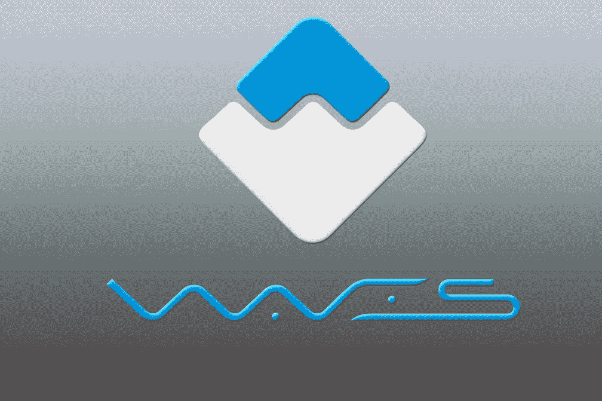

# Waves 协议和 Waves 令牌解释

> 原文：<https://medium.com/coinmonks/waves-protocol-and-waves-token-explanation-739d68118c03?source=collection_archive---------10----------------------->

Waves Protocol And Waves Token Explanation

在引入[区块链技术](https://cryptoworldfinace.blogspot.com/2021/12/blockchain-technology-trends-for-2022.html)后，构建者发现很难在诸如可访问性、可用性和特性集之间达到稳定。然而，Waves (WAVES)协议在很大程度上解决了这个问题。Waves 是用一个普通的区块链答案构建的，这个答案能够发挥 Web 3.0 未来的力量。

# 什么是波浪？

Waves 是一个区块链平台，结合了加密货币、代币发行和分散替代(DEX)的功能。这些加密货币令牌在许多情况下被称为智能合约。Waves 区块链上有一个替代品，为客户提供购买、出售和替换不同加密货币的自由。自推出以来，Waves 已经成为最赚钱的 100 种加密货币之一。截至 2021 年 7 月，这一繁荣导致了近 7 亿美元的市值。

# 海浪的历史

Waves 于 2016 年进入市场。区块链平台从一开始就取得了成功，该公司首次发行硬币(ICO)也是如此。它在推出时曾一度高达 1600 万美元。在平台上工作的团队在平台上线后的盈利能力方面发挥了很大作用。

Waves 社区在 2018 年 9 月进行了一次重要的改进。这一改进导致了许多方面的集成，如协助多签名地址、原子交换、令牌冻结、投票和预言。神谕作为[链外传感器](https://cryptoworldfinace.blogspot.com/2021/12/on-chain-vs-off-chain-work-on-bitcoin.html)与区块链对话。

整整一个月后，Waves 的分析师记录了该平台一天之内的 610 万笔交易。从而使该文档成为任何区块链平台一天中处理最多的交易。

# Waves 区块链

海浪区块链有各种各样的关键因素。它们由节点、PoS 和 LPO、Waves NG、[智能合约](https://cryptoworldfinace.blogspot.com/2021/12/understanding-smart-contract-and-use.html)组成。

# 节点

延续 Waves 社区的双层结构分为完全节点和轻量级节点。完整节点是验证事务的挖掘器，同时将新的[块添加到区块链](https://cryptoworldfinace.blogspot.com/2021/12/block-explanation.html)中。同时，轻量级节点的速度加快了网络内部的交易和言语交流。轻量级节点更快的原因是它们无法下载区块链。

# 波 PoS 和 LPoS

LPoS 是租赁股权证明的首字母缩写。它是 PoS 共识算法的一个改进模型，通过该模型，Waves 的目标是在分配共识的帮助下使 Waves 社区不受损害。用户能够以每次租赁 0.002 波的速率将他们的令牌出租给完整节点。对于节点所有者来说，租借的令牌可以帮助他们生成区块并获得进入采矿奖励。此外，令牌持有者从租赁中获益，因为他们有可能将令牌出租给 Waves 节点并赚取佣金。

# 波浪 NG

Waves NG 是由 Waves platform 带来的一个新协议，它允许其区块链在尽可能短的时间内处理几个事务。这一特征反映了比特币 NG，其理念抛弃了以可比间隔发现区块的规则。它还为客户提供了在请求提交到网络后尽快处理交易的自由。

# 智能合同

2018 年 9 月推出的智能合约特性。它的目标是与 LSK 公司(Lisk)、T2 公司(EOS)、以太坊公司(ETH)和尼奥公司(NEO)竞争。Waves 智能合同保证提供原子交换、令牌冻结、多重签名地址、投票和预言。

# Waves 协议的主要特性

从不同的区块链平台来看，有许多突出的波浪点。

***首先是*** ，它采用菲亚特网关。这使得顾客可以将 Waves stage 上发行的任何代币兑换成可以存放在银行的现金。一个例子是美元/欧元/CNY。

***其次*** ，其 KYC/AML 特征为购物和拉低背部菲亚特现金。KYC 对数字外汇交易所来说不再重要。

***第三*** ，Waves 上的交易价格可以低至正常交易的 0.001 WAVES 或调用脚本的交易的 0.005 左右。

此外，WavesDEX 允许客户像兑换不同的数字货币一样正确地兑换他们的 BTC/瑞士法郎。WavesDEX 主要基于 Waves 区块链进行分散。

最后，我们所有人都可以在 Waves 上启动智能合约，因为没有必要进行编程。这是因为他们不再像以太坊那样复杂，尽管他们刀枪不入，能力超群。

> 阅读:[如何开发加密货币钱包](https://cryptoworldfinace.blogspot.com/2021/11/how-to-development-cryptocurrency-wallet.html)
> 
> [如何在商业中实现区块链](https://cryptoworldfinace.blogspot.com/2021/11/how-to-implement-blockchain-in-business.html)

# Waves 协议的使用案例

Waves 协议的一些使用实例包含一个明显的任务资本雇主 Tokenomica，一个即将到来的政治参与倡议，一个缺乏经验的制造商业企业 science ZrCoin，一个手机游戏平台 MobileGo 的广告和营销能力。此外，一个受保护的电信基础设施雇主 EncryptoTel 和一个名为 Incent 的区块链忠诚度计划也使用 Waves。

# 波浪的优势

作为市场上的先锋力量，Waves 通过简单性吸引了大众的注意。因此，区块链平台有许多优势。Waves 使用起来非常方便。由于其简单的区块链技术，它为客户提供了一种更简单的方式来创建他们的个人令牌。以太坊需要建筑商掌握 Solidarity 等编程语言，以便能够执行智能合同。然而，Waves 令牌对软件来说很方便，并且最适合将这些主要功能整合到实用令牌和忠诚度计划中的公司。

Waves 上的用户可以自由押注他们的加密货币，并获得回报。区块链社区在海浪上下注的原因是为了保持稳定。为了防止在客户运行恶意节点时可能发生的可管理的经济损失，PoS 社区会要求客户进行大额存款以作为节点的一部分。作为 Waves 的交易者，你必须进入分散期权(DEX ),它允许你在几秒钟内用任何不同的 Waves 代币交换任何 Waves 代币。此外，该平台还提供即时进入流动性的计划，使其成为令牌投放策略的最佳选择。

# 海浪令牌

Waves token 是区块链的主要密码。该令牌可用作收费选项，还可用于创建新的令牌或奖励赌注。这使得令牌非常通用。Waves 总共有 100，000，000 个流通令牌。该平台已经能够通过其 ICO 在 2016 年 4 月至 5 月期间提升 1640 万美元。它的代币可以在各种交易所交易，包括[币安](https://www.binance.com)、[比特克斯](https://global.bittrex.com/)和其他交易所。[多看](https://cryptoworldfinace.blogspot.com/2022/01/waves-protocol-and-waves-token.html)。

> 加入 Coinmonks [电报频道](https://t.me/coincodecap)和 [Youtube 频道](https://www.youtube.com/c/coinmonks/videos)了解密码交易和投资

## 也请阅读

 [## 杠杆代币[多头代币]终极指南

### 杠杆代币是具有杠杆风险的 ERC20 代币，不考虑保证金、要求、管理……

medium.com](/coinmonks/leveraged-token-3f5257808b22)  [## 最佳密码交易所| 2021 年十大密码货币交易所

### 编辑描述

blog.coincodecap.com](https://blog.coincodecap.com/crypto-exchange)  [## 2021 年最佳加密交换平台| CoinCodeCap

### 如果我们看看今天的情况，许多密码货币交换平台提供了广泛的功能和深度…

blog.coincodecap.com](https://blog.coincodecap.com/best-swap-platforms)  [## 10 大最佳在线赌场[2021] |赢得并赢得免费 BTC 奖| CoinCodeCap

### 编辑描述

blog.coincodecap.com](https://blog.coincodecap.com/best-online-casinos)  [## 2021 年最佳加密贷款平台| 6 大比特币贷款平台

### 获得比特币和其他密码货币的最佳贷款利率

medium.com](/coinmonks/top-5-crypto-lending-platforms-in-2020-that-you-need-to-know-a1b675cec3fa)  [## 6 款 2021 年最佳硬件钱包|顶级加密硬件钱包[更新]

### 最好的密码硬件钱包是绝对必要的。我们将在 NGRAVE、Ledger Nano X 和……

medium.com](/coinmonks/the-best-cryptocurrency-hardware-wallets-of-2020-e28b1c124069)  [## 2021 年最佳免费加密交易机器人

### 2021 年，币安、比特币基地、库坎和其他密码交易所的最佳密码交易机器人。四倍，Bitsgap…

medium.com](/coinmonks/crypto-trading-bot-c2ffce8acb2a)